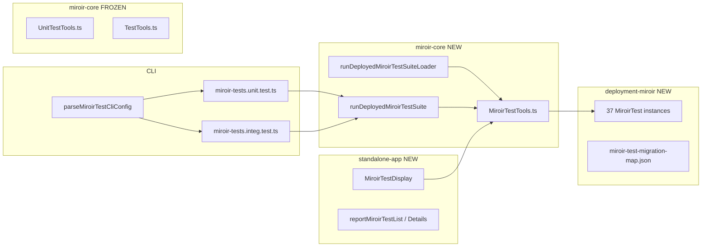

# Feature 196 — Migrate TransformerTests and UnitTests to MiroirTest

GitHub issue: [miroir-framework/miroir#196](https://github.com/miroir-framework/miroir/issues/196)

**Status: Implementation complete** (Phases 0–6). Legacy removal and `RUN_TEST` retirement are deferred follow-ups.

## Overview

Introduce a unified **`MiroirTest`** entity that **replaces** `UnitTest` and `TransformerTest` as the single test concept. Legacy entities and runners remain in the codebase until a later cleanup issue; **new code does not use them**.

Constraints from the issue:

- UUID v4 only
- TDD throughout
- **Do not touch** legacy `UnitTest` / `TransformerTest` code or deployment JSON
- UI execution is always unit mode (no side effects)
- Vitest loaders migrate to `MiroirTest`; same pass/fail including known failures
- `transformers.integ.test.ts` migrates with `executionMode: "integration"`

Supersedes the execution-model direction of [Feature 195](../195-FEATURE-%20enable%20execution%20of%20miroir-core%20unit%20tests%20in%20UI/plan.md): UI and CLI now target `MiroirTest`, not `UnitTest`.

---

## Locked decisions (grill session)

| # | Decision |
|---|----------|
| 1 | **Replace, don't wrap** — one concept; legacy removal deferred |
| 2 | **Schema** — Evolve `UnitTest` → `MiroirTest`; unified `miroirTestType` / `miroirTests` / `miroirTestLabel`; **no** `MiroirTestCatalogSuite` |
| 3 | **Runner** — New distilled `MiroirTestTools.ts`; legacy `UnitTestTools.ts` / `TestTools.ts` frozen |
| 4 | **Execution** — `executionMode: "unit" \| "integration"` param; UI always `"unit"` |
| 5 | **CLI selection** — Dynamic import gate; **`RUN_TEST` retired on new CLI path** (see follow-ups for vitest loaders) |
| 6 | **CLI interface** — Hybrid: env vars (CI) + npm args (local) |
| 7 | **UI** — New parallel reports/menu/components; legacy UI untouched |
| 8 | **Migration** — Pilots by hand → `adminTransformers` gate → generator + manifest |
| 9 | **Vitest** — `miroir-tests.unit.test.ts` + `miroir-tests.integ.test.ts`; per-file loaders use `runDeployedMiroirTestSuiteLoader` |
| 10 | **Loader switch** — Incremental per pilot, then bulk |

---

## Target schema

```typescript
// MiroirTestDefinition — same envelope as UnitTestDefinition
{
  uuid, parentUuid, selfApplication, branch, name, description, ...
  definition: MiroirTestSuite
}

MiroirTestSuite = {
  miroirTestType: "miroirTestSuite",
  miroirTestLabel: string,
  skip?: boolean,
  miroirTests: MiroirTestNode[]
}

MiroirTestNode =
  | MiroirTestSuite
  | { miroirTestType: "transformerTest", miroirTestLabel, ... }  // native transformer fields
  | { miroirTestType: "functionCallTest", miroirTestLabel, ... }
  | { miroirTestType: "queryRunnerTest", miroirTestLabel, ... }
```

### Normalization rules (pilots + generator)

| Legacy | → MiroirTest |
|--------|--------------|
| `unitTestType` / `unitTests` / `unitTestLabel` | `miroirTestType` / `miroirTests` / `miroirTestLabel` |
| `transformerTestSuite` / `transformerTests` | `miroirTestSuite` / `miroirTests` |
| `transformerTestType: "transformerTest"` | `miroirTestType: "transformerTest"` |
| `transformerTestLabel` | `miroirTestLabel` |
| `UnitTestAsTransformerTest` (`payload` wrapper) | Inline `miroirTestType: "transformerTest"` leaf |

---

## Architecture



---

## Developer quick reference

| Area | Path |
|------|------|
| Runner | `packages/miroir-core/src/4_services/MiroirTestTools.ts` |
| Migration logic | `packages/miroir-core/scripts/miroirTestMigrateDefinition.ts` |
| Bulk generator | `packages/miroir-core/scripts/generate-miroir-test-instances.ts` |
| UUID v4 renormalize | `packages/miroir-core/scripts/renormalize-miroir-test-uuids.ts` |
| Manifest | `packages/miroir-core/scripts/miroir-test-migration-map.json` |
| Suite registry (generated) | `packages/miroir-core/tests/helpers/miroirTestSuiteRegistry.ts` |
| CLI parser | `packages/miroir-core/tests/helpers/parseMiroirTestCliConfig.ts` |
| Per-file vitest loader | `packages/miroir-core/tests/helpers/runDeployedMiroirTestSuiteLoader.ts` |
| Integration Postgres bootstrap | `packages/miroir-core/tests/helpers/miroirTestIntegrationStore.ts` |
| MiroirTest JSON data | `packages/miroir-test-app_deployment-miroir/assets/miroir_data/a311f363-e238-4203-bdfc-29e8c160c26b/` |
| UI components | `packages/miroir-standalone-app/src/miroir-fwk/4_view/components/Reports/MiroirTest*.tsx` |

### Commands

```bash
# Rebuild deployment after JSON / index changes
npm run build -w miroir-test-app_deployment-miroir

# Preferred: run suites by registry key (dynamic import)
npm run testMiroir -w miroir-core -- --suites mustache,alterObject --mode unit
npm run testMiroir -w miroir-core -- --suites miroirCoreTransformers --mode integration

# CI-style env vars
MIROIR_TEST_SUITES=mustache MIROIR_TEST_MODE=unit npm run testMiroir -w miroir-core

# Per-file vitest (still supports RUN_TEST for selective runs)
RUN_TEST=transformers.unit.test npm run testByFile -w miroir-core -- transformers.unit.test

# Regenerate instances from legacy sources (skips Phase 3 pilots)
npm run generate-miroir-tests -w miroir-core

# Fix non-v4 target UUIDs after generator changes
npm run renormalize-miroir-test-uuids -w miroir-core
```

### UI

- Menu: **Miroir Tests** (`eaac459c-…`)
- Reports: `reportMiroirTestList` (`58dc6706-…`), `reportMiroirTestDetails` (`0ad63f27-…`)
- Section type: `miroirTestReportSection` in Report ED `952d2c65-…`
- Execution: always `executionMode: "unit"` via `RunMiroirTestSuiteButton`

---

## Phases

### Phase 0 — Entity bootstrap ✅

**Green (done):**

- `entityMiroirTest` (`a311f363-e238-4203-bdfc-29e8c160c26b`) + `entityDefinitionMiroirTest` (`51c647fe-07ec-411c-89cc-02689dc66d6a`)
- Wire `miroirTestDefinition` in `getMiroirFundamentalJzodSchema`
- Export from deployment `index.ts` + `miroir-core/src/index.ts`
- `miroirTest_schema_pilot_empty` (`cebb6dc8-65ea-482d-b17b-5655c927c1c1`)

**Bootstrap note:** MiroirTest leaf schemas use distinct context keys (`miroirFunctionCallTest`, `miroirQueryRunnerTest`) so they do not overwrite UnitTest's `functionCallTest` / `queryRunnerTest` in the fundamental jzod context.

---

### Phase 1 — `MiroirTestTools` skeleton ✅

`MiroirTestTools.ts` with `runMiroirTests`, `runMiroirTestSuite`, `executionMode`, `filter`. Leaf adapters delegate to legacy runners without modifying `UnitTestTools` / `TestTools`.

---

### Phase 2 — CLI infrastructure ✅

- `parseMiroirTestCliConfig.ts`, `runDeployedMiroirTestSuite.ts`
- `miroir-tests.unit.test.ts` / `miroir-tests.integ.test.ts`
- `npm run testMiroir` (hybrid env + args)
- `MiroirEventService` wired for nested suite tracking in CLI path

---

### Phase 3 — Pilots (hand-migrated) ✅

| Registry key | Legacy source | Target UUID (v4) |
|---|---|---|
| `schema_pilot_empty` | (new) | `cebb6dc8-65ea-482d-b17b-5655c927c1c1` |
| `pilot_transformer_plus` | `unitTest_pilot_transformer_plus` | `4b18adc6-5cec-4abf-bb60-7a7fa26e4dc4` |
| `mustache` | `unitTest_suite_mustache` | `bdf83d4d-f4dd-42c9-b2d6-41311d979083` |
| `queries_library` | `unitTest_suite_queries_library` | `a7a74c51-f24e-43d6-bd62-ba3ebcded97d` |
| `adminTransformers` | `transformerTest_adminTransformers` | `8f07f7a2-d864-4600-bd3e-abda85a04061` |

---

### Phase 4 — Parallel UI ✅

- `miroirTestReportSection`, list/details reports, menu **Miroir Tests**
- `MiroirTestDisplay`, `RunMiroirTestSuiteButton`
- Manual smoke: list, details, run — verified

---

### Phase 5 — Bulk migration ✅

- `generate-miroir-test-instances.ts` + `miroir-test-migration-map.json`
- 36 legacy sources migrated → **37 registry keys** (+ schema pilot)
- All entity-backed vitest loaders use `runDeployedMiroirTestSuiteLoader` + `miroirTest_*` exports
- Legacy UnitTest/TransformerTest deployment JSON **untouched**

---

### Phase 6 — Integration + file-pattern loaders ✅

- `transformers.integ.test.ts` → thin shim → `miroir-tests.integ.test.ts` + registry key `miroirCoreTransformers`
- `miroirTestIntegrationStore.ts` for Postgres bootstrap
- File-pattern loaders migrated: `jzodTypeCheck`, `defaultValueForMLSchema`, `unfoldSchemaOnce`, `resolveSchemaReferenceInContext`, `resolveConditionalSchema` (use `honorRunTest: false` + preserved skip/filter logic)

### UUID v4 normalization ✅

26 bulk-generated instances had invalid RFC variant bits. Renamed via `renormalize-miroir-test-uuids.ts`. Generator now uses `deterministicMiroirTestUuidV4` / `targetUuidForLegacySource`. **All 37** instance filenames and inner `uuid` fields are valid UUID v4.

---

## Success criteria

- [x] `MiroirTest` entity + definition; types generated
- [x] `MiroirTestTools` runs all 4 leaf kinds; UI unit-only
- [x] Dynamic import CLI; multi-case via `filter`
- [x] 3 pilots + `adminTransformers` same results as legacy
- [x] Generator + manifest; all entity-backed vitest via `MiroirTest`
- [x] `transformers.integ` via `MiroirTest` + integration mode
- [x] Legacy code/JSON untouched
- [x] All MiroirTest instance UUIDs are RFC 4122 v4
- [~] `RUN_TEST` removed from migrated paths — **partial** (see follow-ups)

---

## Remaining / follow-up (not this issue)

| Item | Notes |
|------|--------|
| **`RUN_TEST` on per-file loaders** | `runDeployedMiroirTestSuiteLoader` still honors `RUN_TEST` by default (`honorRunTest: true`). File-pattern loaders set `honorRunTest: false`. Preferred new path is `npm run testMiroir`. |
| **Legacy UI** | `unitTestReportSection`, `transformerTestReportSection`, Transformer Test Details report — parallel to Miroir Tests menu; delete in cleanup issue. |
| **Legacy runners frozen** | `UnitTestTools.ts`, `TestTools.ts` unchanged; `unitTest.tools.unit.test.ts` still validates legacy tool helpers intentionally. |
| **Orphan loader** | `runDeployedUnitTestSuite.ts` has no callers; safe to delete in cleanup. |
| **`miroir-core` index exports** | Only pilot instances + report assets re-exported from `src/index.ts`; full catalog available via deployment package / registry. |
| **Known failures** | 2 `ansiColumnsToJzodSchema` nested cases fail in integration mode (pre-existing baseline). |
| **Class E/F vitest-only** | Non-entity tests not migrated (by design). |
| **Legacy entity deletion** | Separate issue: remove `UnitTest` / `TransformerTest` entities, JSON, reports, menus. |
| **Skills / docs** | `.github/skills/*` still show `RUN_TEST` examples for transformer workflows; `testMiroir` added to copilot-instructions and testing guides. |

---

## Out of scope (this issue)

- Deleting legacy entities, reports, menus, deployment JSON
- Editing `UnitTestTools.ts` / `TestTools.ts`
- Fixing known failing tests
- Class E/F vitest-only tests

---

## Suggested commits (historical)

1. `feat(miroir-test): add MiroirTest entity definition and generated types`
2. `feat(miroir-core): add MiroirTestTools with leaf dispatch`
3. `feat(miroir-core): add dynamic-import vitest entry points and CLI parser`
4. `feat(miroir-test): pilot MiroirTest instances (transformer, functionCall, queryRunner)`
5. `feat(standalone-app): MiroirTest list/details reports and execution UI`
6. `feat(miroir-test): pilot adminTransformers nested suite`
7. `feat(miroir-core): generator + migration manifest + bulk instances`
8. `refactor(miroir-core): migrate vitest loaders to MiroirTest`
9. `refactor(miroir-core): migrate transformers.integ to MiroirTest`
10. `fix(miroir-test): renormalize MiroirTest instance UUIDs to RFC 4122 v4`
11. `docs: MiroirTest testing guide and plan completion`
