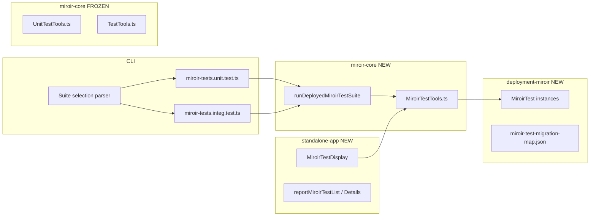

# Feature 196 — Migrate TransformerTests and UnitTests to MiroirTest

GitHub issue: [miroir-framework/miroir#196](https://github.com/miroir-framework/miroir/issues/196)

## Overview

Introduce a unified **`MiroirTest`** entity that **replaces** `UnitTest` and `TransformerTest` as the single test concept. Legacy entities and runners remain in the codebase until a later cleanup issue; **new code does not use them**.

Constraints from the issue:

- UUID v4 only
- TDD throughout
- **Do not touch** legacy `UnitTest` / `TransformerTest` code or deployment JSON
- UI execution is always unit mode (no side effects)
- Vitest loaders migrate to `MiroirTest`; same pass/fail including known failures
- `transformers.integ.test.ts` migrates with `executionMode: "integration"`

---

## Locked decisions (grill session)

| # | Decision |
|---|----------|
| 1 | **Replace, don't wrap** — one concept; legacy removal deferred |
| 2 | **Schema** — Evolve `UnitTest` → `MiroirTest`; unified `miroirTestType` / `miroirTests` / `miroirTestLabel`; **no** `MiroirTestCatalogSuite` |
| 3 | **Runner** — New distilled `MiroirTestTools.ts`; legacy `UnitTestTools.ts` / `TestTools.ts` frozen |
| 4 | **Execution** — `executionMode: "unit" \| "integration"` param; UI always `"unit"` |
| 5 | **CLI selection** — Dynamic import gate; **retire `RUN_TEST`** |
| 6 | **CLI interface** — Hybrid: env vars (CI) + npm args (local) |
| 7 | **UI** — New parallel reports/menu/components; legacy UI untouched |
| 8 | **Migration** — Pilots by hand → `adminTransformers` gate → generator + manifest |
| 9 | **Vitest** — `miroir-tests.unit.test.ts` + `miroir-tests.integ.test.ts`; legacy wrappers until bulk cutover |
| 10 | **Loader switch** — Incremental per pilot, then bulk |

---

## Target schema

```typescript
// MiroirTestDefinition — same envelope as UnitTestDefinition
{
  uuid, parentUuid, selfApplication, branch, name, description, ...
  definition: MiroirTestSuite
}

MiroirTestSuite = {
  miroirTestType: "miroirTestSuite",
  miroirTestLabel: string,
  skip?: boolean,
  miroirTests: MiroirTestNode[]
}

MiroirTestNode =
  | MiroirTestSuite
  | { miroirTestType: "transformerTest", miroirTestLabel, ... }  // native transformer fields
  | { miroirTestType: "functionCallTest", miroirTestLabel, ... }
  | { miroirTestType: "queryRunnerTest", miroirTestLabel, ... }
```

### Normalization rules (pilots + generator)

| Legacy | → MiroirTest |
|--------|--------------|
| `unitTestType` / `unitTests` / `unitTestLabel` | `miroirTestType` / `miroirTests` / `miroirTestLabel` |
| `transformerTestSuite` / `transformerTests` | `miroirTestSuite` / `miroirTests` |
| `transformerTestType: "transformerTest"` | `miroirTestType: "transformerTest"` |
| `transformerTestLabel` | `miroirTestLabel` |
| `UnitTestAsTransformerTest` (`payload` wrapper) | Inline `miroirTestType: "transformerTest"` leaf |

---

## Architecture



---

## Phases

### Phase 0 — Entity bootstrap ✅

**Red:** `miroirTest.schema.unit.test.ts` — `jzodTypeCheck` on `entityDefinitionMiroirTest.mlSchema` + empty pilot instance.

**Green (done):**

- `entityMiroirTest` (`a311f363-e238-4203-bdfc-29e8c160c26b`) + `entityDefinitionMiroirTest` (`51c647fe-07ec-411c-89cc-02689dc66d6a`)
- Wire `miroirTestDefinition` in `getMiroirFundamentalJzodSchema`
- Export from deployment `index.ts` + `miroir-core/src/index.ts`
- `npm run generate-ts-types`
- Minimal `miroirTest_schema_pilot_empty` instance for schema validation

**Do not touch:** legacy entity JSON, `UnitTestTools`, `TestTools`.

**Bootstrap note:** MiroirTest leaf schemas use distinct context keys (`miroirFunctionCallTest`, `miroirQueryRunnerTest`) so they do not overwrite UnitTest's `functionCallTest` / `queryRunnerTest` in the fundamental jzod context. Discriminator values remain `functionCallTest` / `queryRunnerTest`.

**UUIDs (Phase 0):**

| Asset | UUID |
|-------|------|
| `entityMiroirTest` | `a311f363-e238-4203-bdfc-29e8c160c26b` |
| `entityDefinitionMiroirTest` | `51c647fe-07ec-411c-89cc-02689dc66d6a` |
| `miroirTest_schema_pilot_empty` | `cebb6dc8-65ea-482d-b17b-5655c927c1c1` |
| `reportMiroirTestDetails` (placeholder, Phase 4) | `0ad63f27-c4df-4fb8-9a79-cb257c7a2958` |

---

### Phase 1 — `MiroirTestTools` skeleton ✅

**Red:** `miroirTest.tools.unit.test.ts` — dispatch per leaf kind.

**Green (done):** `MiroirTestTools.ts` with `runMiroirTests`, `runMiroirTestSuite`, `executionMode`, `filter`. Leaf adapters delegate to legacy runners without modifying `UnitTestTools` / `TestTools`.

---

### Phase 2 — CLI infrastructure ✅

- `parseMiroirTestCliConfig.ts`
- `runDeployedMiroirTestSuite.ts`
- `miroir-tests.unit.test.ts` / `miroir-tests.integ.test.ts`
- `testMiroir` npm script (hybrid env + args)
- Retire `RUN_TEST` on migrated loaders (per pilot in Phase 3)

**Green (done):** Empty-suite Vitest registration fixed via wrapper `vitest.test` in `runDeployedMiroirTestSuite`. Skip when no suites selected. `npm run testMiroir -- --suites schema_pilot_empty --mode unit` passes.

---

### Phase 3 — Pilots (hand-migrated)

| Order | Source | New instance | Validates |
|-------|--------|--------------|-----------|
| 3a ✅ | `unitTest_pilot_transformer_plus` | `miroirTest_pilot_transformer_plus` | `transformerTest` leaf |
| 3b | `unitTest_suite_mustache` | `miroirTest_mustache` | `functionCallTest` |
| 3c | `unitTest_suite_queries_library` | `miroirTest_queries_library` | `queryRunnerTest` |
| 3d | `transformerTest_adminTransformers` | `miroirTest_adminTransformers` | Deep nested suites |

Per pilot: hand JSON → export → schema test → switch loader → same pass/fail → UI smoke.

---

### Phase 4 — Parallel UI

- `reportMiroirTestList` + `reportMiroirTestDetails` + `miroirTestReportSection`
- Menu “Miroir Tests”
- `MiroirTestDisplay`, `RunMiroirTestSuiteButton`
- Always `executionMode: "unit"`

---

### Phase 5 — Bulk migration

- `generate-miroir-test-instances.ts` + `miroir-test-migration-map.json`
- Switch remaining vitest loaders; delete legacy wrappers

---

### Phase 6 — Integration cutover

- `transformers.integ.test.ts` → `miroir-tests.integ.test.ts` + `miroirTest_miroirCoreTransformers`
- `executionMode: "integration"`

---

## Success criteria

- [ ] `MiroirTest` entity + definition; types generated
- [ ] `MiroirTestTools` runs all 4 leaf kinds; UI unit-only
- [ ] Dynamic import CLI; multi-case via `filter`
- [ ] 3 pilots + `adminTransformers` same results as legacy
- [ ] Generator + manifest; all entity-backed vitest via `MiroirTest`
- [ ] `transformers.integ` via `MiroirTest` + integration mode
- [ ] Legacy code/JSON untouched
- [ ] `RUN_TEST` removed from migrated paths

---

## Out of scope (this issue)

- Deleting legacy entities, reports, menus, deployment JSON
- Editing `UnitTestTools.ts` / `TestTools.ts`
- Fixing known failing tests
- Class E/F vitest-only tests

---

## Suggested commits

1. `feat(miroir-test): add MiroirTest entity definition and generated types`
2. `feat(miroir-core): add MiroirTestTools with leaf dispatch`
3. `feat(miroir-core): add dynamic-import vitest entry points and CLI parser`
4. `feat(miroir-test): pilot MiroirTest instances (transformer, functionCall, queryRunner)`
5. `feat(standalone-app): MiroirTest list/details reports and execution UI`
6. `feat(miroir-test): pilot adminTransformers nested suite`
7. `feat(miroir-core): generator + migration manifest + bulk instances`
8. `refactor(miroir-core): migrate vitest loaders to MiroirTest`
9. `refactor(miroir-core): migrate transformers.integ to MiroirTest`
