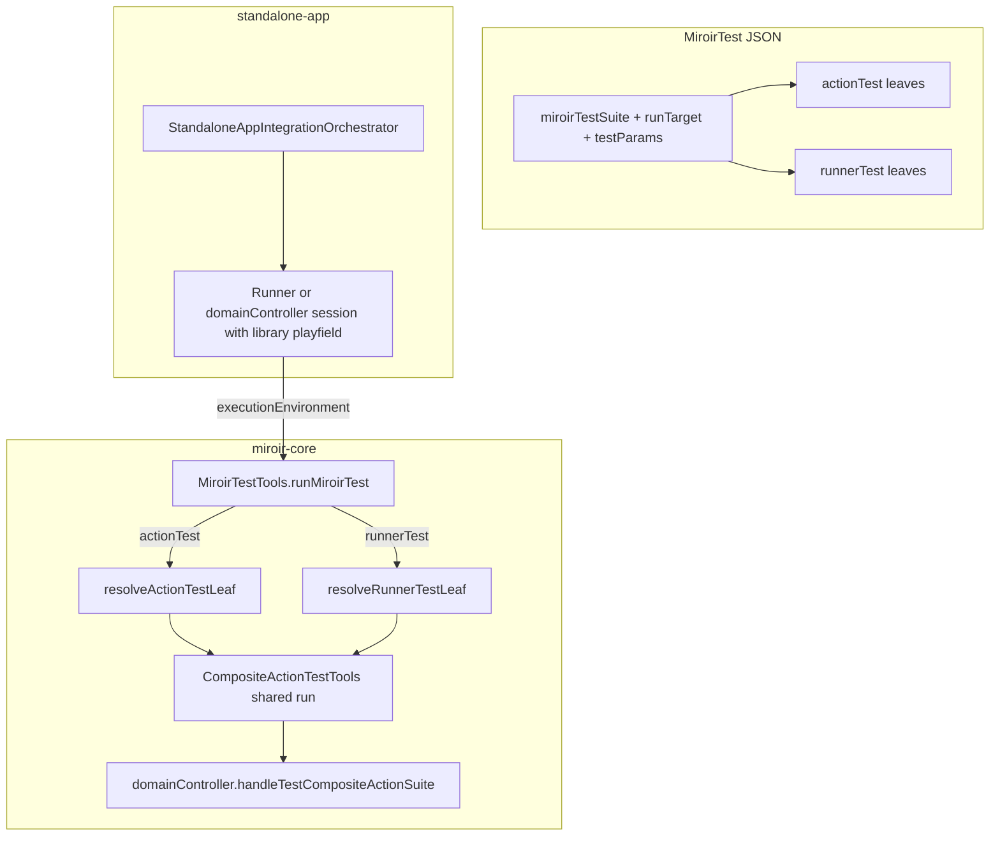

# Action integ → MiroirTest migration plan

**Parent:** [plan.md](./plan.md) (Feature #197)  
**Pilot source:** `packages/miroir-standalone-app/tests/3_controllers/DomainController.integ.Data.CRUD.test.tsx`  
**Status:** Phase 1 ✅ (fundamental `actionTest` schema + compositeActionTestContext + 1.3-a session kind)  
**Method:** TDD; run `npm run nonreg` (or targeted profile integ + unit gate) after each impactful slice

### Hard constraint — legacy file kept green (deprecate, do not delete in 4.1)

- **Do not modify** `DomainController.integ.Data.CRUD.test.tsx` during Phases 0–3 (or any earlier slice).
- Phase **4.1:** mark **deprecated** and point docs/nonreg at `testMiroir --suites domain_controller_data_crud`. **Do not delete** the legacy file until MiroirTest is accepted as the sole owner.
- This command must **keep passing throughout** the migration (and after 4.1 deprecation):

```bash
VITE_MIROIR_TEST_CONFIG_FILENAME=./packages/miroir-standalone-app/tests/miroirConfig.test-emulatedServer-sql.json \
VITE_MIROIR_LOG_CONFIG_FILENAME=./packages/miroir-standalone-app/tests/specificLoggersConfig_DomainController_debug.json \
npm run testByFile -w miroir-standalone-app -- DomainController.integ.Data
```

- Preferred owner path:

```bash
npm run testMiroir -w miroir-standalone-app -- \
  --suites domain_controller_data_crud --mode integ --profile emulatedServer-sql
```

- Delete / retire the legacy file **only in a later cutover slice**, after MiroirTest parity is proven and agreed.
- After `miroir-core` source changes that standalone-app imports from `dist`, run `npm run build -w miroir-core` before re-checking the legacy command.

## Goal

Migrate DomainController **Action-centered** integration tests (composite-action CRUD suites) onto **`MiroirTest` instances**, so they share the same CLI / orchestrator / (later) UI integ path as Runner and Transformer MiroirTests — without duplicating bootstrap or assertion machinery.

**DRY principle:** Runner integ = Actions + Runner/UI composition. Action integ should be a **slightly simpler form of Runner integ**, not a parallel stack.

---

## 1. Inventory — what exists today

### 1.1 MiroirTest leaf kinds (Feature 196 + 197)

| Leaf | Mode | Session kind | Executor |
|------|------|--------------|----------|
| `functionCallTest` | unit only | n/a | `FunctionCallTestTools` |
| `queryTest` | unit only | n/a | `QueryRunnerTestTools` |
| `transformerTest` | unit and/or integ | `transformer` | `MiroirTransformerTestTools` |
| `runnerTest` | **integ only** | `runner` | `RunnerTestTools` → `testBuildPlusRuntimeCompositeActionSuite` |

There is **no** `actionTest` (or equivalent) leaf. `inferIntegrationSessionKind` only recognizes `runnerTest` → `"runner"` and integ `transformerTest` → `"transformer"`.

### 1.2 Runner MiroirTest shape (canonical target to stay close to)

Pilot instance: `miroirTest_runner_library` (`runner_library`).

```text
MiroirTestSuite
  runTarget { applicationUuid, applicationName, deploymentUuid }
  testParams { …param bank… }
  miroirTests[]:
    runnerTest {
      runnerRef, initialModel,
      preTestCompositeActions?, preRunnerCompositeActions?,
      testCompositeActionAssertions?,
      testParams?, skipCreateDeployment?, …
    }
```

Execution path:

1. Vitest entry → `StandaloneAppIntegrationOrchestrator.createSession("runner", …)`
2. `RunnerTestSession.initSession` → `MiroirTestExecutionEnvironment` + `runnerTestContext`
3. `runMiroirTest` → `runMiroirRunnerTest` → `resolveRunnerTestLeaf` → `runRunnerTestCompositeAction`
4. `domainController.handleTestCompositeActionSuite` with **`testBuildPlusRuntimeCompositeActionSuite`**

Session `beforeEach` resets the library playfield (`resetLibraryPlayfield`).

### 1.3 DomainController Data.CRUD shape (pilot to migrate)

File still owns:

- Module-level startups + config load (partially shared with other integ families)
- `DomainControllerIntegrationTestSession` with profile **`miroirPlatform`** (library lifecycle **not** in session `beforeEach`)
- One imperative `TestCompositeActionParams` with `testActionType: **"testCompositeActionSuite"**` containing:
  - Suite hooks: `beforeAll` (create library deployment), `beforeEach` (reset+seed without book3), `afterEach` / `afterAll`
  - Six cases under `testCompositeActions`: Refresh / Add / Add+rollback / Remove / Remove+rollback / Update
- Vitest: `it.each` → `runTestOrTestSuite` (standalone-app helper)

**Semantic overlap with Runner:** same `domainController.handleTestCompositeActionSuite` + `compositeRunTestAssertion` + boxed queries.  
**Differences:** no `Runner` entity / `runnerRef` / `initialModel` / build-plus-runtime templates; uses plain `testCompositeAction` + `compositeActionSequence`; lifecycle hooks live **inside** the suite JSON/TS object, not in session playfield + leaf flags.

### 1.4 Related siblings (later migration, same pattern)

| File | Notes |
|------|--------|
| `DomainController.integ.Model.CRUD.test.tsx` | Larger; model section; `skipResetMiroirModelInInit` |
| `DomainController.integ.compositePK.CRUD.test.tsx` | Data (+ model variants elsewhere) |
| `DomainController.integ.nonUuidPK.CRUD.test.tsx` | Model + Data suites |
| `DomainController.integ.noParentUuid.CRUD.test.tsx` | Model + Data suites |

This plan **pilots Data.CRUD only**; siblings follow after the leaf + shared executor are stable.

---

## 2. Gap analysis — what must close for Action MiroirTests

### Gap A — Schema / leaf type

| Need | Today | Gap |
|------|-------|-----|
| Declare Action integ as MiroirTest JSON | Only `runnerTest` / transformer / unit leaves | Add **`actionTest`** (or agreed name) to `miroirTestLeaf` union + Jzod entity schema + codegen |
| Case-level fields | n/a | Sequence + assertions (+ optional leaf params); **no** `runnerRef` / `initialModel` / `preRunner*` |
| Suite-level run scope | Runner has `runTarget` + `testParams` | Reuse the same suite fields for Action suites |

**Locked direction:** new leaf is a **subset of `runnerTest`**, not a revival of the legacy `Test` entity (`d2842a84-…`). Legacy `Test` stays out of scope (same as #197 G1 for runners).

### Gap B — Shared composite-action executor (DRY)

| Need | Today | Gap |
|------|-------|-----|
| Run `testCompositeActionSuite` from MiroirTest | `runTestOrTestSuite` in **standalone-app** | Logic is outside `miroir-core` MiroirTest dispatch |
| Run `testBuildPlusRuntimeCompositeActionSuite` | `runRunnerTestCompositeAction` in **miroir-core** | Nearly duplicate of `runTestOrTestSuite` suite branch |
| Single status / tracker contract | Both call `handleTestCompositeActionSuite` | Extract **one** core helper used by `runnerTest` and `actionTest` |

**Target:** `CompositeActionTestTools` (name flexible) in `miroir-core/src/5_tests/`:

- `runCompositeActionTestParams(domainController, testAction, applicationDeploymentMap, tracker, paramBank)` — supports both suite action types (lift from `runTestOrTestSuite`)
- `runMiroirRunnerTest` becomes: resolve leaf → call shared helper
- `runMiroirActionTest` becomes: resolve leaf → call shared helper

Standalone-app `runTestOrTestSuite` either thins to a re-export or stays as a deprecated facade until CRUD files are gone.

### Gap C — Leaf → `TestCompositeActionParams` resolve

| Need | Today | Gap |
|------|-------|-----|
| Runner resolve | `resolveRunnerTestLeaf` → build-plus-runtime suite via `testBuildPlusRuntimeCompositeActionSuiteForRunner` | Action needs a **simpler** builder: leaf → `testCompositeAction` / suite entry **without** Runner registry |
| Suite hooks | Runner: session reset + leaf skipCreate/skipDrop | Data.CRUD: hooks embedded in one big suite |

**Two-step migration (recommended):**

1. **Bridge shape (pilot green fast):** one MiroirTest suite whose leaves (or a single suite-shaped node) still express `beforeAll` / `beforeEach` / … as composite actions — closest 1:1 to current TS.
2. **Runner-aligned shape (DRY end state):** move library create/reset/seed into **session playfield** (`miroirAndLibrary` / `resetLibraryPlayfield` + shared seeds such as `LIBRARY_ENTITIES_WITHOUT_BOOK3`), so each `actionTest` leaf is only **sequence + assertions** — same mental model as `runnerTest` without Runner fields.

Do not invent a third lifecycle system.

### Gap D — Session / orchestrator wiring

| Need | Today | Gap |
|------|-------|-----|
| Session for Action suites | `DomainControllerIntegrationTestSession` used by imperative files; orchestrator already has `"domainController"` | MiroirTest CLI/UI path never creates this session for a MiroirTest suite |
| `runnerTestContext` | Required only for `runnerTest` | Action tests need **param bank + runTarget + domainController**, not `runnerRegistry` |
| Infer kind | `inferIntegrationSessionKind` | Must return a kind for suites that contain `actionTest` |

**Decision (prefer DRY with Runner):**

- Prefer routing Action MiroirTest suites through the **same app-stack bootstrap as Runner** (`libraryDeployment` playfield), with a thinner context (`actionTestContext` **or** a generalized `compositeActionTestContext` without `runnerRegistry`).
- Keep `DomainControllerIntegrationTestSession` for **legacy** imperative files and for Model.CRUD quirks (`skipResetMiroirModelInInit`) until those migrate.

Avoid: Action path that re-implements `runAppStackIntegrationBootstrap` differently from Runner.

### Gap E — CLI / registry / Vitest entry

| Need | Today | Gap |
|------|-------|-----|
| `testMiroir --suites … --mode integ` | transformer + `runner_library` | No suite key / export for DomainController Data CRUD |
| Suite registry | library export `miroirTest_runner_library` | Add e.g. `miroirTest_domainController_data_crud` (name TBD) under library (or miroir) deployment model section |
| Vitest entry | `miroir-runner-tests.integ.test.ts` hardcodes runner suite | Generalize CLI loader to select session kind from suite (already partly done in UI launcher via `inferIntegrationSessionKind`) |

### Gap F — Fixture / param bank (Phase R parity)

Data.CRUD currently imports `book1`…`book6`, entity UUIDs, etc. as **TS module literals**.

Runner leaves use **`getFromParameters` / suite `testParams`**. For UI-editable, DRY suites:

- Expected book lists and counts should move toward param-bank / context references where practical.
- Accept **literal expected instances in the pilot** if needed for green parity; schedule a follow-up “R-for-actions” pass (same pattern as Phase R for runners).

### Gap G — UI integ catalog (#197 Phase B)

Once CLI MiroirTest Action suites exist:

- `classifyMiroirTestSuiteExecutionCapabilities` / `inferIntegrationSessionKind` must mark them **integration-only**
- UI launcher must create the correct session (not unit mode)
- Deferred until Gaps A–E green on CLI (same order as Runner: CLI first, UI second)

---

## 3. Design decisions (locked for this plan)

| # | Topic | Decision |
|---|--------|----------|
| A1 | Leaf type | **`actionTest`** — simpler sibling of `runnerTest`; not legacy `Test` entity |
| A2 | Relationship to Runner | Action = Runner minus Runner entity / build-plus-runtime / `preRunner*`; **shared executor** |
| A3 | Suite home | Library application **model** section MiroirTest instance(s), same home pattern as `runner_library` |
| A4 | Pilot | **Data.CRUD only**; keep imperative file until MiroirTest parity proven |
| A5 | Lifecycle end state | Align with Runner: **session playfield + leaf body**; bridge may keep suite hooks for first green |
| A6 | Context object | Prefer generalized **`compositeActionTestContext`** (runTarget, testParams, deployments, domainController); `runnerTestContext` = that + `runnerRegistry` + pageLabel |
| A7 | Testing method | **TDD**; after schema/dispatch/session/CLI slices → **`npm run nonreg`** (or documented subset + full nonreg before merge) |
| A8 | Profiles | Reuse `--profile` / Gap D (pilot: `emulatedServer-sql`) |
| A9 | Session kind for `actionTest` | **1.3-a** — reuse `"runner"` (registry unused for Action leaves) |

---

## 4. Target architecture



**Leaf sketch (illustrative):**

```typescript
// actionTest — subset of runnerTest
{
  miroirTestType: "actionTest",
  miroirTestLabel: "Add Book instance",
  testParams?: Record<string, unknown>,
  // End-state fields (Runner-like):
  compositeActionSequence: CompositeActionSequence, // or templates once ready
  testCompositeActionAssertions: CompositeRunTestAssertion[],
  // Bridge-only / optional:
  beforeTestSetupAction?: CompositeActionSequence,
  afterTestCleanupAction?: CompositeActionSequence,
}
```

Suite-level `beforeAll` / `beforeEach` / … either:

- live on an extended `miroirTestSuite` (if we add them once for Action + Runner), or
- stay in session playfield helpers (preferred for Runner alignment).

---

## 5. Implementation plan (TDD slices)

Each slice: **failing test → implement → green → commit**. After slices marked **★**, run global nonreg.

### Phase 0 — Spec & shared executor (no Data.CRUD move yet) ✅

| Slice | Work | Tests first | Nonreg | Status |
|-------|------|-------------|--------|--------|
| 0.1 | Provisional `miroirTestForActionDraft` (+ TS type); full entity schema in Phase 1 | Unit: schema parse accepts minimal `actionTest`, rejects missing label | — | ✅ |
| 0.2 ★ | Extract `runCompositeActionTestParams`; thin `runRunnerTestCompositeAction` + `runTestOrTestSuite` | Unit: suite + buildPlusRuntime param merge | **nonreg** + legacy Data.CRUD | ✅ |
| 0.3 | `runMiroirActionTest` stub + `MiroirTestTools` dispatch (`executionMode: "integration"` only) | Unit: unit mode throws; missing DC throws; stub “Phase 2” | — | ✅ |

**Note:** Phase 0 does **not** touch `DomainController.integ.Data.CRUD.test.tsx`. Resolve / JSON pilot starts in Phase 2.

### Phase 1 — Schema + session context generalization ✅

| Slice | Work | Tests first | Nonreg | Status |
|-------|------|-------------|--------|--------|
| 1.1 ★ | Add `miroirTestForAction` to fundamental schema; regenerate types; union into `miroirTestLeaf` | Schema / zod unit tests | **nonreg** + legacy Data.CRUD | ✅ |
| 1.2 | `compositeActionTestContext`; `runnerTestContext` extends it | Unit: Runner assignable to Composite | — | ✅ |
| 1.3 | `inferIntegrationSessionKind` / capabilities: `actionTest` → integ, kind **`"runner"` (1.3-a)** | Extended `inferIntegrationSessionKind.unit.test.ts` | — | ✅ |

**Locked 1.3-a:** Action suites reuse session kind `"runner"` (registry unused for Action leaves).

### Phase 2 — Pilot MiroirTest instance (parity with Data.CRUD) ✅

| Slice | Work | Tests first | Nonreg | Status |
|-------|------|-------------|--------|--------|
| 2.0 | `resolveActionTestLeaf` + real `runMiroirActionTest` (via `runCompositeActionTestParams`) | Unit: `ActionTestTools.unit.test.ts` | — | ✅ |
| 2.1 | Add deployment JSON suite with **one** leaf (“Refresh all Instances”) + playfield seed (no suite-level hooks) | Integ: `testMiroir --suites domain_controller_data_crud --mode integ --profile emulatedServer-sql` | — | ✅ |
| 2.2 | Port remaining five cases as `actionTest` leaves | Full suite 6/6 | — | ✅ |
| 2.3 ★ | Wire suite into `testMiroir` / registry export (library package); session `libraryPlayfieldSeed` | CLI entry green for full Data.CRUD suite | **nonreg** | ✅ |
| 2.4 | Parity checklist vs imperative file (same assertions / counts) | Keep both green; document known deltas if any | — | ✅ |

**Phase 2 notes:**
- Suite key: `domain_controller_data_crud` (`miroirTest_domain_controller_data_crud` in **deployment-miroir** `miroir_data`; Library remains `runTarget` only).
- Seed uses `libraryEntitiesAndInstancesWithoutBook3` + `defaultLibraryAppModel` (not `defaultMiroirMetaModel`).
- Imperative `DomainController.integ.Data.CRUD.test.tsx` untouched; both paths green.
- Lifecycle already on session playfield (`RunnerTestSession.libraryPlayfieldSeed`) — Phase 3.1 largely pre-satisfied.

### Phase 3 — Lifecycle alignment (DRY with Runner) ✅

| Slice | Work | Tests first | Nonreg | Status |
|-------|------|-------------|--------|--------|
| 3.1 | Library create/reset/seed on session playfield (`libraryPlayfieldSeed`); JSON suite has **no** suite hooks | Integ: suite still green | — | ✅ |
| 3.2 ★ | Shared `domainControllerDataCrudLibraryPlayfieldSeed` (+ filter entities for Phase 4); integ wiring DRY; unit tests | Unit: `libraryPlayfieldSeeds.unit` + `RunnerTestSession` seed forward | **nonreg** | ✅ |

**Phase 3 notes:**
- Shared seed lives in `tests/helpers/libraryPlayfieldSeeds.ts` (also used by Extractor playfield / Data.CRUD entities).
- Imperative Data.CRUD still owns its own `beforeEach` hooks until Phase 4 cutover; both paths share `libraryEntitiesAndInstancesWithoutBook3`.
- `RunnerTestSession.unit` now mocks `src/.../runRealServerClientBootstrap` (the path session actually imports).

### Phase 4 — Cutover & siblings

| Slice | Work | Tests first | Nonreg | Status |
|-------|------|-------------|--------|--------|
| 4.1 ★ | **Deprecate** (do **not** delete) `DomainController.integ.Data.CRUD.test.tsx`; docs + nonreg prefer `testMiroir --suites domain_controller_data_crud`; legacy stays in nonreg via `DomainController.integ` | Both paths green | **nonreg** | ✅ |
| 4.2 ★ | Port Model.CRUD → `domain_controller_model_crud` (`actionTest`); Publisher+Country playfield seed; deprecate imperative Model.CRUD | Integ 8/8 + legacy green | **nonreg** | ✅ |
| 4.3 ★ | Port compositePK.CRUD → `domain_controller_composite_pk_crud` (`actionTest`); custom TestEntityCompositePK playfield seed; deprecate imperative compositePK | Integ 4/4 + legacy green | **nonreg** | ✅ |
| 4.4+ | Migrate remaining PK / noParentUuid CRUD files using the same leaf + session | One file per slice | nonreg per file or batch | — |

**Phase 4.1 notes:**
- Legacy Data.CRUD marked `@deprecated` with preferred CLI; **must remain runnable** until MiroirTest is accepted as sole owner (later deletion slice — not 4.1).
- Nonreg adds `integ-action-domain_controller_data_crud` while keeping `appstack-DomainController.integ`.

**Phase 4.2 notes:**
- Suite key: `domain_controller_model_crud` (`miroirTest_domain_controller_model_crud` in **deployment-miroir** `miroir_data`; Library remains `runTarget` only); generator: `generate_domain_controller_model_crud_miroir_test.py`.
- Seed: `domainControllerModelCrudLibraryPlayfieldSeed` (Publisher + Country).
- Imperative Model.CRUD deprecated, not deleted.

**Phase 4.3 notes:**
- Suite key: `domain_controller_composite_pk_crud` (`miroirTest_domain_controller_composite_pk_crud` in **deployment-miroir** `miroir_data`; Library remains `runTarget` only); generator: `generate_domain_controller_composite_pk_crud_miroir_test.py`.
- Seed: `domainControllerCompositePkCrudLibraryPlayfieldSeed` (TestEntityCompositePK only; `idAttribute: ["region","code"]`).
- `RunnerTestSession` remaps the *provided* seed metaModel (does not replace with `defaultLibraryAppModel`) so custom entities survive.
- Imperative compositePK.CRUD deprecated, not deleted.

### Phase 5 — UI (#197 Phase B follow-on)

| Slice | Work | Depends |
|-------|------|---------|
| 5.1 | UI launcher routes `actionTest` suites via inferred session kind | Phase B launcher + Phases 0–2 |
| 5.2 | Reporting / troubleshooting same as Runner integ | Phase B reporting |

---

## 6. Mapping — Data.CRUD cases → leaves

| Imperative `testCompositeActions` key | Proposed `miroirTestLabel` |
|---------------------------------------|----------------------------|
| Refresh all Instances | `Refresh all Instances` |
| Add Book instance | `Add Book instance` |
| Add Book instance then rollback | `Add Book instance then rollback` |
| Remove Book instance | `Remove Book instance` |
| Remove Book instance then rollback | `Remove Book instance then rollback` |
| Update Book instance | `Update Book instance` |

Suite label suggestion: `domainController.data.crud` (registry key e.g. `domain_controller_data_crud`).

---

## 7. Non-regression policy

| Trigger | Command |
|---------|---------|
| After ★ slices (schema, shared executor, CLI pilot, lifecycle move, cutover) | `npm run nonreg` from repo root |
| During leaf porting | `npm run testMiroir -w miroir-standalone-app -- --suites <key> --mode integ --profile emulatedServer-sql` |
| Until cutover | Also keep `npm run testByFile -w miroir-standalone-app -- --profile emulatedServer-sql DomainController.integ.Data.CRUD` green |
| Sibling migrations | Same profile; then nonreg |

Do **not** weaken assertions to get green; fix executor / param bank instead.

---

## 8. Out of scope (this plan)

- Migrating all `Runner_*.integ.test.tsx` (still G8 on parent plan)
- Deleting legacy `Test` entity
- PersistenceStoreController-direct `4_storage` → MiroirTest
- Full Phase R-style param-bank cleanup for every book literal in the pilot (optional follow-up)
- Changing CRUD semantics (undo/redo React tests, Model.CRUD behaviour)

---

## 9. Success criteria

- [x] `actionTest` is a first-class `MiroirTest` leaf; dispatch lives in `miroir-core`
- [x] Runner and Action integ share one composite-action execution helper
- [x] Data.CRUD coverage runs via `testMiroir --mode integ` with parity to the imperative suite
- [ ] Imperative Data.CRUD file **deleted** only after MiroirTest is sole owner (4.1: **deprecated**, still green)
- [x] `inferIntegrationSessionKind` / UI capabilities understand Action suites
- [x] Documented in [docs/reference/testing.md](../../../docs/reference/testing.md) under MiroirTest integ families

---

## 10. Related

- [Feature 197 plan](./plan.md)
- [integ-test-setup-gaps.md](./integ-test-setup-gaps.md) (session catalogue; DomainController row)
- [gap-E-refactoring-plan.md](./gap-E-refactoring-plan.md) (DC session migration already done for bootstrap)
- [phase-b-ui-launcher-plan.md](./phase-b-ui-launcher-plan.md) (UI integ after CLI)
- [Feature 196 — MiroirTest](../196-FEATURE-migrate-tests-to-MiroirTest/plan.md)
- Source pilot (deprecated imperative): `packages/miroir-standalone-app/tests/3_controllers/DomainController.integ.Data.CRUD.test.tsx`
- Canonical MiroirTest: `packages/miroir-test-app_deployment-miroir/assets/miroir_data/a311f363-…/c8e2a104-….json` (`domain_controller_data_crud`; Library `runTarget`)
- Runner reference: `packages/miroir-test-app_deployment-library/.../b7e4a901-2c3d-4f5a-b6c7-8d9e0f1a2b3c.json` (`runner_library`)
