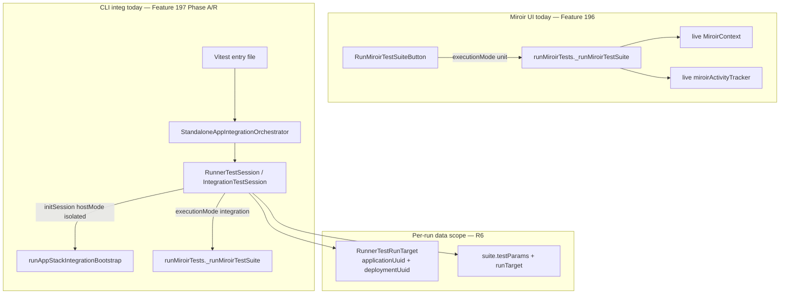
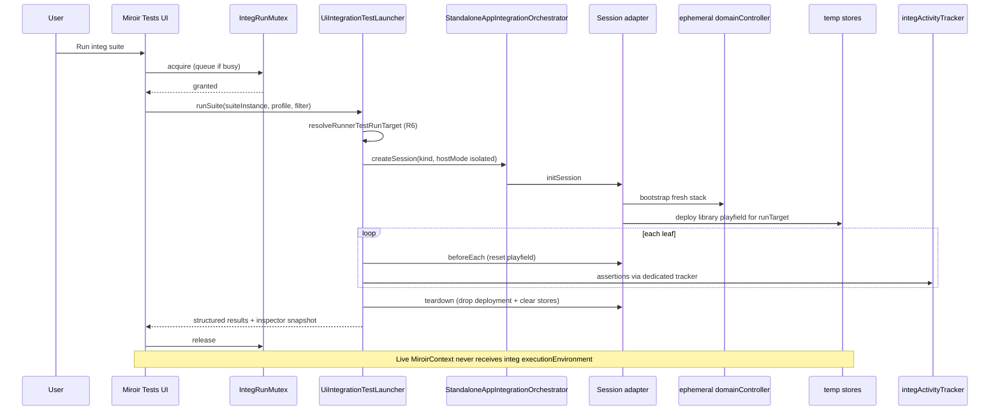
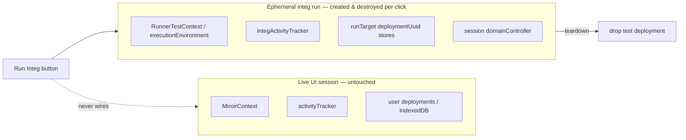
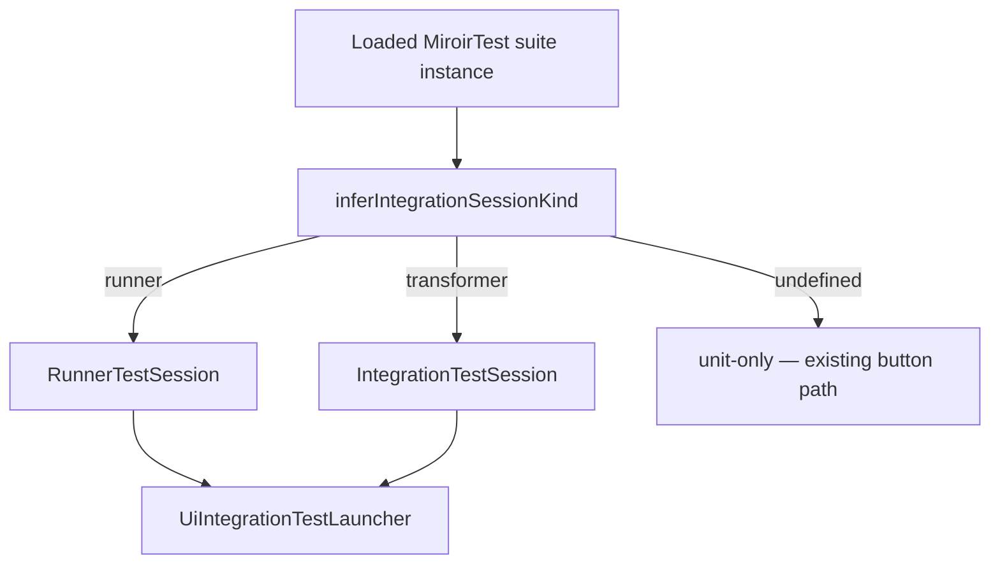

# Phase B — UI integration test launcher

**Parent:** [plan.md](./plan.md) (Feature #197)

**Prerequisites:** Phase A ✅ · Gaps A/B/C-setup/D/E ✅ · Phase R (R0–R6) ✅ · **JzodElementEditor component tests** documented and green ([testing.md](../../../docs/reference/testing.md#jzodelementeditortesttsx--component-integration-suite)) — baseline before B7

**Status:** **Phase B complete** (B0–B7 ✅ incl. C5 + transformer webApp manuals **2026-07-19** · [ui-unit-vs-integ-run-context-plan.md](./ui-unit-vs-integ-run-context-plan.md) T0–T6 ✅) · **Postponed:** B6-b3 Electron emulated · Playwright T3 (D10) · B8 embedded · B9 PersistenceStoreController subprocess

**Goal:** Run the same domainController-based MiroirTest integration suites from the Miroir UI that CLI runs today — with **data-isolated** test runs that do not pollute the user's working session — plus reporting and a troubleshooting inspector.

---

## 1. Architectural impact (read this first)

### 1.1 Terminology correction — what “isolated” means

The parent plan and gap docs sometimes conflate **data isolation** with **Vitest subprocess spawn**. That conflation is misleading in a browser context.

| Term (legacy plan wording) | What it was read as | What we mean for #197 Phase B |
|----------------------------|---------------------|-------------------------------|
| “Isolated test environment” | Spawn Vitest / separate OS process | **Ephemeral data playfield**: own application + deployment identity, own store namespaces, torn down after the run |
| “Sealed run” | Process boundary | **Dataflow boundary**: test `domainController`, param bank, activity tracker, and stores are **not** the live UI `MiroirContext` |
| `hostMode: "isolated"` (Gap A) | Subprocess-only | **Bootstrap mode**: wire a **fresh** emulated stack (`wireEmulatedStack` + platform deploy) instead of injecting the live host `domainController` — works **in-process** in the browser |
| `hostMode: "embedded"` (Gap A) | N/A | Advanced: attach to the **live** host stack for dev troubleshooting — **not** the default for UI integ runs |

**In the browser there is no meaningful “spawn”.** The UI action is **async**: acquire run lock → bootstrap ephemeral session → execute leaves → collect results → teardown stores → release lock. Same JavaScript realm; different **data plane**.

Vitest subprocess remains a **valid CLI/dev transport** (already built) and an **optional Phase B+ launcher** for PersistenceStoreController-direct `4_storage` suites that require Node-side `PersistenceStoreControllerManager` access. It is **not** the primary architectural model for domainController-based MiroirTest integ from the UI.

### 1.2 Present architecture (after Phase R)



**What works today**

- **Unit path in UI:** `RunMiroirTestSuiteButton` calls `runMiroirTests` with `{ executionMode: "unit" }` against the **live** `miroirContext` and activity tracker ([`RunMiroirTestSuiteButton.tsx`](../../../packages/miroir-standalone-app/src/miroir-fwk/4_view/components/Buttons/RunMiroirTestSuiteButton.tsx)).
- **Integ path in CLI:** Vitest loads config → `createStandaloneAppIntegrationOrchestrator()` → session adapter `initSession()` → `_runMiroirTestSuite` with `{ executionMode: "integration", executionEnvironment }` ([`runMiroirRunnerTestsFromCLI.ts`](../../../packages/miroir-standalone-app/tests/helpers/runMiroirRunnerTestsFromCLI.ts)).
- **R6 run scope:** One `RunnerTestRunTarget` per run; suite JSON may pin uuids or session generates fresh UUID v4 ([`RunnerTestRunTarget.ts`](../../../packages/miroir-core/src/5_tests/RunnerTestRunTarget.ts)).
- **Profiles:** `INTEGRATION_TEST_PROFILES` + `--profile` unify config surfaces (Gap D).

**What is missing for UI integ**

| Gap | Status |
|-----|--------|
| No UI code path with `executionMode: "integration"` | ✅ Closed — B5 / B7 |
| UI reuses live `MiroirContext` + tracker | ✅ Closed — isolated launcher + dedicated integ tracker (B1–B3) |
| No run mutex / queue | ✅ Closed — D5 reject (B1) |
| `RunnerTestSession.teardown()` stub | ✅ Closed — B4 |
| Session kind not inferred from deployed suite | ✅ Closed — B0 `inferIntegrationSessionKind` |
| Test helpers under `tests/helpers/` only | ✅ Closed — browser launcher in `src/miroir-fwk/4-tests/` |
| Real-server webApp manual smoke (C5) | ✅ **Done** (2026-07-19) |
| Transformer webApp manual smoke | ✅ **Done** (2026-07-19) |
| Electron emulated profiles (B6-b3) | ⏸️ **Postponed** |
| Embedded host mode (B8) / PSC subprocess (B9) | ⏸️ **Postponed** |

### 1.3 Target architecture — data-isolated UI run





**Architectural invariants (non-negotiable)**

1. **Separate activity tracker** for integ runs — do not call `miroirContext.miroirActivityTracker.resetResults()` for integ (unit button may keep current behavior).
2. **`hostMode: "isolated"`** for default UI integ — session constructs its own bootstrap stack; no injection of live `domainController` unless user explicitly opts into embedded troubleshooting mode.
3. **One integ run at a time** (mutex) — queue or disable Run while active; live UI stays usable but second integ run waits.
4. **Teardown is part of the contract** — success, failure, or cancel must run session `teardown()` and release mutex in `finally`.
5. **Reuse orchestrator + session adapters** — Phase B is wiring, not a parallel bootstrap.

### 1.4 Relationship to locked decisions (parent plan)

| Decision | Phase B interpretation |
|----------|-------------------------|
| **G6** — extend Miroir Tests menu/reports | Same menu (`eaac459c-…`); mode badge `unit` \| `integ`; integ behind session guard on run button |
| **G5** — profiles | UI profile picker backed by `INTEGRATION_TEST_PROFILES` + `describeSession` metadata |
| **Gap A `hostMode`** | **`isolated` = data/bootstrap isolation**, not subprocess |
| **Gap B `playfieldMode`** | `createIfAbsent` for UI integ (fresh library deployment per runTarget); `requireExisting` only for embedded advanced path |
| **R6 run target** | Launcher passes `runTarget` + `suite.testParams` into `RunnerTestSession`; UI offers **Ephemeral run** (fresh UUID v4) vs **Pinned suite targets** (JSON) toggle (**D2 locked**) |
| **Out of scope** | PersistenceStoreController-direct `4_storage` Vitest files — defer unless optional subprocess catalog entry (Phase B+) |

### 1.5 Code seams Phase B must touch

| Area | Package | Change |
|------|---------|--------|
| UI launcher service | `miroir-standalone-app/src/…` | New `runUiIntegrationTestSuite()` — orchestrator + `_runMiroirTestSuite` without Vitest |
| Run button / display | `RunMiroirTestSuiteButton`, `MiroirTestDisplay` | Detect integ-capable suites; branch unit vs integ; mutex + disabled state |
| Session teardown | `RunnerTestSession` | Real store drop (mirror `IntegrationTestSession.teardown` pattern for `runTarget`) |
| Suite → session kind | `miroir-core` or standalone helper | `inferIntegrationSessionKind(suite)` from leaf `miroirTestType` |
| Inspector panel | new UI section | Profile, runTarget, deployment map, phase descriptors, last composite actions from integ tracker |
| Vitest-free test runner shim | `miroir-core` `RunMiroirTests` | Vitest is passed for CLI `it()` registration; UI path runs leaves directly (see B2) |

---

## 2. Scope

### In scope

- domainController-based MiroirTest integ from UI:
  - **`runnerTest`** suites (pilot: `runner_library`)
  - **`transformerTest`** integ suites (follow-on slice; same launcher, `IntegrationTestSession` kind)
- Data-isolated default path (`hostMode: "isolated"`)
- Profile selection, structured results in existing reports, troubleshooting inspector
- Mutex / queue for integ runs

### Out of scope (Phase B)

- PersistenceStoreController-direct `4_storage` suites in-browser (no `PersistenceStoreController` in UI thread) — optional **subprocess catalog** in Phase B+ ([integ-test-setup-gaps.md §4.3](./integ-test-setup-gaps.md))
- Migrating remaining legacy `Runner_*` imperative files (G8 — parallel track)
- **`hostMode: "embedded"`** as default — optional gated dev feature only (B4)

---

## 3. TDD slices

Each slice: **Red → Green → Verify**. After every slice that touches runner path, run [Global non-regression](#global-non-regression-criteria).

### B0 — Terminology + launcher contract (docs + types) ✅

**Deliverables**

- This plan ✅
- Update parent [plan.md](./plan.md) Phase B pointer + isolation wording ✅
- Export `UiIntegrationTestRunRequest` / `UiIntegrationTestRunResult` types (standalone-app) ✅ — [`uiIntegrationTestLauncherTypes.ts`](../../../packages/miroir-standalone-app/src/miroir-fwk/4-tests/uiIntegrationTestLauncherTypes.ts)
- `inferIntegrationSessionKind(suite)` + `classifyMiroirTestSuiteExecutionCapabilities(suite)` ✅ — [`inferIntegrationSessionKind.ts`](../../../packages/miroir-core/src/5_tests/inferIntegrationSessionKind.ts)

**Verify:** unit tests for kind inference on `miroirTest_runner_library` + `miroirCoreTransformers` ✅

```bash
cd packages/miroir-core && npx vitest run tests/4_services/inferIntegrationSessionKind.unit.test.ts
cd packages/miroir-standalone-app && npx vitest run tests/helpers/uiIntegrationTestLauncherTypes.unit.test.ts
```

---

### B1 — Integ run mutex + separate tracker ✅

**Deliverables**

- `IntegTestRunCoordinator`: `acquire()` / `release()` / `runExclusive()`, `isRunning` ✅ — [`integTestRunCoordinator.ts`](../../../packages/miroir-standalone-app/src/miroir-fwk/4-tests/integTestRunCoordinator.ts)
- `getIntegTestRunCoordinator()` singleton for UI ✅
- `createIntegActivityTracker()` (async, optional logger wiring) + `createIntegActivityTrackerSync()` ✅
- D5 policy: second `acquire` throws `IntegTestRunAlreadyActiveError` (no queue) ✅

**Verify:**

```bash
cd packages/miroir-standalone-app && npx vitest run tests/helpers/integTestRunCoordinator.unit.test.ts
```

---

### B2 — Vitest-free suite execution path ✅

**Deliverables**

- Shared `runMiroirTestSuiteWalk` — vitest vs in-process leaf execution ✅ — [`miroirTestSuiteWalk.ts`](../../../packages/miroir-core/src/5_tests/miroirTestSuiteWalk.ts)
- `runMiroirTestSuiteInProcess` + `createInProcessVitestStub` ✅ — [`runMiroirTestSuiteInProcess.ts`](../../../packages/miroir-core/src/5_tests/runMiroirTestSuiteInProcess.ts)
- `runMiroirTestSuite` (CLI) delegates to walk with `inProcess: false` — unchanged Vitest registration ✅

**Verify:**

```bash
cd packages/miroir-core && npx vitest run tests/4_services/runMiroirTestSuiteInProcess.unit.test.ts
```

---

### B3 — `UiIntegrationTestLauncher` (runner pilot) ✅

**Deliverables**

- `runUiIntegrationTestSuite(request, environment)` ✅ — [`uiIntegrationTestLauncher.ts`](../../../packages/miroir-standalone-app/src/miroir-fwk/4-tests/uiIntegrationTestLauncher.ts)
- `UI_INTEGRATION_RUNNER_SUITE_REGISTRY` + `resolveUiIntegrationRunnerSuite` ✅ — [`uiIntegrationTestRunnerSuiteRegistry.ts`](../../../packages/miroir-standalone-app/src/miroir-fwk/4-tests/uiIntegrationTestRunnerSuiteRegistry.ts)
- Node wiring: `runUiIntegrationTestSuiteInNode` ✅ — [`runUiIntegrationTestSuiteInNode.ts`](../../../packages/miroir-standalone-app/tests/helpers/runUiIntegrationTestSuiteInNode.ts)
- Flow: profile → orchestrator session (`hostMode: isolated`) → `initSession` → `runMiroirTestSuiteInProcess` + `beforeEachLeaf` → `teardown` in `finally` ✅
- D2: `resolveUiIntegrationTestRunTarget` (`ephemeral` \| `pinned`) ✅
- B1 mutex via `getIntegTestRunCoordinator().runExclusive` ✅
- `runMiroirRunnerTest` records `setTestAssertionResult` for UI success checks ✅

**Verify:**

```bash
cd packages/miroir-standalone-app && npx vitest run tests/helpers/uiIntegrationTestLauncher.unit.test.ts
cd packages/miroir-standalone-app && npx vitest run tests/helpers/uiIntegrationTestLauncher.integ.test.ts
# Global non-reg (2 passed)
VITE_MIROIR_TEST_CONFIG_FILENAME=./packages/miroir-standalone-app/tests/miroirConfig.test-emulatedServer-sql.json \
VITE_MIROIR_LOG_CONFIG_FILENAME=./packages/miroir-standalone-app/tests/specificLoggersConfig_DomainController_debug.json \
npm run testMiroir -w miroir-standalone-app -- --suites runner_library --mode integ
```

---

### B4 — `RunnerTestSession.teardown` — real store cleanup ✅

**Problem:** Teardown only nulled fields ([`RunnerTestSession.ts`](../../../packages/miroir-standalone-app/tests/helpers/RunnerTestSession.ts)). Data isolation requires drop deployment composite action for `runTarget.deploymentUuid`.

**Delivered**

- Teardown inputs read from `runnerTestContext` set during `initSession` (`runTarget`, `testDeploymentStorageConfiguration`, plus session-held `domainController` / `applicationDeploymentMap`)
- `teardown()` calls `buildTeardownTestApplicationStoresAction` with **runTarget** uuids (same pattern as `IntegrationTestSession`)
- `resetLibraryPlayfield` deferred (optional; teardown deleteStore sufficient for ephemeral runTarget)

**Tests**

- Unit: `RunnerTestSession.unit.test.ts` — mock `handleCompositeAction` receives drop action with runTarget uuids ✅
- Integ: covered by existing B3 launcher integ (session teardown on walk completion) + global `runner_library` non-reg

---

### B5 — UI wiring (G6) ✅

**Delivered**

- `RunMiroirTestSuiteButton`: `runMode` prop — unit path unchanged; integration path calls `runUiIntegrationTestSuite` via `createBrowserUiIntegrationTestLauncherEnvironment`; disabled while coordinator held or suite unsupported ✅
- `MiroirTestDisplay`: execution mode badge (`unit` | `integration` | `mixed`); D6 split buttons for mixed suites ✅
- Snackbar success/fail via existing `handleAsyncAction`; integration success message points to `#integration-test-inspector` ✅
- Browser profile pilot: bundled `emulatedServer-sql` JSON in [`integrationTestProfileAssets.ts`](../../../packages/miroir-standalone-app/src/miroir-fwk/4-tests/integrationTestProfileAssets.ts) ✅
- Minimal [`UiIntegrationTestRunInspectorSummary`](../../../packages/miroir-standalone-app/src/miroir-fwk/4_view/components/Reports/UiIntegrationTestRunInspectorSummary.tsx) (full picker in B6) ✅
- Coordinator `subscribe()` + `useIntegTestRunCoordinator` hook ✅

**Tests**

- Unit: `miroirTestSuiteUiExecution.unit.test.ts`, `integrationTestProfileAssets.unit.test.ts`, coordinator subscribe in `integTestRunCoordinator.unit.test.ts` ✅

---

### B6 — Profile picker + **proven** UI launch (mandatory B6-c + B6-d)

**B6 is not complete** until **both B6-c and B6-d** pass. Unit tests and Node launcher integ alone are insufficient — the report UI must enable and complete a run.

**Implementation order (locked D12):** B6-d0 ✅ → **B6-d1 ✅** → **B6-d2 indexedDb manual ✅** → **B6-c C1–C5 ✅** → B6 done → **B7 ✅** (code/Node/RTL + webApp manual **2026-07-19**). Follow-ups / postponed: Playwright (D10), Electron emulated (D11 / B6-b3), B8, B9.

#### Proof tiers (clarified)

| Tier | What it proves | Required for B6? |
|------|----------------|------------------|
| **T0** Unit (catalog, inspector model, suite key resolver) | Wiring logic | Necessary, not sufficient |
| **T1** Node launcher integ (`uiIntegrationTestLauncher.integ.test.ts`) | Launcher + session in Vitest | Necessary, not sufficient |
| **T2** Node RTL (`MiroirTestDisplayIntegrationLaunch.integ.test.tsx`) | Full React tree: button → launcher → inspector | **Mandatory (B6-d1)** |
| **T3** Manual / automated **webApp** smoke | Browser: button enabled, run completes, inspector green | **Mandatory (B6-d2)** |
| **T4** Real-server path | `realServer-*` with `miroir-server` up | **Mandatory (B6-c)** |

Vitest (T1/T2) may use **`emulatedServer-sql`** because Node registers store sections. T3 must use **`emulatedServer-indexedDb`** in the browser (or real-server after B6-c).

---

#### B6-a — UI scaffold ✅

Picker, run-target toggle, inspector, preferences, `MiroirTestDisplay` wiring.

---

#### B6-b — Runtime-aware profile catalog (partial)

| Slice | Status | Deliverable |
|-------|--------|-------------|
| **B6-b1** | ✅ | `UiIntegrationProfileTransport`; default `emulatedServer-indexedDb`; bundled indexedDb JSON |
| **B6-b2** | ✅ | `detectUiIntegrationRuntime()`; picker filters by runtime (web hides SQL/mongo emulated); CI profiles omitted |
| **B6-b3** | **Postponed** (D11) | Electron launcher env: bundle `emulatedServer-sql` etc.; wire main-process emulated bootstrap |

---

#### B6-d0 — Suite registry key resolution ✅

**Red:** `isUiIntegrationRunnerSuiteSupported("runner.library")` → false while report uses `miroirTestLabel`.

**Green:** `resolveUiIntegrationRunnerSuiteKey(miroirTest)` → `runner_library`; button uses registry key.

**Verify:** `integrationTestProfileCatalog.unit.test.ts` (resolveUiIntegrationRunnerSuiteKey block).

---

#### B6-d1 — Node RTL: Miroir Test details integration button (mandatory)

**File:** `tests/4_view/MiroirTestDisplayIntegrationLaunch.integ.test.tsx`

**Red**

- Render `MiroirTestDisplay` with `miroirTest_runner_library` and `testLabel="runner.library"` (matches report)
- Assert Run Integration button **not disabled** when profile `emulatedServer-indexedDb` (mock runtime webApp)
- Click button → inspector shows `success: true`, suite `runner_library`, ≥1 assertion pass

**Green**

- Provider stack: snackbar, `ConfigurationService.registerTestImplementation({ expect })`, store section startups in `beforeAll` (same as `uiIntegrationTestLauncher.integ.test.ts`)
- May use **`emulatedServer-sql`** profile in this test (Node) once click path works — proves depth beyond B3

**Verify**

```bash
VITE_MIROIR_TEST_CONFIG_FILENAME=./packages/miroir-standalone-app/tests/miroirConfig.test-emulatedServer-sql.json \
VITE_MIROIR_LOG_CONFIG_FILENAME=./packages/miroir-standalone-app/tests/specificLoggersConfig_DomainController_debug.json \
npm run testByFile -w miroir-standalone-app -- MiroirTestDisplayIntegrationLaunch.integ
```

---

#### B6-d2 — WebApp smoke checklist (mandatory — manual only for B6)

**Locked (D10):** Manual checklist **sufficient for B6 done**. Browser automation (Playwright/Cypress) is a **follow-up issue** — not blocking B6 or B7.

##### IndexedDb emulated — ✅ PASSED (2026-07-16)

Manual webApp smoke on `emulatedServer-indexedDb` + ephemeral runTarget:

1. ✅ Library → Miroir Test details for `runner_library`
2. ✅ Profile picker: `emulatedServer-indexedDb` launchable; real-server rows selectable but not launchable until B6-c
3. ✅ **Run Integration Tests** enabled (orange)
4. ✅ Click run → inspector **passed** (2/2 tests, 2/2 assertions: Lend Book + Return Book); ephemeral `runTarget` UUIDs distinct from live Library; blank-page regression fixed (`clearDocumentBody: false`)
5. ✅ **C5** — `realServer-sql` against **same** localhost server (D9); live library session unchanged — **2026-07-19**

**Follow-up issue (postponed):** automate T3 (Playwright) for CI regression of webApp integ launch.

---

#### B6-c — Real-server UI path (mandatory)

**Goal:** SQL / filesystem / mongo / remote IndexedDB in **webApp** via the **same dev `miroir-server`** (`https://localhost:3080`) + `realServer-*` configs.

**Isolation model (locked D9):** **Same dev server, data-isolated `runTarget`.** No second server process. Ephemeral application/deployment UUIDs per integ run; session `teardown()` drops test deployment stores on that server. Live UI session stores remain untouched when `runTarget` UUIDs differ from the working session.

**Implications for C1–C5:**

- Bootstrap is **client-only REST** (`emulateServer: false`) — no in-browser `wireEmulatedStack`.
- Preflight (C2) pings the **host's** `rootApiUrl` (same server the dev app already uses).
- C4/C5 use existing `miroirConfig.test-realServer-*.json` without a separate test-server config family.
- Teardown failure on shared server is **high severity** — inspector must surface failed drop; mutex release still happens in `finally`.

| Slice | TDD | Deliverable |
|-------|-----|-------------|
| **C1** | ✅ | `runRealServerClientBootstrap` + `RunnerTestSession` branch (`emulateServer: false`, `platformEnsureMode: "skip"`) |
| **C2** | ✅ | `assertMiroirServerReachable(rootApiUrl)` before real-server run; snackbar via thrown `MiroirServerUnreachableError` on Run button |
| **C3** | ✅ | Bundled `miroirConfig.browser-realServer-sql.json`; `realServer-sql` launchable in webApp picker |
| **C4** | ✅ file + skip-if-down | `uiIntegrationTestLauncher.realServer.integ.test.ts` — live server, ephemeral, Return Book leaf; `--storage sql\|filesystem\|indexedDb\|mongodb` (or `--profile realServer-*`) |
| **C5** | Manual T3 | ✅ **Done 2026-07-19** — webApp smoke: `realServer-sql` against **same** localhost server; live library session unchanged |

**Verify (C4):**

```bash
# miroir-server running at https://localhost:3080 — prefer argv (env is legacy)
npm run testByFile -w miroir-standalone-app -- \
  --storage sql uiIntegrationTestLauncher.realServer.integ

# Equivalent profile form
npm run testByFile -w miroir-standalone-app -- \
  --profile realServer-filesystem uiIntegrationTestLauncher.realServer.integ
```

Close gaps G-UI-1 … G-UI-7 (§5.3).

---

#### B6 done checklist

- [x] B6-a scaffold ✅
- [x] B6-b2 runtime-filtered picker ✅ · B6-b3 Electron emulated → **postponed** (D11)
- [x] B6-d0 suite key ✅
- [x] **B6-d1** RTL integ test green (`MiroirTestDisplayIntegrationLaunch.integ.test.tsx` — Return Book leaf, ~19s)
- [x] **B6-d2** webApp manual smoke passed (indexedDb emulated) — **2026-07-16**
- [x] **B6-c** C1–C5 ✅ (C4 Node integ skips if server down · **C5 webApp real-server smoke ✅ 2026-07-19**)

---

### B7 — Transformer integ in UI (D3 — same Phase B scope) ✅

**Deliverables**

- ✅ Launcher branch for `kind: "transformer"` → `IntegrationTestSession` + same in-process runner
- ✅ Register transformer suites in UI catalog (`miroirCoreTransformers`)
- ✅ Ephemeral / pinned toggle applies to transformer session `applicationIdentity`
- ✅ Browser-safe `IntegrationTestSession` in `src/` (no `node:path`); browser orchestrator supports transformer with IndexedDB + bundled admin
- ✅ Node integ: `uiIntegrationTestLauncher.integ.test.ts` transformer leaf green
- ✅ **B7 realServer Node path:** `RealServerTransformerTestSession` + browser/Node wiring for `realServer-sql`; Node proof `uiIntegrationTestLauncher.realServer.transformer.integ.test.ts` (skips if server down)
- ✅ List integ RTL: `MiroirTestListIntegrationLaunch.integ.test.tsx` (transformer leaf via **Run All Integration Tests**)
- ✅ List vs details dual-mode UX: [ui-unit-vs-integ-run-context-plan.md](./ui-unit-vs-integ-run-context-plan.md) T0–T6 ✅
- ✅ **WebApp manual** — details `miroirCoreTransformers` indexedDb + `realServer-sql` — **2026-07-19**

**Verify**

```bash
# Node UI launcher integ (one integ leaf)
npm run testByFile -w miroir-standalone-app -- uiIntegrationTestLauncher.integ

# RealServer transformer leaf (requires miroir-server; skips if down)
npm run testByFile -w miroir-standalone-app -- \
  --storage sql uiIntegrationTestLauncher.realServer.transformer.integ

# CLI non-reg
npm run testMiroir -w miroir-standalone-app -- \
  --profile emulatedServer-sql --suites miroirCoreTransformers --mode integ
```

**Manual (webApp) — ✅ Done 2026-07-19**

1. ✅ Miroir Tests → `miroirCoreTransformers` → profile `emulatedServer-indexedDb` → Run Integration Tests (IndexedDB path).
2. ✅ With `miroir-server` up: same suite → profile `realServer-sql` → ephemeral → Run Integration Tests → inspector `sessionKind: transformer`, success.

---

### B8 — (Optional) Embedded troubleshooting path — **postponed**

**Deliverables**

- Hidden/advanced toggle: `hostMode: "embedded"` + inject live host env (explicit confirm dialog)
- `playfieldMode: "requireExisting"` when library already deployed
- Document risks: may mutate live library playfield

**Not required for Phase B done.** Marked **postponed** (not scheduled).

---

### B9 — (Optional Phase B+) Subprocess launcher for PersistenceStoreController suites — **postponed**

**Not default.** UI menu entry that shells `npm run testByFile …` via desktop wrapper or documented dev-only command — **postponed** out of core Phase B unless product requests.

---

## 4. UI ↔ orchestrator mapping

| Suite signal | Session kind | Adapter | Registry / export |
|--------------|--------------|---------|-------------------|
| `runnerTest` leaves | `runner` | `RunnerTestSession` | `miroirRunnerTestSuiteRegistry` |
| `transformerTest` + integ | `transformer` | `IntegrationTestSession` | transformer suite registry / deployment exports |
| PersistenceStoreController Vitest files | `appStackPersistenceStoreController` | subprocess only (B9) | `testByFile` filters |



---

## 5. Config and profiles in the browser

### 5.1 Runtime surfaces and store backends (corrected)

Integration tests use an emulated in-process server (`setupMiroirTest`) or a **real** `miroir-server`. Which backends work depends on **where the UI runs**:

| Runtime | Detect | Emulated IndexedDB | Emulated SQL/fs/mongo | Real server (`realServer-*`) |
|---------|--------|--------------------|------------------------|------------------------------|
| **webApp** (browser) | no `electronAPI.callMiroirIpc` | ✅ native PersistenceStoreController | ❌ | ✅ when B6-c (HTTP client only) |
| **electron** (desktop) | `electronAPI.callMiroirIpc` | ✅ | ✅ main process owns emulated stack (same as app today) | ✅ when B6-c |
| **nodeTest** (Vitest RTL) | test harness | ✅ | ✅ store startups in `beforeAll` | ✅ with server up |

**UI profile picker rules (B6-b2):**

- **Never list** `cliEmulatedOnly` (CI presets) in the picker.
- **webApp picker:** `emulatedServer-indexedDb` + `realServer-*` (selectable; launch gated until B6-c). **Do not show** `emulatedServer-sql` / `-filesystem` / `-mongodb`.
- **electron picker:** all `emulatedServer-*` + `realServer-*` (real-server launch gated until B6-c).

Bundling `emulatedServer-sql` JSON into the web bundle does **not** make SQL runnable in the browser.

### 5.2 Known defect — grey Run button (B6-d0) ✅

[`ReportSectionMiroirTest`](../../../packages/miroir-standalone-app/src/miroir-fwk/4_view/components/Reports/ReportSectionMiroirTest.tsx) passes `testLabel = miroirTestLabel` (`runner.library`) but the launcher registry key is **`runner_library`** (`instance.name`). `isUiIntegrationRunnerSuiteSupported("runner.library")` was false → button greyed even with a valid profile.

**Fix:** `resolveUiIntegrationRunnerSuiteKey(instance)` — map by `instance.name` or `miroirTestLabel` → registry key; pass registry key to `RunMiroirTestSuiteButton.testSuiteKey`.

---

Gap D profiles use filesystem paths in Node (`loadTestConfigFiles`). UI launcher bundles or fetches JSON:

| Approach | Pros | Cons |
|----------|------|------|
| **A — Bundled profile JSON** | Simple; works offline | Per-profile maintenance; today: indexedDb only |
| **B — Fetch from static URLs** | Single source | Vite asset wiring |
| **C — Reuse host `MiroirConfig`** | Matches live stack | Couples integ to live session |

**Default (B6-b):** **A** for `emulatedServer-indexedDb`. Real-server profiles (B6-c) reuse same loader once bootstrap supports `emulateServer: false`.

### 5.3 Gap analysis — real-server integ from UI (B6-c)

| # | Gap | Current state | Needed for B6-c |
|---|-----|---------------|-----------------|
| G-UI-1 | **`runAppStackIntegrationBootstrap` requires `emulateServer: true`** | ✅ Closed — `runRealServerClientBootstrap` (C1) | Client-only wire to `rootApiUrl` |
| G-UI-2 | **Browser orchestrator imports `RunnerTestSession` from `tests/helpers/`** | ✅ Closed — browser sessions in `src/miroir-fwk/4-tests/` | Browser-safe session factory |
| G-UI-3 | **No store-section registration in browser app startup** | ✅ Closed for IndexedDB path; SQL/fs/mongo via real-server only | IndexedDB in app bundle; others on server |
| G-UI-4 | **Real-server profiles absent from Gap D `INTEGRATION_TEST_PROFILES`** | ✅ Closed — UI catalog + loader | Extend UI catalog |
| G-UI-5 | **Server reachability / TLS** | ✅ Closed — `assertMiroirServerReachable` (C2) | Preflight + snackbar |
| G-UI-6 | **Profile picker enables real-server launch** | ✅ Closed (C3) | Enable when G-UI-1…5 satisfied |
| G-UI-7 | **No proof integ button works end-to-end** | ✅ Closed — B6-d1 RTL + B6-d2 indexedDb manual + **C5 real-server webApp ✅ 2026-07-19** | B6-d + C5 |

Reference configs: `tests/miroirConfig.test-realServer-sql.json`, `realServer-indexedDb.json`, `realServer-filesystem.json`. See [testing.md](../../../docs/reference/testing.md#config-file-catalogue).

---

## 6. Locked decisions (grill session)

| # | Decision | Locked |
|---|----------|--------|
| **D1** | **Primary transport** | **In-browser async orchestrator** — data-isolated session in the same JS realm; Vitest subprocess **not** the UI model (optional B9 for PersistenceStoreController-only dev catalog) |
| **D2** | **UI `runTarget` policy** | **User toggle:** “Ephemeral run” → always `generateRunnerTestRunTarget()` (fresh UUID v4); “Pinned suite targets” → `resolveRunnerTestRunTarget({ suite })` (honor JSON pins, generate when unpinned) |
| **D3** | **First UI suites** | **`runner_library` + transformer integ** (e.g. `miroirCoreTransformers`) — B3 runner pilot, B7 transformer in same Phase B scope (not deferred post-done) |
| **D4** | Config / runtime | **webApp:** indexedDb emulated + real-server (B6-c). **electron:** all emulatedServer-* + real-server. **CI profiles:** never in picker |
| **D8** | **Proof depth for B6** | **T2** Node RTL (B6-d1) + **T3** webApp smoke (B6-d2) + **T4** real-server (B6-c) — all mandatory; T0/T1 necessary only |
| **D9** | **Real-server isolation (B6-c)** | **Same dev `miroir-server`**, data-isolated ephemeral `runTarget` + teardown — no dedicated test-server process |
| **D10** | **B6-d2 webApp proof** | **Manual checklist sufficient for B6 done**; Playwright/Cypress T3 automation → **follow-up issue** (not blocking B7) |
| **D11** | **B6-b3 Electron emulated** | **Follow-up issue** — webApp B6 proof sufficient; Electron integ reuses main-process stack after B6-c |
| **D12** | **B6 implementation order** | **B6-d1 → B6-d2 (indexedDb manual) → B6-c → B6-d2 (real-server manual)** → B6 done → B7 |
| **D13** | **B6-d1 RTL scope** | **Single leaf first** (Return Book — same as `uiIntegrationTestLauncher.integ.test.ts`); full `runner_library` optional second test after green |
| **D5** | Mutex policy | **Reject** second run with snackbar “integ run in progress” (no queue v1) — _proposed_ |
| **D6** | Mixed unit+integ suite | **Split buttons**: “Run unit tests” + “Run integ tests” when mixed — _proposed_ |
| **D7** | Cancel mid-run | Phase B v1: no cancel; B+ add `AbortSignal` if bootstrap supports it — _defer_ |

---

## 7. Success criteria

### Phase B done

- [x] UI runs `runner_library` integ with **data-isolated** session (live `MiroirContext` unchanged) — B3–B5, B6-d1/d2, **C5**
- [x] Integ uses dedicated activity tracker; unit button behavior unchanged — B1, B5
- [x] Mutex prevents overlapping integ runs — B1 (D5 reject)
- [x] `RunnerTestSession.teardown` drops ephemeral deployment stores — B4
- [x] Mode badge visible on Miroir Test reports (`unit` / `integ` / `mixed`) — B5
- [x] Inspector shows profile + last runTarget + session descriptor + assertion summary — B6-a; proven B6-d1/d2 + C5
- [x] Profile picker lists profiles with correct **transport** labels (indexedDb browser / CLI-only / real-server) — B6-b
- [x] **B6-d:** RTL integ test clicks “Run Integration Tests” on Miroir Test details and asserts inspector success
- [x] **B6-c C1–C5:** Real-server client bootstrap + Node proof + **webApp real-server smoke ✅ 2026-07-19**
- [x] Transformer integ suite (`miroirCoreTransformers`) runnable from same launcher (B7 code/Node/list RTL + **webApp manual ✅ 2026-07-19**)

### Postponed (optional / follow-up)

- [ ] **B6-b3 / D11** — Electron emulated SQL/fs/mongo profile bundles
- [ ] **D10** — Playwright/Cypress automate B6-d2 T3
- [ ] **B8** — optional `hostMode: "embedded"` troubleshooting path
- [ ] **B9** — PersistenceStoreController-direct `4_storage` subprocess catalog from UI
- [ ] **D7** — cancel mid-run (`AbortSignal`)

### Global non-regression criteria

After every slice that touches runner session / launcher:

```bash
VITE_MIROIR_TEST_CONFIG_FILENAME=./packages/miroir-standalone-app/tests/miroirConfig.test-emulatedServer-sql.json \
VITE_MIROIR_LOG_CONFIG_FILENAME=./packages/miroir-standalone-app/tests/specificLoggersConfig_DomainController_debug.json \
npm run testMiroir -w miroir-standalone-app -- --suites runner_library --mode integ
```

Expected: **2 passed** (`Lend Book` + `Return Book`).

Additional after B2+:

```bash
npm run testMiroir -w miroir-standalone-app -- \
  --profile emulatedServer-sql --suites miroirCoreTransformers --mode integ
```

Unit tests for new helpers:

```bash
cd packages/miroir-standalone-app && npx vitest run tests/helpers/integrationTestProfiles.unit.test.ts
cd packages/miroir-core && npx vitest run tests/5-tests/MiroirTestIntegrationOrchestrator.unit.test.ts
```

---

## 8. Risks and mitigations

| Risk | Mitigation |
|------|------------|
| Integ bootstrap in browser is heavy (slow UX) | Progress UI from activity tracker phases; run single suite; mutex prevents pile-up |
| IndexedDB / Postgres schema leak if teardown stub ships | **B4 is blocking** for “done”; do not ship B5 without B4 |
| Importing `tests/helpers` from React breaks bundle | Move launcher to `src/miroir-fwk/…/integrationTests/`; keep tests importing from src |
| `runnerTest` in unit mode throws | UI must never call unit path for integ-only suites (infer + guard) |
| User confuses embedded troubleshooting with isolated run | Separate advanced toggle + confirm; inspector shows `hostMode` prominently |

---

## 9. References

| Doc | Relevance |
|-----|-----------|
| [plan.md](./plan.md) | Locked decisions G1–G8, Phase A/R outcomes |
| [r6-suite-scoped-context-plan.md](./r6-suite-scoped-context-plan.md) | `RunnerTestRunTarget`, param bank, registry |
| [integ-test-setup-gaps.md](./integ-test-setup-gaps.md) | Gap A/B host + playfield modes |
| [gap-D-refactoring-plan.md](./gap-D-refactoring-plan.md) | Profile catalog for UI picker |
| [Feature 196 plan](../196-FEATURE-migrate-tests-to-MiroirTest/plan.md) | Existing Miroir Tests menu + reports |

### Key code paths (post-R6)

| Path | Role |
|------|------|
| `packages/miroir-standalone-app/src/miroir-fwk/4_view/components/Buttons/RunMiroirTestSuiteButton.tsx` | Unit + integ paths (B5) |
| `packages/miroir-standalone-app/src/miroir-fwk/4-tests/uiIntegrationTestLauncher.ts` | In-browser / Node UI launcher |
| `packages/miroir-standalone-app/tests/helpers/runMiroirRunnerTestsFromCLI.ts` | CLI integ pattern |
| `packages/miroir-standalone-app/tests/helpers/StandaloneAppIntegrationOrchestrator.ts` | Session factory (Node) |
| `packages/miroir-standalone-app/src/miroir-fwk/4-tests/standaloneAppBrowserIntegrationOrchestrator.ts` | Browser orchestrator |
| `packages/miroir-standalone-app/tests/helpers/RunnerTestSession.ts` / `src/.../RunnerTestSession` | Runner adapter — teardown B4 ✅ |
| `packages/miroir-core/src/5_tests/RunnerTestRunTarget.ts` | Per-run deployment identity |
| `packages/miroir-standalone-app/tests/helpers/integrationTestProfiles.ts` | Node profile catalog |

---

## 10. Parent plan sync

When Phase B starts, update [plan.md](./plan.md):

- Replace “Vitest subprocess” default wording in Phase B / Architecture with **data-isolated in-browser orchestrator run**
- Link this file from Phase B section (same pattern as R6)
- Mark success criteria checkboxes here as source of truth for Phase B granularity

---

## 11. Follow-up invariant — `filesystemDeploymentRootDirectory` is server-owned

**Rule (UI integ + real server, and create-deployment in general):** when the client talks to a real `miroir-server` (`emulateServer: false`), **`filesystemDeploymentRootDirectory` must come from the server’s configuration** (`miroirConfig.server.filesystemDeploymentRootDirectory` in `miroirConfig.server.json`). The browser client must **not** invent, override, or send a client-local path as authoritative for server-side filesystem stores.

### Why this matters now

| Surface | Evidence |
|---------|----------|
| **Server owns the path** | [`packages/miroir-server/src/server.ts`](../../../packages/miroir-server/src/server.ts) reads `miroirConfig.server.filesystemDeploymentRootDirectory` (default `./tests/deployments/`). Prod/dev docs: [`docs/guides/build-it-yourself.md`](../../../docs/guides/build-it-yourself.md), [`docs/getting-started/installation-nodejs.md`](../../../docs/getting-started/installation-nodejs.md), [`docs/reference/data-architecture-deployments.md`](../../../docs/reference/data-architecture-deployments.md). |
| **Client must not guess host paths** | Feature [#157](../157-FEATURE-%20harden%20startup%20sequence%20%26%20enable%20admin%20deployment%20choice%20on%20client%20-%20server/PLAN.md): hardcoded `devRelativePathPrefix` / `prodRelativePathPrefix` in browser code are wrong because they resolve on the **client machine**, not the server. Planned fix: `GET /api/serverConfig` → `{ filesystemDeploymentRootDirectory }` — route is still **commented out** in `server.ts` today. |
| **Create / deploy templates already parameterize it** | [`Runner_CreateApplication.tsx`](../../../packages/miroir-standalone-app/src/miroir-fwk/4_view/components/Runners/Runner_CreateApplication.tsx) uses `getFromParameters` / `referencePath: ["filesystemDeploymentRootDirectory"]` for the filesystem `prefix` of new deployments. That parameter must be the **server** root, not a client config field. |
| **Emulated UI integ is different** | Browser profile `emulatedServer-indexedDb` runs an in-process stub (`emulateServer: true`). `setupMiroirTest` still **requires** `client.filesystemDeploymentRootDirectory` to construct `PersistenceStoreControllerManager` even when all sections are IndexedDB ([`setupMiroirTest.ts`](../../../packages/miroir-standalone-app/src/miroir-fwk/4-tests/setupMiroirTest.ts), [`PersistenceStoreControllerManager.ts`](../../../packages/miroir-core/src/4_services/PersistenceStoreControllerManager.ts)). For that path only, a **placeholder** client value is OK (`browser-emulated-no-fs` in `miroirConfig.browser-emulatedServer-indexedDb.json`) — it does not need to match the server. |
| **B6-c (real-server UI integ)** | Must not copy client `filesystemDeploymentRootDirectory` into openStore / createDeployment payloads for filesystem backends. Use server config (via `/api/serverConfig` or equivalent once #157 lands). Same bug class appears when creating a new deployment from the live UI against a real server. |

### Implications for #197

1. **B6-d2 indexedDb smoke** expects **no** HTTPS activity to `miroir-server` (in-browser emulated stack). Vite `/@fs/.../tests/helpers` loads are module fetch, not app API.
2. **B6-c** must treat filesystem roots as **server-authoritative**; closing Feature **#157** (`/api/serverConfig` + `useServerFilesystemRoot`) unblocks correct create-deployment and real-server UI integ for filesystem backends.
3. Do **not** “fix” real-server UI by stuffing a developer machine path into the browser-bundled integ profile.

---

## 12. Follow-up analyses (2026-07-15 B6-d2 smoke)

| Doc | Topic |
|-----|--------|
| [analysis-emulated-deployment-controller-gap.md](./analysis-emulated-deployment-controller-gap.md) | **Core:** application models are self-UUID-grounded — ephemeral deploy needs T1 path-discovery + T2 remap transformers (TDD); pinned suite is not isolation |
| [analysis-ui-integ-without-testing-library.md](./analysis-ui-integ-without-testing-library.md) | Why UI loader pulls `@testing-library/react` via `tests-utils.tsx`; Rank 1 split; UI vs Vitest suite gates |
| [ui-unit-vs-integ-run-context-plan.md](./ui-unit-vs-integ-run-context-plan.md) | List “Run All” is unit-only/unlabeled; details already split unit/integ — TDD plan for dual-mode list + mixed transformer |

### 13. 2026-07-16 post-B6-d2 notes

1. **Blank page regression fixed:** UI integration `beforeEach` previously cleared `document.body`, which unmounted the app. `RunnerTestSession.beforeEach` now disables DOM clearing for UI-launched integration runs.
2. **Issue #199 alignment:** `getMiroirFundamentalSchemaForDeployment` calls observed during ephemeral runner lifecycle are not purely display-related. They are triggered by `DomainController.currentModelEnvironment` / local cache model-environment construction and by teardown model-environment creation.
3. **#199 optimization candidates (follow-up):**
   - Strengthen reuse of schema cache entries across runner phases when schema revision is unchanged.
   - For teardown-only paths, evaluate using static schema mode (`resolveFundamentalSchemaForDeployment(..., "static")`) where safe.
   - Reuse session-level `MiroirModelEnvironment` where possible instead of recomputing per lifecycle step.
4. **B6-d2 indexedDb manual ✅** — ephemeral `runner_library` (Lend + Return) green in browser; inspector passed 2/2.
5. **B6-c C1–C5 ✅** — real-server client bootstrap, preflight, `realServer-sql` launchable, Node integ (skip-if-down), **webApp C5 smoke ✅ 2026-07-19**.
6. **Real-server must not touch package `assets/`:** live admin Deployment for Miroir still points at `miroir-test-app_deployment-miroir/assets/miroir_*` under server `filesystemDeploymentRootDirectory` (`..` → packages). B6-c uses `platformEnsureMode: "skip"` (do not redeploy Miroir) and `resetMiroirPlatform: false` in `RunnerTestSession.beforeEach` when `emulateServer: false`. Ephemeral library isolation only. If a disposable Miroir FS copy is ever needed, use a server-owned test root (e.g. `tests/deployments/`), never package source assets.
7. **realServer createDeployment sequence:** Matches Create Application / Deploy Existing runners (`reportMiroirRunners`): (optional Admin openStore for emulated only) → `createInstance` AdminApplication → `openStore` ephemeral → `createStore` ephemeral → `createInstance` Deployment. For `emulateServer: false`, `skipOpenAdminStore: true` (Admin already open on shared server).

### 14. Phase B overview sync (2026-07-19)

| Slice | Status |
|-------|--------|
| B0–B5 | ✅ Done |
| B6 (a/b/d + C1–C5) | ✅ Done (C5 webApp **2026-07-19**) |
| B6-b3 Electron emulated | ⏸️ Postponed (D11) |
| B7 code / Node / list RTL + dual-mode list UX + webApp manual | ✅ Done (manual **2026-07-19**) |
| B8 embedded / B9 PSC subprocess / D10 Playwright / D7 cancel | ⏸️ Postponed |

Parent [plan.md](./plan.md) status line and Phase B success criteria mirror this table.