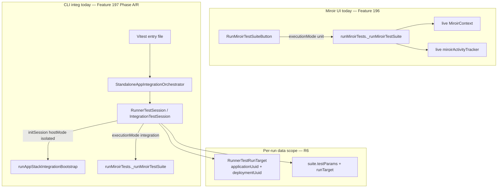
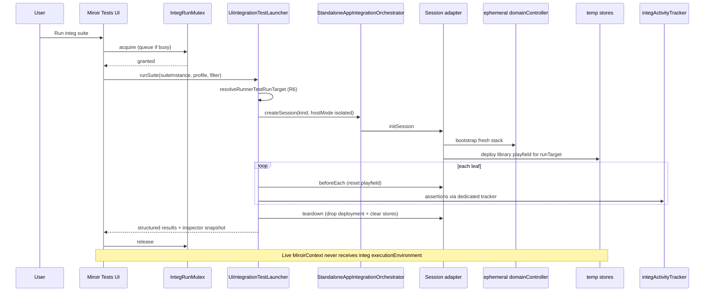
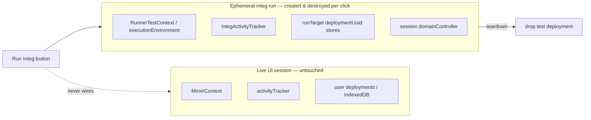
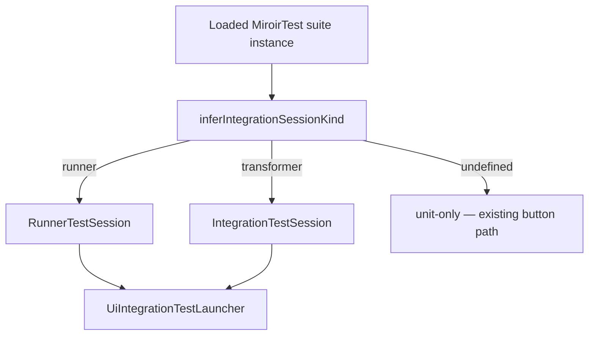

# Phase B — UI integration test launcher

**Parent:** [plan.md](./plan.md) (Feature #197)

**Prerequisites:** Phase A ✅ · Gaps A/B/C-setup/D/E ✅ · Phase R (R0–R6) ✅ · **JzodElementEditor component tests** documented and green ([testing.md](../../../docs/reference/testing.md#jzodelementeditortesttsx--component-integration-suite)) — baseline before B7

**Status:** B0 complete ✅ · B1 complete ✅ · B2 complete ✅ · B3 complete ✅ · B4 complete ✅ · B5 complete ✅ · **B6 complete ✅** · B7+ not started

**Goal:** Run the same domainController-based MiroirTest integration suites from the Miroir UI that CLI runs today — with **data-isolated** test runs that do not pollute the user's working session — plus reporting and a troubleshooting inspector.

---

## 1. Architectural impact (read this first)

### 1.1 Terminology correction — what “isolated” means

The parent plan and gap docs sometimes conflate **data isolation** with **Vitest subprocess spawn**. That conflation is misleading in a browser context.

| Term (legacy plan wording) | What it was read as | What we mean for #197 Phase B |
|----------------------------|---------------------|-------------------------------|
| “Isolated test environment” | Spawn Vitest / separate OS process | **Ephemeral data playfield**: own application + deployment identity, own store namespaces, torn down after the run |
| “Sealed run” | Process boundary | **Dataflow boundary**: test `domainController`, param bank, activity tracker, and stores are **not** the live UI `MiroirContext` |
| `hostMode: "isolated"` (Gap A) | Subprocess-only | **Bootstrap mode**: wire a **fresh** emulated stack (`wireEmulatedStack` + platform deploy) instead of injecting the live host `domainController` — works **in-process** in the browser |
| `hostMode: "embedded"` (Gap A) | N/A | Advanced: attach to the **live** host stack for dev troubleshooting — **not** the default for UI integ runs |

**In the browser there is no meaningful “spawn”.** The UI action is **async**: acquire run lock → bootstrap ephemeral session → execute leaves → collect results → teardown stores → release lock. Same JavaScript realm; different **data plane**.

Vitest subprocess remains a **valid CLI/dev transport** (already built) and an **optional Phase B+ launcher** for PSC-direct `4_storage` suites that require Node-side `PersistenceStoreControllerManager` access. It is **not** the primary architectural model for domainController-based MiroirTest integ from the UI.

### 1.2 Present architecture (after Phase R)



**What works today**

- **Unit path in UI:** `RunMiroirTestSuiteButton` calls `runMiroirTests` with `{ executionMode: "unit" }` against the **live** `miroirContext` and activity tracker ([`RunMiroirTestSuiteButton.tsx`](../../../packages/miroir-standalone-app/src/miroir-fwk/4_view/components/Buttons/RunMiroirTestSuiteButton.tsx)).
- **Integ path in CLI:** Vitest loads config → `createStandaloneAppIntegrationOrchestrator()` → session adapter `initSession()` → `_runMiroirTestSuite` with `{ executionMode: "integration", executionEnvironment }` ([`runMiroirRunnerTestsFromCLI.ts`](../../../packages/miroir-standalone-app/tests/helpers/runMiroirRunnerTestsFromCLI.ts)).
- **R6 run scope:** One `RunnerTestRunTarget` per run; suite JSON may pin uuids or session generates fresh UUID v4 ([`RunnerTestRunTarget.ts`](../../../packages/miroir-core/src/5_tests/RunnerTestRunTarget.ts)).
- **Profiles:** `INTEGRATION_TEST_PROFILES` + `--profile` unify config surfaces (Gap D).

**What is missing for UI integ**

| Gap | Impact |
|-----|--------|
| No UI code path with `executionMode: "integration"` | `runnerTest` / `transformerTest` integ leaves cannot run from UI |
| UI reuses live `MiroirContext` + tracker | Integ run would mutate working session stores and pollute assertion results |
| No run mutex / queue | Concurrent integ + live editing is unsafe |
| `RunnerTestSession.teardown()` is a **stub** (clears refs only) | Ephemeral deployments may **leak** schemas / IndexedDB until B-teardown slice |
| Session kind not inferred from deployed suite | UI cannot route `runner` vs `transformer` without new helper |
| Test helpers live under `tests/helpers/` | Need a **browser-importable** launcher module (or thin `src/` facade) |

### 1.3 Target architecture — data-isolated UI run





**Architectural invariants (non-negotiable)**

1. **Separate activity tracker** for integ runs — do not call `miroirContext.miroirActivityTracker.resetResults()` for integ (unit button may keep current behavior).
2. **`hostMode: "isolated"`** for default UI integ — session constructs its own bootstrap stack; no injection of live `domainController` unless user explicitly opts into embedded troubleshooting mode.
3. **One integ run at a time** (mutex) — queue or disable Run while active; live UI stays usable but second integ run waits.
4. **Teardown is part of the contract** — success, failure, or cancel must run session `teardown()` and release mutex in `finally`.
5. **Reuse orchestrator + session adapters** — Phase B is wiring, not a parallel bootstrap.

### 1.4 Relationship to locked decisions (parent plan)

| Decision | Phase B interpretation |
|----------|-------------------------|
| **G6** — extend Miroir Tests menu/reports | Same menu (`eaac459c-…`); mode badge `unit` \| `integ`; integ behind session guard on run button |
| **G5** — profiles | UI profile picker backed by `INTEGRATION_TEST_PROFILES` + `describeSession` metadata |
| **Gap A `hostMode`** | **`isolated` = data/bootstrap isolation**, not subprocess |
| **Gap B `playfieldMode`** | `createIfAbsent` for UI integ (fresh library deployment per runTarget); `requireExisting` only for embedded advanced path |
| **R6 run target** | Launcher passes `runTarget` + `suite.testParams` into `RunnerTestSession`; UI offers **Ephemeral run** (fresh UUID v4) vs **Pinned suite targets** (JSON) toggle (**D2 locked**) |
| **Out of scope** | PSC-direct `4_storage` Vitest files — defer unless optional subprocess catalog entry (Phase B+) |

### 1.5 Code seams Phase B must touch

| Area | Package | Change |
|------|---------|--------|
| UI launcher service | `miroir-standalone-app/src/…` | New `runUiIntegrationTestSuite()` — orchestrator + `_runMiroirTestSuite` without Vitest |
| Run button / display | `RunMiroirTestSuiteButton`, `MiroirTestDisplay` | Detect integ-capable suites; branch unit vs integ; mutex + disabled state |
| Session teardown | `RunnerTestSession` | Real store drop (mirror `IntegrationTestSession.teardown` pattern for `runTarget`) |
| Suite → session kind | `miroir-core` or standalone helper | `inferIntegrationSessionKind(suite)` from leaf `miroirTestType` |
| Inspector panel | new UI section | Profile, runTarget, deployment map, phase descriptors, last composite actions from integ tracker |
| Vitest-free test runner shim | `miroir-core` `RunMiroirTests` | Vitest is passed for CLI `it()` registration; UI path runs leaves directly (see B2) |

---

## 2. Scope

### In scope

- domainController-based MiroirTest integ from UI:
  - **`runnerTest`** suites (pilot: `runner_library`)
  - **`transformerTest`** integ suites (follow-on slice; same launcher, `IntegrationTestSession` kind)
- Data-isolated default path (`hostMode: "isolated"`)
- Profile selection, structured results in existing reports, troubleshooting inspector
- Mutex / queue for integ runs

### Out of scope (Phase B)

- PSC-direct `4_storage` suites in-browser (no `PersistenceStoreController` in UI thread) — optional **subprocess catalog** in Phase B+ ([integ-test-setup-gaps.md §4.3](./integ-test-setup-gaps.md))
- Migrating remaining legacy `Runner_*` imperative files (G8 — parallel track)
- **`hostMode: "embedded"`** as default — optional gated dev feature only (B4)

---

## 3. TDD slices

Each slice: **Red → Green → Verify**. After every slice that touches runner path, run [Global non-regression](#global-non-regression-criteria).

### B0 — Terminology + launcher contract (docs + types) ✅

**Deliverables**

- This plan ✅
- Update parent [plan.md](./plan.md) Phase B pointer + isolation wording ✅
- Export `UiIntegrationTestRunRequest` / `UiIntegrationTestRunResult` types (standalone-app) ✅ — [`uiIntegrationTestLauncherTypes.ts`](../../../packages/miroir-standalone-app/src/miroir-fwk/4-tests/uiIntegrationTestLauncherTypes.ts)
- `inferIntegrationSessionKind(suite)` + `classifyMiroirTestSuiteExecutionCapabilities(suite)` ✅ — [`inferIntegrationSessionKind.ts`](../../../packages/miroir-core/src/5_tests/inferIntegrationSessionKind.ts)

**Verify:** unit tests for kind inference on `miroirTest_runner_library` + `miroirCoreTransformers` ✅

```bash
cd packages/miroir-core && npx vitest run tests/4_services/inferIntegrationSessionKind.unit.test.ts
cd packages/miroir-standalone-app && npx vitest run tests/helpers/uiIntegrationTestLauncherTypes.unit.test.ts
```

---

### B1 — Integ run mutex + separate tracker ✅

**Deliverables**

- `IntegTestRunCoordinator`: `acquire()` / `release()` / `runExclusive()`, `isRunning` ✅ — [`integTestRunCoordinator.ts`](../../../packages/miroir-standalone-app/src/miroir-fwk/4-tests/integTestRunCoordinator.ts)
- `getIntegTestRunCoordinator()` singleton for UI ✅
- `createIntegActivityTracker()` (async, optional logger wiring) + `createIntegActivityTrackerSync()` ✅
- D5 policy: second `acquire` throws `IntegTestRunAlreadyActiveError` (no queue) ✅

**Verify:**

```bash
cd packages/miroir-standalone-app && npx vitest run tests/helpers/integTestRunCoordinator.unit.test.ts
```

---

### B2 — Vitest-free suite execution path ✅

**Deliverables**

- Shared `runMiroirTestSuiteWalk` — vitest vs in-process leaf execution ✅ — [`miroirTestSuiteWalk.ts`](../../../packages/miroir-core/src/5_tests/miroirTestSuiteWalk.ts)
- `runMiroirTestSuiteInProcess` + `createInProcessVitestStub` ✅ — [`runMiroirTestSuiteInProcess.ts`](../../../packages/miroir-core/src/5_tests/runMiroirTestSuiteInProcess.ts)
- `runMiroirTestSuite` (CLI) delegates to walk with `inProcess: false` — unchanged Vitest registration ✅

**Verify:**

```bash
cd packages/miroir-core && npx vitest run tests/4_services/runMiroirTestSuiteInProcess.unit.test.ts
```

---

### B3 — `UiIntegrationTestLauncher` (runner pilot) ✅

**Deliverables**

- `runUiIntegrationTestSuite(request, environment)` ✅ — [`uiIntegrationTestLauncher.ts`](../../../packages/miroir-standalone-app/src/miroir-fwk/4-tests/uiIntegrationTestLauncher.ts)
- `UI_INTEGRATION_RUNNER_SUITE_REGISTRY` + `resolveUiIntegrationRunnerSuite` ✅ — [`uiIntegrationTestRunnerSuiteRegistry.ts`](../../../packages/miroir-standalone-app/src/miroir-fwk/4-tests/uiIntegrationTestRunnerSuiteRegistry.ts)
- Node wiring: `runUiIntegrationTestSuiteInNode` ✅ — [`runUiIntegrationTestSuiteInNode.ts`](../../../packages/miroir-standalone-app/tests/helpers/runUiIntegrationTestSuiteInNode.ts)
- Flow: profile → orchestrator session (`hostMode: isolated`) → `initSession` → `runMiroirTestSuiteInProcess` + `beforeEachLeaf` → `teardown` in `finally` ✅
- D2: `resolveUiIntegrationTestRunTarget` (`ephemeral` \| `pinned`) ✅
- B1 mutex via `getIntegTestRunCoordinator().runExclusive` ✅
- `runMiroirRunnerTest` records `setTestAssertionResult` for UI success checks ✅

**Verify:**

```bash
cd packages/miroir-standalone-app && npx vitest run tests/helpers/uiIntegrationTestLauncher.unit.test.ts
cd packages/miroir-standalone-app && npx vitest run tests/helpers/uiIntegrationTestLauncher.integ.test.ts
# Global non-reg (2 passed)
VITE_MIROIR_TEST_CONFIG_FILENAME=./packages/miroir-standalone-app/tests/miroirConfig.test-emulatedServer-sql.json \
VITE_MIROIR_LOG_CONFIG_FILENAME=./packages/miroir-standalone-app/tests/specificLoggersConfig_DomainController_debug.json \
npm run testMiroir -w miroir-standalone-app -- --suites runner_library --mode integ
```

---

### B4 — `RunnerTestSession.teardown` — real store cleanup ✅

**Problem:** Teardown only nulled fields ([`RunnerTestSession.ts`](../../../packages/miroir-standalone-app/tests/helpers/RunnerTestSession.ts)). Data isolation requires drop deployment composite action for `runTarget.deploymentUuid`.

**Delivered**

- Teardown inputs read from `runnerTestContext` set during `initSession` (`runTarget`, `testDeploymentStorageConfiguration`, plus session-held `domainController` / `applicationDeploymentMap`)
- `teardown()` calls `buildTeardownTestApplicationStoresAction` with **runTarget** uuids (same pattern as `IntegrationTestSession`)
- `resetLibraryPlayfield` deferred (optional; teardown deleteStore sufficient for ephemeral runTarget)

**Tests**

- Unit: `RunnerTestSession.unit.test.ts` — mock `handleCompositeAction` receives drop action with runTarget uuids ✅
- Integ: covered by existing B3 launcher integ (session teardown on walk completion) + global `runner_library` non-reg

---

### B5 — UI wiring (G6) ✅

**Delivered**

- `RunMiroirTestSuiteButton`: `runMode` prop — unit path unchanged; integration path calls `runUiIntegrationTestSuite` via `createBrowserUiIntegrationTestLauncherEnvironment`; disabled while coordinator held or suite unsupported ✅
- `MiroirTestDisplay`: execution mode badge (`unit` | `integration` | `mixed`); D6 split buttons for mixed suites ✅
- Snackbar success/fail via existing `handleAsyncAction`; integration success message points to `#integration-test-inspector` ✅
- Browser profile pilot: bundled `emulatedServer-sql` JSON in [`integrationTestProfileAssets.ts`](../../../packages/miroir-standalone-app/src/miroir-fwk/4-tests/integrationTestProfileAssets.ts) ✅
- Minimal [`UiIntegrationTestRunInspectorSummary`](../../../packages/miroir-standalone-app/src/miroir-fwk/4_view/components/Reports/UiIntegrationTestRunInspectorSummary.tsx) (full picker in B6) ✅
- Coordinator `subscribe()` + `useIntegTestRunCoordinator` hook ✅

**Tests**

- Unit: `miroirTestSuiteUiExecution.unit.test.ts`, `integrationTestProfileAssets.unit.test.ts`, coordinator subscribe in `integTestRunCoordinator.unit.test.ts` ✅

---

### B6 — Profile picker + inspector ✅

**Delivered**

- Profile dropdown from `listIntegrationTestProfileCatalogEntries()` + descriptions (all Gap D profiles; CLI-only profiles disabled in browser)
- **Run target toggle** (D2): “Ephemeral run” vs “Pinned suite targets” — persisted via `uiIntegrationTestRunPreferences` and synced from last run
- `buildIntegrationTestRunInspectorModel` + expanded [`UiIntegrationTestRunInspectorSummary`](../../../packages/miroir-standalone-app/src/miroir-fwk/4_view/components/Reports/UiIntegrationTestRunInspectorSummary.tsx):
  - Resolved profile name + description
  - `describeIntegrationTestSession(kind)` → bootstrap phases, playfield, `embeddedCapable`
  - Last run: `runTarget`, param bank keys, assertion summary + recent failures
- [`UiIntegrationTestRunControls`](../../../packages/miroir-standalone-app/src/miroir-fwk/4_view/components/Reports/UiIntegrationTestRunControls.tsx) wired in `MiroirTestDisplay`

**Tests**

- Unit: `buildIntegrationTestRunInspectorModel.unit.test.ts`, `integrationTestProfileCatalog.unit.test.ts`, `uiIntegrationTestRunPreferences.unit.test.ts` ✅

**Note:** Only `emulatedServer-sql` is bundled for in-browser config today (D4 pilot); other profiles appear in picker as CLI-only until additional JSON assets are bundled.

---

### B7 — Transformer integ in UI (D3 — same Phase B scope)

**Deliverables**

- Launcher branch for `kind: "transformer"` → `IntegrationTestSession` + same in-process runner
- Register transformer suites in UI catalog (standalone-app deployed instances)
- Ephemeral / pinned toggle applies to transformer session `testApplication` identity where relevant

**Verify:** `miroirCoreTransformers` integ suite green from UI manual test + CLI non-reg.

---

### B8 — (Optional) Embedded troubleshooting path

**Deliverables**

- Hidden/advanced toggle: `hostMode: "embedded"` + inject live host env (explicit confirm dialog)
- `playfieldMode: "requireExisting"` when library already deployed
- Document risks: may mutate live library playfield

**Not required for Phase B done checkbox.**

---

### B9 — (Optional Phase B+) Subprocess launcher for PSC suites

**Not default.** UI menu entry that shells `npm run testByFile …` via desktop wrapper or documented dev-only command — out of core Phase B unless product requests.

---

## 4. UI ↔ orchestrator mapping

| Suite signal | Session kind | Adapter | Registry / export |
|--------------|--------------|---------|-------------------|
| `runnerTest` leaves | `runner` | `RunnerTestSession` | `miroirRunnerTestSuiteRegistry` |
| `transformerTest` + integ | `transformer` | `IntegrationTestSession` | transformer suite registry / deployment exports |
| PSC Vitest files | `appStackPsc` | subprocess only (B9) | `testByFile` filters |



---

## 5. Config and profiles in the browser

Gap D profiles use filesystem paths in Node (`loadTestConfigFiles`). UI launcher must resolve config without `process.env.PWD` assumptions:

| Approach | Pros | Cons |
|----------|------|------|
| **A — Bundled profile JSON** (import test config JSON in launcher module) | Simple; works in browser | Duplicate path maintenance |
| **B — Fetch from known static URLs** (dev server serves `/tests/*.json`) | Single source | Needs vite static asset wiring |
| **C — Reuse host `MiroirConfig` + profile overrides** | Matches live stack store types | Risk of coupling integ run to live config; still need isolated runTarget |

**Proposed default:** **B** for Phase B pilot — vite dev + production build copies `packages/miroir-standalone-app/tests/miroirConfig.*.json` to served assets; profile picker sets which URL pair to load. Document in B3.

---

## 6. Locked decisions (grill session)

| # | Decision | Locked |
|---|----------|--------|
| **D1** | **Primary transport** | **In-browser async orchestrator** — data-isolated session in the same JS realm; Vitest subprocess **not** the UI model (optional B9 for PSC-only dev catalog) |
| **D2** | **UI `runTarget` policy** | **User toggle:** “Ephemeral run” → always `generateRunnerTestRunTarget()` (fresh UUID v4); “Pinned suite targets” → `resolveRunnerTestRunTarget({ suite })` (honor JSON pins, generate when unpinned) |
| **D3** | **First UI suites** | **`runner_library` + transformer integ** (e.g. `miroirCoreTransformers`) — B3 runner pilot, B7 transformer in same Phase B scope (not deferred post-done) |
| **D4** | Config loading in browser | **Static fetch of profile JSON** (§5 approach B) — _proposed; confirm at B3_ |
| **D5** | Mutex policy | **Reject** second run with snackbar “integ run in progress” (no queue v1) — _proposed_ |
| **D6** | Mixed unit+integ suite | **Split buttons**: “Run unit tests” + “Run integ tests” when mixed — _proposed_ |
| **D7** | Cancel mid-run | Phase B v1: no cancel; B+ add `AbortSignal` if bootstrap supports it — _defer_ |

---

## 7. Success criteria

### Phase B done

- [ ] UI runs `runner_library` integ with **data-isolated** session (live `MiroirContext` unchanged)
- [ ] Integ uses dedicated activity tracker; unit button behavior unchanged
- [ ] Mutex prevents overlapping integ runs
- [ ] `RunnerTestSession.teardown` drops ephemeral deployment stores
- [x] Mode badge visible on Miroir Test reports (`unit` / `integ`)
- [x] Inspector shows profile + last runTarget + session descriptor + assertion summary
- [x] Profile picker lists `INTEGRATION_TEST_PROFILES` (browser: catalog with CLI-only entries disabled)
- [ ] Transformer integ suite (`miroirCoreTransformers` or equivalent) runnable from same launcher (B7 — in scope per D3)

### Global non-regression criteria

After every slice that touches runner session / launcher:

```bash
VITE_MIROIR_TEST_CONFIG_FILENAME=./packages/miroir-standalone-app/tests/miroirConfig.test-emulatedServer-sql.json \
VITE_MIROIR_LOG_CONFIG_FILENAME=./packages/miroir-standalone-app/tests/specificLoggersConfig_DomainController_debug.json \
npm run testMiroir -w miroir-standalone-app -- --suites runner_library --mode integ
```

Expected: **2 passed** (`Lend Book` + `Return Book`).

Additional after B2+:

```bash
npm run testMiroir -w miroir-standalone-app -- \
  --profile emulatedServer-sql --suites miroirCoreTransformers --mode integ
```

Unit tests for new helpers:

```bash
cd packages/miroir-standalone-app && npx vitest run tests/helpers/integrationTestProfiles.unit.test.ts
cd packages/miroir-core && npx vitest run tests/5-tests/MiroirTestIntegrationOrchestrator.unit.test.ts
```

---

## 8. Risks and mitigations

| Risk | Mitigation |
|------|------------|
| Integ bootstrap in browser is heavy (slow UX) | Progress UI from activity tracker phases; run single suite; mutex prevents pile-up |
| IndexedDB / Postgres schema leak if teardown stub ships | **B4 is blocking** for “done”; do not ship B5 without B4 |
| Importing `tests/helpers` from React breaks bundle | Move launcher to `src/miroir-fwk/…/integrationTests/`; keep tests importing from src |
| `runnerTest` in unit mode throws | UI must never call unit path for integ-only suites (infer + guard) |
| User confuses embedded troubleshooting with isolated run | Separate advanced toggle + confirm; inspector shows `hostMode` prominently |

---

## 9. References

| Doc | Relevance |
|-----|-----------|
| [plan.md](./plan.md) | Locked decisions G1–G8, Phase A/R outcomes |
| [r6-suite-scoped-context-plan.md](./r6-suite-scoped-context-plan.md) | `RunnerTestRunTarget`, param bank, registry |
| [integ-test-setup-gaps.md](./integ-test-setup-gaps.md) | Gap A/B host + playfield modes |
| [gap-D-refactoring-plan.md](./gap-D-refactoring-plan.md) | Profile catalog for UI picker |
| [Feature 196 plan](../196-FEATURE-migrate-tests-to-MiroirTest/plan.md) | Existing Miroir Tests menu + reports |

### Key code paths (post-R6)

| Path | Role |
|------|------|
| `packages/miroir-standalone-app/src/miroir-fwk/4_view/components/Buttons/RunMiroirTestSuiteButton.tsx` | Unit-only today |
| `packages/miroir-standalone-app/tests/helpers/runMiroirRunnerTestsFromCLI.ts` | CLI integ pattern to mirror |
| `packages/miroir-standalone-app/tests/helpers/StandaloneAppIntegrationOrchestrator.ts` | Session factory |
| `packages/miroir-standalone-app/tests/helpers/RunnerTestSession.ts` | Runner adapter — teardown gap |
| `packages/miroir-core/src/5_tests/RunnerTestRunTarget.ts` | Per-run deployment identity |
| `packages/miroir-standalone-app/tests/helpers/integrationTestProfiles.ts` | Profile catalog |

---

## 10. Parent plan sync

When Phase B starts, update [plan.md](./plan.md):

- Replace “Vitest subprocess” default wording in Phase B / Architecture with **data-isolated in-browser orchestrator run**
- Link this file from Phase B section (same pattern as R6)
- Mark success criteria checkboxes here as source of truth for Phase B granularity
