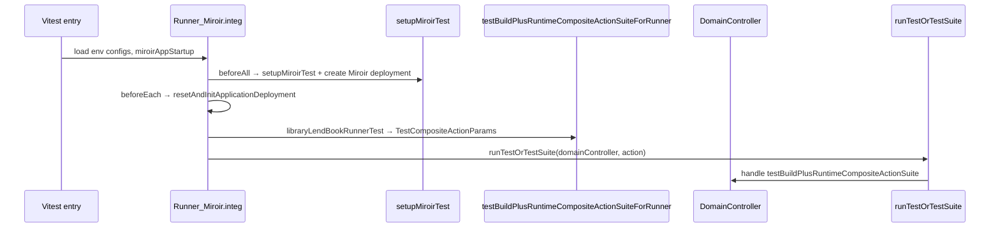
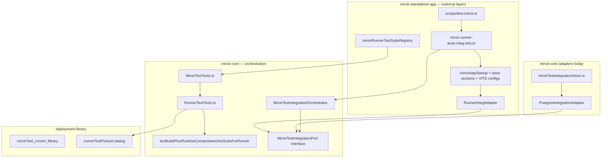

# Feature 197 — Run integration tests in the UI

GitHub issue: TBD (`miroir-framework/miroir#197`)

**Status:** Planning complete (grill session locked)

**Depends on:** [Feature 196 — MiroirTest](../196-FEATURE-migrate-tests-to-MiroirTest/plan.md) (complete)

## Overview

Runner integration tests today live in `miroir-standalone-app` as imperative Vitest files (`Runner_Miroir.integ.test.tsx`, `Runner_Library.ts`, `RunnerIntegTestTools.tsx`). They exercise full stack behaviour — emulated server, `DomainController`, deployment create/reset, `testBuildPlusRuntimeCompositeActionSuite` — but are **not** part of the unified `MiroirTest` model introduced in Feature 196.

**Near-term goal (Phase A):** Extend `MiroirTest` with a `runnerTest` leaf, encode a minimal `libraryLendBookRunnerTest`, and run it via:

```bash
VITE_MIROIR_TEST_CONFIG_FILENAME=./packages/miroir-standalone-app/tests/miroirConfig.test-emulatedServer-sql.json \
VITE_MIROIR_LOG_CONFIG_FILENAME=./packages/miroir-standalone-app/tests/specificLoggersConfig_DomainController_debug.json \
npm run testMiroir -w miroir-standalone-app -- --suites runner_library --mode integ
```

**Later goal (Phase B):** Run the same suites from the Miroir UI inside an **isolated test environment** (setup/teardown per run), with an exploratory troubleshooting view — without polluting the user's working UI session.

Constraints:

- UUID v4 only for new deployment instances
- TDD throughout
- Keep execution logic **centralized in `miroir-core`**; `miroir-standalone-app` owns vitest entry, config files, and UI wiring
- Reuse existing primitives: `testBuildPlusRuntimeCompositeActionSuiteForRunner`, `CompositeRunTestAssertion`, `setupMiroirTest` patterns
- Do **not** delete legacy `Test` entity / `Runner_*.integ.test.tsx` files until cutover is proven

---

## Current state

### Runner test stack (standalone-app)

| Piece | Location | Role |
|-------|----------|------|
| Test definitions | `tests/4_view/Runner_Library.ts` | `RunnerTestParams` objects (`libraryLendBookRunnerTest`, …) |
| Vitest harness | `tests/4_view/Runner_Miroir.integ.test.tsx` | Startup, `beforeAll`/`beforeEach`/`afterAll`, `it.each` over params |
| Setup helpers | `tests/4_view/RunnerIntegTestTools.tsx` | `beforeAllTests`, `beforeEachTest`, `getTestConfig`, storage config |
| Runtime setup | `src/miroir-fwk/4-tests/tests-utils.tsx` | `setupMiroirTest`, `runTestOrTestSuite` |
| Suite builder | `miroir-core/src/1_core/Runner.ts` | `testBuildPlusRuntimeCompositeActionSuiteForRunner` |
| Config | `tests/miroirConfig.test-emulatedServer-sql.json` | `emulateServer`, postgres schemas, filesystem roots |
| Log config | `tests/specificLoggersConfig_DomainController_debug.json` | Per-logger levels for debugging |

**Execution flow today:**



### MiroirTest stack (miroir-core, Feature 196)

| Piece | Location | Role |
|-------|----------|------|
| Entity | `entityMiroirTest` (`a311f363-…`) | Unified test concept |
| Runner | `MiroirTestTools.ts` | `runMiroirTests`, leaf dispatch, `executionMode` |
| Leaf kinds | schema | `transformerTest`, `functionCallTest`, `queryTest`, `miroirTestSuite` |
| CLI | `scripts/test-miroir.ts` | `--suites`, `--mode`, `--filter` |
| Registry | `miroirTestSuiteRegistry.ts` | Dynamic import of deployment JSON |
| Integ bootstrap | `miroirTestIntegrationStore.ts` | Direct Postgres for **transformer** integ only |

**Gap:** No `runnerTest` leaf. No `testMiroir` in `miroir-standalone-app`. Runner integ uses a **different** environment model (emulated server + `VITE_MIROIR_*` configs) than transformer integ (direct `SqlDbDataStoreSection`).

### Legacy parallel: `Test` entity (Feature 195 note)

The `Test` entity (`d2842a84-…`) already models `testBuildPlusRuntimeCompositeActionSuite` integration tests. Runner tests **reuse the same runtime action types** but are **not** stored as `Test` instances. Feature 197 deliberately migrates runner coverage onto `MiroirTest` for a single CLI/UI surface — not onto legacy `Test`.

---

## Problem statement

1. **Representation:** `RunnerTestParams` is TypeScript-only; not selectable via `testMiroir`, not visible in Miroir Test reports.
2. **Duplication:** Every `Runner_*.integ.test.tsx` repeats ~150 lines of startup, config loading, and lifecycle hooks.
3. **Environment coupling:** Test environment setup (`setupMiroirTest`, storage schemas, admin deployment) is embedded in standalone-app test files, not shared with UI startup.
4. **Mode split:** Feature 196 UI runs MiroirTest in `executionMode: "unit"` only. Runner tests are inherently **integration** and will need a guarded UI path in Phase B.

---

## Locked decisions (grill session)

| # | Decision | Locked |
|---|----------|--------|
| G1 | **Leaf type** | **A** — new `miroirTestType: "runnerTest"` on `MiroirTest` (not legacy `Test` entity) |
| G2 | **Instance home** | **A** — `miroir-test-app_deployment-library` (`model` section). `MiroirTest` is a Miroir meta-entity (`a311f363-…`); any application (library, admin, …) may host instances like Reports, Menus, Queries |
| G3 | **JSON vs fixtures (pilot)** | **A** — minimal refs in JSON; heavy payloads in fixture catalog **as interim bridge** |
| G3b | **Param/context resolution (direction)** | Prefer general-purpose `getFromParams` / `getFromContext` transformers over test-specific hard-coded values; tests/queries/runners share a **standard injected execution environment** they reference; intermediate values built during run via `getFromContext` (same as Transformers/Reports). Phase A: ground prep + pilot on fixture bridge; no big-bang unless one-step is simpler |
| G4 | **`testMiroir` script home** | **A** — `miroir-standalone-app` owns the vitest entry script and external layers; **orchestration + shared setup/teardown infrastructure in `miroir-core`** (hexagonal: core orchestrates, packages inject adapters) |
| G5 | **Environment profile selection** | **C** — env vars for CI/explicit override (`VITE_MIROIR_*`, `MIROIR_TEST_POSTGRES_HOST`); optional `--profile` CLI flag for local presets (overrides when present) |
| G6 | **Phase B UI placement** | **A** — extend existing Miroir Tests menu/reports; mode badge (`unit` / `integ`); integ run behind session guard on `RunMiroirTestSuiteButton` |
| G7 | **Headless runner execution** | **A** — extract `runRunnerTestCompositeAction` to `miroir-core`; `RunnerTestTools` + orchestrator call it; `tests-utils` thin re-export for legacy |
| G8 | **Legacy `Runner_*` deprecation** | **B** — deprecate per-file as suites migrate; delete harness only after **all** `Runner_*` integ files have `MiroirTest` equivalents |

## Additional locked decisions (implicit from grill)

| # | Decision |
|---|----------|
| 2 | `runnerTest` leaves run **only** in `executionMode: "integration"`; unit mode throws or skips |
| 3 | `runnerTest` delegates to `testBuildPlusRuntimeCompositeActionSuiteForRunner` |
| 5 | JSON uses `runnerRef`, `fixtureRef`, `environmentRef` resolved at runtime |
| 10 | Phase A pilot: **one** leaf — `libraryLendBookRunnerTest`; `libraryReturnBookRunnerTest` as next slice |

---

## Target schema

### Standard execution environment (target direction)

Tests, queries, and runners should share one **injected execution environment** per run — analogous to `functionCallTest.environmentRef` and `queryTest.fixtureRef` today, but extended for full-stack integration:

```typescript
// Target: MiroirRunnerTestExecutionEnvironment (injected once per vitest session / UI session)
{
  miroirConfig: MiroirConfigClient,
  domainController: DomainControllerInterface,
  applicationDeploymentMap: ApplicationDeploymentMap,
  modelEnvironment: MiroirModelEnvironment,
  // Standard param namespace — leaves reference via getFromParams, not hard-coded UUIDs
  testParams: Record<string, unknown>,   // e.g. user1, book1, deployment uuids
  // Runtime context — preTest steps write here; assertions read via getFromContext
  runtimeContext: Record<string, unknown>,
}
```

**Resolution pattern (align with Transformers/Reports):**

| Mechanism | Use |
|-----------|-----|
| `getFromParams` + `referencePath` | Runner payloads, query inputs — pull from injected `testParams` |
| `getFromContext` + `referencePath` | Assertions on named preTest results (`LendingHistoryList`, …) |
| `environmentRef` on leaf | Select which standard environment profile seeds `testParams` |

Existing `libraryLendBookRunnerTest` already uses `getFromContext` in assertions (`referencePath: ["LendingHistoryList", "items"]`). Phase A should **preserve** that; Phase A+ should migrate **payload UUIDs** (`user1.uuid`, `book1.uuid`) from fixture literals toward `getFromParams` references into the injected environment.

### `MiroirTestForRunner` leaf (new)

```typescript
{
  miroirTestType: "runnerTest",
  miroirTestLabel: string,
  skip?: boolean,
  testTag?: string | string[],

  // Standard environment (pilot: fixtureRef seeds testParams; target: environmentRef)
  environmentRef?: string,              // e.g. "libraryRunnerTestEnvironment"
  runnerRef: string,                    // e.g. "lendDocument"
  fixtureRef?: string,                  // interim: "libraryLendBookDefaults" (Phase A bridge)
  deploymentRef?: string,               // e.g. "libraryTestIdentifiers"

  testCompositeActionLabel?: string,
  // Target: testParams use getFromParams transformers; pilot may defer to fixtureRef
  testParams?: Record<string, unknown>,
  preTestCompositeActions?: CompositeAction[],
  preRunnerCompositeActions?: CompositeAction[],
  testCompositeActionAssertions?: CompositeRunTestAssertion[],

  skipCreateDeployment?: boolean,
  skipDropDeployment?: boolean,
}
```

### Fixture catalog — interim bridge (Phase A)

New `miroir-test-app_deployment-library/tests/runnerTestFixtures.ts`:

```typescript
export const runnerTestFixtureCatalog = {
  libraryTestIdentifiers: { testApplicationUuid, testApplicationDeploymentUuid, ... },
  libraryRunnerTestEnvironment: () => ({
    testParams: { user1: user1.uuid, book1: book1.uuid, ... },
    initialModel: defaultLibraryAppModel,
    deploymentRef: "libraryTestIdentifiers",
  }),
  libraryLendBookDefaults: {
    runner: lendDocument,
    // interim: literal testParams; migrate to getFromParams referencing environment.testParams
    preTestCompositeActions: [ /* fetchLendingHistory → nameGivenToResult: LendingHistoryList */ ],
    testCompositeActionAssertions: [ /* getFromContext on LendingHistoryList */ ],
  },
};
```

**Minimal encoding (G3):** JSON leaf holds `runnerRef` + `fixtureRef` (+ optional `environmentRef`); catalog resolves to `TestCompositeActionParams` via injected environment.

**Ground prep (no big-bang):** Phase A defines `RunnerTestExecutionEnvironment` type, wires `environmentRef` resolution stub (can alias `fixtureRef` initially), documents `getFromParams` migration path for `testParams`. Full param indirection is a follow-up slice inside Phase A or early Phase B.

### MiroirTest instances across applications

`MiroirTest` is defined in the Miroir meta-application (`entityMiroirTest`, `a311f363-e238-4203-bdfc-29e8c160c26b`). Instances are **not** confined to `deployment-miroir`: any application may store them in its `model` section, same pattern as Reports, Menus, Queries. Core transformer/query pilots live under `deployment-miroir`; runner pilots live under `deployment-library` because they exercise library runners and fixtures.

### Pilot instance sketch

```json
{
  "uuid": "<v4>",
  "parentUuid": "a311f363-e238-4203-bdfc-29e8c160c26b",
  "name": "runner_library",
  "selfApplication": "<library-application-uuid>",
  "definition": {
    "miroirTestType": "miroirTestSuite",
    "miroirTestLabel": "runner.library",
    "miroirTests": [
      {
        "miroirTestType": "runnerTest",
        "miroirTestLabel": "Lend Book Test Composite Action",
        "environmentRef": "libraryRunnerTestEnvironment",
        "runnerRef": "lendDocument",
        "fixtureRef": "libraryLendBookDefaults"
      }
    ]
  }
}
```

---

## Architecture (target)

### Hexagonal split: orchestration in core, adapters in packages



| Layer | Package | Responsibility |
|-------|---------|----------------|
| **Port** | `miroir-core` | `MiroirTestIntegrationPort`: `initSession`, `beforeEach`, `teardown`, expose `executionEnvironment` |
| **Orchestrator** | `miroir-core` | `runMiroirTestsFromCliConfig` calls port lifecycle; leaf runners consume injected environment |
| **Transformer adapter** | `miroir-core` | `PostgresIntegrationAdapter` — wraps existing `miroirTestIntegrationStore` |
| **Runner adapter** | `miroir-standalone-app` | `RunnerIntegAdapter` — brings `miroirAppStartup`, config files, `setupMiroirTest` wiring |
| **Vitest script** | `miroir-standalone-app` | `test-miroir.ts` + entry file; passes adapter into orchestrator |

**Goal:** transformer integ (`miroir-core`) and runner integ (`standalone-app`) share the same orchestrator and teardown contract, forcing setup code to stay hexagonal and UI-ready (Phase B reuses the same port).

---

## Developer quick reference (target)

| Area | Path |
|------|------|
| Schema evolution | `entityDefinitionMiroirTest` + `getMiroirFundamentalJzodSchema` |
| Runner leaf dispatch | `packages/miroir-core/src/4_services/RunnerTestTools.ts` |
| Integration port + orchestrator | `packages/miroir-core/tests/helpers/MiroirTestIntegrationOrchestrator.ts` |
| Postgres adapter (existing) | `packages/miroir-core/tests/helpers/miroirTestIntegrationStore.ts` |
| Runner adapter (external layers) | `packages/miroir-standalone-app/tests/helpers/RunnerIntegAdapter.ts` |
| Fixture catalog | `packages/miroir-test-app_deployment-library/tests/runnerTestFixtures.ts` |
| Pilot instance | `miroir-test-app_deployment-library/assets/.../miroirTest_runner_library.json` |
| Standalone registry | `packages/miroir-standalone-app/tests/helpers/miroirRunnerTestSuiteRegistry.ts` |
| Vitest entry | `packages/miroir-standalone-app/tests/miroir-runner-tests.integ.test.ts` |
| Config files | `tests/miroirConfig.test-emulatedServer-sql.json`, `tests/specificLoggersConfig_*.json` |

### Commands (target)

```bash
# Phase A — runner library pilot (explicit env — CI / debugging)
VITE_MIROIR_TEST_CONFIG_FILENAME=./packages/miroir-standalone-app/tests/miroirConfig.test-emulatedServer-sql.json \
VITE_MIROIR_LOG_CONFIG_FILENAME=./packages/miroir-standalone-app/tests/specificLoggersConfig_DomainController_debug.json \
npm run testMiroir -w miroir-standalone-app -- --suites runner_library --mode integ

# Local convenience — bundled preset (overrides default paths when no VITE_* set)
npm run testMiroir -w miroir-standalone-app -- --suites runner_library --mode integ --profile emulatedServer-sql

# Filter single leaf
npm run testMiroir -w miroir-standalone-app -- --suites runner_library --mode integ --profile emulatedServer-sql \
  --filter '{"testList":{"runner.library":["Lend Book Test Composite Action"]}}'

# Legacy path (unchanged until deprecation)
VITE_MIROIR_TEST_CONFIG_FILENAME=... npm run testByFile -w miroir-standalone-app -- Runner_Miroir.integ
```

**Profile resolution order:** explicit `VITE_MIROIR_*` env vars win → else `--profile` maps to preset table → else error (no implicit default in CI).

---

## Phases

### Phase A — `runnerTest` leaf + CLI pilot (near-term)

#### A0 — Schema & types (TDD)

**Red:**

- `miroirTest.schema.unit.test.ts`: `miroirTestForRunner` parses minimal leaf
- `MiroirTestTools`: unknown leaf still exhausts; add failing case for `runnerTest` dispatch

**Green:**

- Extend `entityDefinitionMiroirTest` with `miroirTestForRunner` context key (distinct from legacy `Test`)
- Regenerate `miroirFundamentalType.ts` / jzod schema
- Export types from `miroir-core`

#### A1 — `RunnerTestTools` (TDD)

**Red:**

- `runnerTest.tools.unit.test.ts`: resolve `fixtureRef` + `runnerRef` → `TestCompositeActionParams`
- `miroirTestTools.unit.test.ts`: `runnerTest` in unit mode throws clear error

**Green:**

- `RunnerTestTools.ts`:
  - `resolveRunnerTestLeaf(leaf, fixtureCatalog, environment) → TestCompositeActionParams`
  - `runRunnerTestCompositeAction(domainController, params, applicationDeploymentMap, activityTracker, …)` — **headless**, extracted from `tests-utils.runTestOrTestSuite` (G7)
  - `runMiroirRunnerTestInMemory(vitest, leaf, executionEnvironment, …)` → resolve leaf + call `runRunnerTestCompositeAction`
- Wire `case "runnerTest"` in `MiroirTestTools.runMiroirTestInMemory` (integration only)
- Export `runRunnerTestCompositeAction` from `miroir-core`; `tests-utils.tsx` re-exports for legacy integ files

#### A2 — Shared integration orchestrator (TDD)

**Red:**

- `miroirTestIntegrationOrchestrator.unit.test.ts`: mock port → `initSession` / `beforeEach` / `teardown` called in order
- `runnerIntegAdapter.unit.test.ts` (standalone-app): adapter implements port contract

**Green (miroir-core):**

- `MiroirTestIntegrationPort` interface:
  ```typescript
  interface MiroirTestIntegrationPort {
    initSession(): Promise<MiroirTestExecutionEnvironment>;
    beforeEach(): Promise<void>;
    teardown(): Promise<void>;
  }
  ```
- `MiroirTestExecutionEnvironment` — union/superset for transformer + runner needs (`integrationStore?`, `domainController?`, `testParams`, `runtimeContext`, …)
- `MiroirTestIntegrationOrchestrator` — owns lifecycle; used by `runMiroirTestsFromCliConfig`
- `PostgresIntegrationAdapter` — thin wrap over `initMiroirTestIntegrationStore` (refactor existing integ entry, no behaviour change)

**Green (standalone-app):**

- `RunnerIntegAdapter` implements `MiroirTestIntegrationPort`:
  - Injects external layers: `miroirAppStartup`, store section startups, `loadTestConfigFiles`, `setupMiroirTest`, Miroir deployment create, `resetAndInitApplicationDeployment`
  - Factors logic from `RunnerIntegTestTools.beforeAllTests` / `beforeEachTest`
- `RunnerIntegTestTools.tsx` becomes thin wrapper over adapter (legacy tests unchanged)

**Ground prep (optional stretch):**

- One pilot `testParams` field via `getFromParams`; `resolveRunnerTestEnvironment(environmentRef)` seeds `testParams` namespace

**Follow-up (same feature, later slice):**

- Refactor `miroir-tests.integ.test.ts` (miroir-core) to use orchestrator + `PostgresIntegrationAdapter` explicitly

#### A3 — Pilot instance + fixture catalog

**Green:**

- `runnerTestFixtures.ts` with `libraryTestIdentifiers`, `libraryLendBookDefaults`
- `miroirTest_runner_library` JSON instance (UUID v4)
- Export from `miroir-test-app_deployment-library/index.ts`
- `miroirRunnerTestSuiteRegistry.ts` with key `runner_library`

#### A4 — Standalone vitest entry + `testMiroir` script

**Green:**

- Add `"testMiroir": "tsx ./scripts/test-miroir.ts"` to `miroir-standalone-app/package.json`
- `scripts/test-miroir.ts` — extends `parseMiroirTestCliConfig` with `--profile`; preset table in `tests/helpers/runnerTestProfiles.ts`
- `miroir-runner-tests.integ.test.ts`:
  - `miroirAppStartup()` + store section startups (same as `Runner_Miroir.integ`)
  - `initMiroirRunnerTestEnvironment()`
  - `runMiroirTestsFromCliConfig(config, { runnerTestEnvironment })`
- Vitest entry constructs `RunnerIntegAdapter` and passes to `MiroirTestIntegrationOrchestrator` / `runMiroirTestsFromCliConfig`
- Extend `MiroirTestExecutionOptions` with `executionEnvironment` from orchestrator

**Verify:**

```bash
# Must pass with same assertions as legacy libraryLendBookRunnerTest
npm run testMiroir -w miroir-standalone-app -- --suites runner_library --mode integ
```

#### A5 — Parity check + docs

- Side-by-side run: legacy `Runner_Miroir.integ` vs new `testMiroir` — same pass/fail
- Update `docs/guides/developer/testing.md` with runner integ section
- Legacy `Runner_Miroir.integ` **unchanged** (G8: deprecate only after full `Runner_*` migration)
- Add parity comment in `Runner_Library.ts` pointing to `miroirTest_runner_library` (no `@deprecated` until cutover batch)

---

### Phase B — UI integration test execution (later)

#### B0 — Session isolation model

Design `MiroirRunnerTestSession`:

| Concern | Approach |
|---------|----------|
| Working UI pollution | Never reuse live `MiroirContext` domain controller; spawn isolated session |
| Config | User picks environment profile (sql / indexedDb) or inherits from dev config |
| Setup | `initMiroirRunnerTestEnvironment` with session-scoped schema / indexedDb name (`test_<timestamp>`) |
| Teardown | Drop test schemas, clear indexedDb, reset activity tracker |
| Concurrency | One runner test session at a time (mutex); queue additional runs |

#### B1 — UI components (extend existing Miroir Tests)

- `RunMiroirTestSuiteButton` — detect suite leaf kinds; pass `executionMode: "integration"` for `runnerTest` suites; disabled when integ session active
- `MiroirTestDisplay` / list — **mode badge** (`unit` | `integ`) per suite based on leaf types
- `RunnerTestEnvironmentInspector` (new panel section) — resolved profile, deployment map, store endpoints, last composite actions from activity tracker

#### B2 — Menu & reports

- Reuse **Miroir Tests** menu (`eaac459c-…`) and `reportMiroirTestList` / `reportMiroirTestDetails`
- Extend `miroirTestReportSection` to surface integ-only suites and inspector slot (no separate menu)

#### B3 — Align with server/UI startup (Feature 157)

- Extract shared "deployment bootstrap" steps used by `miroirAppStartup`, emulated server, and test environment so troubleshooting view reflects real startup

---

## Mapping: `libraryLendBookRunnerTest` → `runnerTest`

| `RunnerTestParams` field | Encoding |
|--------------------------|----------|
| `pageLabel` | Vitest entry / suite key label (not in leaf) |
| `runner` | `runnerRef: "lendDocument"` → fixture catalog |
| `testApplicationUuid/Name/DeploymentUuid` | `deploymentRef: "libraryTestIdentifiers"` |
| `testParams` | Injected via `environmentRef` → `testParams` namespace; runner payload uses `getFromParams` (pilot: partial; fixture bridge for rest) |
| `preTestCompositeActions` | fixture catalog |
| `testCompositeActionAssertions` | fixture catalog |
| `internalMiroirConfig` | derived at runtime from env config + `getTestConfig` |
| `adminDeployment` | derived from env config |
| `testDeploymentStorageConfiguration` | derived from env profile + app name |
| `initialModel` | fixture catalog (`defaultLibraryAppModel`) |
| `testCompositeActionLabel` | leaf field or fixture default |

---

## Success criteria

### Phase A

- [ ] `miroirTestType: "runnerTest"` in schema; generated types compile
- [ ] `RunnerTestTools` resolves pilot leaf to identical `TestCompositeActionParams` as `Runner_Library.ts`
- [ ] `npm run testMiroir -w miroir-standalone-app -- --suites runner_library --mode integ` passes
- [ ] `runnerTest` rejected in `executionMode: "unit"` with clear error
- [ ] `miroirRunnerTestEnvironment` used by new entry; legacy `Runner_Miroir.integ` still passes unchanged
- [ ] No secrets committed; config files remain gitignored or use localhost defaults

### Phase B

- [ ] Run `runner_library` from UI without affecting working session stores
- [ ] Environment inspector shows config + last run context
- [ ] Teardown leaves no test schemas / indexedDb databases behind

---

## Grill session summary (complete)

| # | Question | Locked |
|---|----------|--------|
| G1 | Leaf type vs legacy `Test` entity? | **A** — `runnerTest` on MiroirTest |
| G2 | Instance home? | **A** — library app `model` section |
| G3 | JSON vs fixtures? | **A** — minimal refs + `getFromParams`/`getFromContext` direction |
| G4 | Script vs orchestration? | **A** — script in standalone-app, orchestrator in miroir-core |
| G5 | Profile selection? | **C** — env vars + `--profile` |
| G6 | Phase B UI? | **A** — extend Miroir Tests menu |
| G7 | Headless execution? | **A** — `miroir-core` |
| G8 | Legacy deprecation? | **B** — after all `Runner_*` migrated |

---

## Out of scope

- Migrating all `Runner_*.integ.test.tsx` files (pilot only in Phase A)
- Deleting legacy `Test` entity
- Fixing pre-existing type `as any` in lendDocument payload
- CI matrix for every storage backend (pilot: emulatedServer-sql only)
- Running transformer + runner suites in a single `testMiroir` invocation across packages (future)

---

## Suggested commits (Phase A)

1. `feat(miroir-test): add miroirTestForRunner to MiroirTest entity schema`
2. `feat(miroir-core): add RunnerTestTools with fixture resolution`
3. `feat(miroir-core): add miroirRunnerTestEnvironment bootstrap helper`
4. `feat(miroir-library): add runner_test fixture catalog and pilot instance`
5. `feat(standalone-app): add testMiroir script and runner integ vitest entry`
6. `test(standalone-app): parity libraryLendBookRunnerTest via testMiroir`
7. `docs: runner integration tests via MiroirTest`

---

## Related

- [Feature 196 — MiroirTest](../196-FEATURE-migrate-tests-to-MiroirTest/plan.md)
- [Feature 195 — Unit tests in UI](../195-FEATURE-%20enable%20execution%20of%20miroir-core%20unit%20tests%20in%20UI/plan.md) (superseded for unit tests; still relevant for `Test` entity distinction)
- [Feature 157 — Startup sequence](../157-FEATURE-%20harden%20startup%20sequence%20%26%20enable%20admin%20deployment%20choice%20on%20client%20-%20server/PLAN.md) (shared setup/teardown alignment)
