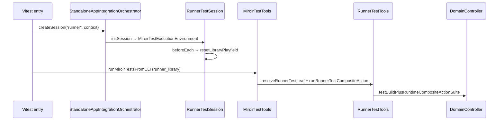
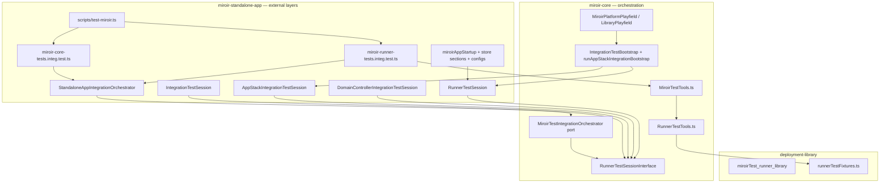
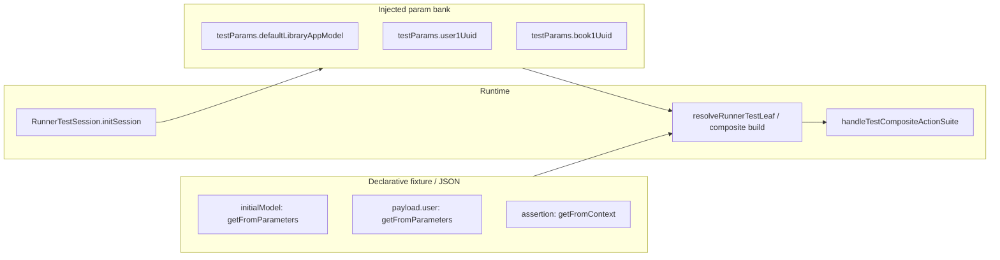
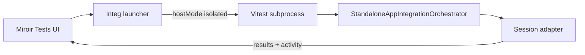

# Feature 197 — Run integration tests in the UI

GitHub issue: TBD (`miroir-framework/miroir#197`)

**Status:** Phase A complete; integration bootstrap gaps A/B/C-setup/E complete ([integ-test-setup-gaps.md](./integ-test-setup-gaps.md)); refactor phase (green) planned before Phase B

**Depends on:** [Feature 196 — MiroirTest](../196-FEATURE-migrate-tests-to-MiroirTest/plan.md) (complete)

## Overview

Runner integration tests live in `miroir-standalone-app` as imperative Vitest files (`Runner_Miroir.integ.test.tsx`, `Runner_Library.ts`, `RunnerIntegTestTools.tsx`) and as MiroirTest JSON suites (`miroirTest_runner_library`). Legacy files still use `RunnerTestParams` + `it.each`; the MiroirTest pilot uses `runnerTest` leaves via `testMiroir`. Both paths share `RunnerTestSession` bootstrap (Gap E).

**Near-term goal (Phase A):** Extend `MiroirTest` with a `runnerTest` leaf, encode a minimal `libraryLendBookRunnerTest`, and run it via:

```bash
VITE_MIROIR_TEST_CONFIG_FILENAME=./packages/miroir-standalone-app/tests/miroirConfig.test-emulatedServer-sql.json \
VITE_MIROIR_LOG_CONFIG_FILENAME=./packages/miroir-standalone-app/tests/specificLoggersConfig_DomainController_debug.json \
npm run testMiroir -w miroir-standalone-app -- --suites runner_library --mode integ
```

**Refactor goal (Phase R, green):** Replace the Phase A **TypeScript fixture bridge** with **transformer-based indirection** (`getFromParameters`, `getFromContext`) and a **standard injected parameter bank** — same pattern as Reports / Transformers. No new failing tests; each slice keeps `runner_library` green.

**Later goal (Phase B):** Run the same suites from the Miroir UI inside an **isolated test environment** (setup/teardown per run), with an exploratory troubleshooting view — without polluting the user's working UI session.

Constraints:

- UUID v4 only for new deployment instances
- TDD throughout
- Keep execution logic **centralized in `miroir-core`**; `miroir-standalone-app` owns vitest entry, config files, and UI wiring
- Reuse existing primitives: `testBuildPlusRuntimeCompositeActionSuiteForRunner`, `CompositeRunTestAssertion`, session adapters (`RunnerTestSession`, …) built on `runAppStackIntegrationBootstrap`
- Do **not** delete legacy `Test` entity / `Runner_*.integ.test.tsx` files until cutover is proven

---

## Current state

Bootstrap/orchestrator state is documented in [integ-test-setup-gaps.md](./integ-test-setup-gaps.md). Summary below reflects post–Gap A/B/C-setup/E reality.

### Integration test infrastructure (shared)

All non-component integration tests in `miroir-standalone-app` converge on `RunnerTestSessionInterface` adapters created by `StandaloneAppIntegrationOrchestrator` (`MiroirTestIntegrationOrchestrator` port in `miroir-core`).

| Session class | Kind | Entry point | Config surface | Playfield |
|---------------|------|-------------|----------------|-----------|
| `IntegrationTestSession` | `transformer` | `miroir-core-tests.integ.test.ts` | `MIROIR_TEST_*` | `testApplication` (synthetic UUIDs) |
| `AppStackIntegrationTestSession` | `appStackPsc` | per-file `4_storage` integ | `VITE_MIROIR_*` | `libraryDeployment` |
| `DomainControllerIntegrationTestSession` | `domainController` | `3_controllers` CRUD, undo-redo | `VITE_MIROIR_*` | profile-dependent |
| `RunnerTestSession` | `runner` | `Runner_Miroir.integ`, `miroir-runner-tests.integ.test.ts` | `VITE_MIROIR_*` + `--profile` | `libraryDeployment` |

**Orchestrator context** (Gap A/B — ready for Phase B UI launcher):

- `hostMode`: `"isolated"` (CLI/Vitest default) | `"embedded"` (inject live host env)
- `hostExecutionEnvironment`, `platformEnsureMode`, `playfieldMode`, `skipBootstrapPhases`
- Helpers: `ensureMiroirPlatform`, `ensureLibraryPlayfield`, `resetLibraryPlayfield`

**Execution flow (MiroirTest runner path):**



**Remaining bootstrap gap (not blocking Phase B launcher):**

- **Gap D** — env config fragmentation: transformer integ uses `MIROIR_TEST_*`; app-stack/runner integ uses `VITE_MIROIR_*` + JSON profiles. Unified `--profile` across both surfaces is optional follow-up.

### MiroirTest runner track (Phase A — complete)

| Piece | Location | Role |
|-------|----------|------|
| Entity + `runnerTest` leaf | `entityMiroirTest` schema | Unified test concept with runner dispatch |
| Runner dispatch | `miroir-core/src/5_tests/RunnerTestTools.ts` | `resolveRunnerTestLeaf`, `runRunnerTestCompositeAction` |
| Orchestrator | `miroir-core/src/5_tests/MiroirTestIntegrationOrchestrator.ts` | Port + `IntegrationTestOrchestratorContext` |
| Factory | `standalone-app/.../StandaloneAppIntegrationOrchestrator.ts` | Session kind → adapter |
| CLI | `standalone-app/scripts/test-miroir.ts` | `--suites`, `--mode`, `--filter`, `--profile` |
| Transformer integ CLI | same script → `miroir-core-tests.integ.test.ts` | `MIROIR_TEST_*` env |
| Runner integ CLI | same script → `miroir-runner-tests.integ.test.ts` | `VITE_MIROIR_*` / `--profile` |
| Pilot instance | `miroirTest_runner_library` in deployment-library | lend + return `runnerTest` leaves |
| Fixture catalog | `miroir-test-app_deployment-library/src/runnerTestFixtures.ts` | interim bridge (Phase R retires literals) |

**Still open for #197:** Phase R (transformer-based param indirection), Phase B (UI launcher + reporting). UI runs **domainController-based** MiroirTest integ first; PSC-direct `4_storage` suites deferred (see [Out of scope](#out-of-scope)).

### Legacy imperative runner files (not yet on MiroirTest JSON)

| Piece | Location | Role |
|-------|----------|------|
| Test definitions | `tests/4_view/Runner_Library.ts` | `RunnerTestParams` objects — parity reference for Phase R |
| Vitest harness | `tests/4_view/Runner_Miroir.integ.test.tsx` | `RunnerTestSession` + `it.each` over params (harness migrated, G8) |
| Setup helpers | `tests/4_view/RunnerIntegTestTools.tsx` | thin wrappers; `beforeEach` → `resetLibraryPlayfield` |
| Suite builder | `miroir-core/src/1_core/Runner.ts` | `testBuildPlusRuntimeCompositeActionSuiteForRunner` |

Per G8: deprecate per-file as MiroirTest equivalents land; delete harness only after **all** `Runner_*` integ files migrate.

### Legacy parallel: `Test` entity (Feature 195 note)

The `Test` entity (`d2842a84-…`) already models `testBuildPlusRuntimeCompositeActionSuite` integration tests. Runner tests **reuse the same runtime action types** but are **not** stored as `Test` instances. Feature 197 deliberately migrates runner coverage onto `MiroirTest` for a single CLI/UI surface — not onto legacy `Test`.

---

## Problem statement

1. **Representation:** Most `RunnerTestParams` coverage is still TypeScript-only; pilot `runner_library` is on MiroirTest JSON — remaining `Runner_*` files not yet migrated (G8).
2. **Duplication:** Startup/lifecycle duplication **reduced** (Gap E) via shared session adapters; legacy files still repeat vitest entry boilerplate until full MiroirTest cutover.
3. **Environment coupling:** Bootstrap is hexagonal and UI-ready (Gaps A/B/E); Phase B still needs a **UI launcher** wired to the orchestrator with session isolation.
4. **Mode split:** Feature 196 UI runs MiroirTest in `executionMode: "unit"` only. Runner tests are inherently **integration** and need a guarded UI path in Phase B.

---

## Locked decisions (grill session)

| # | Decision | Locked |
|---|----------|--------|
| G1 | **Leaf type** | **A** — new `miroirTestType: "runnerTest"` on `MiroirTest` (not legacy `Test` entity) |
| G2 | **Instance home** | **A** — `miroir-test-app_deployment-library` (`model` section). `MiroirTest` is a Miroir meta-entity (`a311f363-…`); any application (library, admin, …) may host instances like Reports, Menus, Queries |
| G3 | **JSON vs fixtures (pilot)** | **A** — minimal refs in JSON; heavy payloads in fixture catalog **as interim bridge** |
| G3b | **Param/context resolution (direction)** | Prefer general-purpose `getFromParams` / `getFromContext` transformers over test-specific hard-coded values; tests/queries/runners share a **standard injected execution environment** they reference; intermediate values built during run via `getFromContext` (same as Transformers/Reports). Phase A: ground prep + pilot on fixture bridge; no big-bang unless one-step is simpler |
| G4 | **`testMiroir` script home** | **A** — `miroir-standalone-app` owns the vitest entry script and external layers; **orchestration + shared setup/teardown infrastructure in `miroir-core`** (hexagonal: core orchestrates, packages inject adapters) |
| G5 | **Environment profile selection** | **C** — env vars for CI/explicit override (`VITE_MIROIR_*`, `MIROIR_TEST_POSTGRES_HOST`); optional `--profile` CLI flag for local presets (overrides when present). **Note:** runner/app-stack `--profile` implemented; cross-family unification with `MIROIR_TEST_*` is Gap D (optional) |
| G6 | **Phase B UI placement** | **A** — extend existing Miroir Tests menu/reports; mode badge (`unit` / `integ`); integ run behind session guard on `RunMiroirTestSuiteButton` |
| G7 | **Headless runner execution** | **A** — extract `runRunnerTestCompositeAction` to `miroir-core`; `RunnerTestTools` + orchestrator call it; `tests-utils` thin re-export for legacy |
| G8 | **Legacy `Runner_*` deprecation** | **B** — deprecate per-file as suites migrate; delete harness only after **all** `Runner_*` integ files have `MiroirTest` equivalents |

## Additional locked decisions (implicit from grill)

| # | Decision |
|---|----------|
| 2 | `runnerTest` leaves run **only** in `executionMode: "integration"`; unit mode throws or skips |
| 3 | `runnerTest` delegates to `testBuildPlusRuntimeCompositeActionSuiteForRunner` |
| 5 | JSON uses `runnerRef`, `fixtureRef`, `environmentRef` resolved at runtime |
| 10 | Phase A pilot: `libraryLendBookRunnerTest` + `libraryReturnBookRunnerTest` in `runner_library` ✅ |
| R0 | **Refactor first slice:** `initialModel` in fixtures → `getFromParameters` transformer; value from injected param bank |
| R-end | **Refactor end state:** no hard-coded fixture payloads; declarative runner tests + environment param injection only |

---

## Target schema

### Standard execution environment (target direction)

Tests, queries, and runners should share one **injected execution environment** per run — analogous to `functionCallTest.environmentRef` and `queryTest.fixtureRef` today, but extended for full-stack integration.

**Implemented today** (`MiroirTestExecutionEnvironment` in `MiroirTestTools.ts`):

```typescript
{
  domainController: DomainControllerInterface,
  applicationDeploymentMap: ApplicationDeploymentMap,
  testApplicationUuid: string,
  persistenceStoreControllerManager: PersistenceStoreControllerManagerInterface,
  runnerTestContext?: RunnerTestContext,  // testParams + runtimeContext for runner leaves
}
```

**Target direction** (Phase R — extend runner context / orchestrator injection):

```typescript
// Target: fuller injected environment per vitest session / UI session
{
  miroirConfig: MiroirConfigClient,
  domainController: DomainControllerInterface,
  applicationDeploymentMap: ApplicationDeploymentMap,
  modelEnvironment: MiroirModelEnvironment,
  testParams: Record<string, unknown>,   // e.g. user1, book1, deployment uuids
  runtimeContext: Record<string, unknown>,
}
```

**Resolution pattern (align with Transformers/Reports):**

| Mechanism | Use |
|-----------|-----|
| `getFromParams` + `referencePath` | Runner payloads, query inputs — pull from injected `testParams` |
| `getFromContext` + `referencePath` | Assertions on named preTest results (`LendingHistoryList`, …) |
| `environmentRef` on leaf | Select which standard environment profile seeds `testParams` |

Existing `libraryLendBookRunnerTest` already uses `getFromContext` in assertions (`referencePath: ["LendingHistoryList", "items"]`). Phase A should **preserve** that; Phase A+ should migrate **payload UUIDs** (`user1.uuid`, `book1.uuid`) from fixture literals toward `getFromParams` references into the injected environment.

### `MiroirTestForRunner` leaf (new)

```typescript
{
  miroirTestType: "runnerTest",
  miroirTestLabel: string,
  skip?: boolean,
  testTag?: string | string[],

  // Standard environment (pilot: fixtureRef seeds testParams; target: environmentRef)
  environmentRef?: string,              // e.g. "libraryRunnerTestEnvironment"
  runnerRef: string,                    // e.g. "lendDocument"
  fixtureRef?: string,                  // interim: "libraryLendBookDefaults" (Phase A bridge)
  deploymentRef?: string,               // e.g. "libraryTestIdentifiers"

  testCompositeActionLabel?: string,
  // Target: testParams use getFromParams transformers; pilot may defer to fixtureRef
  testParams?: Record<string, unknown>,
  preTestCompositeActions?: CompositeAction[],
  preRunnerCompositeActions?: CompositeAction[],
  testCompositeActionAssertions?: CompositeRunTestAssertion[],

  skipCreateDeployment?: boolean,
  skipDropDeployment?: boolean,
}
```

### Fixture catalog — interim bridge (Phase A)

New `miroir-test-app_deployment-library/src/runnerTestFixtures.ts`:

```typescript
export const runnerTestFixtureCatalog = {
  libraryTestIdentifiers: { testApplicationUuid, testApplicationDeploymentUuid, ... },
  libraryRunnerTestEnvironment: () => ({
    testParams: { user1: user1.uuid, book1: book1.uuid, ... },
    initialModel: defaultLibraryAppModel,
    deploymentRef: "libraryTestIdentifiers",
  }),
  libraryLendBookDefaults: {
    runner: lendDocument,
    // interim: literal testParams; migrate to getFromParams referencing environment.testParams
    preTestCompositeActions: [ /* fetchLendingHistory → nameGivenToResult: LendingHistoryList */ ],
    testCompositeActionAssertions: [ /* getFromContext on LendingHistoryList */ ],
  },
};
```

**Minimal encoding (G3):** JSON leaf holds `runnerRef` + `fixtureRef` (+ optional `environmentRef`); catalog resolves to `TestCompositeActionParams` via injected environment.

**Ground prep (no big-bang):** Phase A defines `RunnerTestExecutionEnvironment` type, wires `environmentRef` resolution stub (can alias `fixtureRef` initially), documents `getFromParams` migration path for `testParams`. Full param indirection is a follow-up slice inside Phase A or early Phase B.

### MiroirTest instances across applications

`MiroirTest` is defined in the Miroir meta-application (`entityMiroirTest`, `a311f363-e238-4203-bdfc-29e8c160c26b`). Instances are **not** confined to `deployment-miroir`: any application may store them in its `model` section, same pattern as Reports, Menus, Queries. Core transformer/query pilots live under `deployment-miroir`; runner pilots live under `deployment-library` because they exercise library runners and fixtures.

### Pilot instance sketch

```json
{
  "uuid": "<v4>",
  "parentUuid": "a311f363-e238-4203-bdfc-29e8c160c26b",
  "name": "runner_library",
  "selfApplication": "<library-application-uuid>",
  "definition": {
    "miroirTestType": "miroirTestSuite",
    "miroirTestLabel": "runner.library",
    "miroirTests": [
      {
        "miroirTestType": "runnerTest",
        "miroirTestLabel": "Lend Book Test Composite Action",
        "environmentRef": "libraryRunnerTestEnvironment",
        "runnerRef": "lendDocument",
        "fixtureRef": "libraryLendBookDefaults"
      }
    ]
  }
}
```

---

## Architecture (current + Phase B target)

### Hexagonal split: orchestration in core, adapters in packages



| Layer | Package | Responsibility |
|-------|---------|----------------|
| **Port** | `miroir-core` | `RunnerTestSessionInterface`: `initSession`, `beforeEach`, `teardown` → `MiroirTestExecutionEnvironment` |
| **Orchestrator** | `miroir-core` | `MiroirTestIntegrationOrchestrator` + `IntegrationTestOrchestratorContext` (`hostMode`, `playfieldMode`, …) |
| **Factory** | `miroir-standalone-app` | `StandaloneAppIntegrationOrchestrator` — maps session kind → adapter |
| **Session adapters** | `miroir-standalone-app` | `IntegrationTestSession`, `AppStackIntegrationTestSession`, `DomainControllerIntegrationTestSession`, `RunnerTestSession` |
| **Bootstrap** | `miroir-core` | `runAppStackIntegrationBootstrap`, `ensureMiroirPlatform`, `ensureLibraryPlayfield`, `resetLibraryPlayfield` |
| **Vitest script** | `miroir-standalone-app` | `test-miroir.ts` + entry files; passes orchestrator context into session adapters |

**Goal (met for CLI):** transformer, storage, domain-controller, and runner integ share the same orchestrator port and teardown contract. **Phase B** adds a UI launcher that reuses this stack — default `hostMode: "isolated"` (Vitest subprocess), optional `embedded` for advanced host attachment ([Gap A](./integ-test-setup-gaps.md#2-gap-a--miroir--admin-app-initialization--done)).

---

## Developer quick reference

| Area | Path |
|------|------|
| Schema evolution | `entityDefinitionMiroirTest` + `getMiroirFundamentalJzodSchema` |
| Runner leaf dispatch | `packages/miroir-core/src/5_tests/RunnerTestTools.ts` |
| Integration port + orchestrator | `packages/miroir-core/src/5_tests/MiroirTestIntegrationOrchestrator.ts` |
| Bootstrap phases + session descriptors | `packages/miroir-core/src/5_tests/IntegrationTestBootstrap.ts` |
| Platform / library playfield | `MiroirPlatformPlayfield.ts`, `LibraryPlayfield.ts` |
| Standalone factory | `packages/miroir-standalone-app/tests/helpers/StandaloneAppIntegrationOrchestrator.ts` |
| Session adapters | `packages/miroir-standalone-app/tests/helpers/IntegrationTestSession.ts` |
| Runner adapter | `packages/miroir-standalone-app/tests/helpers/RunnerTestSession.ts` |
| Fixture catalog (Phase A bridge) | `packages/miroir-test-app_deployment-library/src/runnerTestFixtures.ts` |
| Param bank / environment seeds | `RUNNER_TEST_ENVIRONMENT_REFS` in fixture catalog → `RunnerTestContext.testParams` |
| Pilot instance | `miroir-test-app_deployment-library/assets/.../miroirTest_runner_library.json` |
| Standalone registry | `packages/miroir-standalone-app/tests/helpers/miroirRunnerTestSuiteRegistry.ts` |
| Vitest entries | `miroir-core-tests.integ.test.ts` (transformer), `miroir-runner-tests.integ.test.ts` (runner) |
| Gap analysis (bootstrap state) | [integ-test-setup-gaps.md](./integ-test-setup-gaps.md) |
| Config files | `tests/miroirConfig.test-emulatedServer-sql.json`, `tests/specificLoggersConfig_*.json` |

### Commands

```bash
# Phase A — runner library pilot (explicit env — CI / debugging)
VITE_MIROIR_TEST_CONFIG_FILENAME=./packages/miroir-standalone-app/tests/miroirConfig.test-emulatedServer-sql.json \
VITE_MIROIR_LOG_CONFIG_FILENAME=./packages/miroir-standalone-app/tests/specificLoggersConfig_DomainController_debug.json \
npm run testMiroir -w miroir-standalone-app -- --suites runner_library --mode integ

# Local convenience — bundled preset (overrides default paths when no VITE_* set)
npm run testMiroir -w miroir-standalone-app -- --suites runner_library --mode integ --profile emulatedServer-sql

# Transformer integ (same script; MIROIR_TEST_* env — separate from VITE_MIROIR_* until Gap D)
MIROIR_TEST_SUITES=miroirCoreTransformers MIROIR_TEST_MODE=integ \
  npm run testMiroir -w miroir-standalone-app

# Filter single leaf (suite label runner.library — not registry key runner_library)
npm run testMiroir -w miroir-standalone-app -- --suites runner_library --mode integ --profile emulatedServer-sql \
  --filter '{"runner.library":["Return Book Test Composite Action"]}'

# Shorthand: leaf label as sole key (values ignored) when suite has flat leaves
npm run testMiroir -w miroir-standalone-app -- --suites runner_library --mode integ --profile emulatedServer-sql \
  --filter '{"Return Book Test Composite Action":["*"]}'

# Legacy imperative path (harness on RunnerTestSession; not MiroirTest JSON — G8)
VITE_MIROIR_TEST_CONFIG_FILENAME=... npm run testByFile -w miroir-standalone-app -- Runner_Miroir.integ
```

**Profile resolution order (runner / app-stack):** explicit `VITE_MIROIR_*` env vars win → else `--profile` maps to preset table → else error (no implicit default in CI).

---

## Phases

### Phase A — `runnerTest` leaf + CLI pilot (near-term)

#### A0 — Schema & types (TDD)

**Red:**

- `miroirTest.schema.unit.test.ts`: `miroirTestForRunner` parses minimal leaf
- `MiroirTestTools`: unknown leaf still exhausts; add failing case for `runnerTest` dispatch

**Green:**

- Extend `entityDefinitionMiroirTest` with `miroirTestForRunner` context key (distinct from legacy `Test`)
- Regenerate `miroirFundamentalType.ts` / jzod schema
- Export types from `miroir-core`

#### A1 — `RunnerTestTools` (TDD)

**Red:**

- `runnerTest.tools.unit.test.ts`: resolve `fixtureRef` + `runnerRef` → `TestCompositeActionParams`
- `miroirTestTools.unit.test.ts`: `runnerTest` in unit mode throws clear error

**Green:**

- `RunnerTestTools.ts`:
  - `resolveRunnerTestLeaf(leaf, fixtureCatalog, environment) → TestCompositeActionParams`
  - `runRunnerTestCompositeAction(domainController, params, applicationDeploymentMap, activityTracker, …)` — **headless**, extracted from `tests-utils.runTestOrTestSuite` (G7)
  - `runMiroirRunnerTestInMemory(vitest, leaf, executionEnvironment, …)` → resolve leaf + call `runRunnerTestCompositeAction`
- Wire `case "runnerTest"` in `MiroirTestTools.runMiroirTestInMemory` (integration only)
- Export `runRunnerTestCompositeAction` from `miroir-core`; `tests-utils.tsx` re-exports for legacy integ files

#### A2 — Shared integration orchestrator (TDD) ✅

**Red:**

- `miroirTestIntegrationOrchestrator.unit.test.ts`: mock port → `initSession` / `beforeEach` / `teardown` called in order
- `runnerIntegAdapter.unit.test.ts` (standalone-app): adapter implements port contract

**Green (miroir-core):** ✅

- `RunnerTestSessionInterface` — `initSession` → `MiroirTestExecutionEnvironment`; `beforeEach`; `teardown`
- `MiroirTestExecutionEnvironment` — shared shape for transformer + runner (`domainController`, `applicationDeploymentMap`, `testApplicationUuid`, `persistenceStoreControllerManager`, optional `runnerTestContext`)
- `MiroirTestIntegrationOrchestrator` port + `IntegrationTestOrchestratorContext` (`hostMode`, `playfieldMode`, `platformEnsureMode`, …)
- `IntegrationTestBootstrap.ts` — session kinds, phase descriptors, `describeIntegrationTestSession`

**Green (standalone-app):** ✅

- `StandaloneAppIntegrationOrchestrator` — factory for all session kinds
- `IntegrationTestSession` (transformer), `AppStackIntegrationTestSession`, `DomainControllerIntegrationTestSession`, `RunnerTestSession`
- `RunnerTestSession`: shared bootstrap via `runAppStackIntegrationBootstrap`; per-test `resetLibraryPlayfield` (Gap B)
- `RunnerIntegTestTools.tsx` — thin wrapper; legacy `Runner_Miroir.integ` uses `RunnerTestSession` directly
- Transformer integ entry: `miroir-core-tests.integ.test.ts` (moved from miroir-core; `initMiroirCoreTestIntegrationStore` removed — Gap C)

**Also completed (Gap A/B/E — see [integ-test-setup-gaps.md](./integ-test-setup-gaps.md)):**

- `ensureMiroirPlatform`, `ensureLibraryPlayfield`, `resetLibraryPlayfield`
- Legacy `Runner_Miroir.integ`, `3_controllers` CRUD, `4_storage` migrated to session adapters

**Ground prep (optional stretch):**

- One pilot `testParams` field via `getFromParams`; `resolveRunnerTestEnvironment(environmentRef)` seeds `testParams` namespace → deferred to Phase R

#### A3 — Pilot instance + fixture catalog

**Green:**

- `runnerTestFixtures.ts` with `libraryTestIdentifiers`, `libraryLendBookDefaults`
- `miroirTest_runner_library` JSON instance (UUID v4)
- Export from `miroir-test-app_deployment-library/index.ts`
- `miroirRunnerTestSuiteRegistry.ts` with key `runner_library`

#### A4 — Standalone vitest entry + `testMiroir` script

**Green:**

- Add `"testMiroir": "tsx ./scripts/test-miroir.ts"` to `miroir-standalone-app/package.json`
- `scripts/test-miroir.ts` — extends `parseMiroirTestCliConfig` with `--profile`; preset table in `tests/helpers/runnerTestProfiles.ts`
- `miroir-runner-tests.integ.test.ts`:
  - `miroirAppStartup()` + store section startups (same as `Runner_Miroir.integ`)
  - `initMiroirRunnerTestEnvironment()`
  - `runMiroirTestsFromCLI(config, { runnerTestEnvironment })`
- Vitest entry constructs `RunnerTestSession` and passes to `MiroirTestIntegrationOrchestrator` / `runMiroirTestsFromCLI`
- Extend `MiroirTestExecutionOptions` with `executionEnvironment` from orchestrator

**Verify:**

```bash
# Must pass with same assertions as legacy libraryLendBookRunnerTest
npm run testMiroir -w miroir-standalone-app -- --suites runner_library --mode integ
```

#### A5 — Parity check + docs

- Side-by-side run: legacy `Runner_Miroir.integ` vs new `testMiroir` — same pass/fail
- Update `docs/guides/developer/testing.md` with runner integ section
- Legacy `Runner_Miroir.integ`: harness on `RunnerTestSession` (Gap E); **still imperative** — not migrated to MiroirTest JSON (G8)
- Add parity comment in `Runner_Library.ts` pointing to `miroirTest_runner_library` (no `@deprecated` until cutover batch)

#### Phase A — completion notes

- `runnerTest` schema + `RunnerTestTools` + orchestrator + `testMiroir` in standalone-app ✅
- `miroirTest_runner_library` with lend + return leaves ✅
- Shared bootstrap: Gaps A/B/C-setup/E — four session kinds, orchestrator port, playfield helpers ✅
- Return fixture adds `preRunnerCompositeActions: [lendBookPreRunner]` (fix missing in legacy `Runner_Library.ts`)
- Fixture catalog path: `miroir-test-app_deployment-library/src/runnerTestFixtures.ts`

---

### Phase R — Transformer-based refactor (green, before Phase B)

**Principle:** Every value that today is **copied literally** into `runnerTestFixtures.ts` becomes either:

1. A **`getFromParameters`** reference (`referenceName` → key in the injected param bank), or  
2. A **`getFromContext`** reference (`referencePath` → value produced by an earlier step in the composite sequence)

The **param bank** is the standard execution environment (`RunnerTestContext.testParams`), seeded by `environmentRef` (e.g. `libraryRunnerTestEnvironment`) and merged into suite `testParams` at run time — same slot `handleTestCompositeActionSuite` already receives.

**Not in scope for R:** Changing pass/fail behaviour; deleting legacy `Runner_*` files (G8).



#### R0 — `initialModel` as `getFromParameters` (first task)

**Current (Phase A bridge):**

```typescript
// runnerTestFixtures.ts
initialModel: defaultLibraryAppModel,  // literal MetaModel import
```

**Target:**

```typescript
// RunnerTestFixtureDefaults
initialModel: {
  transformerType: "getFromParameters",
  interpolation: "build",
  referenceName: "defaultLibraryAppModel",
} satisfies CoreTransformerForBuildPlusRuntime;

// libraryRunnerTestEnvironment seeds param bank (RunnerTestSession / environmentRef)
testParams: {
  defaultLibraryAppModel  // from Library.ts — injected, not embedded in fixture body
}
```

**Type change:**

```typescript
export type RunnerTestFixtureDefaults = {
  // ...
  initialModel: CoreTransformerForBuildPlusRuntime;  // was MetaModel
};
```

**Red (TDD):**

- `runnerTest.tools.unit.test.ts`: fixture `libraryLendBookDefaults` has transformer `initialModel`, not literal model
- `runnerTest.tools.unit.test.ts`: `resolveRunnerTestLeaf` with param bank containing `defaultLibraryAppModel` produces same `beforeEach` / init model as Phase A
- `miroir-runner-tests.integ`: lend + return still pass

**Green (minimal path — recommended for R0):**

1. Change fixture `initialModel` to `getFromParameters` transformer (both lend + return fixtures).
2. Move `defaultLibraryAppModel` from fixture body into `libraryRunnerTestEnvironment` `testParams`.
3. In `resolveRunnerTestLeaf` (or thin helper `resolveRunnerTestInitialModel`):
   - Merge `environmentSeed.testParams` + leaf overrides into param bank
   - Run transformer at **`interpolation: "build"`** with that bank → concrete `MetaModel`
   - Pass resolved model to `testBuildPlusRuntimeCompositeActionSuiteForRunner` (signature unchanged)
4. Remove `defaultLibraryAppModel` import from fixture entries (keep only in environment provider).

**Files touched:** `runnerTestFixtures.ts`, `RunnerTestTools.ts`, possibly `RunnerTestSession.ts` (ensure merged params reach resolution).

**Open decision R0-a (resolution site):** See [Refactor open decisions](#refactor-open-decisions).

#### R1 — Runner `testParams` payloads via `getFromParameters`

Replace literal UUIDs / dates in lend/return payloads:

```typescript
payload: {
  user: { transformerType: "getFromParameters", interpolation: "build", referenceName: "user1Uuid" },
  book: { transformerType: "getFromParameters", interpolation: "build", referenceName: "book1Uuid" },
  startDate: { transformerType: "getFromParameters", interpolation: "build", referenceName: "lendStartDate" },
}
```

Environment injects `lendStartDate` (ISO string) alongside entity UUIDs. Reuse existing transformer test utilities where possible.

#### R2 — `preTestCompositeActions` / assertions

- `fetchLendingHistoryPreTest`: application UUID, deployment UUID, entity parent UUID → `getFromParameters` (keys from `deploymentRef` / environment)
- Assertions already use `getFromContext` for `LendingHistoryList` — keep; ensure context is populated by preTest steps (unchanged behaviour)

#### R3 — Inline fixture catalog into `MiroirTest` JSON

Move declarative transformer trees from `RUNNER_TEST_FIXTURE_REFS` into `miroirTest_runner_library` leaf fields (or new `runnerTestDefinition` sub-document on leaf). `fixtureRef` becomes optional; environment + JSON hold the full definition.

`runnerRef` / `deploymentRef` may remain string refs (resolve to runner entity + identifier map) — not transformer material.

#### R4 — Retire TypeScript fixture catalog

- Delete or reduce `runnerTestFixtures.ts` to **environment param providers only** (`RUNNER_TEST_ENVIRONMENT_REFS`, `RUNNER_TEST_DEPLOYMENT_REFS`, `RUNNER_REF_MAP`)
- `resolveRunnerTestFixture` → load from JSON leaf + environment; no per-test hard-coded composite actions in TS
- Update plan mapping table; align `Runner_Library.ts` comment / optional parity sync

#### Phase R — success criteria

- [ ] `initialModel` is a `getFromParameters` transformer; `defaultLibraryAppModel` only in environment param bank
- [ ] `npm run testMiroir -w miroir-standalone-app -- --suites runner_library --mode integ` stays green after each R slice
- [ ] No new literals in fixture bodies for fields migrated in that slice
- [ ] (R4) `runnerTestFixtures.ts` contains no composite-action / assertion literals

#### Suggested commits (Phase R)

1. `refactor(runner-test): R0 initialModel via getFromParameters + param bank`
2. `refactor(runner-test): R1 runner payloads via getFromParameters`
3. `refactor(runner-test): R2 preTest actions via getFromParameters`
4. `refactor(runner-test): R3 move runner_test definitions to MiroirTest JSON`
5. `refactor(runner-test): R4 shrink fixture catalog to environment providers only`

---

### Refactor open decisions

| # | Question | Options | Decision |
|---|----------|---------|----------------|
| R0-a | **Where is `initialModel` transformer resolved?** | A) Eager in `resolveRunnerTestLeaf` using merged param bank B) Lazy in `beforeEach` inside composite runtime (extend `resetAndinitializeDeploymentCompositeAction` to accept transformer) C) let the `runTestOrTestSuite` pass a value to the domainController as params | **C** let the "normal" resolution flow proceed |
| R0-b | **Param key naming** | A) `defaultLibraryAppModel` matches `Library.ts` export name B) prefixed keys e.g. `library.defaultLibraryAppModel` | **A** — direct `referenceName` ↔ param key |
| R1-a | **Date params** | A) inject ISO strings in environment B) `returnValue` transformer in fixture | **A** for consistency with param bank |
| R3-a | **JSON size** | A) full composite trees in leaf JSON B) shared sub-fixtures referenced by `fixtureRef` | **B** until generator exists; then **A** for UI editability |
| R4-a | **Catalog fate** | A) delete `runnerTestFixtures.ts` B) keep as environment/runner ref registry only | **B** |

---

### Phase B — UI integration test execution (later)

**Prerequisite:** Gaps A/B/C-setup/E complete ✅ — Phase B wires the **UI launcher** to existing infrastructure; it does not redesign bootstrap from scratch.

**In scope:** domainController-based MiroirTest integ (`runnerTest`, transformer integ via `testMiroir`).

**Deferred:** PSC-direct `4_storage` Vitest suites from UI (see [Out of scope](#out-of-scope)); unified config across `MIROIR_TEST_*` and `VITE_MIROIR_*` (Gap D).

#### B0 — UI launcher + session isolation

Wire UI to `StandaloneAppIntegrationOrchestrator` with explicit host/playfield modes ([Gap A](./integ-test-setup-gaps.md#2-gap-a--miroir--admin-app-initialization--done)).

| Concern | Approach |
|---------|----------|
| **Default (recommended)** | **Isolated Vitest subprocess** — UI spawns `testMiroir` / filtered Vitest with `hostMode: "isolated"`, fresh schema / indexedDb (`test_<timestamp>`), never touches live `MiroirContext` |
| Working UI pollution | Never reuse live domain controller for isolated runs; mutex — one integ session at a time, queue additional runs |
| Config | User picks environment profile (sql / indexedDb) or inherits dev config; runner `--profile` for app-stack; transformer `MIROIR_TEST_*` until Gap D |
| Setup | Reuse `RunnerTestSession` / `IntegrationTestSession` via orchestrator — not a new parallel bootstrap |
| Teardown | Session adapter `teardown()` — drop test schemas, clear indexedDb, reset activity tracker |
| **Advanced (optional)** | `hostMode: "embedded"` + `hostExecutionEnvironment` — inject live host `domainController`; `platformEnsureMode` / `playfieldMode: "requireExisting"` when host already deployed platform + library |

**UI catalog:** use `orchestrator.describeSession(kind)` for mode badges, playfield, `defaultHostMode`, `embeddedCapable` per suite kind.



#### B1 — UI components (extend existing Miroir Tests)

- `RunMiroirTestSuiteButton` — detect suite leaf kinds via `describeSession`; pass `executionMode: "integration"` for integ suites; spawn subprocess or call embedded path; disabled when integ session active
- `MiroirTestDisplay` / list — **mode badge** (`unit` | `integ`) per suite from leaf types + session descriptor
- `RunnerTestEnvironmentInspector` (new panel section) — resolved profile, deployment map, store endpoints, last composite actions from activity tracker

#### B2 — Menu & reports

- Reuse **Miroir Tests** menu (`eaac459c-…`) and `reportMiroirTestList` / `reportMiroirTestDetails`
- Extend `miroirTestReportSection` to surface integ-only suites and inspector slot (no separate menu)

#### B3 — Startup alignment (Feature 157)

- Gap A/B already extracted shared bootstrap (`ensureMiroirPlatform`, `ensureLibraryPlayfield`, `runAppStackIntegrationBootstrap`)
- Phase B: ensure troubleshooting inspector reflects orchestrator phase descriptors and activity tracker output from the launched session
- Optional: embedded path for dev troubleshooting against live host (explicit opt-in, not default)

---

## Mapping: `libraryLendBookRunnerTest` → `runnerTest`

| `RunnerTestParams` field | Encoding |
|--------------------------|----------|
| `pageLabel` | Vitest entry / suite key label (not in leaf) |
| `runner` | `runnerRef: "lendDocument"` → fixture catalog |
| `testApplicationUuid/Name/DeploymentUuid` | `deploymentRef: "libraryTestIdentifiers"` |
| `testParams` | Injected via `environmentRef` → `testParams` namespace; runner payload uses `getFromParams` (pilot: partial; fixture bridge for rest) |
| `preTestCompositeActions` | fixture catalog |
| `testCompositeActionAssertions` | fixture catalog |
| `internalMiroirConfig` | derived at runtime from env config + `getTestConfig` |
| `adminDeployment` | derived from env config |
| `testDeploymentStorageConfiguration` | derived from env profile + app name |
| `initialModel` | Phase A: fixture literal → **Phase R0:** `getFromParameters` + `testParams.defaultLibraryAppModel` |
| `testCompositeActionLabel` | leaf field or fixture default |

---

## Success criteria

### Phase A ✅

- [x] `miroirTestType: "runnerTest"` in schema; generated types compile
- [x] `RunnerTestTools` resolves pilot leaves via fixture catalog
- [x] `npm run testMiroir -w miroir-standalone-app -- --suites runner_library --mode integ` passes (lend + return)
- [x] `runnerTest` rejected in `executionMode: "unit"` with clear error
- [x] Orchestrator + four session adapters (Gaps A/B/C-setup/E); legacy `Runner_Miroir.integ` harness on `RunnerTestSession` (still imperative — G8)
- [x] No secrets committed; config files use localhost defaults

### Phase R

- [ ] R0: `initialModel` → `getFromParameters` + injected `defaultLibraryAppModel`
- [ ] R1–R4: incremental transformer migration; fixture catalog retired

### Phase B

- [ ] UI launcher spawns isolated Vitest subprocess for integ MiroirTest suites (`hostMode: "isolated"`)
- [ ] Run `runner_library` (and transformer integ suites) from UI without affecting working session stores
- [ ] Environment inspector shows config + last run context
- [ ] Teardown leaves no test schemas / indexedDb databases behind
- [ ] (Optional) embedded host path documented and gated — not default

### Gap D (optional — reduces CI friction, not blocking Phase B)

Plan: [gap-D-refactoring-plan.md](./gap-D-refactoring-plan.md)

- [ ] Unified `--profile` for transformer + runner `testMiroir` integ
- [ ] Profile catalog in standalone-app; remove path table from miroir-core
- [ ] CI matrix doc with one profile driving multiple suite kinds
- [ ] (Optional) `testByFile --profile` convenience

---

## Grill session summary (complete)

| # | Question | Locked |
|---|----------|--------|
| G1 | Leaf type vs legacy `Test` entity? | **A** — `runnerTest` on MiroirTest |
| G2 | Instance home? | **A** — library app `model` section |
| G3 | JSON vs fixtures? | **A** — minimal refs + `getFromParams`/`getFromContext` direction |
| G4 | Script vs orchestration? | **A** — script in standalone-app, orchestrator in miroir-core |
| G5 | Profile selection? | **C** — env vars + `--profile` |
| G6 | Phase B UI? | **A** — extend Miroir Tests menu |
| G7 | Headless execution? | **A** — `miroir-core` |
| G8 | Legacy deprecation? | **B** — after all `Runner_*` migrated |

---

## Out of scope

- Migrating all `Runner_*.integ.test.tsx` files to MiroirTest JSON (pilot only in Phase A; G8 governs cutover)
- Deleting legacy `Test` entity
- Fixing pre-existing type `as any` in lendDocument payload
- CI matrix for every storage backend (pilot: emulatedServer-sql only)
- Running transformer + runner suites in a single `testMiroir` invocation across packages (future)
- **UI launcher for PSC-direct `4_storage` suites** — persistence-layer tests keep PSC assertions by design ([Gap C-assertions](./integ-test-setup-gaps.md#42-c-assertions--persistence-tests-keep-psc-by-design)); defer to follow-up issue or Phase B+ (Vitest subprocess catalog entry only)
- **Migrating `4_storage` assertions to `domainController`** — changes test meaning; not required for setup unification
- **Gap D config unification** — optional; runner `--profile` exists; full cross-family profile matrix deferred

---

## Suggested commits (Phase A)

1. `feat(miroir-test): add miroirTestForRunner to MiroirTest entity schema`
2. `feat(miroir-core): add RunnerTestTools with fixture resolution`
3. `feat(miroir-core): add miroirRunnerTestEnvironment bootstrap helper`
4. `feat(miroir-library): add runner_test fixture catalog and pilot instance`
5. `feat(standalone-app): add testMiroir script and runner integ vitest entry`
6. `test(standalone-app): parity libraryLendBookRunnerTest via testMiroir`
7. `docs: runner integration tests via MiroirTest`

---

## Related

- [Integration test setup — gap analysis](./integ-test-setup-gaps.md) (bootstrap gaps A–E)
- [Gap D — unified integration test profiles](./gap-D-refactoring-plan.md)
- [Feature 196 — MiroirTest](../196-FEATURE-migrate-tests-to-MiroirTest/plan.md)
- [Feature 195 — Unit tests in UI](../195-FEATURE-%20enable%20execution%20of%20miroir-core%20unit%20tests%20in%20UI/plan.md) (superseded for unit tests; still relevant for `Test` entity distinction)
- [Feature 157 — Startup sequence](../157-FEATURE-%20harden%20startup%20sequence%20%26%20enable%20admin%20deployment%20choice%20on%20client%20-%20server/PLAN.md) (shared setup/teardown alignment)
