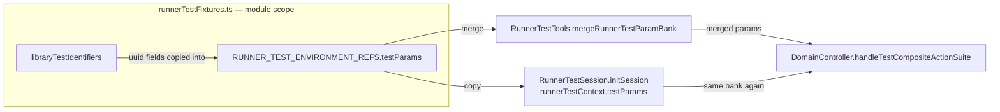
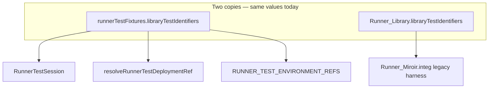
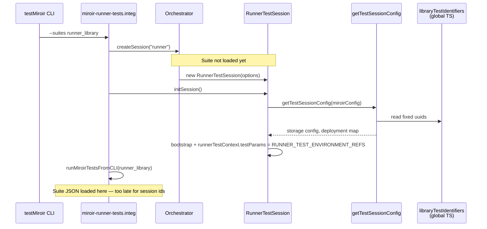
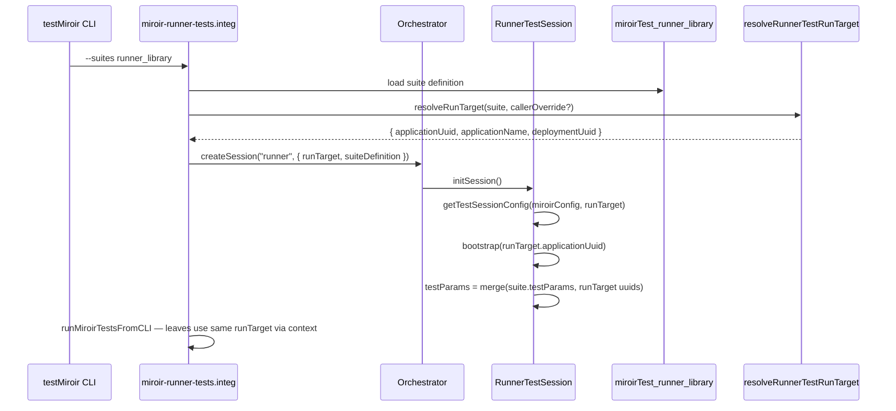
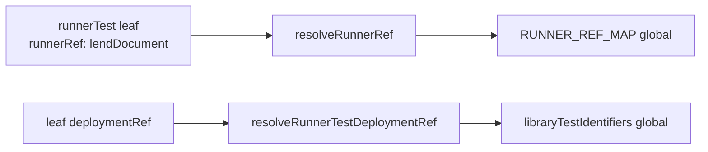

# Phase R6 — Suite-scoped runner test context

**Parent:** [plan.md](./plan.md) (Feature 197)

**Prerequisite:** R0–R5 complete ✅ (`runner_library` integ green; `runnerTestFixtures.ts` trimmed but still present)

**Status:** R6 complete ✅ (R6-A … R6-E)

**Goal:** Remove the global `runnerTestFixtures.ts` module. All context that today is hard-coded for `runner.library` becomes **input to the test run**, derived from the loaded `MiroirTest` suite instance (`uuid` `b7e4a901-2c3d-4f5a-b6c7-8d9e0f1a2b3c`) plus optional caller overrides.

**Core principle:** One **test run** owns a single `{ applicationUuid, applicationName, deploymentUuid }` for its whole lifetime (session init → every leaf → teardown). If the suite JSON does not pin these values, the session factory **generates fresh UUID v4** pairs at run start. Callers (CLI, future UI launcher) may override.

**Constraints:**

- TDD: each slice below is Red → Green → Verify; keep `runner_library` integ green after every slice (see [Global non-regression criteria](#global-non-regression-criteria))
- UUID v4 only for generated deployment targets
- No new failing tests; incremental migration
- Delete `runnerTestFixtures.ts` only in the final slice (R6-E)

---

## Global non-regression criteria

Run after **every** R6 slice (R6-A … R6-E) before marking the slice done. Expected: **2 passed** (`Lend Book` + `Return Book`).

```bash
VITE_MIROIR_TEST_CONFIG_FILENAME=./packages/miroir-standalone-app/tests/miroirConfig.test-emulatedServer-sql.json \
VITE_MIROIR_LOG_CONFIG_FILENAME=./packages/miroir-standalone-app/tests/specificLoggersConfig_DomainController_debug.json \
npm run testMiroir -w miroir-standalone-app -- --suites runner_library --mode integ
```

Unit-test slices (R6-B only) skip this command; all other slices must pass it unchanged or better.

---

## What remains after R5 (the problem)

`packages/miroir-test-app_deployment-library/src/runnerTestFixtures.ts` still exports:

| Export | Problem |
|--------|---------|
| `RUNNER_TEST_ENVIRONMENT_REFS` | Global param bank for **one** suite only |
| `libraryTestIdentifiers` | Global deployment targets; duplicated elsewhere |
| `RUNNER_TEST_DEPLOYMENT_REFS` + `resolveRunnerTestDeploymentRef` | Indirection over the same global map |
| `RUNNER_REF_MAP` + `resolveRunnerRef` | Global runner lookup; ignores which suite is running |

Nothing in this file is reusable for a second runner suite without copy-paste.

---

## Issue 1 — Global param bank (`RUNNER_TEST_ENVIRONMENT_REFS`)

### Present situation

Shared keys (`defaultLibraryAppModel`, `user1Uuid`, `book1Uuid`, dates, entity ids, **and** `testApplicationUuid` / `testApplicationDeploymentUuid`) live in a TypeScript constant built at module load time.



**Call sequence (param bank today):**

1. `RunnerTestSession.initSession()` sets `runnerTestContext.testParams = RUNNER_TEST_ENVIRONMENT_REFS.testParams`
2. For each leaf, `resolveRunnerTestLeaf` merges `RUNNER_TEST_ENVIRONMENT_REFS.testParams` + `leaf.testParams` → suite builder
3. `runRunnerTestCompositeAction` merges `runnerContext.testParams` + `testAction.testParams` → `handleTestCompositeActionSuite`

The bank is **not** tied to which `MiroirTest` suite was selected on the CLI (`--suites runner_library`). It cannot vary per suite without editing TS.

### Impact of refactoring

- Move static bank keys onto **`miroirTestSuite.definition.testParams`** on `miroirTest_runner_library`
- **`testApplicationUuid` / `testApplicationDeploymentUuid` in the bank** become **runtime values** from the test-run target (Issue 3), injected when the session starts — not literals in JSON
- `environmentRef` on leaves becomes redundant for the pilot (optional deprecation)

### Target shape (suite JSON excerpt)

```json
{
  "definition": {
    "miroirTestType": "miroirTestSuite",
    "miroirTestLabel": "runner.library",
    "testParams": {
      "defaultLibraryAppModel": { "…": "MetaModel or reference — TBD in R6-A" },
      "user1Uuid": "04c371ed-702d-4dd9-a06d-8a04eda5d24f",
      "book1Uuid": "caef8a59-39eb-48b5-ad59-a7642d3a1e8f",
      "lendStartDate": "2024-01-01T00:00:00.000Z",
      "lendEndDate": "2024-01-01T00:00:00.000Z",
      "lendingHistoryItemEntityUuid": "e81078f3-2de7-4301-bd79-d3a156aec149",
      "lendingHistoryItemEntityName": "LendingHistoryItem"
    },
    "miroirTests": [ "… leaves keep per-test testParams …" ]
  }
}
```

**Merge order at runtime:** `suite.testParams` → inject run-target uuids into param bank → `leaf.testParams` (leaf wins on key clash).

### Slice R6-A — Suite `testParams` on schema + JSON ✅ **Done**

**Red:**

- Extend `MiroirTestSuite` in entity definition `51c647fe-…` with optional `testParams: Record<string, unknown>`
- Regenerate types; unit test: parsed `miroirTest_runner_library` suite has `testParams` with expected keys (no `testApplicationUuid` literals yet)

**Green:**

- Populate `b7e4a901-…json` suite `testParams` from current `RUNNER_TEST_ENVIRONMENT_REFS` (minus deployment uuid fields — those come from run target in R6-C)
- Keep `RUNNER_TEST_ENVIRONMENT_REFS` temporarily as duplicate; tests compare equality

**Verify:** ✅ (2026-06-27)

- `npm run devBuild -w miroir-test-app_deployment-miroir -w miroir-core`
- `runnerTest.tools.unit.test.ts`: **7 passed** (R6-A parity test)
- [Global non-regression criteria](#global-non-regression-criteria): **2 passed** (runtime still uses global bank until R6-D)

---

## Issue 2 — Duplicate `libraryTestIdentifiers` and `test*` / `install*` pairs

### Present situation

Two independent copies of the same logical data:

| Location | Symbol |
|----------|--------|
| `deployment-library/src/runnerTestFixtures.ts` | `libraryTestIdentifiers` |
| `standalone-app/tests/4_view/Runner_Library.ts` | `libraryTestIdentifiers` (local const) |

Both use six fields:

```typescript
{
  testApplicationUuid, testApplicationDeploymentUuid, testApplicationName,
  installTestApplicationUuid, installTestApplicationDeploymentUuid, installTestApplicationName,
}
```

**Pilot reality:** all six values are **identical** (Library self-application `5af03c98-…` + deployment `f714bb2f-…`). The split was meant for “app under test” vs “storage registration name”, but the pilot never diverges.



### Impact of refactoring

- **One** `RunnerTestRunTarget` (working name) per test run:

```typescript
type RunnerTestRunTarget = {
  applicationUuid: string;
  applicationName: string;
  deploymentUuid: string;
};
```

- Suite JSON may **pin** these (optional block on suite definition) or omit them → session generates UUID v4 at run start
- `getTestSessionConfig` uses the **same** triple for bootstrap, deployment map, storage config, and param-bank injection — no separate `install*` fields unless a future suite truly needs them (out of pilot scope)

### Slice R6-B — Introduce `RunnerTestRunTarget` + resolver ✅ **Done**

**Red:**

- Add `resolveRunnerTestRunTarget(suiteDefinition, callerOverride?)` in `miroir-core` (or `RunnerTestTools.ts`):
  - If `suite.runTarget` (or pinned fields) present → use them
  - Else if `callerOverride` → use it
  - Else → `{ applicationUuid: v4(), deploymentUuid: v4(), applicationName: suite default or "Library" }`
- Unit tests: pinned suite → fixed uuids; empty suite → generated uuids; override wins

**Green:**

- No wiring yet; keep globals

**Verify:** ✅ (2026-06-27)

- `runnerTestRunTarget.unit.test.ts`: **5 passed**
- Schema: optional `runTarget` on `miroirTestSuite` (`51c647fe-…`)
- Resolver: `packages/miroir-core/src/5_tests/RunnerTestRunTarget.ts` (exported from `miroir-core`)
- Precedence: `callerOverride` → `suite.runTarget` → generated uuid v4 + default name `"Library"`

---

## Issue 3 — Session bootstrap runs before suite context exists

### Present situation

`RunnerTestSession` is constructed **without** knowing which MiroirTest suite will run. `getTestSessionConfig(miroirConfig)` imports global `libraryTestIdentifiers` at module scope.



**Impact:** The CLI already knows `--suites runner_library` before `initSession`, but that knowledge does not flow into session config. Postgres schemas, deployment maps, and param-bank uuids are fixed to Library asset ids for every run — collisions and pollution across partial runs are harder to isolate.

### Target situation

Test run **input** is resolved **once** at session creation, from loaded suite + optional caller override:



**Principle (locked):** The triple chosen at session start is the **only** application/deployment identity for that run. Every leaf, `beforeEach` reset, and param-bank `getFromParameters` reference uses these values.

### Slice R6-C — Wire run target into `RunnerTestSession` ✅ **Done**

**Red:**

- Extend `RunnerTestSessionOptions` (or orchestrator session factory) with `runTarget: RunnerTestRunTarget` and `suiteTestParams` (or full suite definition reference)
- Unit test: `getTestSessionConfig(miroirConfig, runTarget)` uses `runTarget.applicationUuid` / `deploymentUuid` instead of `libraryTestIdentifiers`
- Unit test: `runnerTestContext.testParams` includes `testApplicationUuid` / `testApplicationDeploymentUuid` from `runTarget`, merged with suite `testParams`

**Green:**

- `miroir-runner-tests.integ.test.ts`: load `miroirTest_runner_library`, resolve run target, pass into `createSession`
- `getTestSessionConfig` signature takes `runTarget`; remove direct import of `libraryTestIdentifiers` from session file
- Still export `libraryTestIdentifiers` from fixtures for legacy harness until R6-E

**Verify:** ✅ (2026-06-27)

- `RunnerTestSession.unit.test.ts`: **4 passed**
- Pinned `runTarget` on `runner_library` suite JSON
- [Global non-regression criteria](#global-non-regression-criteria): **2 passed**

### Slice R6-D — `RunnerTestTools` uses session context, not globals ✅ **Done**

**Red:**

- Extend `RunnerTestContext` with `runTarget` and `suiteTestParams` (or single `runnerTestRunContext`)
- Unit test: `mergeRunnerTestParamBank(suiteTestParams, runTarget, leaf)` — no import of `RUNNER_TEST_ENVIRONMENT_REFS`
- Unit test: `resolveRunnerTestLeaf` uses `runTarget` for `testBuildPlusRuntimeCompositeActionSuiteForRunner` application/deployment args

**Green:**

- `RunnerTestTools.ts` reads from `executionEnvironment.runnerTestContext` only
- Remove `resolveRunnerTestDeploymentRef` usage from leaf resolution
- Stop importing `RUNNER_TEST_ENVIRONMENT_REFS` in `RunnerTestTools`

**Verify:** ✅ (2026-06-27)

- `runnerTest.tools.unit.test.ts`: **7 passed**
- [Global non-regression criteria](#global-non-regression-criteria): **2 passed**

---

## Issue 4 — Global resolver functions

### Present situation

| Function | What it does | Why it is wrong |
|----------|--------------|-----------------|
| `resolveRunnerTestDeploymentRef(deploymentRef)` | Looks up `RUNNER_TEST_DEPLOYMENT_REFS["libraryTestIdentifiers"]` | Same as global `libraryTestIdentifiers`; leaf `deploymentRef` adds no behaviour |
| `resolveRunnerRef(runnerRef)` | Looks up `RUNNER_REF_MAP` in TS | Runners belong to the **suite** being executed; map is not suite-scoped |



### Impact of refactoring

- **Deployment:** use `runTarget` from context (Issue 3) — delete `deploymentRef` resolution for pilot or keep field as documentation-only until schema cleanup
- **Runners:** suite-level `runners` record on JSON **or** convention: resolve `runnerRef` string against imports registered when the suite is loaded (e.g. `{ lendDocument, returnDocument }` built next to suite loader in deployment-library)

### Slice R6-E — Suite-local runners; delete `runnerTestFixtures.ts` ✅ **Done**

**Red:**

- Unit test: given suite definition + runner registry map, `resolveRunnerFromRegistry(suite, "lendDocument")` returns runner entity
- Grep test / lint rule: no imports from `runnerTestFixtures.ts` in production paths

**Green:**

- Add optional `runners` on suite definition **or** `resolveLibraryRunnerRef(name)` colocated with suite loader (not global map)
- Delete `runnerTestFixtures.ts`; trim `deployment-library/index.ts` exports
- Delete or repoint `Runner_Library.ts` duplicate `libraryTestIdentifiers` (deprecated file — read run target from suite or remove)

**Verify:** ✅ (2026-06-27)

- `runnerLibraryTestRegistry.unit.test.ts`: **3 passed**
- `grep runnerTestFixtures` in `*.ts`/`*.tsx` → **no matches**
- `runnerTestFixtures.ts` **deleted**; replaced by `runnerLibraryTestRegistry.ts`
- `RunnerTestContext.runnerRegistry` wired through session → `resolveRunnerTestLeaf`
- Legacy `Runner_Library.ts`: collapsed to local `runTarget` triple
- [Global non-regression criteria](#global-non-regression-criteria): **2 passed**

---

## Schema work (cross-cutting)

| Entity / type | Change |
|---------------|--------|
| `MiroirTestSuite` | Optional `testParams`, optional `runTarget` `{ applicationUuid?, applicationName?, deploymentUuid? }` |
| `MiroirTestForRunner` | `deploymentRef`, `environmentRef` deprecated for pilot (remove in follow-up) |
| `RunnerTestContext` | Add `runTarget`, `suiteTestParams` (names TBD) |
| Generated types | `devBuild` miroir-test-app_deployment-miroir → miroir-core |

**Open decisions (resolve in R6-A/B):**

| # | Question | Recommendation |
|---|----------|----------------|
| R6-1 | **`defaultLibraryAppModel` in JSON** | Reference by import at suite load time, not embedded MetaModel blob |
| R6-2 | **Pinned vs generated uuids in CI** | Pin in suite JSON for reproducible local/CI runs; document `--run-target-override` for isolation |
| R6-3 | **Runner registry** | Suite loader builds `Record<string, Runner>` from deployment-library assets keyed by runner entity `name` |

---

## Slice summary (TDD order)

| Slice | Issue | Delivers |
|-------|-------|----------|
| **R6-A** | 1 | Suite `testParams` on schema + JSON |
| **R6-B** | 2 | `RunnerTestRunTarget` type + resolver (unit only) ✅ |
| **R6-C** | 3 | Session init takes run target + suite params as **input** ✅ |
| **R6-D** | 1+3 | `RunnerTestTools` uses context; drop global param bank import ✅ |
| **R6-E** | 4 | Suite-local runners; **delete `runnerTestFixtures.ts`** ✅ |

After each slice (except R6-B): [Global non-regression criteria](#global-non-regression-criteria).

---

## Success criteria (R6 complete) ✅

- [x] Single `RunnerTestRunTarget` per test run; generated UUID v4 when suite does not pin
- [x] No global `libraryTestIdentifiers` or `RUNNER_TEST_ENVIRONMENT_REFS`
- [x] `getTestSessionConfig` receives run target from suite/caller, not module import
- [x] `runnerTestFixtures.ts` deleted
- [x] [Global non-regression criteria](#global-non-regression-criteria): **2 passed**
- [x] Main [plan.md](./plan.md) Phase R marked complete → Phase B unblocked

---

## Suggested commits

1. `refactor(runner-test): R6-A suite testParams on miroirTestSuite schema`
2. `refactor(runner-test): R6-B RunnerTestRunTarget resolver`
3. `refactor(runner-test): R6-C wire run target into RunnerTestSession`
4. `refactor(runner-test): R6-D RunnerTestTools uses session run context`
5. `refactor(runner-test): R6-E delete runnerTestFixtures.ts; suite-local runners`
