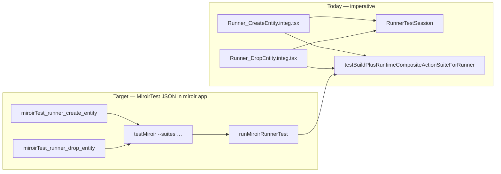

# Runner CreateEntity / DropEntity → MiroirTest migration plan

**Parent:** [plan.md](./plan.md) (Feature #197)  
**Sources:**  
- `packages/miroir-standalone-app/tests/4_view/Runner_CreateEntity.integ.test.tsx`  
- `packages/miroir-standalone-app/tests/4_view/Runner_DropEntity.integ.test.tsx`  
**Instance home:** **Miroir meta-application** (`miroir-test-app_deployment-miroir` / `miroir_data`) — runners `createEntity` / `dropEntity` are Miroir entities; Library Author fixtures are only the payload under test.  
**Status:** Step 1 ✅ (`runner_create_entity`) · Step 2 planned · Step 3 optional  
**Method:** TDD; keep legacy harness green until parity; deprecate (do not delete) per G8

### Hard constraint — legacy files kept green

```bash
# From repo root
npm run testByFile -w miroir-standalone-app -- \
  --profile emulatedServer-sql Runner_CreateEntity.integ

npm run testByFile -w miroir-standalone-app -- \
  --profile emulatedServer-sql Runner_DropEntity.integ
```

Preferred owner path after migration:

```bash
npm run testMiroir -w miroir-standalone-app -- \
  --suites runner_create_entity --mode integ --profile emulatedServer-sql

npm run testMiroir -w miroir-standalone-app -- \
  --suites runner_drop_entity --mode integ --profile emulatedServer-sql
```

---

## 1. Why these tests

| File | Runner | Leaves today | Playfield |
|------|--------|--------------|-----------|
| `Runner_CreateEntity.integ` | `runnerCreateEntity` | `createEntity` (no reports) · `createEntity_withReports` (reports + menu link) | Ephemeral app + **`emptyApplicationModel`** |
| `Runner_DropEntity.integ` | `runnerDropEntity` | `dropEntity` (preRunner runs createEntity sequence first) | Same ephemeral + empty model |

Both are **Miroir runners** (`parentUuid` Runner entity in deployment-miroir), not Library runners. They exercise model-section create/drop of Entity + EntityDefinition (Author fixture from library package as payload only).

Canonical pilot for `runnerTest` JSON remains `miroirTest_runner_library` (Library). These suites add **Miroir-app-owned** runner integ coverage on the same leaf type / session stack.

---

## 2. Present vs target



| Concern | Today | Target |
|---------|-------|--------|
| Suite definition | TS `RunnerTestParams` | `runnerTest` leaves in MiroirTest JSON under **deployment-miroir** |
| Bootstrap | `RunnerTestSession` + ephemeral `runTarget` | Same session kind `"runner"`; suite may omit pinned `runTarget` (ephemeral UUID v4) or pin for CI |
| `initialModel` | `emptyApplicationModel` literal | `getFromParameters` → suite `testParams.emptyApplicationModel` (R0 pattern) |
| Runner payload | Plain object under `createEntity` / `dropEntity` keys | Prefer `getFromParameters` for UUIDs; entity/definition literals OK in pilot |
| Registry | Inline in integ file | `RUNNER_*_REGISTRY` export from deployment-miroir + CLI/UI suite keys |
| UI integ | Not registered | Optional follow-up: add keys to `UI_INTEGRATION_RUNNER_SUITE_REGISTRY` |

---

## 3. Locked decisions

| # | Decision |
|---|----------|
| **M1** | New MiroirTest instances live in **`miroir-test-app_deployment-miroir`** (`miroir_data` / MiroirTest parent), **not** library |
| **M2** | Leaf type stays **`runnerTest`** (G1) — no new leaf |
| **M3** | Session kind **`runner`** via existing orchestrator / `RunnerTestSession` |
| **M4** | Playfield: ephemeral `runTarget` + **`emptyApplicationModel`** (not remapped `defaultLibraryAppModel`) — document that session `beforeEach` must **not** seed library model onto this runTarget (same as current CreateEntity harness comment) |
| **M5** | Two suite keys: `runner_create_entity`, `runner_drop_entity` (or one suite with both leaf families — prefer **two suites** for filterability) |
| **M6** | Migrate **CreateEntity first**, then **DropEntity** as the next slice (DropEntity depends on createEntity semantics / preRunner) |
| **M7** | G8: deprecate imperative files after parity; delete only in a later cutover |

---

## 4. TDD slices

### Step 1 — `runner_create_entity` MiroirTest (CreateEntity)

**Red**

- Unit: resolve leaf(s) from JSON → same `TestCompositeActionParams` shape as current harness (labels, assertions, empty initialModel).
- Integ: `testMiroir --suites runner_create_entity --mode integ --profile emulatedServer-sql` fails until instance + registry exist.

**Green**

1. Add MiroirTest JSON instance (UUID v4) under deployment-miroir with:
   - Suite label e.g. `runner.createEntity`
   - Optional unpinned / ephemeral `runTarget` policy documented for CLI (generate at session start)
   - `testParams`: `emptyApplicationModel`, Author entity/definition refs or literals, menu UUID for withReports leaf
   - Leaves:
     - **Create Entity (no reports)** — `runnerRef: createEntity`, `addDefaultReports: false`, `addMenuLink: false`, entity-list assertions (count 1, Author present)
     - **Create Entity with reports** — preRunner `createInstance` menu; reports count 2; menu items count 1
2. Export `miroirTest_runner_create_entity` + thin runner registry map from deployment-miroir.
3. Wire suite key into `testMiroir` / runner integ CLI registry (same pattern as `runner_library`).
4. Param bank: unwrap plain objects (no `returnValue` wrapper — already required by current DomainController resolution).

**Verify**

```bash
npm run testMiroir -w miroir-standalone-app -- \
  --suites runner_create_entity --mode integ --profile emulatedServer-sql
# Expect 2 passed

npm run testByFile -w miroir-standalone-app -- \
  --profile emulatedServer-sql Runner_CreateEntity.integ
# Still green (legacy)
```

**Deprecate:** mark `Runner_CreateEntity.integ.test.tsx` `@deprecated` pointing at suite key (do not delete).

---

### Step 2 — `runner_drop_entity` MiroirTest (DropEntity) — **immediately after Step 1**

**Depends on:** Step 1 green (createEntity leaf semantics + registry patterns reusable).

**Red**

- Unit: leaf resolves preRunner createEntity sequence + dropEntity runner + assertions (entity list empty).
- Integ: `testMiroir --suites runner_drop_entity` fails until instance exists.

**Green**

1. Add MiroirTest JSON under deployment-miroir:
   - `runnerRef: dropEntity`
   - `preRunnerCompositeActions`: inline createEntity composite sequence (or `runnerRef` + shared create params — prefer **inline/export from createEntity runner definition** as today: `runnerCreateEntity.definition.compositeActionSequence`)
   - `testParams`: createEntity payload + dropEntity `{ application, entity: authorUuid }`
   - Assertions: entity count 0, empty list
2. Export + register `runner_drop_entity`.
3. Parity with `Runner_DropEntity.integ.test.tsx`.

**Verify**

```bash
npm run testMiroir -w miroir-standalone-app -- \
  --suites runner_drop_entity --mode integ --profile emulatedServer-sql
# Expect 1 passed

npm run testByFile -w miroir-standalone-app -- \
  --profile emulatedServer-sql Runner_DropEntity.integ
# Still green
```

**Deprecate:** mark `Runner_DropEntity.integ.test.tsx` `@deprecated`.

---

### Step 3 — (Optional follow-up) UI catalog + harness cleanup

- Register both suites in `UI_INTEGRATION_RUNNER_SUITE_REGISTRY` for Phase B UI launcher.
- Align DropEntity harness with `RunnerTestSession` (same fix as CreateEntity) if still imperative when Step 2 starts.
- Later cutover: delete deprecated integ files when G8 batch agrees.

---

## 5. Implementation notes

### emptyApplicationModel vs library remap

`RunnerTestSession.beforeEach` remaps `defaultLibraryAppModel` onto the session `runTarget`. Create/Drop Entity tests must **not** use that seed for the app under test — they create/drop an ephemeral deployment initialized with **`emptyApplicationModel`** inside the composite suite. Document this in suite JSON description and in any session option added later (e.g. `playfieldSeed: "empty"`).

### Param bank

Do **not** wrap runner payloads in `{ transformerType: "returnValue", value: … }` for these suites — runtime lookup uses `createEntity.application` path segments and expects a plain object.

### Author fixture

Import Author entity + definition from `miroir-test-app_deployment-library` in the **generator script** (Python, per repo preference) that writes Miroir JSON — same pattern as `generate_domain_controller_*_miroir_test.py`. Instance still stored under Miroir app.

### Suggested generator

`code-helpers/features/197-FEATURE- run integration tests in the UI/generate_runner_create_drop_entity_miroir_test.py`  
— emit both JSON files; Step 1 can emit only create suite first.

---

## 6. Success criteria

- [x] Step 1: `runner_create_entity` integ green via `testMiroir` (2 leaves); legacy CreateEntity still green
- [ ] Step 2: `runner_drop_entity` integ green via `testMiroir` (1 leaf); legacy DropEntity still green
- [x] Instances exported from deployment-miroir; UUID v4 only *(create suite)*
- [x] No new leaf type; reuses `runnerTest` + `RunnerTestSession`
- [x] Imperative CreateEntity file deprecated, not deleted *(Step 1)*; DropEntity pending Step 2

---

## 7. Related

- [plan.md](./plan.md) — G1/G2/G8, Phase R param bank
- [r6-suite-scoped-context-plan.md](./r6-suite-scoped-context-plan.md) — `runTarget` / suite `testParams`
- [action-integ-miroirtest-migration-plan.md](./action-integ-miroirtest-migration-plan.md) — parallel Action leaf track (different leaf; Miroir home)
- Pilot reference: `miroirTest_runner_library` in deployment-library
