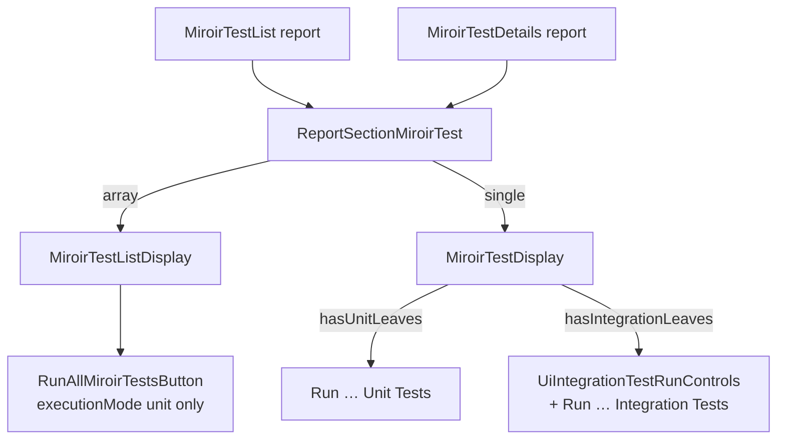

# UI unit vs integ run context — TDD plan (Feature #197)

**Parent:** [plan.md](./plan.md) · [phase-b-ui-launcher-plan.md](./phase-b-ui-launcher-plan.md)  
**Status:** Proposed (post-B7)  
**Problem:** List and details Miroir Test reports expose different run affordances; list “Run All” is unit-only and unlabeled as such, while details already split unit/integ by leaf capabilities. Transformer suites (mixed) need a clear way to launch either mode; runner suites must keep integ-only launch.

---

## 1. Observed UI contexts (from reports + code)

Two report assets drive the Miroir Tests UI via `miroirTestReportSection` → `ReportSectionMiroirTest`:

| Report | Asset UUID | Fetched data | React surface |
|--------|------------|--------------|---------------|
| **MiroirTestList** | `58dc6706-0473-468c-90ee-61b54b157140` | Array of all `MiroirTest` instances | `MiroirTestListDisplay` |
| **MiroirTestDetails** | `0ad63f27-c4df-4fb8-9a79-cb257c7a2958` | Single instance by PK | `MiroirTestDisplay` |

Wiring: [`ReportSectionViewWithEditor.tsx`](../../../packages/miroir-standalone-app/src/miroir-fwk/4_view/components/Reports/ReportSectionViewWithEditor.tsx) → [`ReportSectionMiroirTest.tsx`](../../../packages/miroir-standalone-app/src/miroir-fwk/4_view/components/Reports/ReportSectionMiroirTest.tsx).



### What users see today

| Screen | Badge / controls | Button(s) |
|--------|------------------|-----------|
| Details `runner_library` | `INTEGRATION` + profile / ephemeral\|pinned | Orange **Run … Integration Tests** |
| Details `EntityPrimaryKey` (unit transformer suite) | `UNIT` | Purple **Run … Unit Tests** |
| Details `miroirCoreTransformers` (mixed, after B7) | `MIXED` + integ controls when launchable | **Both** unit + integ (D6) |
| List (any deployment) | Count only | Single purple **Run All Miroir Tests** (= **unit** for every suite) |

### Root mismatch

1. **List action is mode-blind:** `RunAllMiroirTestsButton` hardcodes `{ executionMode: "unit" }` and the label does not say “Unit”.
2. **Details already encodes capability:** `classifyMiroirTestSuiteExecutionCapabilities` + split buttons (locked **D6**). Runner = integ-only; pure unit suites = unit-only; mixed transformer = both.
3. **Mental model clash:** Users learn “Run All Miroir Tests” on the list, then on details for the same entity family see either unit-only, integ-only, or both — without list ever offering integ.
4. **Deployment scope:** Library deployment list may show only `runner_library`; Miroir deployment list shows ~35 suites. Same chrome, different contents — list integ must aggregate *whatever is in the fetched list*, not assume one kind.

---

## 2. Goals / non-goals

### Goals

- **Details:** Keep capability-driven split buttons (unit / integ / both). Retain runner integ. Ensure mixed transformer suites clearly expose both modes (B7 registry already enables integ).
- **List:** Make run mode explicit; offer unit batch and (when applicable) integ batch without burying suite-specific integ behind details-only.
- **Same launcher** for integ from list or details (`runUiIntegrationTestSuite` + mutex + profile / run-target prefs).
- **TDD** slices with Red → Green → Verify; no Vitest subprocess in the browser.

### Non-goals

- Per-row integ buttons on the object list table (edit/view/delete stay; suite launch stays in the report section chrome).
- Changing report JSON schemas / new report section types (reuse `miroirTestReportSection`).
- `hostMode: "embedded"` (B8).
- Making every unit-only suite show an integ button.
- Running SQL-emulated transformer integ inside webApp (IndexedDB + bundled admin only; same as B7).

---

## 3. Locked decisions (this plan)

| # | Decision | Justification |
|---|----------|---------------|
| **U1** | **Details remain the primary suite cockpit** — badge + optional unit button + optional integ controls/button driven by leaf capabilities | Already matches D6; context is one suite; user knows scope. Do not regress runner_library integ-only chrome. |
| **U2** | **List gains an explicit dual batch bar** when the fetched set warrants it: **Run All Unit Tests** always (if any unit-capable suite); **Run All Integration Tests** only if ≥1 suite has integ leaves **and** is UI-launchable | Fixes mode-blind “Run All”; mirrors details ergonomics at aggregate level; avoids showing a dead integ button for unit-only lists. |
| **U3** | **Rename** list primary button from “Run All Miroir Tests” → **“Run All Unit Tests”** (or “Run All Unit Tests (N suites)”) | Removes the implication that “all” includes integ. |
| **U4** | **Shared integ prefs on the list** — reuse `UiIntegrationTestRunControls` + preferences when the list exposes integ batch | One profile / ephemeral\|pinned story for list and details; no second preference store. |
| **U5** | **List integ batch = sequential `runUiIntegrationTestSuite` inside one `runExclusive`** | Coordinator rejects overlapping runs (D5); sequential under one lock is correct UX (progress via tracker/inspector). Skip non-launchable suites with a snackbar summary, do not fail the whole batch silently. |
| **U6** | **Filter leaves by mode** — unit batch runs with `executionMode: "unit"`; integ batch uses launcher `executionMode: "integration"` (existing leaf filtering) | Mixed suites must not execute integ leaves under unit, or unit leaves under integ. |
| **U7** | **No integ affordance on unit-only details** (e.g. `EntityPrimaryKey`) | Capability classification already correct; avoid “grey integ” noise. |
| **U8** | **Label details buttons with suite display name + mode** — keep `Run {label} Unit Tests` / `Run {label} Integration Tests` | Screenshot-proven pattern; mode is in the verb, not only the badge. |

### Rejected alternatives

| Alternative | Why rejected |
|-------------|--------------|
| Single “Run” + mode dropdown on details | Hides dual capability; worse for mixed; conflicts with D6 |
| Integ-only on details; list stays unit-all | Leaves the mismatch users already hit |
| Mode toggle that rewrites one button | Easy to mis-click; badge and button disagree |
| Auto-run integ for every suite that has any integ leaf without registry check | Would enable non-registered suites and throw mid-batch |
| Separate “Transformer Tests” vs “Runner Tests” menus | Product already uses one MiroirTest entity + reports; classify-by-leaves is enough |

---

## 4. Target UX

### Details (`MiroirTestDisplay`) — unchanged shape, clarified copy

```
Miroir Test Available   [UNIT | INTEGRATION | MIXED]

[ Run <suite> Unit Tests ]          // if hasUnitLeaves
  Integration run settings …        // if hasIntegrationLeaves
[ Run <suite> Integration Tests ] // if hasIntegrationLeaves && launchable
Inspector summary …
```

| Suite kind | Unit btn | Integ btn |
|------------|----------|-----------|
| Runner (`runner_library`) | no | yes |
| Unit-only transformer | yes | no |
| Mixed transformer (`miroirCoreTransformers`) | yes | yes (indexedDb / launchable profile) |

### List (`MiroirTestListDisplay`) — new shape

```
Miroir Tests Available (N)   [unit: nᵤ · integ-capable: nᵢ]

[ Run All Unit Tests ]                    // if nᵤ > 0
  Integration run settings …              // if nᵢ_launchable > 0
[ Run All Integration Tests ]             // if nᵢ_launchable > 0

Results accordion (unit and/or integ) …
```

Aggregate helper (new): `classifyMiroirTestListExecutionCapabilities(instances[])` → counts + launchable integ suite keys.

---

## 5. Code seams

| Area | Path | Change |
|------|------|--------|
| List chrome | `MiroirTestListDisplay.tsx` | Dual buttons + optional `UiIntegrationTestRunControls`; rename unit label |
| Run-all | `RunAllMiroirTestsButton.tsx` | Add `runMode: "unit" \| "integration"`; unit path unchanged; integ path batches launcher calls |
| Caps | `inferIntegrationSessionKind.ts` or `miroirTestSuiteUiExecution.ts` | List aggregate classifier |
| Details | `MiroirTestDisplay.tsx` | Copy/title tweaks only if needed; keep capability gates |
| Prefs | `useUiIntegrationTestRunPreferences` / `UiIntegrationTestRunControls` | Reuse on list |
| Inspector | `UiIntegrationTestRunInspectorSummary` | Show last list-batch result (last suite or aggregated summary — slice choice below) |
| Docs | `docs/reference/testing.md` § Running tests in the UI | List vs details + unit vs integ |

---

## 6. TDD slices

Each slice: **Red → Green → Verify**. Prefer unit/RTL over manual until the final smoke.

**Verify (every slice):** automated tests green **and** IDE/linter clean on touched files (quotes, TS casts, Sonar cognitive complexity, no `any` in new test helpers). Do not mark a slice done while Problems still lists errors on those paths.

### T0 — Document context + link from Phase B ✅ (this file)

- Add this plan under Feature #197.
- Pointer from [phase-b-ui-launcher-plan.md](./phase-b-ui-launcher-plan.md) § B7 / follow-ups.

---

### T1 — List capability aggregate (unit) ✅

**Red**

- `classifyMiroirTestListExecutionCapabilities([runner_library, EntityPrimaryKey, miroirCoreTransformers])` expectations:
  - `hasUnitLeaves` / `hasIntegrationLeaves`
  - `unitSuiteKeys` / `integrationSuiteKeys` / `launchableIntegrationSuiteKeys` (using existing `isUiIntegrationRunnerSuiteSupportedForInstance`)

**Green**

- Pure function in `miroirTestSuiteUiExecution.ts` (`classifyMiroirTestListExecutionCapabilities`).

**Verify** ✅

```bash
cd packages/miroir-standalone-app && npx vitest run tests/helpers/miroirTestSuiteUiExecution.unit.test.ts
```

- Linter clean: `miroirTestSuiteUiExecution.ts`, `miroirTestSuiteUiExecution.unit.test.ts`

---

### T2 — `RunAllMiroirTestsButton` accepts `runMode` (unit) ✅

**Red**

- Default / `runMode: "unit"` → still calls `_runMiroirTestSuite` with `{ executionMode: "unit" }`.
- `runMode: "integration"` → does **not** call unit path; calls `runUiIntegrationTestSuite` once per launchable suite (mock env); respects coordinator.

**Green**

- Implement mode branch; sequential integ under one `getIntegTestRunCoordinator().runExclusive` (nested launcher uses passthrough coordinator).
- Label prop remains caller-controlled (`Run All Unit Tests` vs `Run All Integration Tests`).

**Verify** ✅

```bash
cd packages/miroir-standalone-app && npx vitest run tests/4_view/RunAllMiroirTestsButton.unit.test.tsx
```

- Linter clean: `RunAllMiroirTestsButton.tsx`, `RunAllMiroirTestsButton.unit.test.tsx`

---

### T3 — List display dual bar (unit / RTL light) ✅

**Red**

- Render `MiroirTestListDisplay` with mixed fixture instances.
- Assert **Run All Unit Tests** visible.
- Assert **Run All Integration Tests** + integ controls visible when launchable integ suites present.
- Assert integ button **absent** when list is unit-only (e.g. only `EntityPrimaryKey`).
- Assert integ button **absent** (or disabled with title) when integ suites exist but none are registry-launchable.

**Green**

- Wire aggregate classifier + prefs + buttons in `MiroirTestListDisplay`.

**Verify** ✅

```bash
cd packages/miroir-standalone-app && npx vitest run tests/4_view/MiroirTestListDisplay.unit.test.tsx
```

- Linter clean on touched list/display files

---

### T4 — Details mixed suite non-regression (unit / existing RTL) ✅

**Red / Green**

- Extend or reuse `miroirTestSuiteUiExecution` + `MiroirTestDisplay` tests:
  - `runner_library` → integ only
  - unit-only → unit only
  - `miroirCoreTransformers` → both; integ disabled when profile not launchable

**Verify** ✅

```bash
cd packages/miroir-standalone-app && npx vitest run \
  tests/helpers/miroirTestSuiteUiExecution.unit.test.ts \
  tests/4_view/MiroirTestDisplay.unit.test.tsx
```

- B6-d1 `MiroirTestDisplayIntegrationLaunch.integ` still passes its Return Book assertion (pre-existing unhandled `useReportPageContext` noise after teardown may still fail the process exit code).
- Linter clean on touched details/test files

---

### T5 — List integ batch Node proof (integ)

**Red**

- New or extended test: list / button with Node launcher env, list containing `miroirCoreTransformers` (+ optional `runner_library`), click **Run All Integration Tests** with filter limited to one leaf per suite (or mock launcher).
- Assert inspector / result map records transformer `sessionKind` and success for the filtered leaf.

**Green**

- Batch path production-ready; snackbar lists skipped non-launchable keys.

**Verify**

```bash
npm run testByFile -w miroir-standalone-app -- \
  --profile emulatedServer-sql MiroirTestListIntegrationLaunch
```

- Linter clean on touched list-integ proof files

---

### T6 — Docs + manual checklist

**Docs** (`docs/reference/testing.md` § Running tests in the UI):

- Table: **List vs Details** × **Unit vs Integ**.
- Explicit: list “Run All Unit Tests” ≠ integ; details/list integ need launchable profile (`emulatedServer-indexedDb` in webApp).

**Manual webApp**

1. Miroir deployment → Miroir Tests **list** → **Run All Unit Tests** completes; label not ambiguous.
2. Same list → profile indexedDb → **Run All Integration Tests** runs launchable suites only (expect `miroirCoreTransformers` and/or `runner_library` if present).
3. Details `miroirCoreTransformers` → both buttons; unit then integ.
4. Details `runner_library` → integ only (regression).
5. Details unit-only suite → unit only (regression).

**Verify:** docs edited; no leftover lint on code touched in T1–T5.

---

## 7. Implementation order

```text
T0 (this plan) → T1 aggregate → T2 RunAll runMode → T3 list chrome
  → T4 details non-reg → T5 list integ proof → T6 docs/manual
```

Do **not** start T5 until T2/T3 green (batch path must exist).

---

## 8. Inspector / results UX (T2–T3 choice)

**Preferred (v1):** After list integ batch, `setLastUiIntegrationTestRunResult` to the **last** suite result; accordion on the list shows per-suite reports from the batch map (extend `MiroirTestSuiteResultsMap` for integ the same way unit already does).

**Deferred:** Full multi-suite inspector strip — only if manual testing shows last-suite-only is confusing.

---

## 9. Success criteria

- [ ] List unit button label says **Unit**.
- [ ] List shows **Run All Integration Tests** iff the fetched list has ≥1 UI-launchable integ suite.
- [ ] List integ batch uses the same launcher, prefs, and mutex as details.
- [ ] Details still: runner integ-only; unit-only unit-only; mixed both.
- [ ] Mixed suite unit run does not execute integ-only leaves; integ run does not claim unit-only leaves as failures from wrong mode.
- [ ] Docs describe list vs details and transformer vs runner launch.
- [ ] T1–T5 automated proofs green; T6 manual checklist signed off.

---

## 10. Risks

| Risk | Mitigation |
|------|------------|
| List integ batch long / heavy | Mutex + snackbar “integ run in progress”; consider filtering to registered suites only; optional confirm dialog if >3 launchable suites |
| Library list has only `runner_library` | Integ button still correct (one suite); unit button hidden if no unit leaves in list |
| Miroir list has many unit suites + one mixed | Unit batch skips integ-only leaves; integ batch skips unit-only suites |
| Double prefs UI on details after navigating from list | Same preference hook — state shared; acceptable |
| RTL pulls heavy graph | Prefer unit tests for T1–T3; keep list integ proof Node-side like B6-d1 |

---

## 11. References

| Doc / code | Role |
|------------|------|
| [phase-b-ui-launcher-plan.md](./phase-b-ui-launcher-plan.md) | D5 mutex, D6 split buttons, B7 transformer launcher |
| `MiroirTestDisplay.tsx` | Details dual buttons |
| `MiroirTestListDisplay.tsx` | List unit-only today |
| `RunAllMiroirTestsButton.tsx` | Hardcoded unit batch |
| `RunMiroirTestSuiteButton.tsx` | Unit vs integ paths |
| `inferIntegrationSessionKind.ts` | Leaf capability classification |
| Report assets `58dc6706-…` / `0ad63f27-…` | List / details report definitions |
