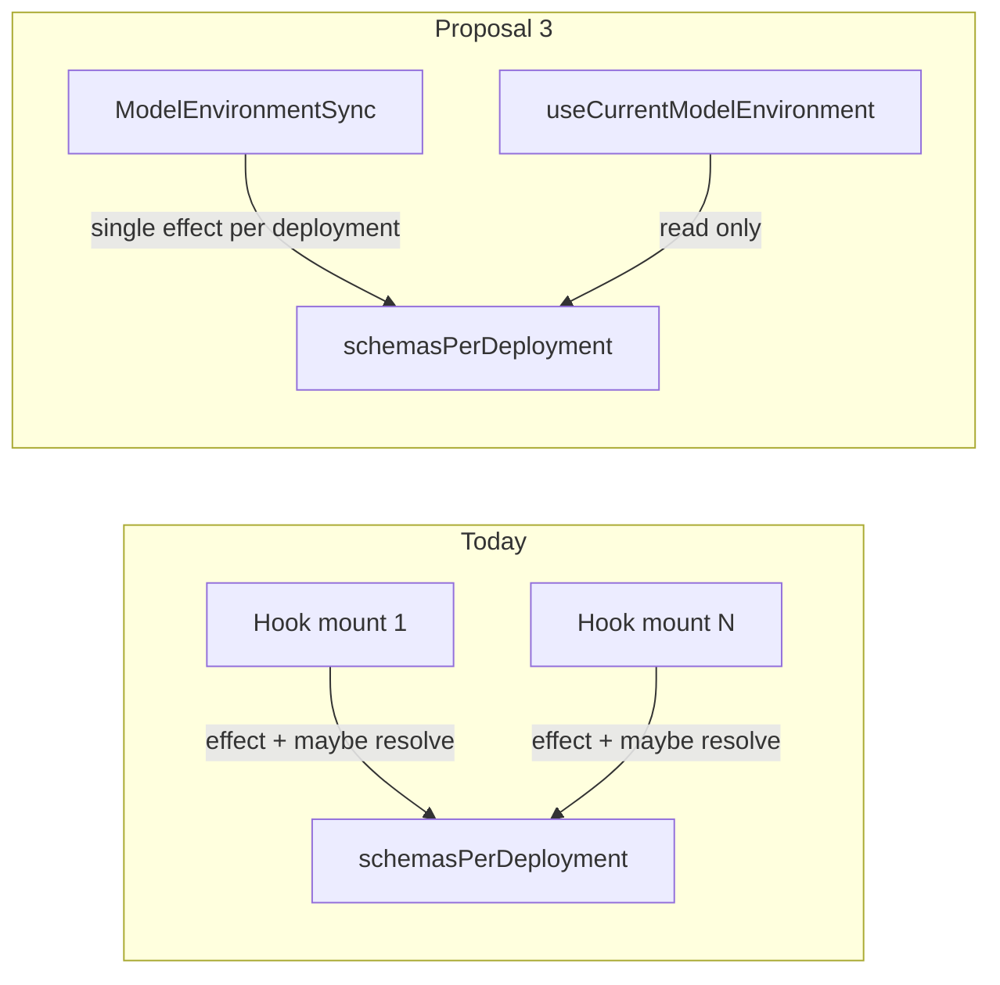

# Proposal 3 — Central ModelEnvironmentSync

## Goal

Move schema resolution ownership out of every `useCurrentModelEnvironment` mount into **one** sync component at the app shell. Descendants only read `schemasPerDeployment` (and assemble the rest of `MiroirModelEnvironment` from cheap selectors).

Acceptance (from [analysis.md](code-helpers/features/199-REFACTOR%20improve%20meta-model%20access%20performance/analysis.md) §5):

- N concurrent `useCurrentModelEnvironment` mounts for the same deployment → **one** `applyDeploymentSchemaRevision` / extended resolve per revision (not N).
- Existing Phase 199 revision policy stays green (data-only → no resolve; app-overlay → one extended; meta → `schemaReloadRequired`).

## Current vs target

Today (`[ReduxHooks.ts](packages/miroir-standalone-app/src/miroir-fwk/4_view/ReduxHooks.ts)` L267–334): each of ~18 production call sites runs `computeSchemaRevision` + `useEffect` → `applyDeploymentSchemaRevision`, and `useMemo` may call `resolveFundamentalSchemaForDeployment(..., "auto")` before the cache is warm.

## Design (locked)

| Decision                                      | Choice                                                                                                                                                                                                                                                                                                                                      |
| --------------------------------------------- | ------------------------------------------------------------------------------------------------------------------------------------------------------------------------------------------------------------------------------------------------------------------------------------------------------------------------------------------- |
| Owner location                                | New `ModelEnvironmentSync` in **miroir-standalone-app**, mounted once from `[RootComponent.tsx](packages/miroir-standalone-app/src/miroir-fwk/4_view/components/Page/RootComponent.tsx)` (after `applicationDeploymentMap` is set on context). Not inside `MiroirContextReactProvider` (keeps Redux/model selectors out of `miroir-react`). |
| Deployments synced                            | **Miroir meta** + **current application** (`context.application` / `currentApplication`). Matches settled “current application only” scope.                                                                                                                                                                                                 |
| Cross-app edge cases                          | Components that request a non-current app (e.g. Library env while on Miroir) go through a context `**ensureSchemaForDeployment`** single-flight API (revision-keyed, shared ref)—not a per-hook effect.                                                                                                                                     |
| Hook API                                      | Keep `useCurrentModelEnvironment(application, map)` signature. Remove its `useEffect` and remove the sync `resolve(..., "auto")` fallback once cache miss is handled by Sync/`ensure`.                                                                                                                                                      |
| Full env in context                           | **Not** in this slice. Still assemble `{ schema, miroirMetaModel, currentModel, endpointsByUuid, deploymentUuid }` in the hook from selectors + context schema. Avoids a second large context object.                                                                                                                                       |
| `useMiroirFundamentalJzodSchemaForDeployment` | Same rule: context schema only; no hot-path `getMiroirFundamentalSchemaForDeployment` fallback.                                                                                                                                                                                                                                             |

## Implementation slices (TDD)

### Phase 7.1 — Single-owner sync (red → green)

**New module:** `packages/miroir-standalone-app/src/miroir-fwk/4_view/ModelEnvironmentSync.tsx`

- Props: `applicationDeploymentMap`, `applicationsToSync: Uuid[]` (Root passes `[selfApplicationMiroir.uuid, currentApplication]` deduped).
- For each app: `useCurrentModel` + `computeSchemaRevision` for meta + app; one effect calling existing `context.applyDeploymentSchemaRevision` (reuse `[schemaReloadPolicy](packages/miroir-react/src/contexts/schemaReloadPolicy.ts)` / provider logic unchanged).

**Context API** (small additions in `[MiroirContextReactProvider.tsx](packages/miroir-react/src/contexts/MiroirContextReactProvider.tsx)`):

- `ensureSchemaForDeployment(input)` — same payload as `applyDeploymentSchemaRevision`, but no-ops if revisions already applied (compare `schemaRevisionsRef`); used by thin hook / tests for non-synced apps.

**Tests first** (extend `[useCurrentModelEnvironment.unit.test.tsx](packages/miroir-standalone-app/tests/4_view/useCurrentModelEnvironment.unit.test.tsx)`):

1. Mount **3** consumers of the same Library app **without** Sync → after refactor, consumers alone must **not** call resolve (or only via ensure once)—assert with spy.
2. Mount `ModelEnvironmentSync` + 3 consumers → **≤1** extended resolve on mount; data-only dispatch → no extra resolve; endpoint add → +1 extended.
3. Meta endpoint change still sets `schemaReloadRequired` (existing Phase 199 case).

Update `TestProviders` to optionally mount Sync (default on for acceptance tests).

### Phase 7.2 — Thin the hook

In `[ReduxHooks.ts](packages/miroir-standalone-app/src/miroir-fwk/4_view/ReduxHooks.ts)`:

- Delete the revision `useEffect` from `useCurrentModelEnvironment`.
- On cache miss: call `ensureSchemaForDeployment` once (not `resolve` inline in `useMemo`).
- Thin `useMiroirFundamentalJzodSchemaForDeployment` the same way.

Production call sites (~18) need **no signature changes**—only Root mounts Sync.

### Phase 7.3 — Wire RootComponent + gate

- Mount `<ModelEnvironmentSync … />` in RootComponent when `applicationDeploymentMap` is available.
- Extend `[tdd-implementation-plan.md](code-helpers/features/199-REFACTOR%20improve%20meta-model%20access%20performance/tdd-implementation-plan.md)` with Phase 7 slices; add `run-step-tests.sh` steps if the gate runner pattern is still used.
- Update [analysis.md](code-helpers/features/199-REFACTOR%20improve%20meta-model%20access%20performance/analysis.md) §8.4: mark Proposal 3 done; diagram shows Sync → context → thin hook.
- Non-regression: existing Phase 199 / Phase 6 describes in the same unit file + `schemaReloadPolicy.unit.test.ts`.

## Out of scope

- Proposal 4 (persisted overlay / progressive hydrate).
- Migrating DomainController / `localCache.currentModelEnvironment` (still deprecated for UI).
- Fixing RunnerView “TODO: WRONG!!” application selection (ensure API covers it; no behavior change required).
- Storing full `MiroirModelEnvironment` in React context / `useSyncExternalStore` (optional follow-up).

## Key files

| File                                                                     | Change                            |
| ------------------------------------------------------------------------ | --------------------------------- |
| `…/ModelEnvironmentSync.tsx`                                             | **New** — single owner effects    |
| `…/Page/RootComponent.tsx`                                               | Mount Sync                        |
| `…/ReduxHooks.ts`                                                        | Thin hooks                        |
| `…/MiroirContextReactProvider.tsx`                                       | `ensureSchemaForDeployment`       |
| `tests/…/useCurrentModelEnvironment.unit.test.tsx`                       | N-mount acceptance + Sync wrapper |
| `code-helpers/features/199-…/analysis.md` + `tdd-implementation-plan.md` | Status / Phase 7                  |

