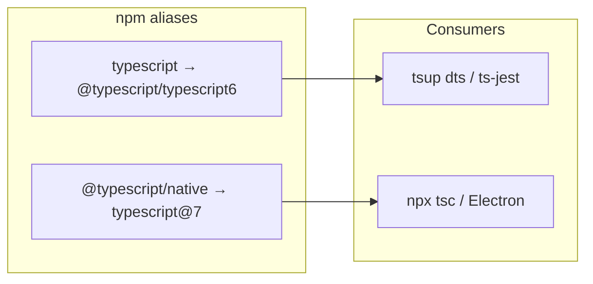

# 202 — Migrate to TypeScript 7

> Dual-install migration from TypeScript 6.0 to TypeScript 7: native `tsc` for typecheck/CLI, `@typescript/typescript6` kept as `typescript` for tsup declaration emit and other Compiler API consumers (until 7.1).

Related: [#202](https://github.com/miroir-framework/miroir/issues/202)

---

## Context (baseline before migration)

- Was on **TypeScript 6.0.2** (`package.json`); packages pinned `^6.0.0`.
- Root `tsconfig.json` used deprecated **`moduleResolution: "node"`** and **`ignoreDeprecations: "6.0"`** (hard errors in TS 7).
- Almost every package tsconfig repeated `ignoreDeprecations` and unused **`baseUrl`**; `packages/miroir-sandbox/tsconfig.json` was the only one with `paths`.
- Builds are mostly **tsup + `dts: true`** (needs the JS Compiler API until 7.1). Vite/ncc/esbuild emit do not need the API. Electron is the main direct **`npx tsc`** consumer.

**Chosen approach:** dual install (Microsoft’s recommended pattern for API-dependent tooling), not a full drop of TS 6.



## Implementation status

| Step | Scope | Status |
|---|---|---|
| **1** | Clear TS 6 deprecations + tsup DTS baseUrl patch | **DONE** (2026-07-19) |
| **2** | Dual-install TypeScript 7 + `@typescript/typescript6` | **DONE** (2026-07-19) |
| **3** | Point Electron / typecheck CLI at native `tsc` | Pending (preload flags cleared early in step 1) |
| **4** | Verify builds / nonreg | Pending |
| **5** | `graphify update .` | Partial — ran after step 1; re-run after later steps |

---

## Step 1 — Clear TS 6 deprecations (required before TS 7) — DONE

### Checklist

- [x] Root `tsconfig.json`: remove `ignoreDeprecations`
- [x] Root `tsconfig.json`: `moduleResolution` `"node"` → `"bundler"`
- [x] Keep `types: ["node", "jest"]`, `strict`, `target`/`module`
- [x] Remove `"ignoreDeprecations": "6.0"` from all package `tsconfig*.json`
- [x] Remove unused `"baseUrl"` from package tsconfigs (incl. standalone-app `./src/`)
- [x] Sandbox: drop `baseUrl`; rewrite paths to `"./../miroir-standalone-app/src/*"`
- [x] Leave `NodeNext` overrides on `miroir-server`, `miroir-cli`, `miroir-mcp`, `miroir-ai`
- [x] Fix legacy `tsbuild` scripts in `miroir-localcache` / `miroir-localcache-redux` (`--baseUrl` / `--moduleResolution node` → `bundler`)
- [x] Electron `build-preload`: drop `--ignoreDeprecations` / classic `moduleResolution` (done early; rest of step 3 still pending)
- [x] tsup DTS `baseUrl` injection workaround: `scripts/patch-tsup-baseurl.py` + root `postinstall` ([egoist/tsup#1388](https://github.com/egoist/tsup/issues/1388))
- [x] `"./src/*"` exports on `miroir-core` and `miroir-store-postgres` for bundler resolution
- [x] Rewrite `miroir-react` theme imports to package root; add `.js` on remaining deep `miroir-*/src/...` imports
- [x] Validate builds: `miroir-core`, `miroir-react` succeed without deprecation suppressions

### Notes / caveats

- Full-repo `tsc --noEmit` still has pre-existing type/rootDir noise (not introduced by step 1).
- tsup remains unmaintained; patch is required until upstream ships a fix or we switch DTS pipeline.

---

## Step 2 — Dual-install TypeScript 7 at the workspace root — DONE

### Planned (kept for reference)

In root `package.json`:

```json
"devDependencies": {
  "@typescript/native": "npm:typescript@^7.0.2",
  "typescript": "npm:@typescript/typescript6@^6.0.2"
}
```

In every package `package.json` that lists `"typescript": "^6.0.0"`: align to the same dual pattern **or** drop the local pin and rely on the workspace root (prefer aligning root + removing redundant package pins where hoisting already covers them, to avoid version skew).

Then `npm install` and confirm:

- `npx tsc --version` → 7.x (from `@typescript/native`)
- `node -e "console.log(require('typescript').version)"` → 6.x (API for tsup)
- `npx tsc6 --version` → 6.x

### Checklist

- [x] Root: add `@typescript/native` → `typescript@^7`
- [x] Root: alias `typescript` → `@typescript/typescript6@^6`
- [x] Remove redundant package-level `"typescript": "^6.0.0"` pins (23 packages; hoist to root)
- [x] `npm install` (force-reinstall alias once so `tsc6` + `@typescript/old` layout is correct)
- [x] Confirm `tsc` = 7.0.2, `typescript` API = 6.0.3, `tsc6` = 6.0.3
- [x] Smoke: `npm run build -w miroir-react` (tsup DTS via TS6 API) succeeds

### Notes / caveats

- npm installs the real TS6 sources under `node_modules/@typescript/old` when aliasing `@typescript/typescript6` as `typescript`. **Do not delete `@typescript/old`** — the `typescript` / `tsc6` entrypoints require it.
- `ts-jest@29` peers `typescript@>=4.3 <6` (warn only); left as-is for now.
- After a broken partial uninstall, a clean `rm -rf node_modules/typescript node_modules/@typescript/{native,old}` + reinstall of both aliases restored correct `.bin/tsc` → native.
---

## Step 3 — Point explicit CLI typecheck/emit at native `tsc` — PENDING

### Planned

- `packages/miroir-standalone-app-electron/package.json`: keep `npx tsc` (resolves to native once dual-installed); remove any `--ignoreDeprecations` / classic `moduleResolution` flags from `build-main` / `build-preload`
- Optionally add a root script e.g. `"typecheck": "tsc -p tsconfig.json --noEmit"` for CI/manual use (native)

No need to change tsup configs: `dts: true` continues to import `typescript` → 6 API.

### Checklist

- [x] Electron `build-preload` flags cleaned (done in step 1)
- [ ] Confirm Electron `build-main` / `build-preload` use native `tsc` after dual-install
- [ ] Optional root `"typecheck"` script

---

## Step 4 — Verify — PENDING

### Planned

1. Clean stale incremental artifacts if present (`**/*.tsbuildinfo`)
2. Build a representative slice: `miroir-core`, `miroir-react`, `miroir-store-postgres` (tsup+dts), `miroir-server` (ncc), `miroir-standalone-app` (Vite), Electron `build-main`/`build-preload`
3. Run unit nonreg if practical: `npm run nonreg:unit`
4. Fix any new hard errors from removed options / `moduleResolution` changes

### Checklist

- [ ] Clean `*.tsbuildinfo`
- [ ] Build representative packages
- [ ] `nonreg:unit` (if practical)
- [ ] Triage/fix any new TS7 / resolution errors

---

## Step 5 — Graphify — PARTIAL

### Planned

After code/config changes: `graphify update .`

### Checklist

- [x] Ran after step 1
- [ ] Re-run after steps 2–4 complete

---

## Out of scope

- Waiting for TypeScript 7.1 API and dropping `@typescript/typescript6`
- Re-enabling orphaned ESLint / `@typescript-eslint` in standalone-app
- Perf tuning (`--checkers` / `--builders`) unless CI shows need
- Vue/Svelte-style embedded LS plugins (not used here)
