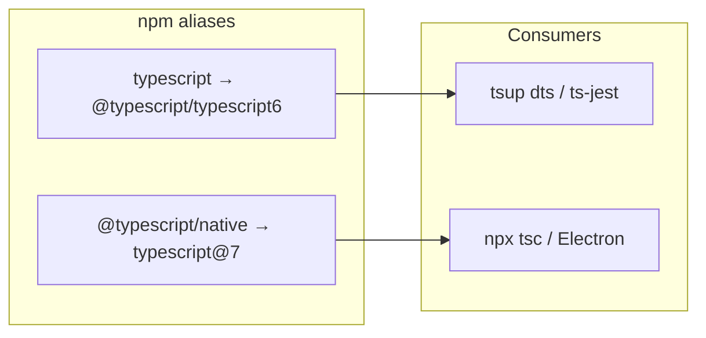

# 202 — Migrate to TypeScript 7

> Dual-install migration from TypeScript 6.0 to TypeScript 7: native `tsc` for typecheck/CLI, `@typescript/typescript6` kept as `typescript` for tsup declaration emit and other Compiler API consumers (until 7.1).

Related: [#202](https://github.com/miroir-framework/miroir/issues/202)

---

## Context

- Already on **TypeScript 6.0.2** (`package.json`); packages pin `^6.0.0`.
- Root `tsconfig.json` still uses deprecated **`moduleResolution: "node"`** and **`ignoreDeprecations: "6.0"`** (hard errors in TS 7).
- Almost every package tsconfig repeats `ignoreDeprecations` and unused **`baseUrl`**; `packages/miroir-sandbox/tsconfig.json` is the only one with `paths`.
- Builds are mostly **tsup + `dts: true`** (needs the JS Compiler API until 7.1). Vite/ncc/esbuild emit do not need the API. Electron is the main direct **`npx tsc`** consumer.

**Chosen approach:** dual install (Microsoft’s recommended pattern for API-dependent tooling), not a full drop of TS 6.



## Implementation status

| Step | Scope | Status |
|---|---|---|
| **1** | Clear TS 6 deprecations (`ignoreDeprecations`, `baseUrl`, classic `moduleResolution`) + tsup DTS baseUrl patch | **Done** |
| **2** | Dual-install TypeScript 7 + `@typescript/typescript6` | Pending |
| **3** | Point Electron / typecheck CLI at native `tsc` | Pending (preload flags cleared early in step 1) |
| **4** | Verify builds / nonreg | Pending |
| **5** | `graphify update .` | Pending |

### Step 1 notes

- Root `moduleResolution` is now `"bundler"`; Node packages keep `NodeNext`.
- **tsup 8.5.1** injects `baseUrl: "."` into DTS builds ([egoist/tsup#1388](https://github.com/egoist/tsup/issues/1388)). Cleared via `scripts/patch-tsup-baseurl.py` (root `postinstall`). Without this, removing `ignoreDeprecations` breaks every `dts: true` package.
- Deep `miroir-*/src/...` imports fail under `bundler` without `exports` / `.js` extensions. Added `"./src/*"` export on `miroir-core` and `miroir-store-postgres`; rewrote `miroir-react` theme imports to the package root (`miroir-core`); added `.js` extensions on remaining deep imports.
- Verified: `npm run build -w miroir-core` and `npm run build -w miroir-react` succeed. Full-repo `tsc --noEmit` still has pre-existing type/rootDir noise.

## Step 1 — Clear TS 6 deprecations (required before TS 7)

Update root `tsconfig.json`:

- Remove `ignoreDeprecations`
- Change `moduleResolution` from `"node"` → `"bundler"` (default for Vite/tsup packages; Node packages already override to `NodeNext`)
- Keep existing `types: ["node", "jest"]`, `strict`, `target`/`module` as-is

Across all package `tsconfig*.json` (~20 files):

- Remove every `"ignoreDeprecations": "6.0"`
- Remove unused `"baseUrl": "./"` (and standalone-app’s `"baseUrl": "./src/"`)
- For sandbox only: drop `baseUrl` and rewrite paths to project-root-relative form, e.g. `"@miroir-app/*": ["./../miroir-standalone-app/src/*"]`
- Leave existing `NodeNext` overrides on `miroir-server`, `miroir-cli`, `miroir-mcp`, `miroir-ai`

Also fix legacy `tsbuild` scripts in `packages/miroir-localcache/package.json` and `packages/miroir-localcache-redux/package.json` that still pass `--baseUrl` / `--moduleResolution node` (or remove those dead scripts if unused).

Validate still on TS 6: `npx tsc --noEmit` / package builds must pass with **zero** deprecation suppressions.

## Step 2 — Dual-install TypeScript 7 at the workspace root

In root `package.json`:

```json
"devDependencies": {
  "@typescript/native": "npm:typescript@^7.0.2",
  "typescript": "npm:@typescript/typescript6@^6.0.2"
}
```

In every package `package.json` that lists `"typescript": "^6.0.0"`: align to the same dual pattern **or** drop the local pin and rely on the workspace root (prefer aligning root + removing redundant package pins where hoisting already covers them, to avoid version skew).

Then `npm install` and confirm:

- `npx tsc --version` → 7.x (from `@typescript/native`)
- `node -e "console.log(require('typescript').version)"` → 6.x (API for tsup)
- `npx tsc6 --version` → 6.x

## Step 3 — Point explicit CLI typecheck/emit at native `tsc`

- `packages/miroir-standalone-app-electron/package.json`: keep `npx tsc` (resolves to native once dual-installed); remove any `--ignoreDeprecations` / classic `moduleResolution` flags from `build-main` / `build-preload`
- Optionally add a root script e.g. `"typecheck": "tsc -p tsconfig.json --noEmit"` for CI/manual use (native)

No need to change tsup configs: `dts: true` continues to import `typescript` → 6 API.

## Step 4 — Verify

1. Clean stale incremental artifacts if present (`**/*.tsbuildinfo`)
2. Build a representative slice: `miroir-core`, `miroir-react`, `miroir-store-postgres` (tsup+dts), `miroir-server` (ncc), `miroir-standalone-app` (Vite), Electron `build-main`/`build-preload`
3. Run unit nonreg if practical: `npm run nonreg:unit`
4. Fix any new hard errors from removed options / `moduleResolution` changes (most likely resolution edge cases in packages still on classic settings)

## Step 5 — Graphify

After code/config changes: `graphify update .`

## Out of scope

- Waiting for TypeScript 7.1 API and dropping `@typescript/typescript6`
- Re-enabling orphaned ESLint / `@typescript-eslint` in standalone-app
- Perf tuning (`--checkers` / `--builders`) unless CI shows need
- Vue/Svelte-style embedded LS plugins (not used here)
