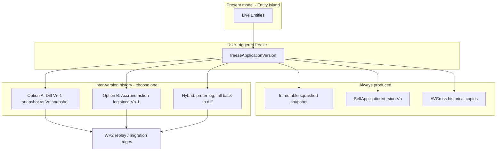
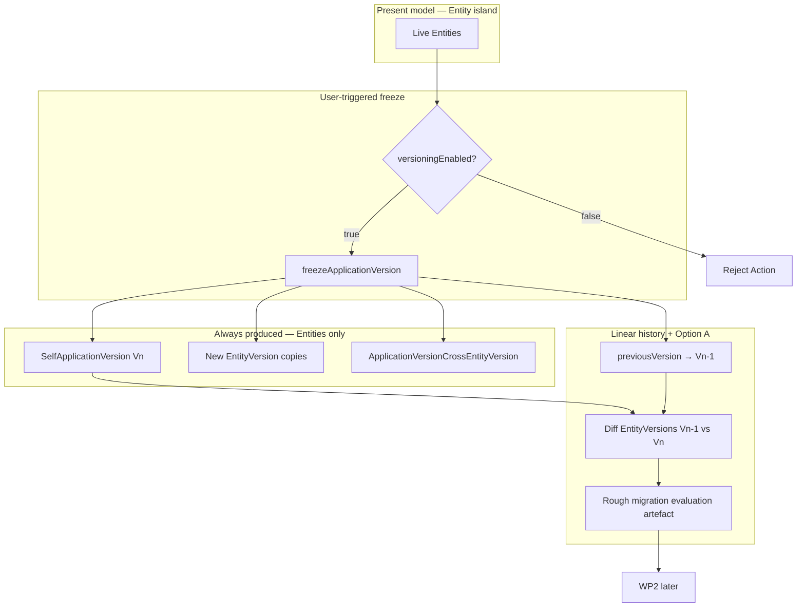

# Issue #216 — Analysis / ADR: Application Versions from Frozen Model State

GitHub issue: https://github.com/miroir-framework/miroir/issues/216

**Document role:** feature analysis **and** architectural decision record for freeze / Application Version design. Settled choices are marked **Accepted**; alternatives remain documented so later revisits (e.g. Option B, full-model snapshot, branching) can reuse the same decision frame.

## Status and sequencing

**Prerequisite #217 is realized** (Entity = authoritative present model; `EntityDefinition` renamed `EntityVersion`; `versioningEnabled`; Cross renamed to `ApplicationVersionCrossEntityVersion`). Executable freeze was **never shipped** in #217 — Phase 10 only closed the *design* gate and deferred implementation here.

This issue sits between WP1 and WP2 of #9:

1. **#217** ✅ — Entity authoritative present model; optional versioning capability; EntityVersion vocabulary
2. **#216 (this issue)** — user-triggered freeze → immutable Application Version (Entities only) + linear inter-version **diff** edges
3. **#9 WP2** — apply / replay migrations between frozen versions (consumes freeze + diff artefacts)
4. **#215** — paired data migrations (later)

Related:

- Parent / motivation: https://github.com/miroir-framework/miroir/issues/9
- #217 analysis: [`../217-/analysis.md`](../217-/analysis.md)
- WP1 (evolution trace): [`../9-FEATURE-create-migrations-for-model-and-data-updates/wp1-analysis-model-evolution-trace.md`](../9-FEATURE-create-migrations-for-model-and-data-updates/wp1-analysis-model-evolution-trace.md)
- WP2 (replayable migrations): [`../9-FEATURE-create-migrations-for-model-and-data-updates/wp2-analysis-application-version-migrations.md`](../9-FEATURE-create-migrations-for-model-and-data-updates/wp2-analysis-application-version-migrations.md)
- Stub at old path: [`../9-FEATURE-create-migrations-for-model-and-data-updates/wp-intermediate-analysis-current-version-and-freeze.md`](../9-FEATURE-create-migrations-for-model-and-data-updates/wp-intermediate-analysis-current-version-and-freeze.md)

**Document history:** moved from the WP intermediate stub and revised after #217. Further revised after #217 realization (2026-07): Option A (diff) chosen as baseline; Entities-only freeze scope; linear history; Phase 10 vs “full #216” split dissolved — #216 owns all freeze work. ADR sections retained so rejected / deferred alternatives stay discoverable.

### Broader product frame: release management

Freeze is the first concrete step of a longer **release management** path: operators deliberately publish a named, immutable model release that later deployments and migrations (#9 WP2, #215) can target. #216 does **not** deliver a full release product (channels, staged rollout, rollback UI).

---

## 0. ADR summary — decisions at a glance

| ID | Decision | Status | Choice for #216 |
|---|---|---|---|
| D1 | When / how is a new Application Version created? | **Accepted** | Explicit user-triggered freeze Action |
| D2 | How is inter-version migration content obtained? | **Accepted** (baseline) | **Option A — Diff** of consecutive frozen snapshots; Option B / hybrid deferred |
| D3 | Role of a `current` Application Version tip | **Accepted** | No `current` tip as present-model authority (or required structure) |
| D4 | Snapshot content scope | **Accepted** (v1) | **Entities only**; other model elements later |
| D5 | History topology | **Accepted** | **Linear** `previousVersion` chain |
| D6 | Relationship to `commit` | **Accepted** | Freeze ≠ commit; quarantine placeholder SAV-on-commit |

Drivers common to all decisions: #217 Entity island; optional `versioningEnabled`; WP2 needs migration *nodes* (squashed snapshots) and eventually *edges*; prefer lower continuous instrumentation cost for the first release-management primitive.

Full options, consequences, and rejection rationale: **§ADR** below. Implementation target for the accepted path: **§1** onward.

---

## ADR — Considered options and decisions

### ADR context

After #217, live model interpretation no longer needs Application Versions. Versioning is optional and external. WP2 still needs:

1. Immutable, deployable **squashed** model states (version *nodes*).
2. A defined source of **edges** explaining *Vn → Vn+1* (exact Action replay *or* derived migration evaluation).

Pre-#217 designs assumed an always-present `current` tip indexing live EntityDefinitions. That premise is obsolete; the options below are the replacements that were weighed.

### D1 — When / by what means is a new Application Version created?

**Status:** Accepted — user-triggered freeze.

| Option | Mechanism | Pros | Cons |
|---|---|---|---|
| **D1-a. User-triggered freeze** ★ | Explicit Action (e.g. `freezeApplicationVersion`) with label / context | Clear release intent; snapshot at a known moment; no coupling to every commit; fits “publish a release” product frame | Operator must remember to freeze; versions may lag live edits |
| **D1-b. Automatic on every `commit`** | Commit creates / advances Application Version | Always-up-to-date version chain; no extra UX | High churn; conflates transaction commit with release; today’s placeholder SAV path is already broken/incomplete; hard to label meaningfully |
| **D1-c. Automatic on deploy / schedule** | External trigger freezes on deploy pipeline or timer | Aligns versions with deployments | Needs deploy integration; still need snapshot fidelity; out of platform baseline |

**Decision:** **D1-a**. Automatic triggers (D1-b/c) remain possible *later* once explicit freeze works; they must not be the first mechanism.

**Consequences:** Platform must materialize a consistent snapshot **at freeze time** regardless of how inter-version history is obtained (D2). Unversioned apps reject the Action. Duplicate version labels fail explicitly.

---

### D2 — How is inter-version history / migration evaluation determined?

**Status:** Accepted baseline — **Option A (Diff)**. Option B and hybrid remain valid future upgrades.

At freeze time two products are conceptually separable:

| Product | Role |
|---|---|
| **Squashed model snapshot** | Immutable copy of present model configuration at freeze (Entity → historical EntityVersion + Cross). Deployable “what the model was.” **Common to all options.** |
| **Inter-version history / migration evaluation** | Ordered information that explains *Vn−1 → Vn* (or can be derived into that). **This is the fork.** |



#### Option A — Snapshot + diff ★ Accepted for #216

**Mechanism**

1. At freeze: deep-copy present Entity definition-bearing fields into new immutable EntityVersion instances; create `SelfApplicationVersion`; create `ApplicationVersionCrossEntityVersion` rows pointing at those **historical** copies.
2. Inter-version history: **compute a structural / semantic diff** between the previous frozen snapshot and the new snapshot; derive (or store) candidate Actions / migration edges that would transform *Vn−1* into *Vn*.

**Strengths**

- Freeze is self-contained: no continuous instrumentation between freezes.
- Works even if intermediate Actions were lost, edited outside the platform, or applied via bulk import.
- Snapshot equality is easy to test (`project(Entity at freeze) == historical copy`).
- Aligns cleanly with #217: live Entity island is the only present-model source; history is reconstructed when needed.
- Lower operational impact for the first release-management primitive.

**Weaknesses**

- Diff → Action synthesis is hard: attribute renames, drops/creates, schema reshapes, and non-invertible edits may not map uniquely to ModelActions.
- Diff quality may be insufficient for faithful WP2 replay without heuristics or human confirmation.
- Loses intent / original Action parameters (only the net effect remains).

**Fit when**

- Freezes are infrequent.
- WP2 can tolerate derived migrations or human-reviewed migration edges.
- Operational simplicity between freezes matters more than perfect Action fidelity.

#### Option B — Snapshot + accrued action log (deferred)

**Mechanism**

1. Between freezes: the platform **appends** executed model Actions (resolved payloads) to an application-scoped log (likely built on / extending WP1 `ApplicationEvolutionTraceEvent`, which today lacks replayable Action payloads).
2. At freeze: produce the same squashed snapshot as Option A; **attach or slice** the action log from the previous freeze (or from app creation) to this version as the *Vn−1 → Vn* tape.

**Strengths**

- Highest fidelity for WP2: replay uses the Actions that actually ran.
- Preserves parameters, order, and intent that a structural diff cannot recover.
- Natural extension of WP1 once events store resolved Action payloads.

**Weaknesses**

- Requires continuous, correct accrual: every model path that mutates the live model must append; gaps corrupt history.
- Bulk edits, fixture loads, and dual-write-era inconsistencies need explicit log policy.
- Storage growth; compaction / squashed baselines (already in WP1) become more important.
- A “working tip” structure (see D3) may be needed only to hold the open log segment — implementation convenience, not present-model authority.

**Fit when**

- Faithful Action replay is a hard WP2 requirement.
- The platform already owns all model mutations (no silent external edits).
- Team accepts instrumentation cost between freezes.

#### Hybrid (possible later, not a third equal baseline)

- Prefer action log when continuous; fall back to diff to heal gaps; or store both (log for replay, diff for audit).
- Defer until Option A is shipping and WP2 fidelity requirements are clearer.

#### Decision matrix

| Criterion | Option A — Diff | Option B — Action log | Hybrid |
|---|---|---|---|
| Faithful WP2 Action replay | Weak / derived | Strong | Strong when log complete |
| Continuity requirements between freezes | Low | High | Medium |
| Handles out-of-band model edits | Better | Needs policy | Diff heals gaps |
| Implementation complexity at freeze | Diff engine | Log slice + payload completeness | Both |
| Implementation complexity continuously | None | Every model mutation path | Every path + gap detection |
| Need for working tip / `current` | Low | Medium (as log anchor only) | Medium |
| Testability of freeze snapshot | High (projection equality) | High (same) + log completeness | Highest cost |
| Dependency on extending WP1 events | Optional | Required (replayable payloads) | Required for log path |

**Decision:** **Option A** for #216. Rationale: deliver freeze value sooner with less continuous risk; accept rough migration evaluation as the edge source WP2 can refine. Option B remains the upgrade path when exact replay becomes mandatory.

**Consequences:** #216 must ship Entity-set diff artefacts; must **not** block on WP1 payload extension. WP2 analysis should treat edges as *derived* until/unless Option B is adopted.

---

### D3 — Role of a `current` Application Version (or working tip)

**Status:** Accepted — no required `current` tip.

Previous #216 design **required** a live tip named `current` that indexed the present model via Cross rows. That conflicts with #217:

- Present model authority is the **Entity island**, not any Application Version.
- Unversioned apps must not need Application Versions at all.
- Even for versioned apps, a `current` tip is **not** required to interpret the live model.

| Purpose | Useful under Option A? | Useful under Option B? |
|---|---|---|
| Present-model authority / schema resolution | **No** — Entity island (#217) | **No** |
| Accrue open action-log segment until next freeze | No | **Maybe** — convenient place to attach “since last freeze” |
| Point `StoreBasedConfiguration.currentApplicationVersion` | **Maybe** — may mean “last freeze” only | Same |
| Squashed “what is now” index for tooling that only knows Application Versions | Low if tooling moves to Entity | Low / transitional |

| Option | Description | Verdict |
|---|---|---|
| **D3-a. Always-present `current` as present-model index** | Cross rows define live schema | **Rejected** — conflicts with #217 |
| **D3-b. No tip structure** ★ | Freeze reads Entities; chain via `previousVersion` only | **Accepted** for Option A baseline |
| **D3-c. Working tip / open-log anchor (not named as live authority)** | Durable cursor for Option B log segment; naming must not imply present-model tip (e.g. `lastFreezeUuid` / open log cursor) | Deferred unless/until Option B |

**Decision:** **D3-b**. Do not invent mandatory `current` Application Versions.

---

### D4 — Snapshot content scope

**Status:** Accepted for #216 v1 — Entities only.

| Option | Scope | Pros | Cons |
|---|---|---|---|
| **D4-a. Entities only** ★ | Live Entities → EntityVersions + Cross | Smallest vertical slice; unblocks version nodes for schema evolution; matches current WP2 Entity-centric migration stories | Incomplete “full app config” release; Reports/Queries/… drift unmarked |
| **D4-b. Full model** | Entities + Reports, Queries, Menus, Endpoints, Transformers, … | True configuration release | Large blast radius; many Cross-like mappings or a general “model element version” story; delays freeze |
| **D4-c. Configurable include list** | Freeze parameter selects element kinds | Flexible | Premature API complexity before Entity freeze works |

**Decision:** **D4-a**. Extend toward D4-b only after Entity freeze + diff are proven.

---

### D5 — History topology

**Status:** Accepted — linear.

| Option | Topology | Pros | Cons |
|---|---|---|---|
| **D5-a. Linear chain** ★ | Each SAV has at most one `previousVersion` | Simple tip resolution; matches WP1 “ignore branch fork/merge for now”; easy diff against single predecessor | No parallel experiments / merge |
| **D5-b. Branched** | Multiple children / merge commits | Supports experimental lines | Needs branch/merge semantics, multi-parent diff; out of WP2 assumptions |

**Decision:** **D5-a**. Branch fork/merge stays future work; default branch UUID may still be stored on SAV for metamodel compatibility without enabling forks.

---

### D6 — Relationship between `commit` and freeze

**Status:** Accepted — freeze is not commit.

Today `DomainController` commit builds a placeholder `SelfApplicationVersion` with TODO UUIDs and does not reliably persist it or maintain Cross rows.

| Option | Behavior | Verdict |
|---|---|---|
| **D6-a. Promote commit into real freeze** | Every commit snapshots + diffs | Rejected for now (see D1-b) |
| **D6-b. Explicit freeze; quarantine commit placeholders** ★ | Freeze owns versioning; commit stops competing or clearly marked non-version | **Accepted** |
| **D6-c. Commit records evolution only (WP1); freeze publishes versions** | Clean separation of trace vs release | Compatible with D6-b; preferred long-term framing |

**Decision:** **D6-b** (with D6-c as the conceptual framing). Implementation must not leave commit creating competing version semantics.

---

## 1. Sought-after result (accepted path)
For applications with `SelfApplication.versioningEnabled === true`:

1. The user can **freeze** the currently deployed present model into a new **Application Version**.
2. That version holds an **immutable squashed Entity snapshot**: for every live Entity, a new `EntityVersion` instance (new UUID, deep-copied definition-bearing fields) plus `ApplicationVersionCrossEntityVersion` rows.
3. History is a **linear chain** via `SelfApplicationVersion.previousVersion` (first freeze: no previous / bootstrap).
4. At each freeze after the first, the platform **diffs** the previous freeze’s EntityVersions vs the new snapshot and stores a **rough migration evaluation** (derived structural / semantic delta → candidate migration edges) on or beside the new Application Version, for WP2 to refine later.
5. Live present-model reads never go through Application Version mappings.

For applications with versioning **disabled**: no Application Version / freeze / history Actions.

### 1.1 Baseline before first freeze

Between create (`versioningEnabled: true`) and first successful freeze:

- Live model = Entity island only; no Application Version required for ordinary CRUD / reports / schema resolution.
- No mandatory Application Version named `current`.
- First freeze creates *V1*; inter-version diff is empty / bootstrap.
- Legacy fixture rows named `"Initial"` (or commit placeholders) are historical data to migrate or ignore — not the live tip.

---

## 2. What #217 already delivered (available now)

Facts from the realized codebase — reuse these; do not re-implement.

| Capability | Where / status |
|---|---|
| Entity carries full present-model definition (`mlSchema`, `viewAttributes`, `cache`, `idAttribute`, `display`, `icon`, `externalDataSource`, …) | Assets + generated types; Phases 1–11 |
| Live model assembly / Actions / stores / UI use Entity, not historical copies | Phase 11 (+ Phase 12 UI off ED hub) |
| `EntityDefinition` → `EntityVersion` vocabulary (Entity `54b9c72f-…`, exports, Cross rename) | Phase 12 vocab-first (compat aliases retained) |
| `ApplicationVersionCrossEntityVersion` with FK field **`entityVersion`** (schema + Zod + assets) | Phase 12; Zod: `ApplicationVersionCrossEntityVersionSchema` |
| `SelfApplication.versioningEnabled` on canonical apps (`true`) | Phase 1/3 |
| `assertVersioningEnabledImmutable` on LocalCache `updateInstance` (Redux + Zustand) | Phase 5 |
| Projection / compare helpers: `projectEntityPresentModelDefinition`, `compareEntityPresentModelDefinitions`, `entityHasCompletePresentModel` | `entityPresentModel.ts` |
| ED-/EntityVersion-shaped projection from Entity (compat): `presentEntityAsRedundantEntityDefinition` | **Reuse pattern for field copy only** — must **not** reuse live Entity UUID as historical UUID |
| WP1 evolution trace (observational; **no** resolved Action payloads) | Done; useful for audit, not for #216 Option A edges |
| `SelfApplicationVersion` type fields `previousVersion`, `modelStructureMigration`, `modelCUDMigration` | Schema exists; **unused / empty** in freeze path today |
| §11.3 equality contract documented | `EntityVersion at freeze == project(Entity at freeze)` — **tests not implemented** |

---

## 3. Gap analysis: available (#217) vs needed (#216)

### 3.1 Must build in #216

| Gap | Why it matters |
|---|---|
| **Freeze Action / Endpoint** | No `freezeApplicationVersion` (or equivalent) exists. User cannot publish a version. |
| **`assertApplicationVersioningEnabled` gate** | Freeze must reject unversioned apps; LocalCache only locks flag flips, not freeze entry. |
| **Snapshot planner (Entities only)** | Allocate new EntityVersion UUIDs; deep-copy definition-bearing + identity fields from each live Entity; create Cross rows `applicationVersion → entityVersion`. |
| **§11.3 equality + live isolation tests** | Prove snapshot == Entity projection at freeze; mutating live Entity afterward must not mutate historical copies. |
| **Linear `previousVersion` linking** | Resolve tip of chain (last freeze for app+branch); set `previousVersion` on new SAV; first freeze has none / null. |
| **Persist Application Version + EntityVersions + Cross in one freeze transaction** | Today commit builds a placeholder SAV and **does not reliably persist** it; Cross sets are incomplete fixture `"Initial"` rows only. |
| **Entity-only structural / semantic diff** (*Vn−1* ↔ *Vn*) | Produce rough migration evaluation from consecutive EntityVersion sets (create/drop/rename Entity; attribute add/remove/update; mlSchema delta). Store on SAV (`modelStructureMigration` / `modelCUDMigration` or successor artefact). |
| **Decouple / stop treating `commit` as freeze** | Commit’s placeholder SAV + TODO UUIDs must not remain the versioning mechanism; freeze is explicit. |
| **Fixture policy for `"Initial"` / placeholder SAV rows** | Document migrate-or-ignore; first real freeze may treat them as *V0* predecessor or skip and start *V1* fresh (decide in implementation slice). |

### 3.2 Available but insufficient / easy to misuse

| Item | Caveat |
|---|---|
| `presentEntityAsRedundantEntityDefinition` | When no legacy ED exists, synthesizes with **`uuid: entity.uuid`** — wrong for freeze. Freeze must mint **new** EntityVersion UUIDs and deep-copy. |
| `schemaChangeKind` / `computeSchemaRevision` | Fingerprints whole MetaModel revisions for reload policy — **not** an Entity-pair migration diff. Do not pretend it is Option A. |
| WP1 `ApplicationEvolutionTraceEvent` | No resolved Action payloads → cannot drive Option B; optional audit side-channel only for #216. |
| Existing Cross / `"Initial"` SAV rows | Partial; not produced by freeze; must not be treated as complete Entity-island snapshots. |
| Dual-write-era live EntityVersion rows (if any remain for compat) | Freeze snapshots **must not** reuse those UUIDs as “history”. |

### 3.3 Explicitly out of #216 (gaps deferred)

| Deferred | Owner |
|---|---|
| Snapshot of non-Entity model elements (Report, Query, Menu, Endpoint, Transformer, …) | Follow-up after Entity freeze works |
| Option B accrued Action log / WP1 replayable payloads | Later; higher-fidelity WP2 |
| Full WP2 migration apply / deferred planner | #9 WP2 |
| Paired data migrations | #215 |
| Branch fork/merge | Future |
| Full release-management UX (channels, rollout, rollback UI) | Future |
| Automatic freeze on schedule / deploy | Future |

---

## 4. Freeze flow (accepted path — D1-a + D2 Option A + D4-a + D5-a)

Implements the **Accepted** ADR choices. Alternative flows (auto-commit freeze, Option B log slice, full-model snapshot) are described under **§ADR** and are not the #216 implementation target.



### Snapshot equality (#217 §11.3, owned by #216 tests)

```text
definition-bearing projection of each new EntityVersion
==
projectEntityPresentModelDefinition(live Entity) at freeze time
```

plus Entity identity fields needed for a historical copy (`name`, `entityUuid` → live Entity uuid, `conceptLevel`, icon/display/… as carried on Entity). Live Entity UUID stays the stable Entity identity; historical copy gets a **new** EntityVersion UUID referenced only via Cross.

### Diff evaluation (Option A — rough by design)

Compare Entity sets keyed by live `entityUuid`:

| Delta class | Rough evaluation |
|---|---|
| Entity present only in *Vn* | createEntity candidate |
| Entity present only in *Vn−1* | dropEntity candidate |
| Same Entity, `name` changed | renameEntity candidate |
| Same Entity, definition fields / `mlSchema` changed | alterEntityAttribute / schema-update candidate (may be coarse: field-level or whole-mlSchema replace) |

Store the ordered candidate list on the new Application Version (reuse `modelStructureMigration` / `modelCUDMigration` if they fit; otherwise introduce an explicit freeze-diff artefact and document the mapping for WP2).

**Quality bar:** useful as a starting point for human-reviewed or WP2-refined migrations — **not** guaranteed faithful Action replay. Renames vs drop+create ambiguity is acceptable in v1 (document heuristic). See **§ADR D2** for why this bar is intentional versus Option B.

---

## 5. Constraints from #217 (non-negotiable)

1. Freeze copies **Entities** into immutable historical **EntityVersions** (new UUIDs).
2. `ApplicationVersionCrossEntityVersion` maps Application Versions → **historical** EntityVersions only; never used to assemble live present model.
3. Live mutation after freeze must not mutate historical copies.
4. `versioningEnabled` is immutable; freeze/version Actions reject unversioned applications.
5. Any remaining dual-write / compat EntityVersion rows are **not** freeze snapshots.

### 5.1 `assertVersioningEnabledImmutable` ownership

Already enforced on LocalCache SelfApplication `updateInstance`. #216 adds freeze **entry** gates (`versioningEnabled === true`). Re-audit SelfApplication update paths only if a bypass is discovered; do not re-implement the helper.

---

## 6. Acceptance criteria

### 6.1 Freeze primitive (Entities only)

- [ ] Versioned apps can freeze a new Application Version via an explicit user-triggered Action (label + application context; optional description).
- [ ] Unversioned apps reject freeze / version-history Actions.
- [ ] Baseline before first freeze: ordinary model use needs no Application Version; first freeze creates *V1* with empty/bootstrap diff.
- [ ] Freeze snapshots **Entities only** into new EntityVersion instances + Cross rows; equality to Entity present-model projection at freeze time (§11.3).
- [ ] Later live Entity edits do not mutate that snapshot.
- [ ] Cross mappings reference historical EntityVersions only; live schema never resolves through them.
- [ ] History is **linear**: new SAV.`previousVersion` points at the previous freeze (or absent on first freeze); no fork/merge in this issue.
- [ ] `commit` is not the freeze mechanism (placeholder SAV path documented as legacy / cleaned up enough not to create competing version semantics).

### 6.2 Diff-based migration evaluation

- [ ] Each freeze after the first produces a **rough** inter-version diff artefact from EntityVersion sets *Vn−1* vs *Vn* (create / drop / rename / alter candidates).
- [ ] Artefact is persisted with the new Application Version in a shape WP2 can read (existing migration arrays or documented successor).
- [ ] Tests cover: equal snapshots → empty/minimal diff; attribute add/remove; entity add/drop; live-vs-snapshot isolation; versioning gates; linear `previousVersion` chain.

### 6.3 Non-criteria

- Always-present `current` Application Version.
- Application Version as present-model authority.
- Snapshotting Reports / Queries / Menus / Endpoints / etc.
- Option B action-log fidelity / WP1 payload extension.
- Full release-management product; automatic freeze; branch merge.
- Perfect rename detection or byte-identical Action replay.

---

## 7. Out of scope

- Full WP2 migration apply / deferred replay planner (#9 WP2).
- Paired data migrations (#215).
- Application Model Branch fork/merge.
- Non-Entity model element versioning.
- Option B accrued action log.
- Automatic freeze on schedule / on deploy.

---

## 8. Suggested implementation slices

Canonical TDD plan (vertical red→green phases 0–8): [`./tdd-implementation-plan.md`](./tdd-implementation-plan.md).

Summary:

1. **Pure domain — snapshot** — gate + EntityVersion copies + plan builder + §11.3 / isolation tests  
2. **Pure domain — linear tip + diff** — `previousVersion` + Option A Entity-set diff → `modelCUDMigration`  
3. **Wire freeze Action** — `freezeApplicationVersion` on Model Endpoint; persist; reject unversioned  
4. **Commit / fixture hygiene** — quarantine placeholder SAV-on-commit; ignore `"Initial"` for tip  
5. **WP2 handoff** — nodes = frozen SAVs; edges = derived diff (not Action tape)

---

## 9. Open decisions (implementation-level)

Architectural forks D1–D6 are recorded under **§ADR** (Accepted / Rejected / Deferred). Remaining open items are narrower:

1. Version label format (free string vs semver) — default: free string unique per application.
2. Exact persistence shape for diff artefact: reuse `modelStructureMigration` / `modelCUDMigration` vs new field/entity.
3. Fate of existing `"Initial"` / placeholder SAV + partial Cross sets (treat as *V0* vs ignore).
4. Whether freeze is a ModelAction on the shared model endpoint or a dedicated Endpoint Action.
5. Default branch UUID resolution when linking `previousVersion` (single linear branch assumption from WP1).
6. Diff heuristics for rename vs drop+create (v1 may emit drop+create and document the limitation).

### ADR revisit triggers

Re-open the corresponding ADR decision if:

- WP2 requires faithful Action replay → revisit **D2** (Option B or hybrid).
- Release management needs full configuration snapshots → revisit **D4** (full model).
- Product needs parallel experiment lines → revisit **D5** (branching).
- Deploy pipeline should publish versions without a manual step → revisit **D1** (auto freeze) only after D1-a works.
- Option B needs an open-segment anchor → revisit **D3-c** (working tip naming).
