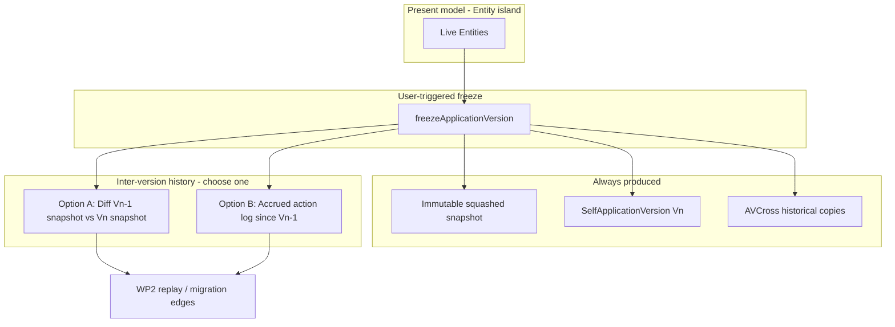

# Issue #216 — Analysis: Application Versions from Frozen Model State

GitHub issue: https://github.com/miroir-framework/miroir/issues/216

## Status and sequencing

Prerequisite: **#217** — Entity is the authoritative present model; Application Version history is optional and external to live model interpretation.

Analysis for #217: [`../217-/analysis.md`](../217-/analysis.md)
(formerly referenced as `pre-wp2-analysis-entity-authoritative-present-model.md`, which never lived under the #9 feature folder).

This issue sits between WP1 and WP2 of #9:

1. **#217** — Entity becomes the authoritative present-model definition
2. **#216 (this issue)** — create Application Versions from frozen model / configuration (and optionally action history)
3. **#9 WP2** — replayable Application Version migrations
4. **#215** — paired model/data migrations

Related:

- Parent / motivation: https://github.com/miroir-framework/miroir/issues/9
- WP1 (evolution trace): [`../9-FEATURE-create-migrations-for-model-and-data-updates/wp1-analysis-model-evolution-trace.md`](../9-FEATURE-create-migrations-for-model-and-data-updates/wp1-analysis-model-evolution-trace.md)
- WP2 (replayable migrations): [`../9-FEATURE-create-migrations-for-model-and-data-updates/wp2-analysis-application-version-migrations.md`](../9-FEATURE-create-migrations-for-model-and-data-updates/wp2-analysis-application-version-migrations.md)
- #215 (paired data migrations — later)

**Document history:** moved from
`9-FEATURE-create-migrations-for-model-and-data-updates/wp-intermediate-analysis-current-version-and-freeze.md`
and fully revised after #217. The previous design (“always-present `current` tip as present-model authority”) is **superseded**.

### Broader product frame: release management

Freeze is the first concrete step of a longer **release management** path: operators deliberately publish a named, immutable model/configuration release that later deployments and migrations (#9 WP2, #215) can target. #216 does not implement a full release product (channels, rollout, rollback UI); it establishes the versioning primitive those releases will rest on.

### Relationship to #217 Phase 10

|#217 Phase 10 (must close for Entity↔version history split)|Full #216 (may continue after Phase 10)|
|---|---|
|Versioned vs unversioned lifecycle (freeze allow/reject)|Inter-version history Option A vs B implemented for WP2 edges|
|Freeze snapshot §11.3 equality + immutability / live isolation|Schema/data alignment polish; fixture migration notes|
|`versioningEnabled` immutability on persisted SelfApplication updates (see §5.1)|Release-oriented labeling / previousVersion policy refinements|
|Versioned-app baseline between create and first freeze (§1.1)|Full release-management UX / automation|

Closing Phase 10 does **not** require choosing or shipping Option A/B history. Closing #216 does.

---

## 1. Sought-after result

For applications with versioning enabled (`SelfApplication.versioningEnabled === true`):

1. The user (or an explicit user-triggered Action) can **create a new Application Version** from the application’s present model / configuration at a chosen moment (“freeze”) — the release-management primitive for publishing a named model state.
2. That Application Version holds an **immutable squashed snapshot** of the model state suitable for later deploy/compare/migrate.
3. (**Full #216, beyond Phase 10**) The Application Version also carries (or can derive) enough **history between versions** that WP2 can eventually replay or reconstruct the progression from *Vn* to *Vn+1*.
4. Live present-model reads never go through Application Version mappings; they use the Entity island (#217).

For applications with versioning **disabled**: no Application Version / freeze / history Actions are required or allowed.

### 1.1 Initial baseline for versioned applications (before first freeze)

Between application creation (with `versioningEnabled: true`) and the first successful freeze:

- Live model is the Entity island only; no Application Version is required for ordinary CRUD, reports, or schema resolution.
- There is **no** mandatory Application Version named `current`.
- Freeze is allowed; it creates the **first** numbered/labeled Application Version from the present Entity projection.
- Inter-version history for that first freeze is empty or “from bootstrap” (no previous freeze to diff or slice against); subsequent freezes produce *Vn−1 → Vn* history per the chosen Option A/B.
- Placeholder / legacy `"Initial"` version rows in fixtures are historical data to migrate or ignore — not the live present-model tip.

Unversioned applications never enter this baseline: freeze and version-history Actions are rejected for the application lifetime.

---

## 2. Two questions that define the design

### Q1 — When / by what means is a new Application Version created?

**Working assumption for #216:** creation is **user-triggered**.

- An explicit Action (name TBD, e.g. `freezeApplicationVersion`) takes application context + version label/number.
- Not automatic on every commit, every model Action, or every deploy (those remain open as *future* triggers if product needs them; they are not the #216 baseline).

Implications:

- The platform must be able to materialize a consistent snapshot **at freeze time**, regardless of how history between freezes is obtained (see Q2).
- Unversioned applications reject the Action.
- Duplicate version labels fail explicitly.

### Q2 — How is the content of a new Application Version / version history determined?

At freeze time, **two products** are needed for WP2 readiness:

| Product | Role |
|---|---|
| **Squashed model snapshot** | Immutable copy of present model configuration at freeze (Entity → historical EntityDefinition / EntityVersion copies + Application Version ↔ copy mappings). Deployable “what the model was.” |
| **Inter-version history** | Ordered information that explains how to go from the previous frozen version to this one (or that can be diffed to produce that). |

The squashed snapshot is **common to both options below**. The open design fork is **how inter-version history is obtained**.

---

## 3. Option comparison: diff vs accrued action log



### Option A — Snapshot + diff

**Mechanism**

1. At freeze: deep-copy present Entity definition-bearing fields into new immutable historical EntityDefinition / EntityVersion instances; create `SelfApplicationVersion`; create `ApplicationVersionCrossEntityDefinition` rows pointing at those **historical** copies (never at live dual-write EDs if those still exist for compatibility).
2. Inter-version history: **compute a structural / semantic diff** between the previous frozen snapshot and the new snapshot; derive (or store) the Action sequence that would transform *Vn−1* into *Vn*.

**Strengths**

- Freeze is self-contained: no continuous instrumentation between freezes.
- Works even if intermediate Actions were lost, edited outside the platform, or applied via bulk import.
- Snapshot equality is easy to test (`project(Entity at freeze) == historical copy`).
- Aligns cleanly with #217: live Entity island is the only present-model source; history is reconstructed when needed.

**Weaknesses**

- Diff → Action synthesis is hard: attribute renames, drops/creates, schema reshapes, and non-invertible edits may not map uniquely to ModelActions.
- Diff quality may be insufficient for faithful WP2 replay without heuristics or human confirmation.
- Loses intent / original Action parameters (only the net effect remains).

**Fit when**

- Freezes are infrequent.
- WP2 can tolerate derived migrations or human-reviewed migration edges.
- Operational simplicity between freezes matters more than perfect Action fidelity.

### Option B — Snapshot + accrued action log

**Mechanism**

1. Between freezes: the platform **appends** executed model Actions (resolved payloads) to an application-scoped log (likely built on / extending WP1 `ApplicationEvolutionTraceEvent`, which today lacks replayable Action payloads).
2. At freeze: produce the same squashed snapshot as Option A; **attach or slice** the action log from the previous freeze (or from app creation) to this version as the *Vn−1 → Vn* tape.

**Strengths**

- Highest fidelity for WP2: replay uses the Actions that actually ran.
- Preserves parameters, order, and intent that a structural diff cannot recover.
- Natural extension of WP1 once events store resolved Action payloads.

**Weaknesses**

- Requires continuous, correct accrual: every model path that mutates the live model must append; gaps corrupt history.
- Bulk edits, fixture loads, and dual-write-era inconsistencies need explicit log policy.
- Storage growth; compaction / squashed baselines (already in WP1) become more important.
- A “working tip” structure (see §4) may be needed only to hold the open log segment — that is an implementation convenience, not present-model authority.

**Fit when**

- Faithful Action replay is a hard WP2 requirement.
- The platform already owns all model mutations (no silent external edits).
- Team accepts instrumentation cost between freezes.

### Hybrid (possible later, not a third equal baseline)

- Prefer action log when continuous; fall back to diff to heal gaps; or store both (log for replay, diff for audit). Defer until A vs B is chosen.

---

## 4. Role of a `current` Application Version (optional, undecided)

Previous #216 design **required** a live tip named `current` that indexed the present model via CrossEntityDefinition rows. That conflicts with #217:

- Present model authority is the **Entity island**, not any Application Version.
- Unversioned apps must not need Application Versions at all.
- Even for versioned apps, a `current` tip is **not** required to interpret the live model.

### Why one might still keep a `current` (or equivalent working tip)

| Purpose | Useful? |
|---|---|
| Present-model authority / schema resolution | **No** — Entity island (#217) |
| Accrue open action-log segment until next freeze (Option B) | **Maybe** — convenient place to attach “since last freeze” |
| Point `StoreBasedConfiguration.currentApplicationVersion` | **Maybe** — config already models a tip pointer; may mean “last freeze” or “working tip” |
| Squashed “what is now” index for tooling that only knows Application Versions | **Low value** if tooling moves to Entity; transitional only |

### Working stance for this analysis

- Do **not** treat “always-present `current`” as an acceptance criterion.
- Treat any working tip as an **implementation aid** for Option B log accrual (or config pointers), not as live model authority.
- Prefer naming that does not imply present-model tip (e.g. open log cursor / lastFreezeUuid) if a tip structure proves necessary.

Decision on whether a working tip exists at all should follow the Option A vs B choice:

- **Option A:** tip is largely unnecessary; freeze reads Entities directly and diffs against previous freeze snapshot.
- **Option B:** some durable “open segment” anchor helps; it need not be a full Application Version named `current`.

---

## 5. Constraints from #217 (non-negotiable)

1. Freeze copies **Entities** into immutable historical copies (today still shaped as EntityDefinition; later renamed EntityVersion in Phase 12 of #217).
2. `ApplicationVersionCrossEntityDefinition` maps Application Versions → **historical** copies only; never used to assemble live present model.
3. Live mutation after freeze must not mutate historical copies (new UUIDs + deep-copied definition fields).
4. `versioningEnabled` is immutable; freeze/version Actions reject unversioned applications.
5. Dual-write live EntityDefinitions (compatibility) are **not** freeze snapshots; freeze must allocate distinct historical instances.

### 5.1 Ownership of `assertVersioningEnabledImmutable`

| Layer | Owner | Status |
|---|---|---|
| Policy helper `assertVersioningEnabledImmutable` | #217 Phase 1 / strategy tests | Done |
| LocalCache `updateInstance` on SelfApplication (Redux + Zustand) | #217 Phase 5 | Done |
| Any additional persistence / DomainController SelfApplication update paths | **#217 Phase 10 test gate** — re-assert or extend if a path still bypasses LocalCache | Remaining check, not a new #216 feature |
| Freeze / version-history Actions reject `versioningEnabled !== true` | #216 / Phase 10 | Required |

#216 acceptance criteria cover the **freeze gate**. Phase 10’s “`assertVersioningEnabledImmutable` on persisted updates” means: confirm no SelfApplication update path flips the flag; extend enforcement only where gaps remain. Do not re-implement the helper inside #216.

§11.3 of #217 (snapshot equality):

```text
historical EntityVersion / EntityDefinition at freeze
==
definition-bearing projection of Entity at freeze time
```

---

## 6. Current platform gaps (facts, not design choices)

- `DomainController` commit builds a `SelfApplicationVersion` with placeholder / TODO fields and does not reliably persist it.
- `ApplicationVersionCrossEntityDefinition` is only partially populated (e.g. Miroir `"Initial"`).
- Schema/data mismatch: EntityDefinition schema field `entity` vs persisted instances’ `entityDefinition`.
- WP1 evolution trace records operation metadata but **not** resolved Action payloads required for Option B / WP2 replay.
- Library / other apps often have placeholder version rows without complete cross sets.

These motivate #216; they do not force the old “always `current`” solution.

---

## 7. Decision matrix (for product / architecture choice)

| Criterion | Option A — Diff | Option B — Action log |
|---|---|---|
| Faithful WP2 Action replay | Weak / derived | Strong |
| Continuity requirements between freezes | Low | High |
| Handles out-of-band model edits | Better | Needs policy |
| Implementation complexity at freeze | Diff engine | Log slice + payload completeness |
| Implementation complexity continuously | None | Every model mutation path |
| Need for working tip / `current` | Low | Medium (as log anchor only) |
| Testability of freeze snapshot | High (projection equality) | High (same) + log completeness tests |
| Dependency on extending WP1 events | Optional | Required (replayable payloads) |

**Recommendation posture (not a final pick):** if WP2’s primary value is **exact Action replay**, prefer Option B and plan WP1 event payload extension as part of or immediately before #216 implementation. If WP2 can start from **snapshot pairs + derived migrations**, Option A delivers freeze value sooner with less continuous risk.

Either option still delivers the #216 core result: **user-triggered freeze → immutable Application Version from present Entity model**.

---

## 8. Proposed acceptance criteria

### 8.1 Phase 10 core (closes #217 Phase 10 test gate)

- [ ] Versioned applications can create a new Application Version via an explicit user-triggered freeze Action (label + application context).
- [ ] Unversioned applications reject freeze / version-history Actions; versioned applications allow them.
- [ ] Versioned-app baseline (§1.1): between create and first freeze, ordinary model use needs no Application Version; first freeze creates *V1* with empty/bootstrap inter-version history.
- [ ] Freeze produces an immutable squashed snapshot equal to the Entity present-model projection at freeze time (§11.3); live Entity mutation afterward does not alter that snapshot.
- [ ] `ApplicationVersionCrossEntityDefinition` (or successor) for a frozen version references historical copies only; present-model assembly never reads those rows for live schema.
- [ ] `assertVersioningEnabledImmutable`: LocalCache enforcement remains green; any remaining SelfApplication persist/update bypass is closed or documented (§5.1).
- [ ] Integration / unit tests cover freeze snapshot equality, versioning gates, live-vs-snapshot isolation, and baseline-before-first-freeze.

### 8.2 Full #216 (beyond Phase 10; needed for WP2-ready releases)

- [ ] Inter-version history strategy is chosen (A or B) and implemented enough that WP2 can attach migration edges between consecutive frozen versions (derived Actions and/or accrued Action tape).
- [ ] Schema alignment for cross records (`entity` vs `entityDefinition`) resolved for the chosen storage shape.
- [ ] History artefact tests per chosen option; #9 WP2 can assume frozen Application Versions exist as migration nodes with squashed indices **and** a defined history edge source.

Non-criteria (explicitly **not** required unless Option B implementation needs them):

- Always-present Application Version named `current` for every application.
- Using any Application Version as present-model authority.
- Full release-management product (channels, staged rollout, rollback UI) — freeze is the primitive; the broader release use case comes later.

---

## 9. Out of scope

- Full WP2 migration apply / deferred replay planner (#9 WP2).
- Paired data migrations (#215).
- Application Model Branch fork/merge.
- Renaming EntityDefinition → EntityVersion (#217 Phase 12).
- Automatic freeze on schedule / on deploy (may be follow-ups after user-triggered freeze works).

---

## 10. Suggested implementation slices

**Phase 10 first (no A/B decision required):**

1. Pure domain: `assertApplicationVersioningEnabled`; `snapshotEntitiesAsHistoricalDefinitions`; freeze plan builder (ApplicationVersion + historical copies + Cross rows); §11.3 equality + live-isolation tests; baseline-before-first-freeze tests.
2. Wire user-triggered freeze Action / Endpoint (versioned apps only); reject unversioned.
3. Audit SelfApplication update paths for `assertVersioningEnabledImmutable` gaps (§5.1).

**Full #216 after Phase 10 (after A vs B decision):**

4. Schema fix for CrossEntityDefinition FK field naming vs persisted data.
5. **If Option A:** diff service previous-freeze ↔ new-freeze → migration edge artefact.
6. **If Option B:** extend evolution trace (or dedicated action log) with resolved Action payloads; open-segment accrual; freeze attaches log slice.
7. Fixture / migration notes for existing `"Initial"` / TODO version rows (historical only; do not invent mandatory `current` unless Option B needs an anchor).
8. Update WP2 analysis to consume freeze outputs instead of assuming always-`current` tip.

---

## 11. Open decisions checklist

1. **Q2 choice:** Option A (diff), Option B (action log), or sequenced hybrid.
2. Version label format (free string vs semver).
3. `previousVersion` linking policy on `SelfApplicationVersion`.
4. Whether any working tip / open-log anchor exists, and if so its name and lifetime (not present-model authority).
5. Fate of existing `"Initial"` / placeholder version assets.
6. Whether freeze is a ModelAction on the shared model endpoint or a dedicated Endpoint Action.
7. Interaction with remaining dual-write live EntityDefinitions during #217 transition (freeze must not snapshot the live dual-write row UUID as “history”).
