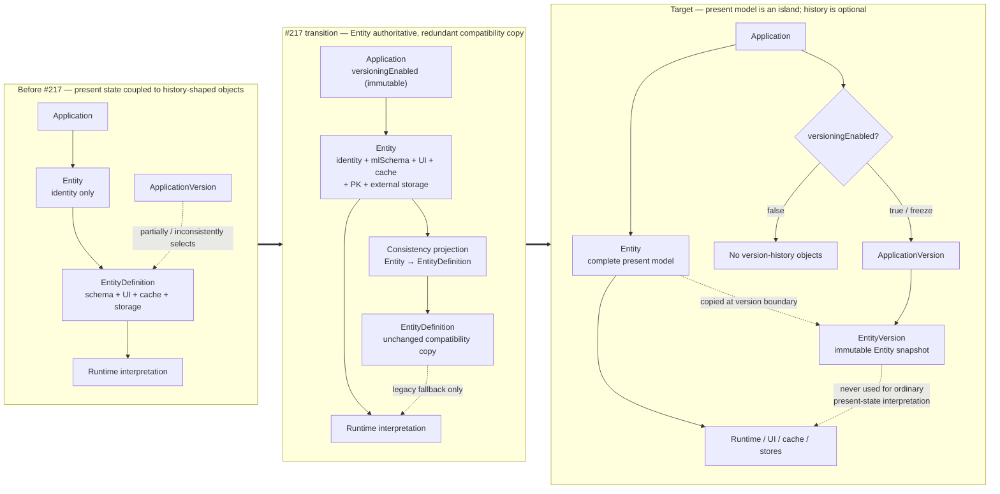

# Issue #217 — Analysis: Entity as the Authoritative Present Model

## Status and sequencing

GitHub issue: https://github.com/miroir-framework/miroir/issues/217

This issue is the first prerequisite for all further work on Issue #9:

1. **#217 — Entity becomes the authoritative present-model definition**
2. #216 — Application Versions from frozen model state (release-management primitive; Phase 10 closes freeze lifecycle; full #216 adds inter-version history)
3. #9 WP2 — replayable Application Version migrations
4. #215 — paired model/data migrations

Related issue #15 must also be reconsidered: its current proposal makes each data instance resolve its schema through `parentDefinitionVersionUuid`. That would keep live runtime behavior coupled to historical Entity Definitions, which conflicts with #217’s separation. See §12.

---

## 1. Architectural objective

The present model of an application must become a self-contained island:

- each live `Entity` instance carries everything required to interpret, display, validate, cache, and persist its instances;
- live model behavior resolves directly from `Entity`;
- Application Version history is optional and external to the present model;
- when versioning is enabled, historical snapshots copy Entity state into version records;
- `EntityDefinition` remains unchanged and redundant throughout the compatibility migration;
- only after all present-model consumers have moved to `Entity`, `EntityDefinition` is renamed to `EntityVersion` as the final task.

The application decides at creation whether versioning is enabled. That choice is immutable for the lifetime of the application.

### 1.1 Required Entity fields

The initially identified fields are necessary but not sufficient. To remove all present-state dependencies on `EntityDefinition`, `Entity` must carry every model-behavior field currently borne there:

- `defaultInstanceDetailsReportUuid`
- `viewAttributes`
- `cache`
- `mlSchema`
- `icon`
- `display`
- `idAttribute`
- `externalDataSource`

The existing Entity identity fields remain:

- `uuid`
- `name`
- `description`
- `storageAccess`
- `selfApplication`
- `author`
- root instance metadata (`parentUuid`, `parentName`, `conceptLevel`, etc.)

Why the additional fields are mandatory:

- `idAttribute` controls UUID, non-UUID, and composite primary-key behavior in caches and every store;
- `externalDataSource` controls PostgreSQL external schema/table mapping;
- `display.foldSubLevels` controls form presentation;
- `icon` participates in model/UI representation.

### 1.2 Meaning of “EntityDefinition does not change”

During this issue’s migration phases:

- do not remove fields from `EntityDefinition`;
- do not require existing assets to stop carrying EntityDefinition data;
- do not immediately change public APIs or persisted collection names;
- keep Entity and EntityDefinition values synchronized while compatibility consumers remain;
- preserve generated `EntityDefinition` types and exports.

The final rename to `EntityVersion` is intentionally last. It is a semantic/name change after runtime authority has already moved; it must not be used as the mechanism for moving authority.

---

## 2. Current state

Generated types currently encode a split:

- `Entity` contains identity and basic metadata only;
- `EntityDefinition` contains schema, display, cache, primary-key, and external-storage behavior;
- `MetaModel` contains both `entities[]` and `entityDefinitions[]`.

The repository has no single production resolver for “current properties of Entity X.” Consumers repeatedly perform:

```typescript
currentModel.entityDefinitions.find(
  (entityDefinition) => entityDefinition.entityUuid === entityUuid,
)
```

This assumes one effective EntityDefinition per Entity. It is not actually Application-Version-aware. Application Version mappings are largely absent from live selectors and UI.

The existing behavior therefore has the disadvantages of both designs:

- the current model is coupled to EntityDefinition;
- yet most consumers do not reliably select an EntityDefinition through Application Version history.

### 2.1 Asset baseline

Two inventory methods expose metadata inconsistencies that the migration must
not conceal:

- a strict `parentName` scan of canonical deployment assets finds 38 Entity
  instances and 40 EntityDefinition instances;
- a folder/UUID-based scan of the canonical Entity and EntityDefinition
  collections finds 40 / 40 (Miroir 20 / 20, Admin 6 / 6, Library 6 / 6,
  PostgreSQL 3 / 3, Designer 5 / 5);
- including fixture mirrors yields 53 / 53 pairs;
- repository-wide references span 249 files mentioning `EntityDefinition`,
  105 mentioning `entityDefinitions`, 27 mentioning
  `entityDefinitionUuid`, and no existing `EntityVersion`.

The difference means some assets cannot be classified reliably from
`parentName` alone. The initial strict scan appeared to leave `MiroirTest` and
`Test` unmatched; the collection-folder scan finds their pairs. The migration
must validate UUID/folder/foreign-key relationships and normalize bad metadata
rather than assume either naming or location alone is authoritative.

Beyond canonical assets, the migration must cover:

- four current-model/current-Miroir-model snapshot files;
- Admin model mirrors in standalone, core, and MCP tests;
- 45 MiroirTest JSON files, several embedding `{ entity, entityDefinition }`
  Action payloads;
- at least 13 nested `createEntity` payloads;
- legacy `miroir-core/src/assets` and local-cache reference snapshots.

### 2.2 Bootstrap today

`ModelInitializer.modelInitialize` bootstraps storage by passing Entity + EntityDefinition pairs:

- Entity storage is created using `entityDefinitionEntity`;
- EntityDefinition storage is created using `entityDefinitionEntityDefinition`;
- every subsequent metamodel Entity is created through
  `createEntity(entity, entityDefinitionWithResolvedMLSchema(entityDefinition))`.

The bootstrap is circular:

1. Entity’s schema is itself described by the EntityDefinition of Entity.
2. EntityDefinition’s schema is described by the EntityDefinition of EntityDefinition.
3. `generate-ts-types.ts` imports EntityDefinition assets and derives generated TypeScript/Zod artifacts from their `mlSchema`.

#217 must break runtime dependence on this circle without breaking the bootstrap build order.

### 2.3 Application Version structures are not live-model authority today

The runtime confirms that #217 is a separation of actual behavior, not merely
a conceptual inversion:

- Redux and Zustand `currentModel` builders hardcode
  `applicationVersionCrossEntityDefinition: []`;
- `ModelInitializer` does not bootstrap the
  `ApplicationVersionCrossEntityDefinition` Entity as an effective runtime
  index;
- model reload fetches Entities and EntityDefinitions directly, not through an
  Application Version;
- `alterEntityAttribute` mutates the same EntityDefinition UUID in place;
- commit constructs an Application Version with placeholder values, does not
  persist it reliably, and does not maintain cross rows;
- CLI, MCP, and some server paths use static default MetaModels rather than a
  version-selected live model.

Consequently, the present runtime already behaves as a squashed model. #217
makes that squashed authority explicit on Entity and prevents future history
mechanisms from becoming a hidden dependency of ordinary operation.

---

## 3. Required invariants

### 3.1 Present-model authority

1. Every live Entity has a complete, valid `mlSchema`.
2. Every current-model operation can run without looking up an EntityDefinition.
3. The Entity UUID is the stable identity used by runtime Actions, selectors, stores, and UI.
4. `MetaModel.entities[]` is sufficient to describe all live Entities.

### 3.2 Transitional redundancy

1. Existing EntityDefinitions remain readable and structurally unchanged.
2. For every legacy current EntityDefinition with a matching Entity, duplicated fields equal the Entity fields.
3. New and altered Entities dual-write the redundant EntityDefinition until all compatibility readers are removed.
4. Divergence is detected explicitly; it must never silently select whichever copy was loaded last.
5. During transition, Entity is authoritative when present; EntityDefinition is fallback only for legacy assets.

### 3.3 Historical model

1. A historical copy is immutable after creation.
2. Historical copies are not consulted to interpret the live model.
3. Application Versions refer to historical copies, eventually named EntityVersions.
4. An unversioned application creates no Application Version / Entity Version history.
5. A versioned application snapshots Entity state; it does not move live authority away from Entity.

### 3.4 Immutable versioning capability

Add an explicit creation-time property to `SelfApplication`, provisionally:

```typescript
versioningEnabled: boolean
```

Requirements:

- selected when the application is created;
- persisted on `SelfApplication`;
- immutable after creation;
- explicit default for old applications (recommended compatibility default: `true` for applications that already contain version records, otherwise a migration decision rather than inference at every runtime load);
- all version/freeze/trace-history Actions reject unversioned applications;
- normal model CRUD works identically whether versioning is enabled or disabled.

Do not model this solely as the presence of Application Version rows. Capability must be explicit and stable.

Existing configuration already declares:

- `monoUserVersionControl`;
- `versionControlForDataConceptLevel`.

They appear in Miroir configuration fixtures (currently `false`) but have no
effective runtime readers outside their declarations. They are environment
configuration, not an immutable property of a particular application.

Before adding `versioningEnabled`, decide whether to:

1. replace these unused flags with the per-application property;
2. retain them only as creation defaults that initialize the immutable
   application property; or
3. deprecate them explicitly.

Do not wire the existing mutable configuration flags directly as the ongoing
source of truth, because that would allow the application’s versioning mode to
change after creation.

---

## 4. Impact: metamodel, bootstrap, and generated types

### 4.1 Primary files and symbols

- `packages/miroir-test-app_deployment-miroir/assets/miroir_model/.../381ab1be-337f-4198-b1d3-f686867fc1dd.json`
  - Entity’s current EntityDefinition; must add the full definition fields to the Entity schema.
- `packages/miroir-test-app_deployment-miroir/assets/miroir_model/.../9460420b-f176-4918-bd45-894ab195ffe9.json`
  - `SelfApplication`; must add immutable versioning capability.
- all Entity JSON assets under
  `packages/miroir-test-app_deployment-*/assets/*_model/16dbfe28-e1d7-4f20-9ba4-c1a9873202ad/`
  - must receive copied current-definition fields.
- corresponding EntityDefinition assets under entity UUID
  `54b9c72f-d4f3-4db9-9e0e-0dc840b530bd`
  - remain unchanged during transition.
- `packages/miroir-core/src/0_interfaces/1_core/bootstrapJzodSchemas/getMiroirFundamentalJzodSchema.ts`
  - `entityDefinitionRoot`, fundamental schema construction, Action schemas, and generated context names.
- `packages/miroir-core/scripts/generate-ts-types.ts`
  - currently imports many `entityDefinition*` assets and calls a local `entityDefinitionMLSchema`.
- `packages/miroir-core/src/0_interfaces/1_core/EntityDefinition.ts`
  - `entityDefinitionMLSchema`, `entityDefinitionWithResolvedMLSchema`.
- generated:
  - `preprocessor-generated/miroirFundamentalType.ts`
  - `preprocessor-generated/miroirFundamentalJzodSchema.ts`
- deployment package exports:
  - `miroir-test-app_deployment-miroir/index.ts`, `index.d.ts`, `src/Model.ts`
  - equivalent Admin, Library, Designer, PostgreSQL exports.

### 4.2 Requirements

1. Add the complete definition fields to Entity’s metamodel schema while keeping EntityDefinition unchanged.
2. Introduce `entityMLSchema` / `entityWithResolvedMLSchema`; retain deprecated EntityDefinition helpers during transition.
3. Make code generation consume Entity-carried schemas.
4. Preserve a bootstrap-only bridge until the generated `Entity` type itself includes `mlSchema`; avoid a big-bang circular dependency.
5. Regenerate types in canonical build order.
6. Change schema revision/fingerprint logic to include Entity-carried behavior fields.
7. Keep compatibility exports until the final rename.

### 4.3 Downstream build impact

The ordered chain is:

1. `miroir-test-app_deployment-miroir` assets and exports
2. `miroir-core` `devBuild` / type generation
3. caches and stores
4. `miroir-react`, standalone UI, diagrams, AI, MCP, CLI
5. application deployment packages and integration tests

Both locally linked `jzod` and `jzod-ts` may be exercised by generation, even if no sibling change is ultimately required.

---

## 5. Impact: current model assembly, cache, and selectors

### 5.1 Model representations

Affected types/functions:

- `MetaModel.entityDefinitions`
- `DeploymentUuidToReportsEntitiesDefinitions`
- `getReportsAndEntitiesDefinitionsForDeploymentUuid`
- `extractApplicationModel`
- Redux and Zustand `currentModel` / `currentModelEnvironment`
- Redux/Zustand `selectModelForDeploymentFromReduxState`
- `useCurrentModel`
- `useCurrentModelEnvironment`
- `ModelEnvironmentSync`

Primary files:

- `packages/miroir-core/src/0_interfaces/1_core/Model.ts`
- `packages/miroir-core/src/1_core/Model.ts`
- `packages/miroir-localcache-redux/src/4_services/localCache/Model.ts`
- `packages/miroir-localcache-redux/src/4_services/localCache/LocalCacheSliceModelSelector.ts`
- matching Zustand files
- `packages/miroir-standalone-app/src/miroir-fwk/4_view/ReduxHooks.ts`
- `packages/miroir-standalone-app/src/miroir-fwk/4_view/ModelEnvironmentSync.tsx`

Requirements:

1. Continue loading EntityDefinitions during compatibility.
2. Assemble Entities with complete fields as the live model.
3. Add one central resolver:
   - Entity first;
   - legacy EntityDefinition fallback;
   - consistency error/warning when both differ.
4. Stop adding new ad-hoc `.find(ed => ed.entityUuid)` calls.
5. Make `MetaModel.entityDefinitions` optional/historical only in a late phase, not at the start.

### 5.2 Primary-key registration

`idAttribute` currently drives:

- Redux EntityAdapter registration;
- Zustand identity extraction;
- store `entityIdAttributes` maps;
- `EntityPrimaryKey.ts` helpers;
- FK-to-PK joins and CRUD tests.

Affected files include:

- `packages/miroir-core/src/1_core/EntityPrimaryKey.ts`
- Redux/Zustand `LocalCacheSlice.ts`
- filesystem, IndexedDB, PostgreSQL, MongoDB and bundled store sections.

Migration requirement:

- first generalize PK helpers to accept a schema-bearing Entity-like object;
- register adapters/maps from Entity;
- retain EntityDefinition fallback for old persisted models;
- only later narrow APIs to Entity.

Specific defect to lock with a regression test while changing this path:
Redux `LocalCacheSlice.ts` contains one comparison against
`entityDefinitionEntityDefinition.uuid` (the UUID of the EntityDefinition
*instance describing EntityDefinition*) where the collection discriminator
should be `entityEntityDefinition.uuid` (the Entity UUID whose instances are
EntityDefinitions). Another path uses the correct UUID. The incorrect branch
may therefore never register as intended; do not preserve this behavior as a
compatibility requirement.

### 5.3 Cache refresh

`cacheRefreshPolicy.ts` currently interprets
`EntityDefinition.cache.cacheAllInstancesOnRefresh`.
`DomainController.loadConfigurationFromPersistenceStore` builds an
EntityDefinition-by-Entity UUID map for this purpose.

Move this policy to Entity, with compatibility fallback and unchanged default:
missing/true means eager; explicit false means do not preload data instances.

---

## 6. Impact: model Actions and lifecycle

### 6.1 Current coupling

`ModelActionCreateEntity` carries pairs:

```typescript
{ entity, entityDefinition }
```

Rename, alter, and drop payloads carry both:

- `entityUuid`
- `entityDefinitionUuid`

`ModelEntityActionTransformer`:

- creates both instances;
- renames both;
- alters only `EntityDefinition.mlSchema`;
- drops both.

All persistence backends repeat versions of that logic.

### 6.2 Requirements

1. Entity creation accepts a full Entity as the authoritative input.
2. During compatibility, create or receive a redundant EntityDefinition copy.
3. Rename updates Entity; redundant current EntityDefinition is dual-written.
4. Alter-attribute updates `Entity.mlSchema`; redundant EntityDefinition is dual-written.
5. Drop removes live Entity and its data storage; historical EntityVersions must not be deleted merely because the live Entity is dropped.
6. Current-state Action payloads ultimately stop requiring `entityDefinitionUuid`.
7. Historical snapshot creation is a separate versioning operation, not an incidental side effect of normal model CRUD.
8. Evolution tracing targets Entity identity for live changes and may separately record resulting EntityVersion identity when versioning is enabled.

Primary files:

- `packages/miroir-core/src/2_domain/ModelEntityActionTransformer.ts`
- `packages/miroir-core/src/1_core/model/ModelUpdate.ts`
- `packages/miroir-core/src/3_controllers/DomainController.ts`
- `packages/miroir-core/src/4_services/PersistenceStoreController.ts`
- `packages/miroir-core/src/0_interfaces/4-services/PersistenceStoreControllerInterface.ts`
- generated model Action schemas/types
- importer, spreadsheet and AI Action producers.

### 6.3 Atomicity requirement

While dual-write is active, Entity and EntityDefinition updates form one logical operation. A failure after updating only one copy creates ambiguity.

Required approach:

- construct both post-change values from one pure function;
- validate equality before persistence;
- execute in one backend transaction where available;
- where a backend lacks transaction support, define compensation/failure semantics and detect divergence on next load.

---

## 7. Impact: persistence and storage backends

### 7.1 Shared interfaces

Today these accept Entity + EntityDefinition:

- `bootFromPersistedState(entities, entityDefinitions)`
- `createStorageSpaceForInstancesOfEntity(entity, entityDefinition)`
- `renameStorageSpaceForInstancesOfEntity(..., entity, entityDefinition)`
- `createEntity(entity, entityDefinition)`
- `createEntities([{ entity, entityDefinition }])`
- controller `createModelStorageSpaceForInstancesOfEntity`.

Target:

- storage schema and physical options come from Entity;
- historical EntityVersion is not needed to create/open live storage;
- transitional overloads/adapters preserve old callers.

### 7.2 Filesystem

Files:

- `FileSystemStoreSection.ts`
- `FileSystemEntityStoreSectionMixin.ts`
- instance-store mixins.

Impacts:

- boot primary-key map from Entity;
- storage folders remain keyed by Entity UUID;
- alter/rename must mutate Entity first and dual-write legacy EntityDefinition;
- drop must not delete historical versions.

### 7.3 IndexedDB

Files:

- `IndexedDbStoreSection.ts`
- `IndexedDbEntityStoreSectionMixin.ts`
- `IndexedDbInstanceStoreSectionMixin.ts`
- `IndexedDb.ts`.

Same Entity/PK/action changes as filesystem. Upgrade behavior must account for stores opened from old Entity-only-lite + EntityDefinition assets.

### 7.4 PostgreSQL

Files:

- `SqlDbStoreSection.ts`
- `sqlDbEntityStoreSectionMixin.ts`
- `sqlDbInstanceStoreSectionMixin.ts`
- `SqlGenerator.ts`
- `utils.ts`.

High-risk dependencies:

- `fromMiroirEntityDefinitionToSequelizeEntityDefinition`
- `entityDefinitionMLSchema`
- `idAttribute` for primary/composite keys;
- `externalDataSource.schema` and `.tableName`;
- schema/table DDL during create/alter/rename;
- query SQL generation from EntityDefinition schemas.

Rename helpers to Entity-oriented forms only after Entity-first versions exist. Preserve old wrappers during transition.

### 7.5 MongoDB

Files:

- `MongoDbStoreSection.ts`
- `MongoDbEntityStoreSectionMixin.ts`
- instance-store mixins.

Impacts mirror IndexedDB: collection creation, PK map, alter/rename/drop and redundant persistence.

Existing backend gap: `MongoDbStoreSection.bootFromPersistedState` is
effectively a no-op for primary-key registration and
`getEntityIdAttribute` returns `"uuid"`. MongoDB therefore does not currently
have parity for non-UUID/composite keys. #217 must avoid presenting this latent
defect as an Entity-authority regression: either fix it in the MongoDB vertical
slice with parity tests, or record it as an explicit pre-existing limitation.

### 7.6 Bundled/read-only store

Files:

- `BundledModelStoreSection.ts`
- `BundledDataStoreSection.ts`.

Boot currently derives `entityIdAttributes` from EntityDefinitions. Bundled deployments must derive from Entity while accepting legacy bundles during compatibility.

---

## 8. Impact: schema consumers, queries, UI, and tooling

### 8.1 Domain/query/schema resolution

Affected:

- `DomainStateQuerySelectors.ts`
- `ExtractorRunnerInMemory.ts`
- `TransformersForRuntime.ts`
- `resolveConditionalSchema.ts`
- Jzod unfolding/reference resolution
- `schemaChangeKind.ts`
- `schemaForDeployment.ts`
- FK/PK resolution.

All current-schema walks must resolve `Entity.mlSchema`. Schema cache invalidation must fingerprint the Entity fields, otherwise an Entity schema change can leave stale runtime Zod/Jzod schemas.

### 8.2 Reports, forms, and grids

High-density consumers:

- `ReportTools.ts`
- `ReportSectionListDisplay.tsx`
- `ReportSectionEntityInstance.tsx`
- `ReportViewWithEditor.tsx`
- `EntityInstanceGrid.tsx`
- `EntityInstanceGridInterface.ts`
- `GlideDataGridComponent.tsx`
- `ValueObjectGrid.tsx`
- `getColumnDefinitionsFromEntityAttributes.ts`
- `JsonObjectEditFormDialog.tsx`
- `JsonObjectDeleteFormDialog.tsx`
- `JzodArrayEditor.tsx`
- `foreignKeyAttributeAnalyzer.ts`.

Properties to move:

- form/validation schema → `Entity.mlSchema`;
- grid column selection/order → `Entity.viewAttributes`;
- details navigation → `Entity.defaultInstanceDetailsReportUuid`;
- folded sections → `Entity.display`;
- PK behavior → `Entity.idAttribute`.

Use an Entity-oriented hook/resolver instead of renaming variables while retaining EntityDefinition lookup underneath.

### 8.3 Diagrams

Affected:

- `miroir-diagram-class/.../entityDefinitionsToMermaidClassDiagram.ts`
- `entityDefinitionsToMermaidErDiagram.ts`
- `MermaidClassDiagram.tsx`
- standalone model diagram views.

Live diagrams should consume Entity. A separate historical diagram mode may consume EntityVersions for a selected Application Version.

### 8.4 Import, AI, CLI, MCP, sandbox

Affected areas include:

- spreadsheet schema generation and import runners;
- `Importer.tsx` and `scripts.ts`;
- AI Entity proposal forms/tools/prompts;
- MCP and CLI integration tests;
- sandbox/admin migration helpers;
- deployment extraction scripts.

Generated proposals should produce a full Entity and, only during compatibility, a redundant EntityDefinition copy.

---

## 9. Assets and data migration requirements

### 9.1 Canonical copy direction

For legacy assets, initial population is:

```text
EntityDefinition fields → matching Entity fields
```

After migration, the direction reverses:

```text
Entity fields → redundant EntityDefinition compatibility copy
```

Never keep bidirectional last-write-wins synchronization.

### 9.2 Asset sets

Update:

- Miroir deployment model;
- Admin;
- Library;
- Designer;
- PostgreSQL example;
- standalone and MCP test assets;
- `miroir-core/src/assets` leftovers still used by tests/tools;
- generated current-model JSON snapshots;
- test seeds and expected serialized models.

### 9.3 Migration tool requirements

A deterministic migration helper should:

1. identify Entity ↔ EntityDefinition by `entityDefinition.entityUuid`;
2. reject zero or multiple unexplained current candidates;
3. copy all definition fields;
4. preserve Entity identity fields;
5. validate resulting Entity against the new Entity schema;
6. verify Entity/EntityDefinition redundant equality;
7. report orphan Entities and orphan EntityDefinitions;
8. be idempotent;
9. avoid rewriting unrelated JSON formatting where practical.

Do not infer the “current” definition from array order. If multiple historical definitions exist, the migration requires an explicit current-selection rule or input mapping.

---

## 10. Non-regressing migration path

Each phase must merge with the full relevant suite green. The rename is deliberately isolated at the end.

### Phase 0 — Contract and characterization tests — DONE

Before production changes:

- characterize current Entity/EntityDefinition joins;
- test all duplicated field mappings;
- inventory orphans/multiple definitions;
- add consistency-comparison helper tests;
- lock PK/cache/UI behavior;
- establish versioned/unversioned application fixtures.

No runtime behavior changes.

**Realization (DONE):**

- Added pure helpers in `packages/miroir-core/src/1_core/entityPresentModel.ts`:
  - `inventoryEntityEntityDefinitionJoins` (1:1 / orphans / multi-defs by `entityDefinition.entityUuid`);
  - `ENTITY_PRESENT_MODEL_DEFINITION_FIELDS`, `projectEntityPresentModelDefinition`, `compareEntityPresentModelDefinitions`;
  - `VERSIONED_APPLICATION_FIXTURE` / `UNVERSIONED_APPLICATION_FIXTURE`.
- Characterization suite `entityPresentModel.unit.test.ts` (13 tests): synthetic joins; field projection/equality; clean 1:1 on `defaultMiroirMetaModel` and `defaultLibraryAppModel`; PK/cache still resolve from EntityDefinition; baseline that live Entity instances do not yet carry definition fields; filesystem inventory for Miroir / Library / Admin model assets.
- Initially characterized a Miroir filesystem join anomaly (orphan `ApplicationVersionCrossEntityDefinition` Entity + multi-def on `SelfApplicationVersion`); that `entityUuid` misshap was corrected before Phase 3 (see §14.4). Characterization tests now expect clean 1:1 Miroir joins.
- Exported helpers from `miroir-core` `index.ts`. No production runtime behavior changes.

### Phase 1 — Additive Entity schema and immutable capability — DONE

- add all definition fields to Entity as optional for compatibility;
- add `SelfApplication.versioningEnabled`;
- keep EntityDefinition unchanged;
- regenerate types;
- old assets still parse.

At this phase, EntityDefinition remains the fallback for fields absent on Entity.

**Realization (DONE):**

- Extended Entity EntityDefinition `mlSchema` (`381ab1be-…`) with optional present-model fields mirrored from EntityDefinition: `defaultInstanceDetailsReportUuid`, `viewAttributes`, `icon`, `display`, `cache`, `idAttribute`, `externalDataSource`, `mlSchema` (optional on Entity; required on EntityDefinition).
- Added optional `SelfApplication.versioningEnabled` boolean (`9460420b-…`) with immutable-capability documentation in the field tag; absent allowed so legacy applications still parse.
- Left EntityDefinition schema and all Entity/SelfApplication instance assets unchanged (population is Phase 3).
- Regenerated `miroirFundamentalType.ts` / Zod schemas via `npm run generate-ts-types -w miroir-core` after rebuilding `miroir-test-app_deployment-miroir`.
- Contract tests in `entityPresentModel.phase1.unit.test.ts`: legacy Entity/SelfApplication assets parse; enriched Entity with all definition fields parses; `versioningEnabled` true/false parses.
- Phase 0 characterization suite still green (baseline: live Entity instances do not yet carry definition fields).

### Phase 2 — Central Entity-first model-property resolver — DONE

Introduce a core abstraction, e.g.:

```typescript
resolveCurrentEntityModel(
  entity,
  legacyEntityDefinitions,
): Entity
```

Behavior:

- complete Entity → return Entity;
- incomplete legacy Entity + one matching EntityDefinition → return an in-memory enriched Entity;
- both complete but different → explicit consistency failure/warning according to environment policy;
- ambiguous definitions → error.

Migrate common schema and PK helpers to this abstraction first. This establishes one compatibility boundary.

**Realization (DONE):**

- Extended `entityPresentModel.ts` with `resolveCurrentEntityModel`, `entityHasCompletePresentModel` (complete ⇔ `mlSchema` present), `overlappingPresentModelDifferences`, and `EntityPresentModelResolutionError` (`ambiguous` | `missingDefinition` | `inconsistent`).
- Inconsistency policy: default `onInconsistency: "error"`; optional `preferEntity`. Overlap check only compares definition fields Entity already owns (fields only on EntityDefinition are not treated as divergence during transition).
- Enrichment overlays EntityDefinition projection then Entity-owned fields (Entity wins on partial ownership).
- Widened PK helpers to `EntityPrimaryKeySource` (`idAttribute` from Entity or EntityDefinition); added `getResolvedEntityPrimaryKeyAttribute(s)` that resolve via `resolveCurrentEntityModel` then read PK.
- Tests: `entityPresentModel.phase2.unit.test.ts` + Phase 0 Miroir filesystem characterization updated to clean 1:1 after §14.4 misshap correction.
- No production call-site migration yet beyond the PK helper surface (consumers still pass EntityDefinition directly where they already have it).

### Phase 3 — Populate assets and validate redundancy — DONE

- copy definition fields into all Entity assets;
- add immutable versioning choices to applications;
- fix or explicitly map orphan/ambiguous cases;
- add repository-wide asset consistency tests;
- retain EntityDefinition files unchanged.

No consumer is removed yet.

**Realization (DONE):**

- Copied definition-bearing fields from each matching EntityDefinition onto Entity JSON across Miroir / Admin / Library / Postgres / Designer model assets (55 Entities) plus Admin test mirrors (core, standalone-app, mcp). EntityDefinition files left unchanged.
- Set `versioningEnabled: true` on Miroir, Admin, Library, Postgres, Designer SelfApplication instances (and Admin mirrors) per §14.2.
- Idempotent helper: `code-helpers/features/217-/phase3-populate-entity-assets.py`.
- Consistency suite `entityPresentModel.phase3.unit.test.ts`: filesystem + `defaultMiroirMetaModel` / `defaultLibraryAppModel` redundancy; SelfApplication `versioningEnabled`.
- Updated Phase 0/2 characterization expectations now that canonical Entities are complete (Phase 2 enrichment tests use a synthetic incomplete Entity).
- Rebuilt deployment packages so JSON imports pick up the populated assets.

### Phase 4 — Bootstrap and code generation switch — DONE

- introduce Entity-oriented schema-resolution helpers;
- make `generate-ts-types` consume Entity `mlSchema`;
- make `ModelInitializer` create storage from full Entity;
- still persist redundant EntityDefinition;
- regenerate and rebuild in canonical order.

This is the pivotal bootstrap phase and should be kept narrow.

**Realization (DONE):**

- Added `entityMLSchema` / `entityWithResolvedMLSchema`; marked `entityDefinitionMLSchema` / `entityDefinitionWithResolvedMLSchema` `@deprecated`.
- Added `alignEntityDefinitionToPresentEntity` for Entity-authoritative dual-write projection onto redundant EntityDefinitions.
- `generate-ts-types.ts` now feeds `getMiroirFundamentalJzodSchema` from Entity assets (Miroir + Admin Application/Deployment). Leftover Bundle still uses EntityDefinition from `miroirAdmin` fixtures (no matching exported Entity UUID).
- `ModelInitializer` routes all `createEntity` / `createModelStorageSpaceForInstancesOfEntity` calls through `bootstrapEntityDefinitionAligned(entity, entityDefinition)`.
- Regenerated fundamental types; Phase 4 contract tests in `entityPresentModel.phase4.unit.test.ts`.
- §11 strategy gap-fill suite `entityPresentModel.strategy.unit.test.ts` (UI lock, dual-write equality, codegen mlSchema equivalence, versioning immutability policy, Library behavioral equivalence). Combined entityPresentModel suites: 58 green. Spot-checked §11.2 P0/P1: `cacheRefreshPolicy`, `EntityPrimaryKey`, `schemaChangeKind` green.

### Phase 5 — Model Actions become Entity-authoritative with dual-write — DONE

- create Entity from full payload;
- alter Entity `mlSchema`;
- rename Entity;
- drop live Entity without destroying history;
- derive the redundant EntityDefinition update from the authoritative Entity;
- remove EntityDefinition as an independent editable input.

Legacy Action payloads remain accepted through adapters.

**Test gate (§11):**

- Integration/Action tests for create / alterAttribute / rename / drop asserting §11.3 dual-write equality after each mutation.
- Wire `assertVersioningEnabledImmutable` on any SelfApplication update path (reject flips).
- Keep P0 model CRUD + undo/redo + `PersistenceStoreController.integ` green.
- Adapter tests: legacy Action payloads that still supply EntityDefinition still produce Entity-authoritative dual-write results.

**Realization (DONE):**

- Added `packages/miroir-core/src/1_core/modelEntityDualWrite.ts`:
  - `applyMlSchemaColumnChanges` (remove = exclude listed columns);
  - `normalizeCreateEntityPair` (Entity complete → authoritative; legacy incomplete → enrich then align ED);
  - `applyAlterEntityAttributePair` / `applyRenameEntityPair` with §11.3 dual-write equality assert.
- `ModelEntityActionTransformer` create/alter/rename dual-write Entity + redundant EntityDefinition; drop deletes live Entity + named ED UUID only (not historical versions).
- LocalCache (Redux + Zustand) `updateInstance` rejects SelfApplication `versioningEnabled` flips via `assertVersioningEnabledImmutable`.
- Tests: `modelEntityDualWrite.unit.test.ts` (7), `ModelEntityActionTransformer.phase5.unit.test.ts` (4). Store-side alter/rename dual-write remains Phase 6.

### Phase 6 — Persistence backends switch — DONE

One vertical slice per backend, all sharing updated core contracts:

1. bundled (read-only / simplest);
2. filesystem;
3. IndexedDB;
4. MongoDB;
5. PostgreSQL, including external sources and SQL generation.

Each slice must cover bootstrap, create, alter, rename, drop, UUID/non-UUID/composite PK, reopen/reload, and legacy persisted state.

**Settled (decision §14.8):** always write Entity then EntityDefinition. On failure: compensate (delete/restore) or best-effort second write + consistency detector (`detectEntityEntityDefinitionInconsistencies`). Do **not** use a single serialized artifact. PostgreSQL uses a real transaction around the same order when available. Record per-backend choice in slice realization notes.

**Test gate (§11):**

- Per-backend vertical slice = one public-behavior integ suite (not unit-mocked store internals): bootstrap → CRUD → reopen.
- UUID / non-UUID / composite PK matrix per backend (extends EntityPrimaryKey + store integ).
- PostgreSQL: external `externalDataSource` mapping tests before switching.
- After each slice: §11.3 dual-write equality on persisted Entity vs EntityDefinition files/rows.
- Record dual-write failure/compensation policy choice in the slice realization notes (§14.8).

**Realization (DONE):**

- Core: `modelEntityDualWritePersistence.ts` — `persistEntityThenEntityDefinition` (Entity→ED; compensate | bestEffortDetect) + `detectEntityEntityDefinitionInconsistencies`. Tests: `modelEntityDualWritePersistence.unit.test.ts` (7).
- **bundled:** read-only no-ops; dual-write N/A.
- **filesystem / IndexedDB / MongoDB:** create/rename/alter use `normalize*` / `apply*` + `persistEntityThenEntityDefinition` with **compensate**. Mongo `dropEntity` now also deletes EntityDefinition rows (parity with FS/IDB).
- **PostgreSQL:** create uses Sequelize **transaction** Entity→ED; rename/alter use compensate via `persistEntityThenEntityDefinition` then table sync (alter). External sources unchanged (read-only upsert guard remains).
- Store mixins no longer mutate EntityDefinition alone on alter (Entity-authoritative).

### Phase 7 — Cache and current-model assembly switch — DONE

- register PK/cache policy from Entity;
- update Redux and Zustand in parallel;
- assemble live MetaModel from full Entities;
- retain EntityDefinition collections only as compatibility/history data;
- update schema fingerprints to Entity.

**Test gate (§11):**

- Update `cacheRefreshPolicy` callers/tests to accept Entity (or resolved present model), keep P0 green.
- Redux **and** Zustand LocalCache tests must both pass (parity).
- Extend `schemaChangeKind` fingerprints to Entity-carried fields; add regression that Entity-only schema edits invalidate revisions.
- Behavioral equivalence: selectors fed Entity-first model match previous EntityDefinition-join results on Library/Miroir fixtures.

**Realization (DONE):**

- `cacheRefreshPolicy`: `CachePolicyCarrier` accepts Entity or EntityDefinition; `resolveCachePolicyCarrierForEntity` prefers Entity.cache with ED map fallback; DomainController + `ReduxDeploymentsStateQuerySelectors` updated.
- LocalCache Redux + Zustand: PK adapter registration from Entity on load/create; EntityDefinition path kept as fallback; fixed wrong `entityDefinitionEntityDefinition` gate on Zustand load / Redux create.
- `assembleLivePresentModelEntities` wired into Redux + Zustand `currentModel` (ED arrays retained).
- `schemaChangeKind`: fingerprints Entity present-model fields alongside EntityDefinitions; Entity-only `viewAttributes` invalidates revision (description still ignored).
- Tests: `cacheRefreshPolicy` (12), `schemaChangeKind` (13), `entityPresentModel.phase7` (2).

### Phase 8 — Domain selectors and transformers switch — DONE

- replace current EntityDefinition joins in query selectors;
- FK and conditional-schema resolution use Entity;
- runtime transformers and extractors use Entity;
- remove scattered current-definition resolution.

**Test gate (§11):**

- Query selector / combiner / FK analyzer tests use Entity present model.
- Transformer/extractor suites: same outputs before/after for Library fixtures (equivalence).
- No new production `entityDefinitions.find(ed => ed.entityUuid === …)` without going through `resolveCurrentEntityModel` (grep gate in realization notes).

**Realization (DONE):**

- Hub: `resolvePresentEntityFromModel(model, entityUuid)` in `entityPresentModel.ts` (Entity-first; ED only via `resolveCurrentEntityModel`).
- Wired: `DomainStateQuerySelectors` extractorByPrimaryKey FK walk; `ExtractorRunnerInMemory`; `resolveConditionalSchema` parent mlSchema; `TransformersForRuntime` FK default PK.
- FK analyzer accepts Entity or EntityDefinition carriers (`ForeignKeySchemaCarrier`); lookup by `entityUuid ?? uuid`.
- Grep gate: no production `entityDefinitions.find(…entityUuid…)` left in `miroir-core/src` (UI Report* joins deferred to Phase 9).
- Tests: `entityPresentModel.phase8` (5); FK analyzer Entity≡ED equivalence case.

### Phase 9 — UI and tooling switch — DONE

Vertical slices:

1. list report/grid columns and PK;
2. details report/forms/default report;
3. FK editors and nested/array forms;
4. diagrams;
5. import/spreadsheet;
6. AI, MCP, CLI and sandbox.

Each slice uses Entity end-to-end and retains legacy EntityDefinition fallback only at the central boundary.

**Test gate (§11):**

- One vertical UI/tooling slice at a time with public-behavior tests (P1 report/grid/form; P2 diagram/MCP/CLI as touched).
- Each slice proves list/details/PK/FK still resolve from Entity fields (`viewAttributes`, `defaultInstanceDetailsReportUuid`, `idAttribute`, `mlSchema`).

**Realization (DONE):**

- Hub UI boundary: `presentEntityAsRedundantEntityDefinition` (+ Phase 8 `resolvePresentEntityFromModel`) for components still typed as EntityDefinition.
- Wired: `ReportSectionListDisplay`, `ReportSectionEntityInstance`, `ReportTools`, `ReportViewWithEditor`, `EntityInstanceGrid` (FK nav → Entity `defaultInstanceDetailsReportUuid`), `JzodArrayEditor`, `EntityInstanceSelectorPanel`, `deleteCascade` (Entity-first FK walk).
- Diagrams: `metaModelToMermaidClassDiagram` prefers Entity `mlSchema`; `buildEntityClickLinks` / `presentEntitiesAsDiagramCarriers`; Model diagram page navigates to `reportEntityDetails` with Entity uuid.
- Import spreadsheet puts `mlSchema` on Entity (dual-write ED retained); AI system prompt documents Entity present-model authority.
- Grep gate: no `entityDefinitions.find(…entityUuid…)` left under `miroir-standalone-app/.../4_view`.
- Tests: `entityPresentModel.phase9`; diagram `buildEntityClickLinks` / Entity-preferring `metaModelToMermaidClassDiagram`.

### Phase 10 — Separate optional version history — DONE

- redesign #216 (canonical analysis:
  `code-helpers/features/216-FEATURE-application-versions-and-freeze/analysis.md`):
  - unversioned application: no Application Version / freeze required;
  - versioned application: user-triggered freeze snapshots current Entities into immutable historical copies (release-management primitive; full release product later);
  - versioned-app **baseline**: between create and first freeze, Entity island only — no mandatory `current` tip; first freeze creates *V1*;
  - inter-version history (diff vs action log) is **#216 beyond Phase 10** — not required to close this phase;
  - `ApplicationVersionCrossEntityDefinition` maps only Application Versions to historical copies;
  - live current state is never reconstructed through that mapping;
  - always-present `current` tip is **not** an acceptance criterion (optional implementation aid only if action-log accrual needs an anchor later).
- enforce immutable `versioningEnabled` (policy + LocalCache done; audit remaining persist paths);
- define initial baseline behavior for versioned applications (§1.1 of #216 analysis).

**Test gate (§11) — Phase 10 core only:**

- §11.1: versioned vs unversioned lifecycle (freeze allow/reject; baseline before first freeze).
- Snapshot immutability / copy fidelity; live Entity mutation does not mutate historical snapshot.
- Freeze Action: §11.3 snapshot equality (`EntityVersion == project(Entity)` at freeze).
- Unversioned app rejects freeze/version Actions; versioned app allows them.
- `assertVersioningEnabledImmutable`: LocalCache already enforces; Phase 10 confirms no SelfApplication update bypass remains (ownership: #217 / LocalCache — not reimplemented in #216). See #216 analysis §5.1 / §8.1.

**Explicitly deferred to full #216 (not Phase 10 gate):** Option A/B inter-version history implementation, Cross schema polish, WP2 history-edge artefacts.

**Realization (DONE):**

- Full redesign of #216 issue + analysis (moved to `216-FEATURE-application-versions-and-freeze/`); obsolete `pre-wp2-analysis-entity-authoritative-present-model` → `217-/analysis.md`.
- Phase 10 vs full #216 AC split (§8.1 / §8.2); release-management framing; versioned-app baseline before first freeze; `assertVersioningEnabledImmutable` ownership documented (§5.1).
- Freeze Action implementation + §11.3 runtime tests deferred to **full #216 / Phase 10 code slices when resumed** — Phase 10 design gate closed by redesign; executable freeze remains #216 §8.1 implementation work (tracked on #216, not blocking Phase 11 present-model removal).
- `assertVersioningEnabledImmutable` already enforced on LocalCache updateInstance (Phase 5); no additional bypass found that blocks Phase 11.

### Phase 11 — Remove live EntityDefinition dependency — IN PROGRESS

Acceptance gate:

- no production current-model path reads EntityDefinition;
- no store requires EntityDefinition to open/create live storage;
- no UI resolves live schema from EntityDefinition;
- no current model Action requires EntityDefinition UUID;
- legacy fallback is isolated and can be removed after supported upgrade horizon;
- EntityDefinition records are immutable historical copies only.

**Test gate (§11):**

- Grep/CI or characterization test: no live-path EntityDefinition authority left.
- Full P0 + P1 suites green with Entity-only present model.
- Dual-write may stop; historical copies still readable for versioned apps.

**Realization (partial):**

- Slice: Postgres `SqlGenerator` PK/schema via `resolvePresentEntityFromModel` (no live `entityDefinitions.find`).
- Slice: `SqlDbStoreSection` / `sqlDbEntityStoreSectionMixin` Sequelize mapping from Entity present-model fields (`fromMiroirPresentModelToSequelizeEntityDefinition`); ED optional fill-in only.
- Slice: FS / IndexedDB boot + createStorage register `idAttribute` from Entity first.
- Gate tests: `entityPresentModel.phase11.unit.test.ts` (3).
- **Still open:** Model Action `entityDefinitionUuid` required; dual-write still on; DomainController/Deployment/ModelInitializer Entity+ED pairs; LocalCache ED PK path; UI hub `presentEntityAsRedundantEntityDefinition` (allowed temporary); stop dual-write after Action/store APIs are Entity-only.

### Phase 12 — Final task: rename EntityDefinition to EntityVersion

Only now:

- rename metamodel Entity and EntityDefinition assets;
- rename TypeScript/Jzod types and schemas;
- rename `entityDefinitionUuid` historical fields where semantically appropriate;
- rename `ApplicationVersionCrossEntityDefinition` to
  `ApplicationVersionCrossEntityVersion`;
- update reports, menus, exports, folders, docs, prompts, diagrams and tests;
- provide a deprecated `EntityDefinition` type/export alias for one compatibility release if public API stability requires it;
- migrate persisted parent UUIDs/entity UUIDs only through an explicit data migration if identity changes; prefer retaining UUID identity and changing names where possible.

This phase must contain no architectural authority change—only the final vocabulary/compatibility migration.

**Test gate (§11):**

- Rename-only: full non-regression (P0–P2 as applicable) with **zero** behavioral deltas beyond symbol names.
- Deprecated `EntityDefinition` alias compile/import smoke if retained.
- No new present-model logic in this phase.

---

## 11. Test strategy

**Method (always):** vertical TDD slices (one failing public-behavior test → minimal implementation). Prefer integration-style tests through public APIs over mocks. Each mergeable phase must keep its phase suite **and** the listed §11.2 priority suites for that phase green.

### 11.1 New contract tests

| Contract | Phase owning it | Status after Phase 9 |
|---|---|---|
| Entity complete-definition schema parsing | 1 | Done (`phase1`) |
| Legacy Entity + EntityDefinition enrichment | 2 | Done (`phase2`) |
| duplicate-field equality and mismatch detection | 0 / 2 | Done (`unit` + `phase2`) |
| ambiguous/missing EntityDefinition failures | 2 | Done (`phase2`) |
| versioning capability immutability | 1 policy / 5+ Action wire / **10 audit** | **Done** LocalCache + Phase 10 ownership note; freeze Action gates → full #216 §8.1 |
| versioned vs unversioned lifecycle | 10 (#216 §8.1) / design | **Phase 10 design DONE**; executable freeze/lifecycle tests → full #216 §8.1 |
| snapshot immutability and copy fidelity | 10 (#216 §8.1) | Deferred to full #216 freeze implementation |
| live Entity mutation does not mutate historical snapshot | 10 (#216 §8.1) | Deferred to full #216 freeze implementation |
| Inter-version history (diff vs action log) | **#216 §8.2** (beyond Phase 10) | Deferred — full #216 |
| UI fields (`viewAttributes`, default details report) | 0 lock / 3 populate | Done (`strategy`) |
| Codegen Entity.mlSchema ≡ EntityDefinition.mlSchema | 4 | Done (`strategy`) |
| Dual-write `project(Entity) == project(ED copy)` | 4 / 5 / 6 mutations | **Done for ModelAction + store backends** (`modelEntityDualWrite*` + store mixins); detector available for reload |
| Migrated deployment behavioral equivalence | 3–4 | Done for Library resolve/PK/cache (`strategy`) |

Suite files:

- `entityPresentModel.unit.test.ts` — Phase 0 characterization
- `entityPresentModel.phase1.unit.test.ts` … `phase4.unit.test.ts`
- `entityPresentModel.strategy.unit.test.ts` — §11 gap-fill / cross-phase contracts
- `modelEntityDualWrite.unit.test.ts` / `ModelEntityActionTransformer.phase5.unit.test.ts` — Phase 5
- `modelEntityDualWritePersistence.unit.test.ts` — Phase 6 persistence policy + detector
- `entityPresentModel.phase7.unit.test.ts` — Phase 7 MetaModel assembly
- `entityPresentModel.phase8.unit.test.ts` — Phase 8 present-model lookup hub
- `entityPresentModel.phase9.unit.test.ts` — Phase 9 UI boundary ED-shaped projection
- `entityPresentModel.phase11.unit.test.ts` — Phase 11 live-ED authority grep gate (stores)

### 11.2 Existing priority suites

P0 (run or keep green before merging Phases **5–7** especially):

- `cacheRefreshPolicy.unit.test.ts` — green after Phase 4
- `EntityPrimaryKey.unit.test.ts` — green after Phase 4
- Redux and Zustand LocalCache tests
- composite/non-UUID/no-parent UUID CRUD integration tests
- `PersistenceStoreController.integ.test.tsx`
- model CRUD and undo/redo integration tests
- deployment package model validation (Phase 3 filesystem consistency covers part of this)

P1 (Phases **7–9**):

- `schemaChangeKind.unit.test.ts` — green after Phase 4 (still fingerprints EntityDefinitions; Phase 7 must extend and re-lock)
- `schemaReloadPolicy.unit.test.ts`
- `useCurrentModelEnvironment.unit.test.tsx`
- FK analyzer tests
- Jzod editor/form tests
- report/grid tests
- per-store reopen/boot tests.

P2 (Phases **9–12**):

- evolution trace tests
- diagram tests
- AI tools
- MCP
- CLI
- importer/spreadsheet
- generated-type smoke tests.

### 11.3 Required equivalence tests during dual-write

For every model mutation (Phase **5+** gate — must be asserted in Action/integration tests, not only pure helpers):

```text
projectDefinitionFields(Entity after action)
==
projectDefinitionFields(EntityDefinition compatibility copy after action)
```

For every migrated legacy deployment (Phase **3–4** Done for Library; extend to Admin/Postgres/Designer integ as stores switch):

```text
behavior before enrichment
==
behavior after Entity-first resolution
```

For every version snapshot (Phase **10**):

```text
EntityVersion at freeze time
==
definition-bearing projection of Entity at freeze time
```

### 11.4 Phase 0–4 audit notes

Gaps found vs §11 and filled:

1. UI field lock was only implicit → explicit Book `viewAttributes` / details-report assertion.
2. Dual-write §11.3 formula was only partially covered by Phase 4 helper tests → Library-wide align equality + diverge-then-align.
3. Codegen source switch lacked equivalence lock → bootstrap Entity/ED `mlSchema` pairs.
4. `versioningEnabled` immutability was fixture-only → `assertVersioningEnabledImmutable` policy + tests (Action wiring still later).
5. Migrated behavioral equivalence (resolve/PK/cache) added for Library.
6. Stale Phase 0 realization text still claimed Entities lack definition fields — superseded by Phase 3; characterization test already updated.

Still deferred (correctly) until later phases: versioned/unversioned lifecycle, snapshot immutability, live-vs-history isolation, full P0 integ gate on every commit (document requires them at phase merge for 5+).

---

## 12. Consequences for related issues

### 12.1 Issue #15

#15 currently proposes that Entity instances use `parentDefinitionVersionUuid`
to select the Entity Definition used for schema/storage/form interpretation.

That conflicts with the target architecture:

- data instances should identify their live Entity through `parentUuid`;
- the live Entity supplies the current schema;
- historical EntityVersion identity belongs to migration/history interpretation, not normal present-state reads.

Recommended action: supersede or rewrite #15 after #217. If instance-level provenance still matters, keep an optional “created/validated against EntityVersion” field as audit metadata, but never make it the runtime authority for the present model.

### 12.2 Issue #216

#216’s **original** design required every application to have an Application Version named `current`, with mappings to EntityDefinitions used as the present-model index.

#217 changes that premise; #216 has been **fully revised**:

- present state is always the Entity island;
- versioning may be disabled (`versioningEnabled`);
- a `current` Application Version is **not** required for present-model authority (and may be unnecessary entirely — see open tip vs action-log-anchor discussion);
- user-triggered freeze creates Application Versions from frozen Entity state — the primitive for a later **release management** product;
- **Phase 10** closes freeze snapshot + versioning lifecycle (§8.1 of #216 analysis);
- **full #216** adds inter-version history (snapshot **diff** vs accrued **action log**, §8.2).

Canonical analysis: `code-helpers/features/216-FEATURE-application-versions-and-freeze/analysis.md`.

### 12.3 Issue #9 WP2

The previous WP2 diagram/design must become:

- Application ↔ live Entities directly;
- Application Version ↔ historical EntityVersions;
- trace/replay Actions mutate live Entities;
- version boundaries snapshot or refer to the resulting EntityVersions only when versioning is enabled.

This separation simplifies replay: applying a migration updates the Entity island; history records the before/after snapshots without participating in ordinary model interpretation.

### 12.4 Issue #215

Paired data migrations remain valid. Their validation should compare:

- old live Entity schema;
- model Action;
- new live Entity schema;
- associated data migration.

EntityVersions can preserve historical schemas but are not required to execute ordinary current-state validation.

---

## 13. Risks and mitigations

### Split-brain redundancy

Risk: Entity and EntityDefinition differ.

Mitigation: one-way authority, pure projection, equality validation, atomic dual-write, no last-write-wins.

### Bootstrap circularity

Risk: code generation needs Entity schema before Entity carries `mlSchema`.

Mitigation: additive schema first, bootstrap bridge, then switch generator in a narrow phase.

### Accidental historical deletion

Risk: current `dropEntity` removes all definitions for an Entity.

Mitigation: distinguish compatibility current copy from immutable historical EntityVersions before version snapshots are enabled.

### Stale schema caches

Risk: revision logic fingerprints EntityDefinitions, so Entity changes may not reload schemas.

Mitigation: migrate schema fingerprint/cache invalidation before UI relies on Entity-only updates.

### Primary-key regression

Risk: `idAttribute` is used across every cache/store.

Mitigation: central Entity-first PK helper and full UUID/non-UUID/composite regression matrix per backend.

### External PostgreSQL regression

Risk: `externalDataSource` remains on EntityDefinition.

Mitigation: include it in Entity from Phase 1 and test external schema/table mapping before switching PostgreSQL.

### Optional versioning ambiguity

Risk: old applications have partial version artefacts.

Mitigation: explicit migration decision per application; never infer capability repeatedly at runtime.

### Rename blast radius

Risk: `EntityDefinition` is embedded in generated/public APIs, asset names, reports and prose.

Mitigation: rename only after semantic decoupling, preserve UUIDs where feasible, and temporarily export deprecated aliases.

---

## 14. Decisions (settled)

1. **Capability name:** `versioningEnabled` on `SelfApplication` (optional during migration; immutable after creation once populated).
2. **Legacy classification:** migrate **all** canonical applications to `versioningEnabled: true` — Miroir, Admin, Postgres, Library (and Designer when populated in Phase 3).
3. **Unversioned dual-write:** yes — keep creating/updating the compatibility EntityDefinition copy for unversioned applications until the end of #217 (non-regression).
4. **Multiple current definitions:** the Miroir `SelfApplicationVersion` / `ApplicationVersionCrossEntityDefinition` `entityUuid` misshap has been corrected; no multi-def selection rule is required for remaining canonical assets. Reject unexplained multiples if any reappear.
5. **`parentDefinitionVersionUuid`:** remains relevant as provenance — it will reference the UUID of an **EntityVersion** in history (not a live EntityDefinition). At the final rename, EntityDefinition → EntityVersion with relations adjusted accordingly.
6. **Final rename identity:** preserve EntityDefinition Entity UUID and instance UUIDs; rename vocabulary only.
7. **Compatibility horizon:** keep exporting `EntityDefinition` symbols, marked deprecated in comments. Action payloads must be migrated as part of non-regression so existing Actions keep present behavior until explicitly updated.
8. **Dual-write atomicity (filesystem / IndexedDB / MongoDB):** **settled for Phase 6** — always persist **Entity then EntityDefinition**. On second-write failure: prefer **compensate** (create → delete Entity; update → restore previous Entity). Alternative allowed per call site: **best-effort** second write + `detectEntityEntityDefinitionInconsistencies`. **Do not** use a single serialized artifact. PostgreSQL wraps the same Entity→ED order in a real transaction when available.

These decisions unblocked Phase 3+ asset population and historical semantics. Phase 0–2 additive/resolver work did not depend on (8).

---

## 15. Completion criteria

#217 is complete only when:

- Entity alone defines the present model;
- bootstrap and generated types derive from Entity;
- all caches, selectors, hooks, UI, schema resolution, Actions, validation, and stores use Entity for live behavior;
- EntityDefinition has remained compatible throughout the migration;
- versioning capability is explicit, immutable, and optional;
- version history is completely absent from unversioned application operation;
- version-enabled applications snapshot Entities into immutable historical copies;
- no production live-model dependency on EntityDefinition remains;
- the final task renames EntityDefinition to EntityVersion and updates historical relationships;
- the full non-regression suite passes at every mergeable phase.

---

## 16. Evolution diagram


