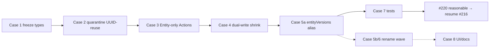

# Issue #220 — Analysis: Reduce post-#217 EntityDefinition tech debt (unblock #216)

GitHub issue: https://github.com/miroir-framework/miroir/issues/220

**Document role:** implementation analysis for the #220 **code** refactor. This document is a working map (inventory → dividing line → migration cases → validation). **Done for #220 means the code/tests criteria in the issue are met**, not that this file exists.

## Status and sequencing

| Step | Issue | Role |
|------|-------|------|
| ✅ | #217 | Entity = authoritative present model; metamodel `EntityDefinition` → `EntityVersion`; deprecated TS aliases; dual-write during transition |
| ✅ | **#220 (this)** | Leftover vocabulary / dual-write / UUID-reuse debt reduced to a **reasonable** level on the freeze path — issue AC met; Phase 7 / #213 deferred |
| unblocked | #216 | User-triggered freeze → historical EntityVersions + linear diff |
| later | #9 WP2 / #215 / #213 | Migrations, data migrations, pure doc cleanup |

Canonical parents:

- #217 analysis: [`../217-/analysis.md`](../217-/analysis.md)
- #216 analysis / ADR: [`../216-FEATURE-application-versions-and-freeze/analysis.md`](../216-FEATURE-application-versions-and-freeze/analysis.md)
- Issue body (acceptance criteria): https://github.com/miroir-framework/miroir/issues/220
- TDD implementation plan: [`./tdd-implementation-plan.md`](./tdd-implementation-plan.md)

### What “reasonable” means here

Enough clarity that #216 implementers:

1. never resolve live schema through EntityDefinition / Cross mappings;
2. never mint historical snapshots via UUID-reuse “redundant live definition” helpers;
3. see `Entity` (present) vs `EntityVersion` (history) in freeze-adjacent APIs and tests;
4. treat remaining `EntityDefinition` names as thin deprecated aliases or explicitly quarantined compat only.

It does **not** mean zero occurrences of the string `EntityDefinition` in the monorepo (release bundles, closed issues, evolution-trace op enums, and third-party history may keep the old word).

---

## 1. Context / problem

#217 moved present-model authority onto live `Entity` and renamed the historical snapshot concept to `EntityVersion`. Generated types already say:

```ts
/** @deprecated Use EntityVersion */
export type EntityDefinition = EntityVersion;
```

`MetaModel.applicationVersionCrossEntityVersion` was renamed, but **`MetaModel.entityDefinitions` is still the collection property name** (typed as `EntityVersion[]`). Dual-write modules, Action planners, store boot APIs, UI report sections, and many tests still speak `EntityDefinition` / `entityDefinitions` for mixed meanings:

| Meaning after #217 | Correct name | Still often called |
|--------------------|--------------|--------------------|
| Live structure/behavior | `Entity` | EntityDefinition / “definition” |
| Historical immutable snapshot | `EntityVersion` | EntityDefinition (alias) |
| Deprecated TS alias | `EntityDefinition = EntityVersion` | everywhere imports use the alias |
| Redundant live ED copy (compat) | should die or quarantine | dual-write / `presentEntityAsRedundant…` |

#216 freeze already has early scaffolding (`applicationVersionFreeze.ts`, snapshot unit tests) and explicitly warns that `presentEntityAsRedundantEntityDefinition` **reuses the live Entity UUID** — unsafe for historical minting. Continuing #216 without cleaning the surrounding vocabulary makes incorrect snapshot/persist wiring likely.

---

## 2. Codebase findings inventory

Counts below are **source-oriented**. Release/client bundles (`miroir-server/release`, electron unpacked) dominate raw greps (~20k+ hits) and must be ignored for planning.

Approximate source surface (pattern `EntityDefinition|entityDefinitions|createEntityDefinition|updateEntityDefinition|entityDefinition`, excluding `preprocessor-generated`):

| Area | ~hits | Notes |
|------|------:|-------|
| `miroir-core` (non-test) | ~1.2k | Controllers, dual-write, Model, PersistenceStore, selectors |
| `miroir-core` dual-write / present / freeze | ~194 | Highest leverage for #216 |
| Stores + localcache | ~476 | `bootFromPersistedState`, getInstances labeling |
| UI (`standalone-app` src, react) | ~300+ | Report diagram `entityDefinitions`, forms |
| Deployment packages | ~400+ | Model exports, READMEs, assets naming |
| Tests/docs (core + standalone) | ~1.7k | Teach old split if left unchanged |
| Dual-write **import** consumers outside core dual-write modules | ~few | Mostly `ModelEntityActionTransformer` + unit tests |

### 2.1 Employment classes (by role)

#### A. Deprecated type alias (generated)

- `EntityDefinition = EntityVersion` in `miroirFundamentalType.ts` (#217 Phase 12).
- Re-exported from `packages/miroir-core/src/index.ts`.
- **Role:** temporary TS comfort. **Keep** until call sites migrate; then remove.

#### B. MetaModel / in-memory model collections

- `MetaModel.entityDefinitions: EntityVersion[]` — **property name still legacy**.
- `emptyMetaModel`, `Deployment.ts` filters, `Model.ts` section builders, `schemaChangeKind` fingerprints under `entityDefinitions`.
- `DeploymentUuidToReportsEntitiesDefinitions` / `EntityDefinitionCouple` — UI/bootstrap pairing of Entity + “definition”.
- Cross side already uses `applicationVersionCrossEntityVersion` (good).

#### C. Present-model helpers

- `entityPresentModel.ts` — Entity-authoritative projection, join inventory, `alignEntityDefinitionToPresentEntity`, **`presentEntityAsRedundantEntityDefinition`** (UUID reuse, deprecated).
- `EntityDefinition.ts` — `entityMLSchema` (good) + deprecated `entityDefinitionMLSchema*`.

#### D. Dual-write / live Action resolution

- `modelEntityDualWrite.ts` / `modelEntityDualWritePersistence.ts` — Entity then ED upsert; inconsistency detector.
- `modelEntityActionLiveResolve.ts` — `planCreate/Rename/Alter…` → `entityOnly` when present model complete; `dualWrite` for legacy/incomplete; `resolveLiveEntityDefinitionForAction`; `resolveOrSynthesizeEntityDefinitionForCreate`.
- `ModelEntityActionTransformer.ts` — executes dualWrite vs entityOnly plans.
- **Import graph is narrow** (core + dedicated unit tests) — good for quarantine/removal.

#### E. Freeze scaffolding (#216 early)

- `applicationVersionFreeze.ts`:
  - `FREEZE_APPLICATION_VERSION_ACTION_TYPE`
  - `assertApplicationVersioningEnabled`
  - `snapshotEntitiesAsHistoricalEntityVersions` → returns **`EntityDefinition[]`** despite minting new UUIDs and setting `parentName: "EntityVersion"`.
- Tests already contrast UUID-reuse helper vs historical minting.

#### F. Persistence / store / localcache

- `PersistenceStoreController.bootFromPersistedState` loads entities + entityDefinitions collections.
- Store mixins (filesystem, indexedDb, postgres, mongodb, bundled) still name parameters / logs `entityDefinitions`.
- Localcache model selectors assemble `entityDefinitions` arrays for MetaModel-shaped state.

#### G. Evolution trace / Action vocabulary (frozen strings)

- Trace `operationType` includes `createEntityDefinition` / `updateEntityDefinition`.
- These are **persisted observational enums** (WP1). Renaming breaks historical traces; treat as external/frozen unless a versioned enum migration is designed.

#### H. UI / reports

- `modelDiagramReportSection.definition.entityDefinitions` (schema field).
- Standalone report editors still pass `entityDefinitions={…}` for diagrams.
- Lower priority for #216; may stay until #213 / a UI slice.

#### I. Deployment assets & codegen

- EntityVersion rows still live under entity folder `54b9c72f-…` (correct metamodel identity).
- Package READMEs / `Model.ts` exports may still say EntityDefinition.
- Type generator historically imported “entityDefinition*” assets; verify current scripts use Entity / EntityVersion wording.

#### J. Docs & closed issues

- #213 owns broad doc cleanup.
- Older issues (#118, #80, #17, #57) titled EntityDefinition — optional triage after code work.

---

## 3. Problematic cases (post-#217 / hazardous for #216)

1. **UUID-reuse projection used near freeze**  
   `presentEntityAsRedundantEntityDefinition` returns `uuid: entity.uuid`. Freeze must mint **new** historical UUIDs. Early #216 snapshot code is correct on this point, but the helper remains a public export and an easy foot-gun.

2. **Freeze API typed as `EntityDefinition[]`**  
   `snapshotEntitiesAsHistoricalEntityVersions` documents EntityVersion behavior but returns the deprecated alias. Callers and persist layers will keep thinking in “definitions.”

3. **`MetaModel.entityDefinitions` property**  
   Collection holds what are now EntityVersions (live redundant copies and/or historical rows mixed by convention). Freeze persist + Cross linking need a clear “historical EntityVersions for this Application Version” story; the property name invites treating the array as present-model authority.

4. **Dual-write still in the live Action path**  
   For complete Entities, planners already prefer `entityOnly` — good. Dual-write remains for incomplete Entity enrichment and explicit ED on create. That is OK short-term **if** freeze never calls dual-write persist for snapshots. Today the modules are not strongly quarantined (same export surface as present-model helpers).

5. **Store boot / selectors still require ED arrays for ordinary load**  
   Ordinary apps still load `entityDefinitions` alongside entities. Present-model ops should not *need* them (#217 invariant 3.1.2). Residual requirement blocks confidence that Entity island is enough before freeze.

6. **Evolution-trace op names**  
   `createEntityDefinition` / `updateEntityDefinition` teach the old world in WP1 traces. Not a freeze blocker if left frozen; hazardous if #216/WP2 invent new ops with the same names for live mutations.

7. **Docs / UI still saying “Entity Definition” for live schema**  
   Confuses humans implementing #216; lower code risk than (1)–(5).

---

## 4. Dividing line (implementation policy)

| Bucket | Meaning | `EntityDefinition` name allowed? | #220 action |
|--------|---------|----------------------------------|-------------|
| **Present model** | Live structure/behavior | **No** — use `Entity` | Migrate call sites; Entity-only Actions when complete |
| **Application Version history** | Immutable snapshots + Cross | **No** — use `EntityVersion` | Rename freeze/history APIs & types |
| **Deprecated TS alias** | `type EntityDefinition = EntityVersion` + thin re-exports | **Yes, temporary** | Keep listed; removal-gated after call-site migration |
| **Compat dual-write / dual-read** | Redundant live ED copies | **Only if still required** | Quarantine module boundary; EOL when no incomplete-Entity / legacy payload needs remain |
| **Frozen external strings** | Trace op enums, closed issues, release artifacts | Document; do not “fix” history | Leave (or versioned migration later) |

### Hard rules for #216 adjacency

- Freeze **must not** call `presentEntityAsRedundantEntityDefinition` (or any helper that reuses live Entity UUID).
- Freeze **must** mint new EntityVersion UUIDs and link only via `ApplicationVersionCrossEntityVersion`.
- Live schema resolution **must not** go through Cross mappings or “pick a definition for this Entity” as authority when Entity has complete present model.

---

## 5. Migration cases — impact and validation

Suggested implementation order. Prefer thin vertical slices over one mega-rename.

### Case 1 — Freeze path vocabulary & return types

- **Current:** `snapshotEntitiesAsHistoricalEntityVersions` returns `EntityDefinition[]`; local vars typed as definition.
- **Target:** Return/annotate `EntityVersion[]`; comments and exports say historical EntityVersion only.
- **Bucket:** Application Version history.
- **Impact:** `applicationVersionFreeze.ts`, `index.ts` exports, #216 unit tests. Low behavior risk (alias is identical).
- **Validation:** existing `applicationVersionFreeze.216.snapshot` / `phase0` unit tests; grep freeze module for `EntityDefinition` → expect zero (except comments pointing at deprecated helper).
- **AFK:** yes.

### Case 2 — Quarantine UUID-reuse helpers from freeze

- **Current:** `presentEntityAsRedundantEntityDefinition` and synthesize-for-create are public next to freeze exports.
- **Target:** Move dual-write / redundant-projection symbols behind a clear compat module (e.g. `entityDefinitionCompatibility.ts`) or mark `@internal` / `@deprecated` with eslint-disable boundaries; freeze tests assert they are not imported from freeze modules. Optionally rename export to `presentEntityAsRedundantLiveEntityVersionCopy` only if that reduces confusion without a huge churn.
- **Bucket:** Compat dual-write.
- **Impact:** `entityPresentModel.ts`, `modelEntityActionLiveResolve.ts`, `index.ts`, phase9 tests.
- **Validation:** `applicationVersionFreeze.216.phase0` (already asserts UUID reuse vs mint); ensure freeze source files do not import the helper.
- **AFK:** yes.

### Case 3 — Present-model Action path: Entity-only by default

- **Current:** Planners already `entityOnly` when complete; dual-write for incomplete / explicit ED.
- **Target:** Confirm DomainController / Persistence paths for create/rename/alter/drop do not *require* live ED for ordinary post-#217 apps; delete dead dual-write branches if tests prove unused; keep dual-write only for documented legacy enrichment.
- **Bucket:** Present model + compat.
- **Impact:** `ModelEntityActionTransformer`, PersistenceStoreController model Actions, ModelInitializer bootstrap.
- **Validation:** `ModelEntityActionTransformer.217.phase11` unit tests; DomainController integ (filesystem) for create/alter Entity without ED payload; inconsistency detector tests still pass when ED present.
- **AFK:** mostly; HITL if bootstrap still needs dual-write for metamodel seed.

### Case 4 — Quarantine or shrink dual-write persistence

- **Current:** `persistEntityThenEntityDefinition`, `detectEntityEntityDefinitionInconsistencies`.
- **Target:** Either (a) stop calling persist dual-write from non-legacy paths, or (b) keep module but stop exporting as first-class public API; document EOL (“remove when no deployment ships incomplete Entity”).
- **Bucket:** Compat dual-write.
- **Impact:** dual-write modules, any store callers, consistency checkers.
- **Validation:** dual-write unit tests; scan `persistEntityThenEntityDefinition` call sites → only legacy/bootstrap.
- **AFK:** yes once Case 3 call sites known.

### Case 5 — `MetaModel.entityDefinitions` → `entityVersions` (phased)

- **Current:** Property name legacy; type already `EntityVersion[]`.
- **Target (phased):**  
  - **5a:** Introduce `entityVersions` as preferred accessor / builder field; keep `entityDefinitions` as deprecated alias getter or dual field during transition.  
  - **5b:** Rename through stores, localcache, deployment MetaModel constructors, tests.  
  - **5c:** Remove alias.
- **Bucket:** History collection naming (and leftover live redundant rows in same array — see open question).
- **Impact:** High — MetaModel is ubiquitous. Do **not** block #216 freeze Action if Cases 1–4 done; schedule 5a minimum before freeze persist wires Cross rows from a named collection.
- **Validation:** typecheck; MetaModel zod parse tests; default Miroir/Library MetaModel builders; localcache selectors.
- **AFK:** 5a; HITL before 5b/5c (asset/export churn).

### Case 6 — Store / localcache API parameter names

- **Current:** `bootFromPersistedState(entities, entityDefinitions)`, selector fields `entityDefinitions`.
- **Target:** Rename parameters/fields to `entityVersions` in interfaces once Case 5a lands; update mixins.
- **Bucket:** History / collection naming.
- **Impact:** All store packages + redux/zustand localcache.
- **Validation:** store unit tests; LocalCache unit tests; one DomainController integ per major store if signatures change.
- **AFK:** after Case 5a.

### Case 7 — Freeze-critical tests & fixtures stop teaching ED-as-live-model

- **Current:** Many tests still construct/`find` via `entityDefinitions` for present-model assertions.
- **Target:** Present-model tests assert on `Entity` fields; history tests use `EntityVersion` / snapshot helpers; dual-write tests stay in a named compat suite.
- **Bucket:** Present + history.
- **Impact:** `miroir-core/tests/1_core/*`, phase11 transformer tests, freeze tests.
- **Validation:** `npm run testByFile -w miroir-core -- applicationVersionFreeze` / `entityPresentModel` / `ModelEntityActionTransformer.217.phase11`; targeted `testMiroir` if suites touch model Actions.
- **AFK:** yes.

### Case 8 — UI / docs / report schema field (lower priority)

- **Current:** diagram sections and docs say `entityDefinitions`.
- **Target:** Rename when cheap; otherwise leave to #213 / follow-up.
- **Bucket:** Present-model vocabulary in UI.
- **Impact:** standalone-app report editors, jzod report section schema (may need deployment rebuild).
- **Validation:** UI smoke / existing report tests if touched.
- **Out of “reasonable” minimum** unless it blocks freeze UX.

### Case 9 — Evolution-trace operation strings

- **Current:** `createEntityDefinition` / `updateEntityDefinition` in enums.
- **Target:** **Leave frozen** for WP1 history; document in this analysis. Optional later: add `createEntityVersion` / `updateEntityVersion` for new events only.
- **Bucket:** External / frozen.
- **Impact:** None for #220 code minimum.
- **Validation:** n/a.

---

## 6. Recommended work order (for implementers)



**Minimum to unblock #216:** Cases **1, 2, 3, 4 (quarantine), 7**, plus **5a** if freeze persist needs a clearly named EntityVersion collection. Cases 5b/6/8 can follow without blocking freeze Action design.

---

## 7. Open questions (HITL only if blocking)

1. **Live redundant EntityVersion rows:** After #217, deployments may still store one “live” EntityVersion row per Entity (dual-write). Should #220 delete those rows from canonical assets once Entity-only is proven, or leave them until a dedicated data migration (#215-ish)?  
   - *Recommendation:* stop **writing** them on ordinary Actions (Case 3/4); defer **deleting** persisted rows from assets unless cheap and covered by nonreg.

2. **Same MetaModel array for live-redundant vs historical EntityVersions?**  
   - Today one `entityDefinitions` array can conceptually mix both. Freeze must only *create* historical rows + Cross; live interpretation must ignore Cross.  
   - *Recommendation:* do not invent a second collection in #220 unless #216 persist design requires it; document the convention in #216 when wiring persist.

3. **Rename `presentEntityAsRedundantEntityDefinition` vs quarantine-only?**  
   - *Recommendation:* quarantine + deprecate first (Case 2); rename only if greps stay confusing after Cases 1–4.

---

## 8. Outcome of this analysis vs #220 done

| Artifact | Role |
|----------|------|
| This `analysis.md` | Working map (inventory may lag after deletions); optional updates as cases close |
| Code + tests meeting [issue #220 acceptance criteria](https://github.com/miroir-framework/miroir/issues/220) (8 bullets) | **Actual done** — see `tdd-implementation-plan.md` §Acceptance |
| Phase 6 + Entity-only Action slices | Over-delivery vs issue minimum |
| Follow-up | Case 8 / Phase 7 → #213; evolution-trace op strings left frozen |

### Cross-links

- #217 (done) — Entity present model + EntityVersion rename  
- #216 — Freeze Application Versions (blocked on #220 reasonable)  
- #213 — Documentation Entity Definition cleanup  
- #9 WP2 — Application Version migrations  

---

## 9. Inventory snapshot appendix (2026-07-27)

Notable symbols:

| Symbol | File | Notes |
|--------|------|-------|
| `EntityDefinition = EntityVersion` | `miroirFundamentalType.ts` | Deprecated alias |
| `MetaModel.entityDefinitions` | generated MetaModel | Property name legacy; values are EntityVersion |
| `applicationVersionCrossEntityVersion` | generated MetaModel | Renamed — keep as pattern |
| `presentEntityAsRedundantEntityDefinition` | `entityPresentModel.ts` | UUID reuse; unsafe for freeze |
| `snapshotEntitiesAsHistoricalEntityVersions` | `applicationVersionFreeze.ts` | Correct minting; wrong return alias |
| `plan*EntityMutation` / dualWrite | `modelEntityActionLiveResolve.ts` | Entity-only when complete |
| `persistEntityThenEntityDefinition` | `modelEntityDualWritePersistence.ts` | Compat persist |
| Trace ops `createEntityDefinition` / `updateEntityDefinition` | generated enums | Frozen WP1 strings |

Dual-write import consumers (non-generated): core dual-write modules, `ModelEntityActionTransformer.ts`, and dedicated unit/freeze tests — narrow enough to quarantine deliberately.
