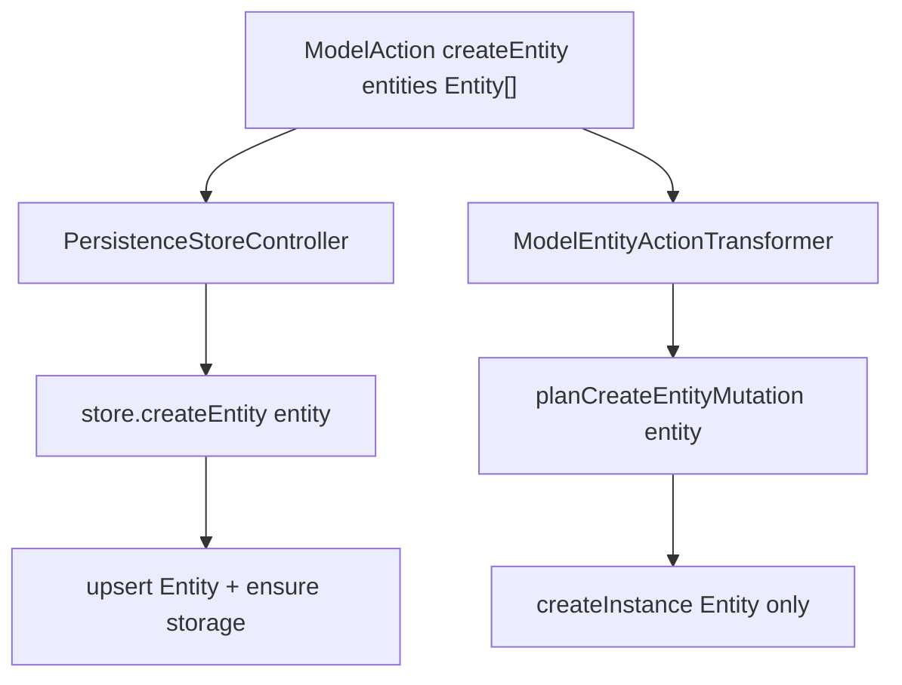

# #220 — Remove `entityVersion` from `createEntity` (TDD)

Parent: [tdd-implementation-plan.md](./tdd-implementation-plan.md) / [analysis.md](./analysis.md).

## Decision (locked)

- Store: `createEntity(entity: Entity)` only; batch `createEntities(entities: Entity[])`.
- Action payload: flat `entities: Entity[]` (drop the `{ entity, entityVersion? }` pair entirely).
- Create path is **Entity-only**: Entity must already carry present-model (`mlSchema`). No dual-write on create.
- Leave `normalizeCreateEntityPair` / alter-rename dual-write alone until create call sites are gone; then delete create-only dual-write branches and Phase 5 “create emits 2 instances” tests.
- Historical EntityVersion rows are **not** produced by `createEntity` (freeze/#216 remains the history path).

## Global non-regression gates

| When | Command / check |
|------|-----------------|
| Slice 1–3 | Targeted unit tests listed in each slice Validation; `npx tsc --noEmit --skipLibCheck` on touched packages when types change |
| Slice 4+ | `npm run build -w miroir-test-app_deployment-miroir` then `npm run devBuild -w miroir-core` |
| After callers / MiroirTest | `npm run testMiroir -w miroir-standalone-app -- --profile emulatedServer-sql --suites domain_controller_model_crud,domain_controller_model_undo_redo --mode integ` and `PersistenceStoreController.integ` |

---

## Slice 1 — Store interface + Postgres (tracer bullet)

**RED:** Focused test that the Postgres entity-store create path treats `createEntity` as Entity-only: complete Entity is enough; no EntityVersion argument; present-model fields come from Entity (`mlSchema` / `idAttribute`), not from a second param.

**GREEN:**

- [`PersistenceStoreControllerInterface.ts`](../../../packages/miroir-core/src/0_interfaces/4-services/PersistenceStoreControllerInterface.ts): drop 2nd param; `createEntities(Entity[])`.
- [`sqlDbEntityStoreSectionMixin.ts`](../../../packages/miroir-store-postgres/src/4_services/sqlDbEntityStoreSectionMixin.ts): remove `entityVersion` param, consistency check, and `normalizeCreateEntityPair` dual-write branch; keep Entity-only upsert + storage-space path (derive schema from `entity.mlSchema` / `idAttribute` only).
- Mirror stubs: [`ErrorModelStore.ts`](../../../packages/miroir-core/src/3_controllers/ErrorHandling/ErrorModelStore.ts), [`BundledModelStoreSection.ts`](../../../packages/miroir-store-bundled/src/4_services/BundledModelStoreSection.ts).

### Validation (Slice 1)

- [x] New/updated unit test for Entity-only `createEntity` (no 2nd arg) is red then green.
- [x] `sqlDbEntityStoreSectionMixin.createEntity` signature is `(entity: Entity)` only; no `normalizeCreateEntityPair` import/use on create.
- [x] Interface + ErrorModelStore + BundledModelStoreSection signatures match.
- [x] `npm run build -w miroir-core -w miroir-store-postgres -w miroir-store-bundled` succeeds (or package-local build equivalent).
- [x] Grep: no `createEntity(.*,.*entityVersion` in `sqlDbEntityStoreSectionMixin.ts`.

### Realization (Slice 1)

What landed:

- Characterization test [`220.createEntity-entity-only.unit.test.ts`](../../../packages/miroir-core/tests/1_core/220-entityDefinition-tech-debt/220.createEntity-entity-only.unit.test.ts) asserts interface + Postgres mixin source contracts.
- [`PersistenceStoreControllerInterface`](../../../packages/miroir-core/src/0_interfaces/4-services/PersistenceStoreControllerInterface.ts): `createEntity(entity)` / `createEntities(Entity[])`.
- Postgres [`sqlDbEntityStoreSectionMixin`](../../../packages/miroir-store-postgres/src/4_services/sqlDbEntityStoreSectionMixin.ts): dropped dual-write create; `getAccessToModelSectionEntity(entity)` Entity-only; removed `normalizeCreateEntityPair` import (rename/alter still use `persistEntityThenEntityDefinition`).
- Stubs: ErrorModelStore, BundledModelStoreSection.
- [`PersistenceStoreController`](../../../packages/miroir-core/src/4_services/PersistenceStoreController.ts): store methods Entity-only; `handleAction("createEntity")` maps `payload.entities` → `pair.entity` only (Action still pairs until Slice 4).
- [`ModelInitializer`](../../../packages/miroir-core/src/3_controllers/ModelInitializer.ts): `bootstrapCompleteEntity` via `resolveCurrentEntityModel` + aligned EV; all `createEntity` calls single-arg. `createModelStorageSpaceForInstancesOfEntity` still takes aligned EV for table schema bootstrap.

Deferred to Slice 2: FS / IndexedDB / Mongo mixins and standalone-app integ callers.

---

## Slice 2 — Other store mixins + PersistenceStoreController

Same signature change in:

- [`FileSystemEntityStoreSectionMixin.ts`](../../../packages/miroir-store-filesystem/src/4_services/FileSystemEntityStoreSectionMixin.ts)
- [`IndexedDbEntityStoreSectionMixin.ts`](../../../packages/miroir-store-indexedDb/src/4_services/IndexedDbEntityStoreSectionMixin.ts)
- [`MongoDbEntityStoreSectionMixin.ts`](../../../packages/miroir-store-mongodb/src/4_services/MongoDbEntityStoreSectionMixin.ts)
- [`PersistenceStoreController.ts`](../../../packages/miroir-core/src/4_services/PersistenceStoreController.ts) `createEntity` / `createEntities` / `handleAction("createEntity")` mapping

**RED→GREEN:** update [`PersistenceStoreController.integ.test.tsx`](../../../packages/miroir-standalone-app/tests/4_storage/PersistenceStoreController.integ.test.tsx) and [`tests-utils.tsx`](../../../packages/miroir-standalone-app/src/miroir-fwk/4-tests/tests-utils.tsx) to call `createEntity(entity)` with complete library Entities (assets already have `mlSchema`).

### Validation (Slice 2)

- [x] All writable store mixins + PersistenceStoreController use single-arg `createEntity` / `Entity[]` batch.
- [x] PersistenceStoreController integ + tests-utils compile and call Entity-only create.
- [x] `npm run testByFile -w miroir-standalone-app -- PersistenceStoreController.integ` (filesystem or sql profile) passes for createEntity cases.
- [x] Grep: no dual-write `normalizeCreateEntityPair` on create in FS/IDB/Mongo mixins.

### Realization (Slice 2)

What landed:

- Characterization tests extended for FS / IndexedDB / Mongo Entity-only create signatures.
- Mixins Entity-only: `FileSystemEntityStoreSectionMixin`, `IndexedDbEntityStoreSectionMixin`, `MongoDbEntityStoreSectionMixin` (no `normalizeCreateEntityPair` on create).
- Callers: `tests-utils.tsx`, `PersistenceStoreController.integ.test.tsx` drop 2nd arg; rename setup seeds historical `EntityVersion` via `upsertInstance("model", …)` because create no longer dual-writes.
- Residual bootstrap fix in `ModelInitializer.bootstrapCompleteEntity`: project present-model from aligned+resolved EV onto Entity instead of `resolveCurrentEntityModel` (extend-form vs flattened `mlSchema` was throwing `EntityPresentModelResolutionError` and aborting Miroir entity seeding mid-bootstrap).
- Nonreg: `PersistenceStoreController.integ` filesystem profile — 11/11 passed.

---

## Slice 3 — Planner + transformer (create dual-write removed)

**RED:** Change [`ModelEntityActionTransformer.217.phase11.unit.test.ts`](../../../packages/miroir-core/tests/2_domain/ModelEntityActionTransformer.217.phase11.unit.test.ts) / add assert that `planCreateEntityMutation(entity)` rejects incomplete Entity and never takes EV; update Phase 5 create case to Entity-only (1 `createInstance` object) or delete dual-write create case.

**GREEN:**

- [`planCreateEntityMutation`](../../../packages/miroir-core/src/1_core/modelEntityActionLiveResolve.ts): signature `(entity: Entity)` only; return `entityOnly` or `undefined`.
- [`ModelEntityActionTransformer.ts`](../../../packages/miroir-core/src/2_domain/ModelEntityActionTransformer.ts): read `payload.entities` as `Entity[]`; emit Entity-only `createInstance`.
- Keep `normalizeCreateEntityPair` for now (alter/rename / orphaned); stop importing it from create paths.

### Validation (Slice 3)

- [ ] `planCreateEntityMutation` TypeScript arity is 1; dualWrite create path gone.
- [ ] `npm run testByFile -w miroir-core -- ModelEntityActionTransformer.217` passes.
- [ ] Phase 5 create test no longer asserts two instances (Entity + EntityVersion).
- [ ] LocalCache createEntity undo unit still green if still compiling against transitional Action shape.

---

## Slice 4 — Action schema + codegen

**RED:** [`zodParseActions.test.ts`](../../../packages/miroir-core/tests/1_core/zodParseActions.test.ts) — parse `createEntity` with `entities: [completeEntity]`; reject payloads that still carry `entityVersion` once `.strict()`.

**GREEN:**

- Edit ModelEndpoint JSON under `miroir_data/3d8da4d4-…/7947ae40-…json` — `entities` becomes `array` of `schemaReference` → `entity` (not object with `entityVersion`).
- `npm run build -w miroir-test-app_deployment-miroir` then `npm run devBuild -w miroir-core`.
- Confirm generated `ModelActionCreateEntity` in [`miroirFundamentalType.ts`](../../../packages/miroir-core/src/0_interfaces/1_core/preprocessor-generated/miroirFundamentalType.ts).

### Validation (Slice 4)

- [ ] Generated type: `payload.entities: Entity[]` (no `entityVersion` property).
- [ ] Zod parse test: flat Entity array ok; `{ entity, entityVersion }` rejected under strict schema.
- [ ] `npm run testByFile -w miroir-core -- zodParseActions` passes.
- [ ] Endpoint JSON has no `entityVersion` under createEntity payload definition.

---

## Slice 5 — Production / harness callers (bottom-up compile fix)

Convert every `createEntity` / `entities: [{ entity, entityVersion }]` site to complete Entity only:

| Area | Files (representative) |
|------|------------------------|
| Deploy / reset | [`Deployment.ts`](../../../packages/miroir-core/src/1_core/Deployment.ts), DomainController `resetModel`/`initModel` |
| Bootstrap | ModelInitializer — align Entity present-model; drop EV arg |
| UI / runners | AiActionsProvider, ImportEntityFromSpreadsheetRunner, Runner_CreateApplication, runner templates |
| Seeds / playfield | libraryPlayfieldSeeds, transformerTestApplicationPlayfield, IntegrationTestSession — move `mlSchema` (+ `idAttribute`) onto incomplete synthetic Entities then drop EV |

LocalCache redux/zustand: TypeScript fallout only once transformer is Entity-only.

### Validation (Slice 5)

- [ ] `npx tsc --noEmit --skipLibCheck` clean for miroir-core + standalone-app (or build-all of touched packages).
- [ ] Grep: no `entityVersion:` inside `actionType: "createEntity"` / `createEntity(` call sites in `packages/**/src`.
- [ ] DomainController reset/init and Deployment emit `{ entities: Entity[] }` or equivalent flat list.

---

## Slice 6 — MiroirTest / integ JSON (Entity-complete fixtures)

For each create in DomainController suites, copy present-model from former `entityVersion` onto `entity`, then set `"entities": [ <entity> ]` (flat):

- `domain_controller_model_crud`, `domain_controller_model_undo_redo`, composite/non-uuid/no-parent suites, `evolutionTraceWP1`, runner `createEntity` / spreadsheet tests under `miroir_data/a311f363-…` and related runner JSON.

### Validation (Slice 6)

- [ ] Rebuild deployment-miroir after JSON edits.
- [ ] `npm run testMiroir -w miroir-standalone-app -- --profile emulatedServer-sql --suites domain_controller_model_crud --mode integ` → PASSED.
- [ ] `… --suites domain_controller_model_undo_redo --mode integ` → PASSED.
- [ ] Spot-check: MiroirTest create payloads have no `entityVersion` key.

---

## Slice 7 — Cleanup create dual-write dead code

- Remove create-path use of `persistEntityThenEntityDefinition` from stores (already gone after slice 1–2).
- Quarantine or delete create-specific dual-write tests; keep alter/rename dual-write until a later #220 slice.
- Grep gate: no `entityVersion` adjacent to `createEntity` in `packages/**` (allow EntityVersion type / freeze / alter-rename).
- Optional: `graphify update .` after the wave.

### Validation (Slice 7)

- [ ] Grep gate clean for createEntity + entityVersion coupling.
- [ ] `modelEntityDualWrite` create-only tests removed or quarantined; alter/rename dual-write tests still green.
- [ ] Curated nonreg: model_crud + undo_redo + PersistenceStoreController.integ still PASS.

---

## Out of scope

- Removing `entityVersion` / dual-write from **renameEntity** / **alterEntityAttribute**.
- Changing freeze / historical EntityVersion minting (#216).
- Flattening MetaModel `entityVersions` collection.
