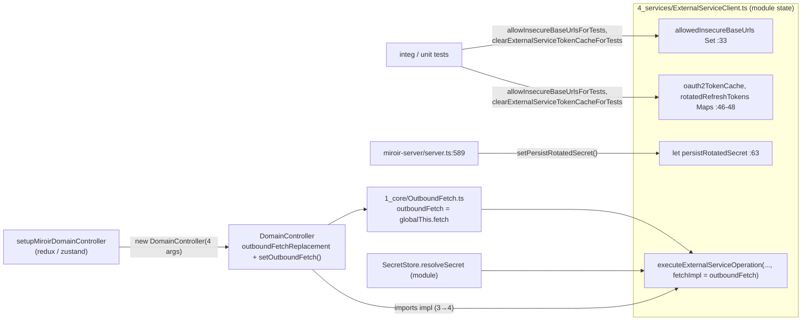
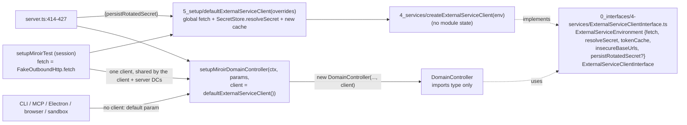
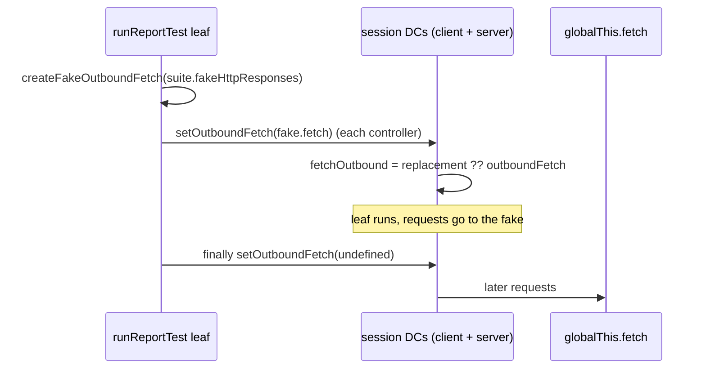
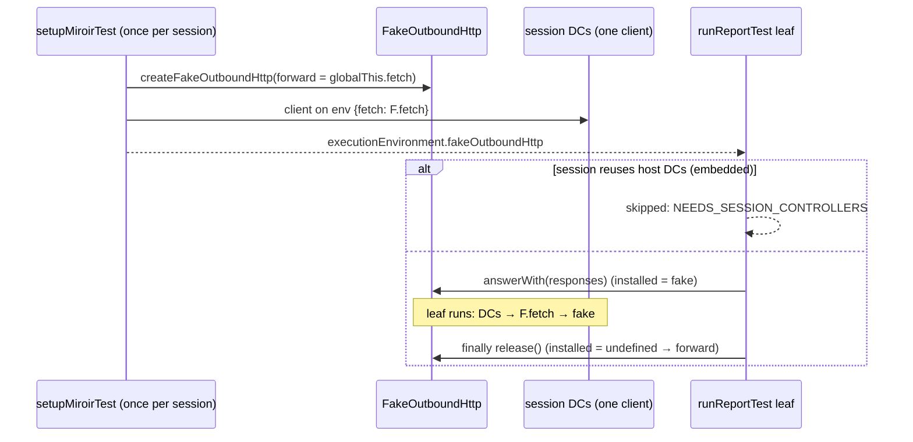

# #339 / PR #355 — minimality review

Branch `claude/issue-339-f2hly9` vs `origin/_integration` (3 commits, 41 files, +866 / −311).

## Verdict

The production change is close to minimal and does everything the acceptance criteria ask: the module state in `ExternalServiceClient.ts` is gone, `DomainController` gets an `ExternalServiceClientInterface` when it is built (the layer 3→4 import is gone, suppression count 6→5), and `setOutboundFetch` and the four test setters are removed.
Most of the line count is mechanical test migration that the removed API makes necessary.
The avoidable parts are small: about 40–60 lines in all. They are a few exported types and factories nobody outside core uses, commit 3 widening `IntegTestHostOptions`, unused `tokenCache` wiring in 2 test files, pointless `afterAll` clears in 5 files, and a 126-line new unit test that partly repeats existing coverage.
`FakeOutboundHttp` is the one real design point. It moves the per-leaf "set / unset" from `DomainController` into a test-owned fetch. That is acceptable and cheap (30 lines), but it is the old setter in another place, not an immutable per-suite environment. It also has no test of its own.

## Diagrams

### 1. Ownership of the external service environment

BEFORE (`origin/_integration`)

AFTER (branch)

### 2. Report test with fake HTTP

BEFORE

AFTER

## Per-area minimality

Line counts come from `git diff --numstat`. Totals by category: production 10 files +215/−139; test helpers (`5_tests`, `4-tests`) 8 files +93/−16; tests 20 files +270/−155; docs 2 files +287; config 1 file ±1.

| Area | Files | +/− | Verdict | Comment |
|---|---|---|---|---|
| Client without module state | `4_services/ExternalServiceClient.ts`, `0_interfaces/4-services/ExternalServiceClientInterface.ts` (new), `1_core/OutboundFetch.ts` (deleted) | +130/−93 | required | Mechanical: `fetchImpl` is replaced by `environment` on 6 functions, and the Maps, Set and `let` become environment fields. `createExternalServiceClient` (`ExternalServiceClient.ts:55`) is a 10-line adapter. |
| DomainController + interface | `DomainController.ts`, `DomainControllerInterface.ts`, `eslint-suppressions.json` | +10/−27 | required | 5th constructor param (`DomainController.ts:432`), 5 call sites, `setOutboundFetch` removed. Smallest possible. |
| Default environment factory | `5_setup/externalServiceEnvironment.ts` (new) | +33 | consequence | It is in 5_setup, as the issue asks. `defaultExternalServiceEnvironment` is exported but used only by `defaultExternalServiceClient`, so one function would do. |
| Export surface | `index.ts` | +21/−10 | partly avoidable | 7 new type exports plus 4 functions. `ResolveExternalServiceSecret` and `ExternalServicePrincipal` have no user outside core, and neither does `defaultExternalServiceEnvironment`. |
| Composition roots | `sagaTools.ts`, `setupTools.ts`, `server.ts`, `componentTestTools.tsx` | +24/−10 | required | `server.ts:414-427`: the closure over `domainController` needs the explicit `DomainControllerInterface` annotation, which is fine. The default param (`sagaTools.ts:32`, `setupTools.ts:30`) spares about 10 runtime roots. |
| Report fake HTTP | `FakeHttpResponses.ts` (+30), `MiroirTestTools.ts` (+6), `setupMiroirTest.ts` (+24/−4), `appStackIntegrationBootstrap.ts` (+11), `RunnerTestSession.ts` (+2/−1), `runReportTest.tsx` (+11/−10) | +84/−15 | required (design choice) | The issue requires removing `setOutboundFetch`. The switch (`FakeHttpResponses.ts:61-84`) is the smallest way to do that without rebuilding a session per suite. It adds a new skip message (`runReportTest.tsx:181`) for embedded host mode, which is a behaviour change. |
| Session option in base host options (commit 3) | `IntegTestHostOptions.ts:39` (+ duplicate on `AppStackBootstrapOptions` `appStackIntegrationBootstrap.ts:64`) | +7 | avoidable | No runner or action session uses it. `RealServerClientBootstrapOptions = IntegTestHostOptions & …` (`runRealServerClientBootstrap.ts:25`) now accepts it and ignores it silently. Keeping it on `AppStackIntegrationSessionOptions` only (commit 2's state) was enough. |
| Test migration (removed setters) | 10 standalone integ files, 284 harness, core `ActionImplementations`, `DomainControllerOutboundFetch`, `secretsOauthCache.270.phase5` | ≈+144/−155 | required | Mostly one `externalServiceEnvironment: {…}` line per session plus `tokenCache.clear()`. The guards file keeps a local `executeExternalServiceOperation` wrapper (`externalServiceGuards.integ.test.ts:332`), which keeps the diff small. |
| Test noise | `externalServiceDispatch.integ.test.ts:296,311`, `externalServiceReport.integ.test.tsx:385,405`; `afterAll` `tokenCache.clear()` in spotifyApp, 281 ×3, guards | ≈−20 possible | avoidable | Those two files never clear their `tokenCache`, so `{ insecureBaseUrls }` alone would do. Clearing in `afterAll` is dead code, because the cache dies with the file. |
| New unit test | `externalServiceClient.339.unit.test.ts` | +126 | consequence, could be smaller | Its 3 cases (token cache, insecure URLs and secrets, each per client) are useful. Fetch injection is already in `DomainControllerOutboundFetch.unit`, and rotation and persistence are in 270 phase 5. About 70 lines would cover the cases this PR adds. |
| Feature docs | `code-helpers/features/339-…/analysis.md`, `tdd-implementation-plan.md` | +287 | process-required | AGENTS.md requires these for refactors. The plan (134 lines) is long for a mechanical refactor. |

## Simpler alternatives considered

1. **Pass the environment and keep free functions (D1-b).** This saves the client interface and the adapter, about 20 lines. It keeps the 3→4 implementation import, though, and the issue names that import as a defect. The PR's D1-a is justified.
2. **Drop `fetch` from `ExternalServiceClientInterface` (`:48`).** `handlePrepareOpenApiDocument` would then need a `fetchDocument(url)` method instead. That is not simpler; keeping `fetch` is fine.
3. **Don't add `FakeOutboundHttp`.** Report suites could each build a session (D5-b), but that is far slower. Another option is to let `runReportTest` build a client per suite on a mutable `DomainController` field, but that is the setter the issue forbids. The switch is the cheapest way to meet the acceptance. A smaller variant would be a closure inside `setupMiroirTest` returning `{fetch, use(fake): release}` without a new exported core type. It would save the export and the `MiroirTestExecutionEnvironment` field only if Report runs had another way to reach it, and they do not. **Keep it.**
4. **Make the client required in `setupMiroirDomainController` (D2-b).** The issue reads that way ("built in the composition root"), but it would cost about 10 more call sites. The default parameter is a reasonable, smaller compromise. It is not module state, because it is built per call.
5. **Leave `externalServiceEnvironment` off `IntegTestHostOptions` (revert commit 3).** This saves 7 lines and an option that is silently ignored.
6. **Merge `defaultExternalServiceEnvironment` into `defaultExternalServiceClient`.** This saves 1 export and about 8 lines.

## Gaps against the issue and side effects

- **Nothing in the acceptance list is missing in the code.** `ExternalServiceClient.ts` has no mutable module state apart from the logger (`:33`), `SecretStore` is now a type-only import, `DomainControllerInterface` has no `setOutboundFetch`, and all four setters, their clear functions and `OutboundFetch.ts` are gone. A grep finds no remaining reference in `packages/` or `docs/`, only in historical `code-helpers/` plans.
- **What I verified:** `DomainControllerOutboundFetch.unit`, `externalServiceClient.339.unit`, `ActionImplementations.unit` and `secretsOauthCache.270.phase5.unit` pass, 19 tests in all. I did **not** run `npm run lint`, the standalone integ tests (#284, Report fake HTTP, #281) or `nonreg:filesystem`, so those acceptance items remain to be confirmed from CI or the PR.
- **No test for `createFakeOutboundHttp`** (forwarding, `answerWith`, `release` ignoring a stale fake) and none for the new `REPORT_TEST_FAKE_HTTP_NEEDS_SESSION_CONTROLLERS` skip. This is the only new stateful code.
- **Behaviour change (documented in analysis D5):** a Report suite with `fakeHttpResponses` in an embedded-host session is now skipped. It used to fake the app's own controller. The UI launchers default to `"isolated"` (`RunAllMiroirTestsButton.tsx:184`, `RunMiroirTestSuiteButton.tsx:201`), so the impact is small, but this should be stated in the PR body.
- **Behaviour change (not documented):** in emulated-server runtime roots (`standalone-app/src/index.tsx:264,280`, `miroir-cli`, `miroir-mcp` and `miroir-sandbox` setup), the client and server controllers now each get their own default environment, so OAuth tokens are no longer shared process-wide. Only the local-mode (server) controller makes the calls, so this is probably harmless. `setupMiroirTest` does share one client, but the runtimes do not.
- **Interface file imports a layer-4 type:** `ExternalServiceClientInterface.ts:9` imports `ResolveSecretResult` from `4_services/SecretStore`. The lint rule allows type-only imports, but a 0_interfaces file depending on an implementation file is a small smell. The type could move to `0_interfaces`.
- `SecretStore` itself stays module-level (D7). That is out of scope and consistent with the issue, which asks only for the resolver to be injected.

## Recommendations, ranked by value

1. Add a 20–30 line unit test for `createFakeOutboundHttp`, covering forwarding, `answerWith`/`release`, and a stale release not clearing a newer fake, plus one runner case for the embedded skip. This is the only untested new logic.
2. Revert commit 3, or document that only app-stack sessions honour the option. Today real-server and runner options accept `externalServiceEnvironment` and ignore it silently.
3. Mention both behaviour changes (the embedded skip and per-controller token caches in emulated runtimes) in the PR description.
4. Trim the exports: inline `defaultExternalServiceEnvironment` into `defaultExternalServiceClient`, and stop exporting `ResolveExternalServiceSecret` and `ExternalServicePrincipal` from `index.ts` until a package needs them.
5. Remove test noise: drop `tokenCache` from `externalServiceDispatch.integ` and `externalServiceReport.integ`, and drop the `afterAll` `tokenCache.clear()` calls.
6. Optionally shrink `externalServiceClient.339.unit.test.ts` to the cases no other test covers, and move `ResolveSecretResult` into `0_interfaces`.
