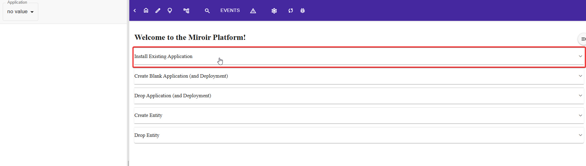
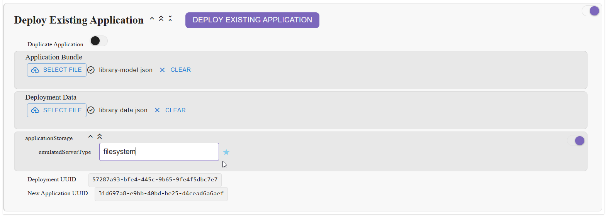
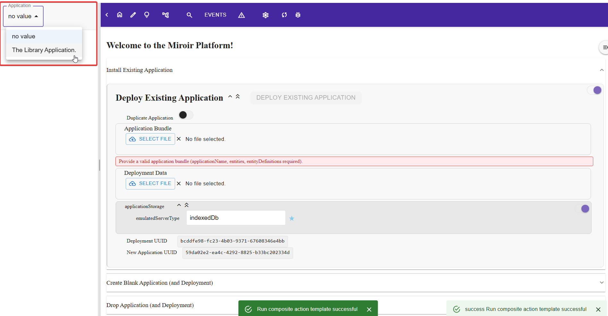
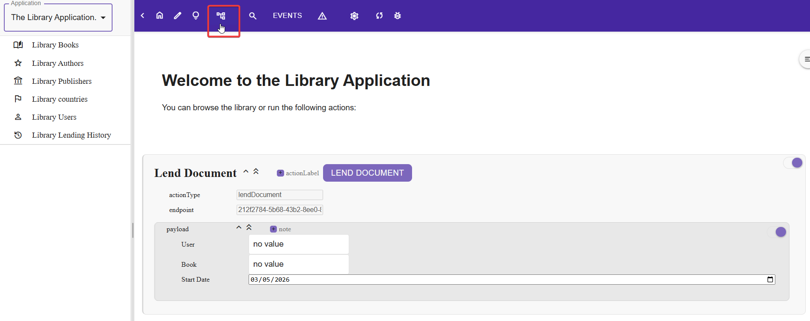
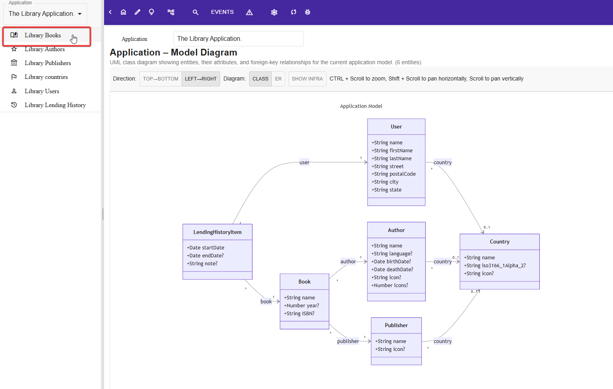
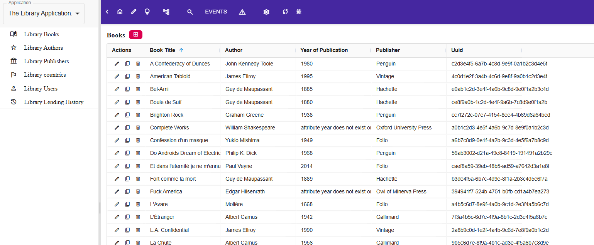

# Quickstart Guide

**Estimated time: 5 minutes**

Get up and running with Miroir Framework in under 5 minutes with the standalone app, or explore other solutions (access a local Miroir server through a browser, deploy on a local network, etc.).

---

## Prerequisites

The current Operating systems are supported for standalone application deployment (via [Electron](https://github.com/electron/electron/blob/v40.6.1/README.md#platform-support)):

- Linux:
  - Ubuntu 18.04 and newer
  - Fedora 32 and newer
  - Debian 10 and newer
- Windows 10 and up
- macOS (Monterey and up)

---

## Miroir Installation

The fastest way to get up and running is to use the standalone app available for your platform. Alternatively, you can [deploy Miroir as a service](./installation.md) or [build Miroir from scratch](./installation.md)

### 1. Download the binary for your platform and install it

Go [there]() to download the latest available binaries of the standalone app.


## Running Miroir

Once you've installed the Miroir standalone app and run it, you may deploy your first Miroir application.

Download the Library application [Model](https://github.com/miroir-framework/miroir/releases/download/untagged-8eb448b720da212062bb/library-model.json) and [sample data](https://github.com/miroir-framework/miroir/releases/download/untagged-8eb448b720da212062bb/library-data.json)

### Deploy the Library Application in Miroir

On the home page (click on the `Home` when the application selector equals `no value` to reach it) use the **Install Existing Application** runner:



Select the **library-model.json** and **library-data.jaon** files, and deploy the application on the filesystem:



Once the installation is over, you'll get a green notification of success, then you can select the deployed application, and its Home page will be displayed.



**the created deployment resides in the installation directory, under the `resources/miroir-assets` subdirectory.**


### Display the current Model of the Library Application

Once on the homepage of the Library application, you may start exploring what it does, and how it works. First review tha application's `Model` by clicking the on model icon in the application bar:



When you display the model, you can see that the library application can manipulate `Authors`, `Books`, `Publishers` and `users`, which retain their intuitive meaning in that context:



You can Display the Books in the Library Catalog by clicking on the left Menu bar icon:




### Further Exploring the Library Application


To learn more about Miroir applications, go to the [Library Tutorial](../tutorials/library-tutorial.md)

---

## Common Issues

### Port Already in Use

When using the Miroir server, a "zombie" server may run already.

**Problem**: `Error: listen EADDRINUSE: address already in use :::5173`

**Solution**: Kill the process using the port:
```bash
# Windows (Git Bash)
netstat -ano | findstr :5173
taskkill /PID <PID> /F

# Linux/Mac
lsof -ti:5173 | xargs kill -9
```

---

## What's Next?

**You've successfully:**

- ✅ Installed Miroir
- ✅ deployed the Library example application with an example dataset


**Continue your journey:**

📚 **[Library Tutorial](../tutorials/library-tutorial.md)** - Comprehensive hands-on guide
🎓 **[Core Concepts](../guides/core-concepts.md)** - Deep dive into Miroir architecture
💻 **[Developer Guide](../guides/developer/creating-applications.md)** - Build your own app
📖 **[Full Documentation](../index.md)** - Complete documentation index

---

**[← Back to Documentation Index](../index.md)**
