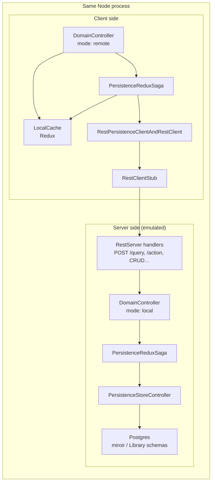
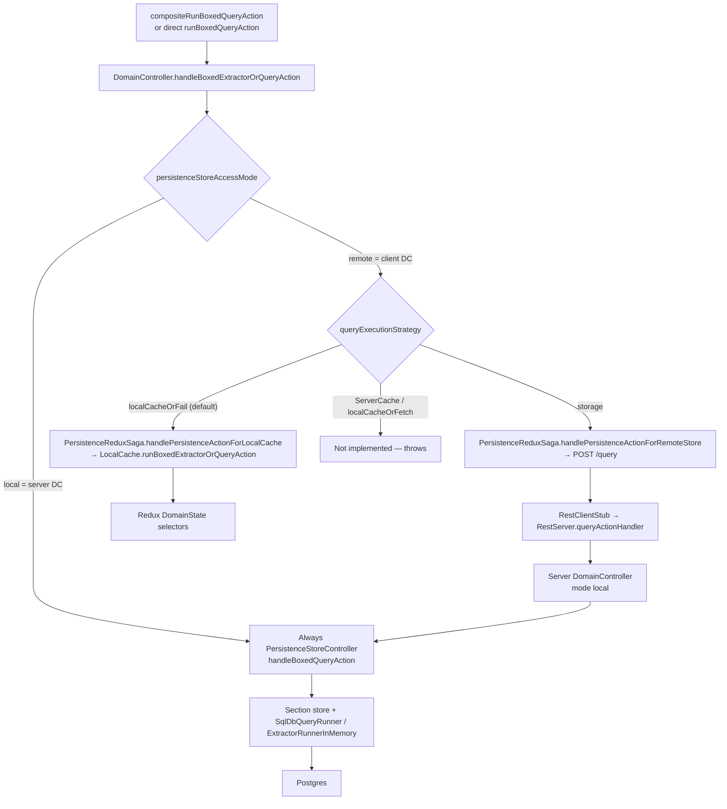
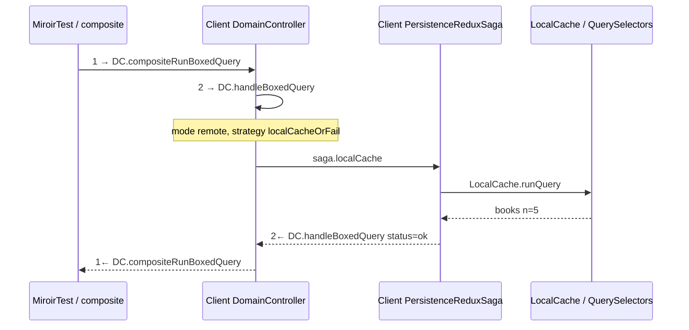
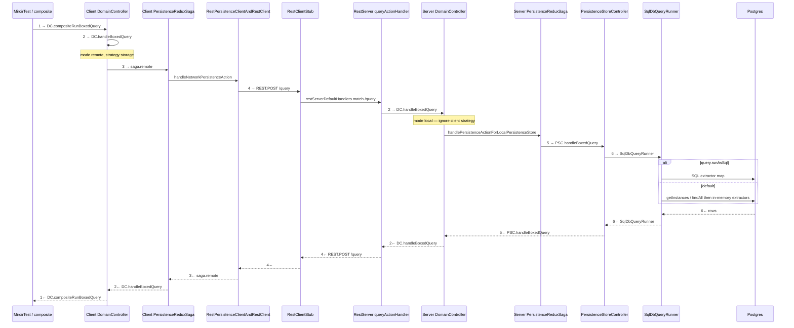

# Workflow: `runBoxedQueryAction` on an emulated server

This is the first document in a series of **action-workflow** notes. Each note traces one action through one runtime profile, with enough detail to read logs and enough structure to copy for the next action or profile.

**This note:** `runBoxedQueryAction` (the boxed “run a Query” action) on **emulated server + SQL**.

**Audience:** someone new to the framework who has a log dump and wants a consistent picture of who talks to whom.

**Grounding run:** MiroirTest leaf `Refresh all Instances` in suite `domainController.data.crud` (`domain_controller_data_crud`), profile `emulatedServer-sql`. Reproduce with:

```bash
npm run testMiroir -w miroir-standalone-app -- \
  --profile emulatedServer-sql \
  --suites domain_controller_data_crud \
  --mode integ \
  --filter '{"domainController.data.crud":["Refresh all Instances"]}'
```

---

## 1. What “emulated server” means

There is **no HTTP server process** and **no real network**. One Node process builds **two** `DomainController` instances and a stub that pretends to be REST:

| Role | Object | `persistenceStoreAccessMode` | Talks to |
|------|--------|------------------------------|----------|
| **Client** | `domainControllerForClient` | `"remote"` | Client `LocalCache` (Redux) **and** a REST facade |
| **Server** | `domainControllerForServer` | `"local"` | `PersistenceStoreController` → Postgres |
| **Network stand-in** | `RestClientStub` | — | In-process call to the same `restServerDefaultHandlers` a real `miroir-server` would use |

Wiring lives in `packages/miroir-standalone-app/src/miroir-fwk/4-tests/setupMiroirTest.ts`. Both controllers share one `MiroirContext` (same activity tracker / logger context). The stub is given the **server** controller and the **server** `PersistenceStoreControllerManager`.



A **real server** profile (`realServer-sql`) keeps the same REST contract (`POST /query`, `POST /action/:actionType`, …) but replaces `RestClientStub` with `RestClient` + HTTP to `miroir-server`. That profile is out of scope here.

---

## 2. Name map (logs vs conversation)

People (and this series) say “PersistenceStoreRunner”. The code uses several classes. When you grep logs, match on the **logger name**, not the informal name.

| Informal name | Actual type | Logger name | Layer |
|---------------|-------------|-------------|-------|
| Client DomainController | `DomainController` | `3_miroir-core_DomainController` | 3 |
| Client localCache | `LocalCache` + `LocalCacheSlice` | `4_miroir-localcache-redux_LocalCache`, `…_LocalCacheSlice` | 4 |
| Client PersistenceStoreRunner / saga | `PersistenceReduxSaga` | `4_miroir-localcache-redux_PersistenceReduxSaga` | 4 |
| REST facade | `RestPersistenceClientAndRestClient` | `4_miroir-localcache-redux_RestPersistenceClientAndRestClient` | 4 |
| Network / stub | `RestClientStub` | `4_miroir-core_RestClientStub` | 4 |
| REST dispatch | `queryActionHandler` / `restActionHandler` | `4_miroir-core_RestServer` | 4 |
| Server DomainController | same class, other instance | `3_miroir-core_DomainController` | 3 |
| Server PersistenceStoreRunner | `PersistenceStoreController` | `4_miroir-core_PersistenceStoreController` | 4 |
| Storage query runner | `SqlDbQueryRunner` / `ExtractorRunnerInMemory` | `4_miroir-store-postgres_…`, `2_miroir-core_ExtractorRunnerInMemory` | 4 / 2 |
| In-cache query selectors | `QuerySelectors`, `DomainStateQuerySelector` | `2_miroir-core_QuerySelectors`, `2_miroir-core_DomainStateQuerySelector` | 2 |

Logger names are `{cleanLevel}_{package}_{Class}` (see `MiroirLoggerFactory.getLoggerName`). Clean levels follow the folder: `2_domain`, `3_controllers`, `4_services`.

---

## 3. The action that is actually being run

`Refresh all Instances` is a **composite** test, not a lone query. Sequence from the MiroirTest JSON:

1. `rollback` on Miroir (`360fcf1f-…`) — “refresh” client cache from storage.
2. `rollback` on Library (`5af03c98-…`) — same for the Library deployment.
3. `compositeRunBoxedQueryAction` named `calculateNewEntityDefinionAndReports`, result bound as `entityBookList`.
4. Assertions (`checkNumberOfBooks` expects 5, then the book list).

The inner query is:

```json
{
  "actionType": "runBoxedQueryAction",
  "endpoint": "9e404b3c-368c-40cb-be8b-e3c28550c25e",
  "payload": {
    "application": "5af03c98-fe5e-490b-b08f-e1230971c57f",
    "applicationSection": "data",
    "query": {
      "queryType": "boxedQueryWithExtractorCombinerTransformer",
      "extractors": {
        "books": {
          "extractorOrCombinerType": "extractorInstancesByEntity",
          "parentUuid": "e8ba151b-d68e-4cc3-9a83-3459d309ccf5"
        }
      }
    }
  }
}
```

There is **no** `queryExecutionStrategy` on this leaf. The client default is **`localCacheOrFail`**. So the query itself never goes to Postgres. The thousands of SQL lines in the log are **session bootstrap + rollback**, not the query.

That default is intentional: transactional / model scripts mutate the client cache until `commit`. Querying storage would hide uncommitted work.

---

## 4. Bird’s-eye: two ways a query can run

`DomainController.handleBoxedExtractorOrQueryAction` is the fork. Client vs server is `this.persistenceStoreAccessMode`. Strategy is `payload.queryExecutionStrategy`.



`ServerCache` and `localCacheOrFetch` currently throw. Only `localCacheOrFail` and `storage` are live.

### 4.1 Execution-block catalog

Hop numbers live in **this document** (sequence-diagram edges). Logs use **block names**, not those numbers. Runtime `spanId` (`s4`, `s5`, …) is assigned per run and must not be frozen here.

Direction in the log prefix: `>` enter, `.` interior, `<` exit. Same `spanId` on that hop’s `>` and `<`.

| Doc hop | Block name (log) | Layer | Path A | Path B | `>` / `<` in logs today |
|---------|------------------|-------|--------|--------|-------------------------|
| 1 / 1← | `DC.compositeRunBoxedQuery` | client DC | yes | yes | yes |
| 2 / 2← | `DC.handleBoxedQuery` | client or server DC | yes (client) | yes (client, then again on server) | yes (enter includes `strategy=` `mode=`) |
| 3 / 3← | `saga.remote` | client PersistenceReduxSaga | no — `saga.localCache` instead | yes | yes |
| 4 / 4← | `REST.POST /query` | RestServer `queryActionHandler` | no | yes | yes |
| 5 / 5← | `PSC.handleBoxedQuery` | PersistenceStoreController | no | yes | yes (enter `section=`, exit sizes) |
| 6 / 6← | `SqlDbQueryRunner` | storage | no | yes | yes |

Path A after hop 2: `DC.handleBoxedQuery` → `saga.localCache` → `LocalCache.runQuery` (QuerySelectors on Redux). No REST, no Postgres for the query itself.

---

## 5. Path A — what `Refresh all Instances` actually does

This is the path you will see in a log of this leaf.

### 5.1 Before the query: `rollback` fills the client cache

`rollback` is **not** a query, but it is why the query can stay on the client. Client `DomainController.handleModelAction` → `loadConfigurationFromPersistenceStore`:

1. Client mode is `"remote"`, so each entity collection is read with `RestPersistenceAction_read`.
2. That goes through **client saga → REST facade → `RestClientStub` → server handlers → server DomainController / PersistenceStoreController → Postgres `SELECT`**.
3. Returned instances are written into the **client** Redux cache (`loadNewInstancesInLocalCache` / `LocalCacheSlice`).
4. A second `rollback` on the client cache (`LocalCache.handleLocalCacheAction`) resets undo/redo to the freshly loaded snapshot.

Log signatures for this phase:

| You see | Meaning |
|---------|---------|
| `3_miroir-core_DomainController### DomainController handleAction START actionType= rollback` | Client (or server) DC entered `handleAction` |
| `4_miroir-core_RestClientStub### RestClientStub call … method= post` then `found methodToCall` | In-process “HTTP” hop |
| `4_miroir-core_PersistenceStoreController### … getInstances section data entity` | Server store listing instances |
| `Executing (default): SELECT …` | Sequelize talking to Postgres |
| `4_miroir-localcache-redux_LocalCache### LocalCache handleAction` with `loadNewInstancesInLocalCache` | Client cache ingest |
| `DomainController loadConfigurationFromPersistenceStore completed successfully` | That application’s rollback finished |

This phase is **verbose**. One rollback walks every model/data/modelVersion entity. Do not look for `runBoxedQueryAction` until you see `handleCompositeAction compositeActionSequence handling sub action` with `compositeRunBoxedQueryAction`.

### 5.2 The query: client cache only

After both rollbacks:



Steps:

1. `handleCompositeAction` unwraps `compositeRunBoxedQueryAction` and calls `handleCompositeRunBoxedQueryAction` (**hop 1**).
2. That calls `handleBoxedExtractorOrQueryAction` with the inner `runBoxedQueryAction` (**hop 2**).
3. Client DC is `"remote"` and strategy defaults to `localCacheOrFail`.
4. `PersistenceReduxSaga.handlePersistenceActionForLocalCache` → `LocalCache.runBoxedExtractorOrQueryAction`.
5. `getDomainStateExtractorRunnerMap()` + `runQuery` walk extractors **synchronously** on Redux `DomainState`.
6. `extractorInstancesByEntity` for Book becomes `selectEntityInstanceUuidIndexFromDomainState` / list extract on deployment `f714bb2f-…`, section `data`, entity `e8ba151b-…`.
7. Result `{ books: [ five Book instances ] }` is stored in the composite context as `entityBookList`.

Log signatures (grounding run after slices 0–2). `K7X2NQ` / `s4` / `s5` are examples; copy the tokens from your dump:

```
#K7X2NQ.s4># → DC.compositeRunBoxedQuery
#K7X2NQ.s5># → DC.handleBoxedQuery strategy=localCacheOrFail mode=remote
#K7X2NQ.s6># → saga.localCache
#K7X2NQ.s6<# ← saga.localCache status=ok
#K7X2NQ.s5<# ← DC.handleBoxedQuery status=ok
#K7X2NQ.s4.# … handleCompositeRunBoxedQueryAction adding result to context as entityBookList
#K7X2NQ.s4<# ← DC.compositeRunBoxedQuery status=ok
```

Payload dumps (`JSON.stringify(action)`, LocalCache / QuerySelectors query bodies) are **DEBUG**. At INFO you should see the enter/exit pair per hop, plus the composite “adding result to context as …” line.

**What you will not see on this leaf:** `RestClientStub` for `/query`, `PersistenceStoreController.handleBoxedQueryAction`, or a `SELECT` on `"Library"."Book"` caused by the query itself. Hops 3–6 are Path B only.

### 5.3 After the query: assertions

`compositeRunTestAssertion` reads `entityBookList.books` from the composite context. Logger context switches to `checkNumberOfBooks`. That is test machinery, not the query pipeline.

---

## 6. Path B — `queryExecutionStrategy: "storage"` (full stack)

This is the path a newcomer usually *imagines* when they say “run a query on the emulated server”. Other leaves in the same suite (and model CRUD) set `"storage"` explicitly. Walk it once so storage logs make sense.



Hop **2** runs twice on Path B: client DC, then server DC (same block name). Client and server share one logger name; tell them apart by **neighbors** (stub / RestServer sit between the two DC bursts).

Layer by layer (hop numbers match §4.1):

1. **Client DomainController (hops 1–2)** — `handleCompositeRunBoxedQueryAction` then `handleBoxedExtractorOrQueryAction`, `case "storage"`: `handlePersistenceActionForRemoteStore`.
2. **Client saga (hop 3)** — Redux-saga generator `handlePersistenceActionForRemoteStore`. Access mode `"local"` is forbidden here (that is the server). It calls `innerHandlePersistenceActionForRemoteStore`.
3. **REST facade + stub (hop 4)** — `runBoxedQueryAction` maps to `POST /query` with `{ action, applicationDeploymentMap }`. `RestClientStub.call` finds `{ method: "post", url: "/query", handler: queryActionHandler }` and invokes it in-process with the **server** DC. The return is wrapped as `{ status: 200, data: result }` to look like `fetch`.
4. **RestServer** — `queryActionHandler` unwraps `body.action` and calls **server** `domainController.handleBoxedExtractorOrQueryAction` (**hop 2** again).
5. **Server DomainController** — `persistenceStoreAccessMode == "local"`: **ignores** client strategy and always uses `handlePersistenceActionForLocalPersistenceStore`.
6. **Server saga** — `runBoxedQueryAction` → `localPersistenceStoreController.handleBoxedQueryAction`.
7. **PersistenceStoreController (hop 5)** — picks model vs data vs modelVersion section from `payload.applicationSection`, delegates to that section store.
8. **Storage runner (hop 6)** — Postgres: `SqlDbInstanceStoreSectionMixin` → `SqlDbQueryRunner.handleBoxedQueryAction`. If `query.runAsSql` is set, extractors compile toward SQL; otherwise `ExtractorRunnerInMemory` issues store reads (`getInstances` / `findAll`) and runs extractors/combiners/transformers in memory.

Log signatures to look for on this path (INFO enter/exit; payloads at DEBUG):

```
#K7X2NQ.s4># → DC.compositeRunBoxedQuery
#K7X2NQ.s5># → DC.handleBoxedQuery strategy=storage mode=remote
#K7X2NQ.s6># → saga.remote
#K7X2NQ.s7># → REST.POST /query
#K7X2NQ.s8># → DC.handleBoxedQuery strategy=storage mode=local
#K7X2NQ.s9># → PSC.handleBoxedQuery section=data
#K7X2NQ.s10># → SqlDbQueryRunner
#K7X2NQ.s10<# ← SqlDbQueryRunner status=ok books=5
#K7X2NQ.s9<# ← PSC.handleBoxedQuery status=ok books=5
#K7X2NQ.s8<# ← DC.handleBoxedQuery status=ok
#K7X2NQ.s7<# ← REST.POST /query status=ok books=5
#K7X2NQ.s6<# ← saga.remote status=ok
#K7X2NQ.s5<# ← DC.handleBoxedQuery status=ok
#K7X2NQ.s4<# ← DC.compositeRunBoxedQuery status=ok
```

Sequelize SQL is DEBUG (`SqlDbStore` `logging` callback). Client vs server `DC.handleBoxedQuery`: the second burst sits **inside** `REST.POST /query` and has `mode=local`.

Client and server DomainControllers share one logger name. Distinguish them by **neighbors**: stub/RestServer lines sit **between** the two DC bursts; `PersistenceStoreController` / Sequelize sit on the server side only.

---

## 7. How to read a log line

Typical interior line (after slices 0–5):

```
#K7X2NQ.s5.# #domainController.data.crud-Refresh all Instances-Refresh all Instances-*-runBoxedQueryAction# query [22:41:27] info 3_miroir-core_DomainController### …
```

Enter / exit (same span, opposite direction):

```
#K7X2NQ.s5># → DC.handleBoxedQuery strategy=localCacheOrFail mode=remote
#K7X2NQ.s5<# ← DC.handleBoxedQuery status=ok
```

| Piece | Meaning |
|-------|---------|
| `#K7X2NQ.s5.#` | Run token: `#{runId}.{spanId}{dir}#` — `>` enter, `.` interior, `<` exit. No span yet: `#K7X2NQ.-.#`. No run: `#*NoRun*.-.#` |
| `#domainController.data.crud-Refresh all Instances-…#` | Legacy labels: `testSuite-test-testAssertion-compositeAction-action` |
| `query` / `rollback` / `assertion` / `bootstrap` / `*` | `phase` on `LoggerGlobalContext` (after the label block) |
| trailing `runBoxedQueryAction` | `LoggerGlobalContext.setAction(actionType)` — you are **inside** that action |
| trailing `*` | No current action on the context (bootstrap, or action finished) |
| `[22:41:27]` | Local time |
| `info` | Level |
| `4_miroir-localcache-redux_LocalCache` | `{layer}_{package}_{logger}` |
| `###` | Separator before the message |
| `→ {block}` / `← {block} status=` | Enter / exit of a catalog hop (see §4.1). Block names, not diagram numbers |

A leaf also prints banners you can copy into grep:

```
RUN K7X2NQ START
…
RUN K7X2NQ END status=ok
```

Bootstrap / rollback often get **their own** `RUN …` tokens (standalone `trackAction` before the leaf context). The query hops for this leaf share the runId that appears next to `#domainController.data.crud-Refresh all Instances-…#`.

Vitest prefixes blocks with:

```
stdout | miroir-runner-tests.integ.test.ts > Refresh all Instances
```

That title is the **leaf**, not the logger context. Prefer `runId` when dumps are concatenated.

### 7.1 Grep recipes

Copy `runId` from `RUN … START`, from any `#??????.sN.#` prefix (six Crockford-base32 characters, no `I L O U`), or from the Events timeline chip (same `#runId.spanId>` / `<` tokens). A failed CLI leaf also writes `miroir-run-{runId}-error.json` (`MIROIR_RUN_EXPORT_DIR` or cwd).

**Log presets:** `specificLoggersConfig_orientation.json` (INFO on DC/saga/stub only; WARN elsewhere) for readable hop lines; `specificLoggersConfig_query-debug.json` for payload dumps at DEBUG. See [testing.md — Logger config options](../../reference/testing.md#logger-config-options).

```bash
# whole leaf / run (all spans, enter + interior + exit)
grep K7X2NQ logs.txt

# one hop (enter, interior, exit) — use the span from the line you care about
grep 'K7X2NQ.s5' logs.txt

# enter only / exit only
grep 'K7X2NQ.s5>' logs.txt
grep 'K7X2NQ.s5<' logs.txt

# Path A query pair by block name (span ids vary)
grep 'DC.compositeRunBoxedQuery' logs.txt
grep 'DC.handleBoxedQuery' logs.txt

# isolate this leaf among concatenated dumps (suite + leaf labels)
grep 'domainController.data.crud-Refresh all Instances' logs.txt
```

Nested children have their own `spanId`. Reconstruct parent + children by taking every line with that `runId` **between** the parent span’s `>` and `<`.

**Rollback vs query (slice 5):** `phase` is `rollback` then `query` then `assertion`. Each application rollback emits **one INFO line per section** (`rollback application=… section=data entities=N instances=M`). Per-entity `getInstances` and Sequelize `Executing (default):` are DEBUG.

**Noise you can skip when hunting a query:**

- Other `RUN` tokens before the leaf (session `initModel` / playfield seed, `phase=bootstrap`).
- Redux “non-serializable value” warnings (`Date` on `timestamp`).

**Anchor lines for this leaf:** `RUN {runId} START` next to the suite/leaf labels, then `rollback application=` summaries, then `#….sN># → DC.compositeRunBoxedQuery`.

---

## 8. Component cheat sheet

### Client `DomainController`

Entry: `handleAction` → `handleActionInternal` → for a sequence, `handleCompositeAction`. Queries are not `handleAction` of `runBoxedQueryAction` at the top level; they are **sub-actions** of `compositeActionSequence`.

Important methods:

- `handleBoxedExtractorOrQueryAction` — strategy fork (client) or always-storage (server).
- `handleCompositeRunBoxedQueryAction` — runs the inner query, stores `returnedDomainElement` under `nameGivenToResult`.
- `loadConfigurationFromPersistenceStore` — implementation of `rollback` / cache refresh.

### Client `PersistenceReduxSaga`

Three doors, easy to confuse:

| Method | Used for |
|--------|----------|
| `handlePersistenceActionForLocalCache` | Boxed query on Redux state (`localCacheOrFail`) |
| `handlePersistenceActionForRemoteStore` | Anything that must look like HTTP (`storage` queries, `RestPersistenceAction_read`, model actions sent to the server) |
| `handlePersistenceActionForLocalPersistenceStore` | **Server** DC talking to `PersistenceStoreController` |

Queries on the client cache **do not** `dispatch` a saga for the extract itself: `handlePersistenceActionForLocalCache` calls `this.localCache.runBoxedExtractorOrQueryAction` directly.

### Client `LocalCache`

Redux store of instances, keyed by `deploymentUuid_section_entityUuid`. `runBoxedExtractorOrQueryAction` takes a snapshot (`getDomainState()`) and runs the **sync** extractor map. No I/O.

`handleAction` / `handleLocalCacheAction` is the **write** path (ingest after rollback, undo/redo). Mixing the two in your head is a common log-reading mistake: `LocalCache action=` with `runBoxedQueryAction` is a **read**; `LocalCache handleAction` with `loadNewInstancesInLocalCache` is a **write**.

### Saga / “network”

`RestPersistenceClientAndRestClient.handleNetworkPersistenceAction` chooses URL by `actionType`:

- `runBoxedQueryAction` → `POST /query`
- `runBoxedQueryTemplateAction` → `POST /queryTemplate`
- most model/instance/store actions → `POST /action/:actionType`
- CRUD REST → `/CRUD/:deploymentUuid/:section/…`

`RestClientStub` does **not** serialize to the wire. It looks up `restServerDefaultHandlers` by `(method, rawUrl)` and calls the handler. Same handler table as `miroir-server`.

### Server `DomainController`

Same class. `persistenceStoreAccessMode: "local"` means “I own a PersistenceStoreControllerManager; I do not call REST.” Incoming `/query` always hits storage, even if the client payload still says `localCacheOrFail` (the client would not have sent it in that case).

### Server `PersistenceStoreController` / storage runner

One controller per **deployment** (Miroir vs Library vs Admin), with **sections** (model, data, modelVersion). `handleBoxedQueryAction` refuses to run if `applicationSection` is missing, then delegates to that section’s instance store.

Postgres section mixin forwards to `SqlDbQueryRunner`. Filesystem / IndexedDB / Mongo each have their own `ExtractorOrQueryPersistenceStoreRunner`. The interface is `handleBoxedQueryAction(query, applicationDeploymentMap, modelEnvironment)`.

---

## 9. Why this leaf is a good first log, and where it misleads

**Good:** you see rollback (full client↔stub↔server↔Postgres) and then a clean in-cache query, in one file. You can tell the two phases apart.

**Misleading if you only skim SQL:** most SQL is bootstrap and `getInstances` during rollback. The query that the test asserts on did **not** produce those `SELECT`s.

**To force Path B in a later note:** add `"queryExecutionStrategy": "storage"` on the `runBoxedQueryAction` payload (as other leaves in this suite already do) and look for `RestClientStub` + `handleBoxedQueryAction` + `SELECT` **after** the composite query sub-action, not only during rollback.

---

## 10. Series slots (not written yet)

Copy this file’s section shape (topology → name map → sequence → log signatures → cheat sheet) for:

| Slot | What changes |
|------|----------------|
| `runQuery` + `emulatedServer-filesystem` / `-mongodb` / `-indexedDb` | Storage runner class and SQL vs files vs IndexedDB log texture; stub wiring stays |
| `runQuery` + `realServer-sql` | `RestClient` + HTTP; two processes; server logs live in the server process |
| `rollback` / `commit` / `createInstance` | Different REST URL (`/action/:actionType`); cache writes; transactions |
| `runBoxedQueryTemplateAction` | `/queryTemplate`; extra template-resolution step |
| `runAsSql: true` | `SqlDbQueryRunner` SQL extractor map instead of in-memory-over-reads |

Parent index: [Architecture Overview](../architecture.md).
