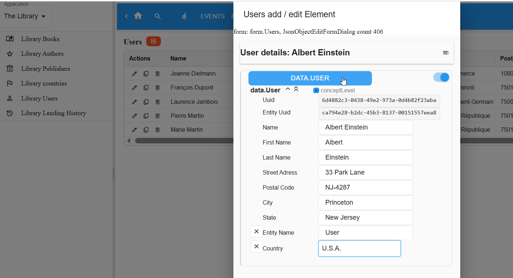
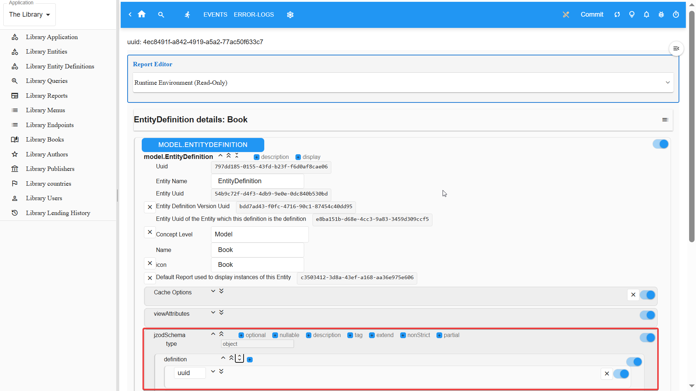
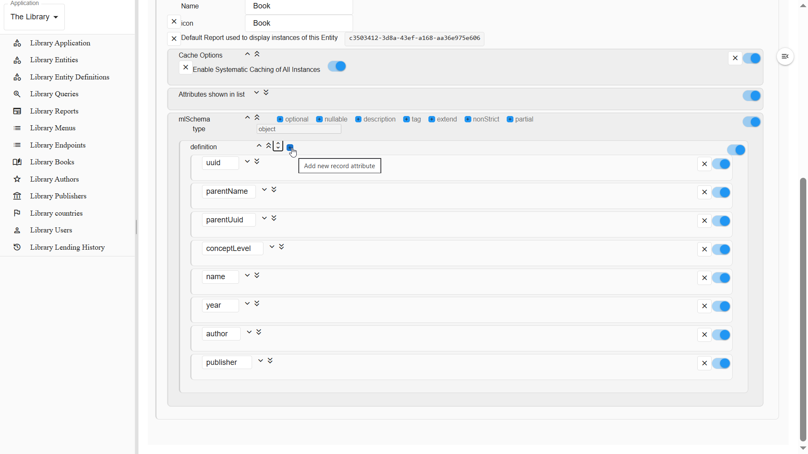
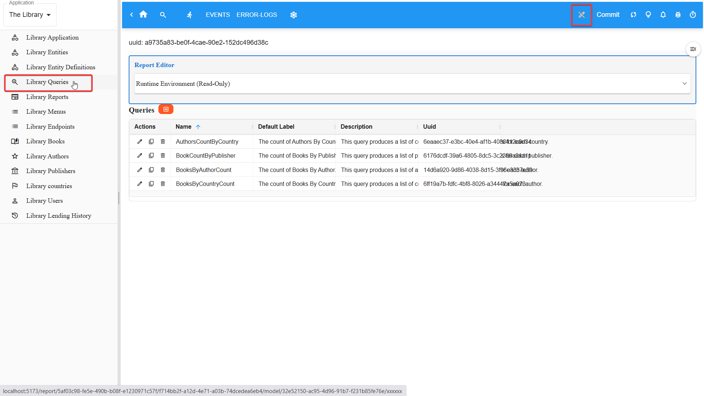
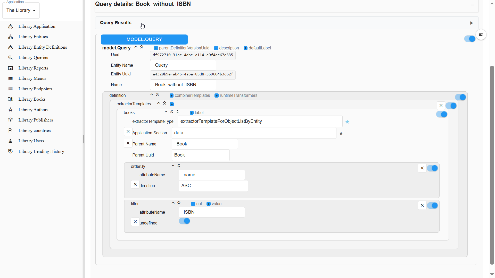
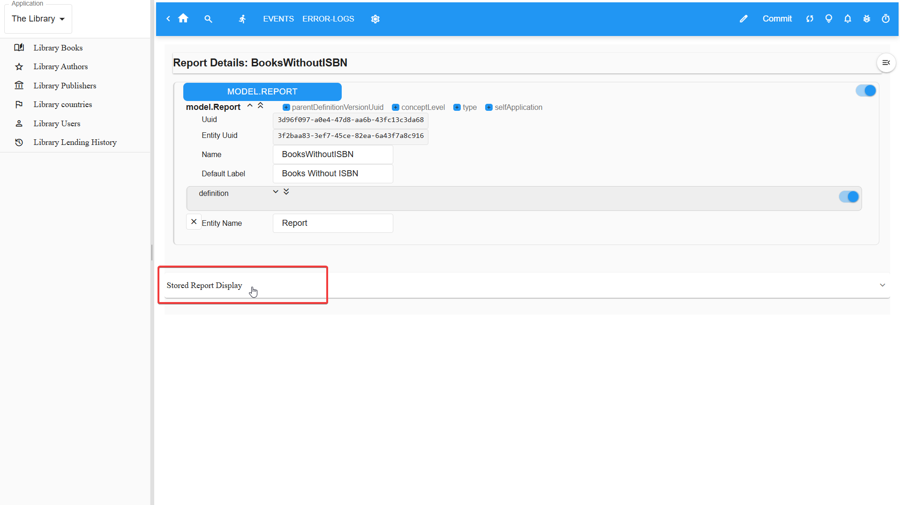
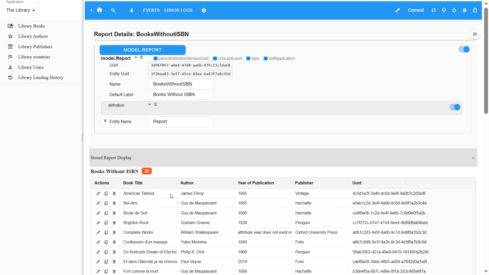
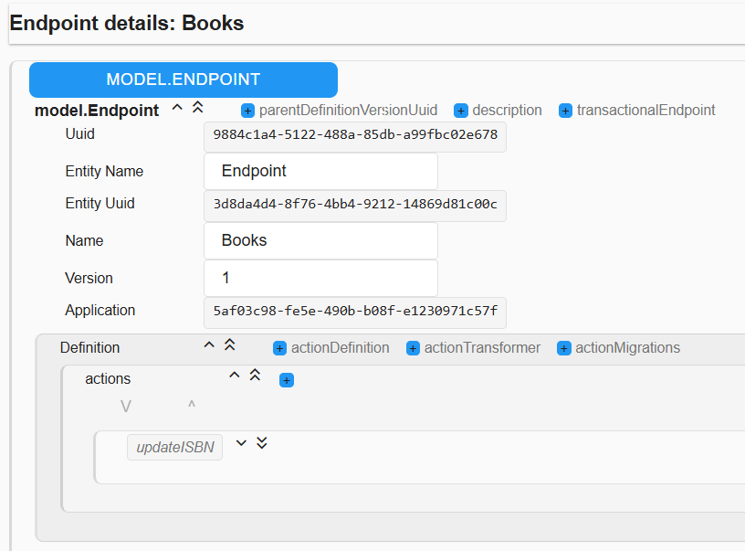
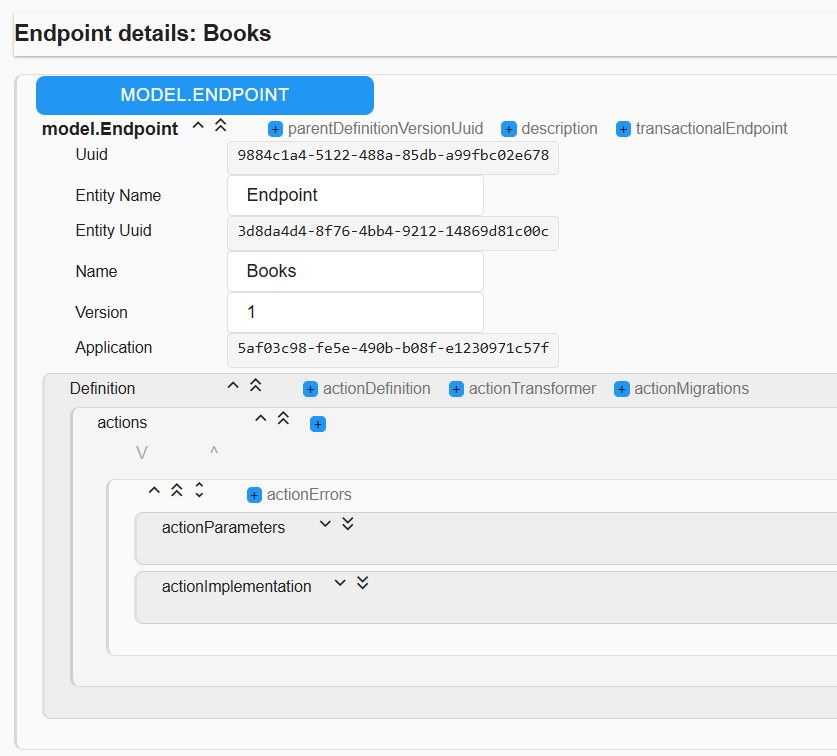

# Miroir: The Library Tutorial

This tutorial introduces the Miroir Framework through a concrete example: a Library application. You'll learn by doing - starting with basic operations, then discovering how Miroir's architecture makes them possible.

We assume you have a working Miroir Framework instance. If not, follow the setup documentation [here TBW](//https://github.com/miroir-framework/miroir).

## Getting Started

### Deploy the Library Application

TBW

### Load the Example Data

TBW

## Part 1: Discovering the Library Application

### The Home Page


The interface has three main areas:

- **Left**: The catalogue menu for browsing data
- **Top**: The application bar
- **Center**: The current view (a Report)

### Browsing Data Through Entities


The Library organizes its data into **Entities** - collections of related instances with a common structure:

- **Book** - volumes in the library's collection
- **Author** - book creators, with name, nationality, and dates
- **Publisher** - book publishers
- **User** - library members
- **LendingHistoryItem** - records when some Book has been borrowed by some user (incl. out and return dates)
- **Country** - ancillary concept referenced by Authors and Publishers

Each menu item enables the display of instances for one Entity.

### Working with Users

Click "Library Users" in the catalogue menu to see the Users' list Report:


#### Viewing User Details

Click on the name a user in the list to see the report displaying its full information, with the form:


Miroir manipulates data in the [JSON](https://en.wikipedia.org/wiki/JSON) format. The JSON format for the displayed user can be shown using the above-highlighted switch on the top-right corner.


#### Modifying a User

Modification on data is possible directly in the details Report, in the form or in the JSON display. Validate your changes by clicking on the blue button on top:


A confirmation is displayed, and the value modified persistently.


#### Creating a New User

Use the "New User" button:


You get a new user creation form, that you can fill out to add a new user. If you copy / paste the following JSON:

```json
{
  "uuid": "6d4882c3-0438-49e2-973a-0d4b82f23aba",
  "parentUuid": "ca794e28-b2dc-45b3-8137-00151557eea8",
  "name": "Albert Einstein",
  "firstName": "Albert",
  "lastName": "Einstein",
  "street": "33 Park Lane",
  "postalCode": "NJ-4287",
  "city": "Princeton",
  "state": "New Jersey",
  "parentName": "User",
  "country": "2eda1207-4dcc-4af9-a3ba-ef75e7f12c11"
}
```

you will get the following screen:



Upon validation, a success notification is displayed, and the added User can be seen in the Users' list.


#### Deleting a User

In the `UserList` report, find the `Delete` icon for the user you just added.


Confirm the Drop:

<!--  -->


A success message is displayed, and the user disappears from the Users' list.

### Going Further: How Does it Work?

We have introduced Entity and Report concepts, we now recap and introduce some of the other main concepts in Miroir.

When you clicked on the "Library Users" item in the menu:

1. The app displayed the `UserList` **Report**
2. The Report executed a **Query** to fetch all User instances
3. Miroir rendered the data using the Report's display specification and the `User` **Entity**'s declared attributes

When you updated, created or deleted a User:

1. The form submitted an update, create or delete **Action** 
2. The Action validated data against the User's **Entity** definition
3. Miroir persisted the instance through the configured store for the Application's **Deployment**
4. The UI refreshed automatically

All of this was configured through JSON declarations, not imperative code. We will now see how.

## Part 2: Working with Entities

We will show how to add an `ISBN` optional attribute to the `Book` Entity.

### Going into 'Design' Mode

Click on the pencil icon on the right of the app bar to enable `Design Mode`. The design mode enables altering the application itself, not only the data the application manipulates.


The 'report editor' is now shown on the top of the current view and the 'model' menu items are now shown on the left.


click on the `Library Entity Definitions` menu item.

### Editing the Book Entity Definition

In the lifetime of an application, the precise meaning of an identified concept often fluctuates. For example, we oversaw the necessity of knowing the ISBN of each book, extremely useful to communicate with book sellers.

Adding the ISBN will thus alter the definition of the `Book` entity, without altering the `Book` Entity itself.
<!-- Entities are versioned, enabling controlled evolution of the data model. -->
<!-- Example: The User EntityDefinition declares fields like `name`, `email`, `registrationDate`. -->

Click on the `Book` Entity Definition:


This displays the definition, in which the attributes of the Entity are shown:



Of special interest is the `mlSchema` attribute, that describes the structure of a `Book`:


A `Book` has the following attributes:

- **uuid**: Unique, primary identifier for the book. Every entity instance must have one.
- **parentName**: Name of the parent Entity or type (optional).
- **parentUuid**: Unique identifier of the parent Entity. Every Entity instance must point to its Entity through this attribute.
- **conceptLevel**: Level or type of concept (optional, `model` or `data`, usal objects are implicitly `data`).
- **name**: The name of the book (title).
- **year**: The year associated with the book (year of first publication).
- **author**: Reference to the author of the book.
- **publisher**: Reference to the publisher of the book.

The `name` is a simple `string`, that will be shown as `Book Title` in forms:


The `author` is a `uuid`, that is a reference to an instance of the `Author` Entity, a relationship commonly called a [Foreign Key](https://en.wikipedia.org/wiki/Foreign_key) in database systems:


The `foreignKeyParams` attribute in the `tag` informs the Miroir platform of the intended interpretation for the Foreign Key: in this case the given `uuid` shall be found as primary identifier for a `Book` instance. When selecting a book in the UI, the displayed list of books shall be sorted by the `name` attribute.

To add an attribute, click on the blue **+** icon:



Edit the attribute's definition to declare it a simple, **optional** string. **remember to declare it optional, because the existing Books do not have a value for it yet, and the structure check for them would otherwise fail!**


Validate when ready!


Now when displaying the Book details Report for a given book, an optional `ISBN` attribute can be added:


Try a value like `123456789` and you're done with Part 2! Congrats!

## Part 3: Working with Reports

<!-- We will demonstrate the creation of a new Report, based on the following use case: suppose we want to find the books that have never been borrowed. -->
We will demonstrate the creation of a new Report that will show the list of books that do not have an ISBN in our database yet.

In order to create this general-purpose Report, we are first going to create a Query, that can be used in the Report and later in other circumstances to help implementing new functions.

Reports are declarative. You describe **what** to show, not **how** to fetch or render it. Miroir handles the implementation. In turn, Queries are also declarative, they describe **which** data elements must be fetched, not **how** to fetch them.

### Working with Queries

A **Query** specifies what data to retrieve. Queries execute, in the following order:

- **Extractors** - fetch raw data from storage
- **Combiners** - join multiple extractors together
- **Transformers** - further shape the data (filter, map, aggregate)

Stored Queries are instances of the **Query** Entity, and have an **uuid** like any other Entity instance.

The existing Queries for the Library Application can be displayed by using the menu when the **Design Mode** is active (using the pencil icon in the app bar).



### Adding the *Book_Without_ISBN* Query

Add a new query by using the **"+"** icon on the Queries List. Fill it out with the following definition:

```json
{
  "uuid": "df972710-31ac-4dbe-a114-c0f4cc67e335",
  "parentName": "Query",
  "parentUuid": "e4320b9e-ab45-4abe-85d8-359604b3c62f",
  "name": "Book_without_ISBN",
  "definition": {
    "extractorTemplates": {
      "books": {
        "extractorOrCombinerType": "extractorForObjectListByEntity",
        "applicationSection": "data",
        "parentName": "Book",
        "parentUuid": "e8ba151b-d68e-4cc3-9a83-3459d309ccf5",
        "orderBy": {
          "attributeName": "name",
          "direction": "ASC"
        },
        "filter": {
          "attributeName": "ISBN",
          "undefined": true
        }
      }
    }
  }
}
```

Which looks like:




You can check the result of the Query by opening the `Query Results` section:


In our case, the book which we added an ISBN to is missing from the list, which validates our Query.

### Adding the *Book_Without_ISBN* Report

Add a new Report by using the **"+"** icon on the Report List:


 Fill it out with the following definition:

```json
{
  "uuid": "3d96f097-a0e4-47d8-aa6b-43fc13c3da68",
  "parentUuid": "3f2baa83-3ef7-45ce-82ea-6a43f7a8c916",
  "name": "BooksWithoutISBN",
  "defaultLabel": "Books Without ISBN",
  "definition": {
    "runStoredQueries": [
      {
        "storedQuery": "df972710-31ac-4dbe-a114-c0f4cc67e335",
        "label": "booksWithoutISBN"
      }
    ],
    "section": {
      "type": "list",
      "definition": [
        {
          "type": "objectListReportSection",
          "definition": {
            "parentUuid": "e8ba151b-d68e-4cc3-9a83-3459d309ccf5",
            "parentName": "Book",
            "fetchedDataReference": "books",
            "label": "Books Without ISBN"
          }
        }
      ]
    }
  },
  "parentName": "Report"
}
```

Which looks like:


To check that the Report Works, use the **Stored Report Display** at the bottom of the page:



In our case, the Book(s) to which you have added an ISBN must be missing from the list.



Congrats, you've finished part 3!

## Part 4: Working with Endpoints, Actions and Runners

We are now going to create an **updateISBN** Action and an **updateISBN** Runner for that Action, that will provide a dedicated interface to add missing ISBNs to our Books.

As a formal introduction, suffice to say that **Actions** provide a programmatic interface (API) to perform operations that change state:

- CRUD operations on data instances,
- CRUD operations on model elements such as Entities, Reports, Queries, Actions, etc.

Actions can execute Queries to access the existing state. Actions can be composed freely into sequences of actions, a sequence of action being itself an Action.

Actions are declared in **Endpoints** and run on the Miroir framework.

**Runners** provide a visual interface (UI) to run Actions (including sequences of Actions).

### Creating the **Books** Endpoint and **updateISBN** Action

Add the `Books` endpoint by clicking on the **+** sign on the `EndpointList` Report:


Use the following definition or seize its equivalent in the UI.

```json
{
  "uuid": "9884c1a4-5122-488a-85db-a99fbc02e678",
  "parentName": "Endpoint",
  "parentUuid": "3d8da4d4-8f76-4bb4-9212-14869d81c00c",
  "name": "Books",
  "version": "1",
  "application": "5af03c98-fe5e-490b-b08f-e1230971c57f",
  "definition": {
    "actions": [
      {
        "actionParameters": {
          "actionType": {
            "type": "literal",
            "definition": "updateISBN"
          },
          "application": {
            "type": "literal",
            "definition": "5af03c98-fe5e-490b-b08f-e1230971c57f"
          },
          "endpoint": {
            "type": "literal",
            "definition": "9884c1a4-5122-488a-85db-a99fbc02e678"
          },
          "payload": {
            "type": "object",
            "definition": {
              "book": {
                "type": "uuid",
                "tag": {
                  "value": {
                    "foreignKeyParams": {
                      "targetEntity": "e8ba151b-d68e-4cc3-9a83-3459d309ccf5"
                    },
                    "initializeTo": {
                      "initializeToType": "value",
                      "value": "31f3a03a-f150-416d-9315-d3a752cb4eb4"
                    }
                  }
                }
              },
              "ISBN": {
                "type": "string"
              }
            }
          }
        },
        "actionImplementation": {
          "actionImplementationType": "compositeActionTemplate",
          "definition": {
            "actionType": "compositeActionSequence",
            "endpoint": "1e2ef8e6-7fdf-4e3f-b291-2e6e599fb2b5",
            "application": "360fcf1f-f0d4-4f8a-9262-07886e70fa15",
            "payload": {
              "application": "31f3a03a-f150-416d-9315-d3a752cb4eb4",
              "definition": [
                {
                  "actionType": "compositeRunBoxedQueryAction",
                  "actionLabel": "getTargetBook",
                  "nameGivenToResult": "targetBook",
                  "queryTemplate": {
                    "actionType": "runBoxedQueryAction",
                    "application": "360fcf1f-f0d4-4f8a-9262-07886e70fa15",
                    "endpoint": "9e404b3c-368c-40cb-be8b-e3c28550c25e",
                    "payload": {
                      "application": "5af03c98-fe5e-490b-b08f-e1230971c57f",
                      "applicationSection": "data",
                      "query": {
                        "queryType": "boxedQueryWithExtractorCombinerTransformer",
                        "application": "5af03c98-fe5e-490b-b08f-e1230971c57f",
                        "pageParams": {},
                        "queryParams": {},
                        "contextResults": {},
                        "extractors": {
                          "targetBook": {
                            "label": "deployments of the application",
                            "extractorOrCombinerType": "extractorForObjectByDirectReference",
                            "parentUuid": "e8ba151b-d68e-4cc3-9a83-3459d309ccf5",
                            "parentName": "Deployment",
                            "applicationSection": "data",
                            "instanceUuid": {
                              "transformerType": "mustacheStringTemplate",
                              "interpolation": "build",
                              "definition": "{{payload.book}}"
                            }
                          }
                        }
                      }
                    }
                  }
                },
                {
                  "actionType": "updateInstance",
                  "actionLabel": "updateTargetBook",
                  "application": "360fcf1f-f0d4-4f8a-9262-07886e70fa15",
                  "endpoint": "ed520de4-55a9-4550-ac50-b1b713b72a89",
                  "payload": {
                    "application": "5af03c98-fe5e-490b-b08f-e1230971c57f",
                    "applicationSection": "data",
                    "objects": [
                      {
                        "parentUuid": "Book",
                        "applicationSection": "data",
                        "instances": [
                          {
                            "transformerType": "mergeIntoObject",
                            "interpolation": "runtime",
                            "applyTo": {
                              "transformerType": "getFromContext",
                              "interpolation": "runtime",
                              "referencePath": [
                                "targetBook",
                                "targetBook"
                              ]
                            },
                            "definition": {
                              "transformerType": "createObject",
                              "definition": {
                                "ISBN": {
                                  "transformerType": "getFromParameters",
                                  "referencePath": [
                                    "payload",
                                    "ISBN"
                                  ]
                                }
                              }
                            }
                          }
                        ]
                      }
                    ]
                  }
                }
              ]
            }
          }
        }
      }
    ]
  }
}
```

### Walking through the **Books** Endpoint

The Books endpoint defines only 1 Action, the **updateISBN** action:



Each Action defines an interface `actionParameters` and an implementation `actionImplementation`:



The interface has an envelope, which necessarily contain the unique `actionType` for the Action, the `application` and `Endpoint` to which it belongs. It also has a `payload` where the interesting things are: each **updateISBN** call must have a `book` and an `ISBN` attributes.


The implementation is a `compositeActionTemplate`, meaning that it is a composition of Actions, which undergo a step of parameter resolution, the formal parameters used in the composition being replaced by value arguments upon execution. This mechanism allows to access values upon execution, such as the ones defined in the interface of the Action, in our case the `book` to be modified, and the value to set its `ISBN` attribute to.


The `compositeActionSequence` contains only 2 Actions:

- the **getTargetBook** runs a query that fetches the details of the Book instance pointed to by the `book` parameter
- the **updateTargetBook** runs an **updateInstance** Action that replaces the old Book details with the modified version with the added `ISBN`.

### Creating the *updateISBN* Runner


Create the Runner according to the following definition:

```json
{
  "uuid": "5c707fe4-359a-4211-8653-8565a8af0c55",
  "application": "b5eebf00-8b11-453d-a667-7c337188162a",
  "parentName": "Runner",
  "parentUuid": "e54d7dc1-4fbc-495e-9ed9-b5cf081b9fbd",
  "name": "UpdateISBN",
  "defaultLabel": "UpdateISBN",
  "definition": {
    "runnerType": "actionRunner",
    "endpoint": "9884c1a4-5122-488a-85db-a99fbc02e678",
    "action": "updateISBN"
  }
}
```

Add the Runner to the homepage using the Report editor, it should look like this:


the definition for the Report section displaying the **updateISBN** Runner is:

```json
  {
    "type": "runnerReportSection",
    "definition": {
      "runnerReportSectionType": "storedRunner",
      "label": "updateISBN",
      "runner": "5c707fe4-359a-4211-8653-8565a8af0c55"
    }
  }
```

You may then use the Runner to add ISBN numbers to existing books with a simplified interface:


Go and check the result in the `Book Details` Report for the chosen Book:


Congrats, you've finished part 4!


<!-- ### Transformers: Pure Functions

**Transformers** are pure data transformation functions. They can:
- Filter collections
- Map values
- Aggregate data
- Compose into pipelines

The same Transformer can run client-side, server-side, or be converted to SQL - Miroir handles the translation. -->

<!-- ## Part 5: Batch Updates

Showing how to use Queries to perform batch updates of data and building tools in your application beyond the simple CRUD operations. -->

## What's Next?

You've seen how Miroir applications work from the outside and understand the core concepts. To go deeper:

- Examine the Library EntityDefinitions in `library_model/`
- Study the Report definitions
- Explore how Queries and Actions are declared
- Learn about the Transformers that we used in the Action implementation
- Try creating your own Entity

The power of Miroir lies in making applications declarative, introspective, and data-driven. Furthermore, one can edit an application while running it, without re-buiding and re-packaging this application (just like Smalltalk, but for the web).
