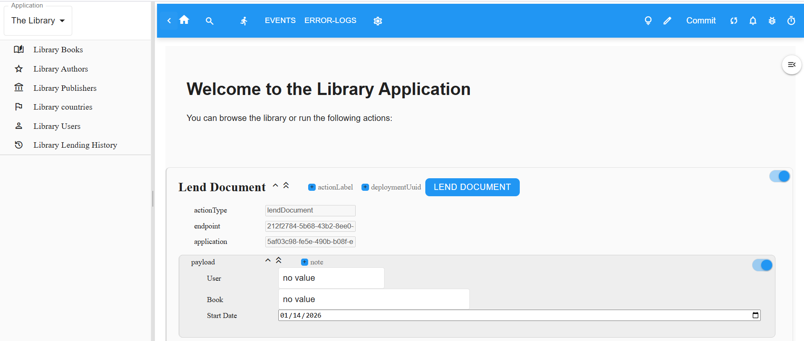
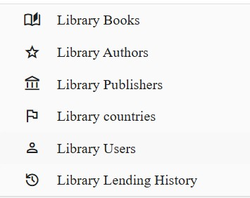

# The Library Tutorial

This tutorial introduces the Miroir Framework through a concrete example: a Library application. You'll learn by doing - starting with basic operations, then discovering how Miroir's architecture makes them possible.

We assume you have a working Miroir Framework instance. If not, follow the setup documentation [here TBW](//https://github.com/miroir-framework/miroir).

## Getting Started

### Deploy the Library Application

TBW

### Load the Example Data

TBW

## Part 1: Using the Library Application

### The Home Page

The interface has three main areas:
- **Left**: The catalogue menu for browsing data
- **Top**: The application bar
- **Center**: The current view (a Report)

### Browsing Data Through Entities

The Library organizes its data into **Entities** - collections of related items with a common structure:

- **Book** - volumes in the library's collection
- **Author** - book creators, with name, nationality, and dates
- **Publisher** - book publishers
- **User** - library members
- **Country** - referenced by Authors and Publishers

Each menu item displays instances of one Entity.

### Working with Users

Click "Library Users" in the catalogue menu to see the list:

#### Viewing User Details

Click on the name a user in the list to see its full information, which displays
the following form:

Miroir manipulates data in the [JSON](https://en.wikipedia.org/wiki/JSON) format. The JSON format for the displayed user can be shown using the above-highlighted switch on the top-right corner.

#### Modifying a User

Modification on data is possible (depending on the Entity definition that we will see below) directly, in the form or in the JSON display. Validate your changes by clicking on the blue button on top:

A confirmation is displayed, and the value modified persistently.

#### Creating a New User

TBW - Use the "New User" button

**What just happened?** You performed Create, Read, and Update operations without writing any code. Miroir provided these capabilities automatically based on the User Entity's definition.

## Part 2: Understanding Reports

The views you've been using are called **Reports** in Miroir. A Report declares:
- What data to fetch (a **Query**)
- How to display it (display sections)

### The User List Report

The User list is a Report that:
1. Queries all User instances
2. Displays them in a table format

### The User Details Report

The User details view is another Report that:
1. Queries a specific User by ID
2. Displays fields in a form layout

**Key insight**: Reports are declarative. You describe *what* to show, not *how* to fetch or render it. Miroir handles the implementation.

## Part 3: Miroir's Core Concepts

Now that you've used the Library app, let's understand what powers it.

### Entities and EntityDefinitions

An **Entity** is a concept in your domain (like "Book" or "Author"). Its **EntityDefinition** specifies the shape of its instances using Jzod schemas.

Example: The User EntityDefinition declares fields like `name`, `email`, `registrationDate`.

These definitions are stored as JSON, not hardcoded in TypeScript. This is what makes Miroir applications data-driven.

### The Meta-Model

Miroir has a special property: it defines itself using its own concepts.

- **Entity** is itself an Entity
- **EntityDefinition** is itself an EntityDefinition
- This bootstrapping enables Miroir to be fully introspective

### Model vs Data

Every Miroir application deployment stores two things:

**Model** (in `library_model/`):
- Entity and EntityDefinition declarations
- Queries, Reports, Actions definitions
- The structure of your application

**Data** (in `library_data/`):
- Actual instances: specific books, authors, users
- The content of your application

### Queries: Fetching Data

A **Query** specifies what data to retrieve. Queries combine:
- **Extractors** - fetch raw data from storage
- **Transformers** - shape the data (filter, map, aggregate)
- **Combiners** - merge multiple queries

Queries can execute in-memory (client/server) or in the database (for SQL backends).

### Actions: Modifying Data

**Actions** perform operations that change state:
- Create/update/delete Entity instances
- Modify the Model itself (add new Entities)

Actions are declared in **Endpoints** and executed by the framework.

### Transformers: Pure Functions

**Transformers** are pure data transformation functions. They can:
- Filter collections
- Map values
- Aggregate data
- Compose into pipelines

The same Transformer can run client-side, server-side, or be converted to SQL - Miroir handles the translation.

## Part 4: How It All Connects

When you clicked "Users" in the menu:

1. The app displayed the **User List Report**
2. The Report executed its **Query**
3. The Query used an **Extractor** to fetch all User instances
4. Miroir rendered the data using the Report's display specification

When you created a new User:

1. The form submitted an **Action**
2. The Action validated data against the User **EntityDefinition**
3. Miroir persisted the instance through the configured store
4. The UI refreshed automatically

All of this was configured through JSON declarations, not imperative code.

## What's Next?

You've seen how Miroir applications work from the outside and understand the core concepts. To go deeper:

- Examine the Library EntityDefinitions in `library_model/`
- Study the Report definitions
- Explore how Queries and Actions are declared
- Try creating your own Entity

The power of Miroir lies in making applications declarative, introspective, and data-driven - just like Smalltalk, but for the web.